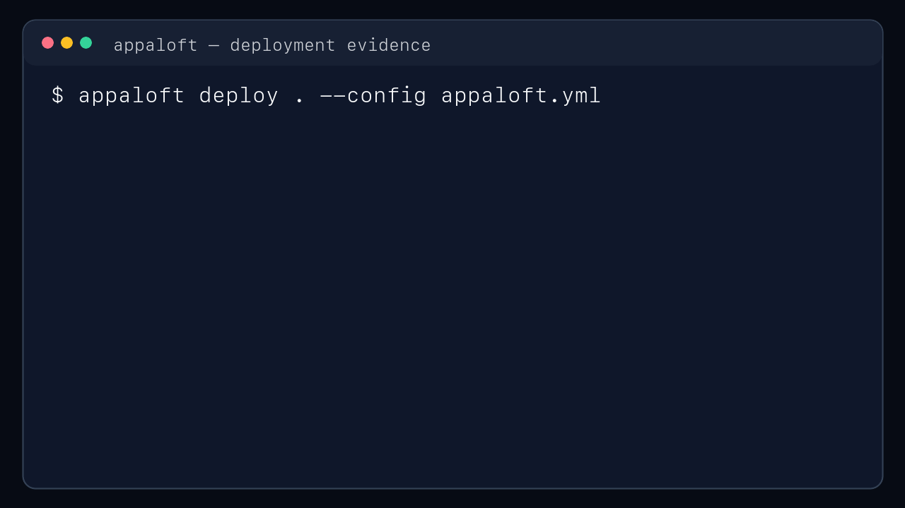

<div align="center">
  <a href="https://www.appaloft.com/en-US/">
    
  </a>

  <p><code>/ˌæp əˈlɔːft/</code></p>
  <h3>Build with agents. Ship with proof.</h3>
  <p>
    <strong>An open source AI application delivery platform.</strong><br />
    From secure agent sandboxes to verified production: run work in isolation, freeze an exact
    candidate, promote it explicitly, then deploy and verify through one operation catalog.
  </p>
  <p>
    <a href="https://github.com/appaloft/examples/tree/main/hello">5-minute example</a> ·
    <a href="https://www.appaloft.com/en-US/">Website</a> ·
    <a href="https://app.appaloft.com">Cloud</a> ·
    <a href="https://docs.appaloft.com/en/">Docs</a> ·
    <a href="https://github.com/appaloft/appaloft/releases/latest">Releases</a> ·
    <a href="./README.zh-CN.md">中文</a>
  </p>
</div>

<p align="center">
  
</p>

## Try The Hello Example In Five Minutes

The official [`appaloft/examples/hello`](https://github.com/appaloft/examples/tree/main/hello)
project is a dependency-free Node HTTP app with a Dockerfile, `appaloft.yml`, `/health`, and a small
JSON API. Clone it and verify the workload before deploying:

```bash
git clone --depth 1 https://github.com/appaloft/examples.git
cd examples/hello
npm start
```

In another terminal:

```bash
curl -sS http://127.0.0.1:3000/health
```

Once Appaloft is installed and a target is selected, deploy the same directory through the one-file
configuration:

```bash
appaloft deploy . --config appaloft.yml
```

The full example documents local Docker verification, public Git deployment, Cloud Console setup,
health checks, and the exact source/runtime contract.

## What Is Appaloft?

Appaloft is an open source AI application delivery platform. It connects coding-agent execution and
isolated Sandboxes to immutable candidate artifacts, explicit Promotion, production Deployment, and
delivery evidence. The existing deployment control plane remains the available production
foundation behind CLI, HTTP API, Web console, MCP tools, and the AI skill.

Use Appaloft when you want:

- One `appaloft.yml` file to describe source, runtime, network, access, dependencies, and deploy
  intent.
- A local-first workflow that can deploy from a folder, Git repo, zip archive, Docker image, or
  Compose bundle.
- A repeatable deploy loop: detect, plan, execute, verify, observe, retry, redeploy, or rollback.
- AI-friendly operations without giving agents direct database, Docker, SSH, or provider access.
- Self-hosted control on your own Linux server or VM.

## Capability Maturity

| Delivery stage | Maturity | Current boundary |
| --- | --- | --- |
| Run Agents | Private preview | Harness-neutral Runtime and observable/cancellable Run APIs are implemented; the first adapter is pinned Pi and requires an operator-provisioned Sandbox template. |
| Work in Sandboxes | Private preview | Resource, network, process, file, lifecycle, snapshot, and credential-broker boundaries are implemented; hosted worker availability is configuration-dependent. |
| Preview & Promote | Private preview | Idle-workspace capture, immutable Source Artifact, exact-digest candidate preview, and plan/accept/retry Promotion are implemented; candidate preview currently targets statically publishable output. |
| Deploy & Verify | Available | Existing folder, Git, zip, image, Docker, Compose, static artifact, Deployment, health, logs, retry, rollback, and proof readback remain supported. |

“Delivery Evidence Chain” means Appaloft can preserve and read the observations linking an accepted
candidate to a Deployment result. It does not claim formal correctness, security, or compliance.

## Agent SDK Quickstart (Private Preview)

The API hierarchy makes Runtime ownership explicit: agents belong to a Sandbox. After an operator
provisions a Pi-enabled Sandbox template and sets `APPALOFT_PI_SANDBOX_TEMPLATE_ID`, an application
developer can use the generated SDK without running Pi in the application process:

```ts
import { createAppaloftClient } from "@appaloft/sdk";

const appaloft = createAppaloftClient({
  baseUrl: "https://app.example.com/api",
  auth: {
    kind: "product-session",
    cookie: process.env.APPALOFT_SESSION_COOKIE!,
  },
});

const sandbox = await appaloft.sandboxes.create({
  source: { kind: "template", templateId: process.env.PI_SANDBOX_TEMPLATE_ID! },
  requestedIsolation: "gvisor",
  limits: {
    cpuMillis: 2_000,
    memoryBytes: 2_147_483_648,
    diskBytes: 10_737_418_240,
    maxProcesses: 128,
  },
  networkPolicy: { mode: "deny", rules: [] },
});

const agent = await sandbox.agents.create({ harness: "pi" });
const run = await agent.runs.create({
  task: "Build the requested application in /workspace/app",
});
```

The caller owns chat/session state. Appaloft owns the isolated execution, lifecycle, event readback,
artifact boundary, Promotion checkpoints, and production delivery evidence.

See the official [Sandbox Agent examples](https://github.com/appaloft/examples/tree/main/sandbox-agent)
for complete Chat-to-App, human approval, and Preview-to-Promotion flows. The feature is Private
Preview and requires an Appaloft 1.2+ control plane and matching SDK; Agent operations currently
use a product session rather than a deploy token.

Resource-handle methods throw `AppaloftSdkRequestError` on failure. The complete generated,
non-throwing operation facade remains available under `appaloft.operations`.

## Quick Start

Install the self-hosted stack on a Linux server or VM:

```bash
curl -fsSL https://appaloft.com/install.sh | sudo sh
```

Pin a release version:

```bash
curl -fsSL https://appaloft.com/install.sh | sudo sh -s -- --version 1.0.1
```

The installer verifies or installs Docker Engine and the Compose plugin, writes the self-hosted
stack to `/opt/appaloft`, and starts the Appaloft backend, static console, and PostgreSQL.

## Current Scope And Boundaries

| Ready to try today | Current boundary |
| --- | --- |
| Local folders, public Git repositories, zip archives, prebuilt images, and Compose bundles | You provide or register the runtime target and the credentials needed to reach it. |
| Workspace commands, Dockerfile, Docker Compose, prebuilt-image, and static-artifact plans | Provider capabilities vary; inspect the generated plan and target readiness before mutation. |
| Local shell, generic SSH, and Docker Swarm runtime targets | Appaloft is a deployment control plane, not a general cloud-account or DNS-zone manager. |
| CLI, HTTP API, Web console, GitHub Action, MCP, and AI skill entrypoints | External edge/DNS provider orchestration remains a governed post-1.0 track. |
| Health, logs, diagnostics, retry, redeploy, rollback, and durable work observation | A successful command is not a substitute for workload, health, and access verification. |

See [Providers](./docs/PROVIDERS.md), [Core operations](./docs/CORE_OPERATIONS.md), and the
[product roadmap](./docs/PRODUCT_ROADMAP.md) for the current public contracts and planned work.

## Install Options

Choose the entry point that matches how you want to use Appaloft.

| Surface | Command |
| --- | --- |
| Self-hosted server | `curl -fsSL https://appaloft.com/install.sh \| sudo sh` |
| Self-hosted with PGlite | `curl -fsSL https://appaloft.com/install.sh \| sudo sh -s -- --database pglite` |
| Self-hosted with a domain | `curl -fsSL https://appaloft.com/install.sh \| sudo sh -s -- --domain console.example.com` |
| Docker image | `docker pull ghcr.io/appaloft/appaloft:latest` |
| npm CLI | `npm install -g @appaloft/cli` |
| Homebrew CLI | `brew install appaloft/tap/appaloft` |
| GitHub Release | Download platform archives from [latest releases](https://github.com/appaloft/appaloft/releases/latest). |
| MCP launcher | `npx @appaloft/mcp` |
| AI skill | `npx skills add appaloft/appaloft --skill appaloft --global --agent codex --copy --yes` |
| Source checkout | `bun install && bun run --cwd apps/shell src/index.ts --help` |

## One File Deploy Config

Create `appaloft.yml` in your project:

```yaml
name: my-app
source:
  path: .
runtime:
  method: workspace-commands
  installCommand: bun install --frozen-lockfile
  buildCommand: bun run build
  startCommand: bun run start
network:
  internalPort: 3000
access:
  default: public
```

Then deploy:

```bash
appaloft deploy . --config appaloft.yml
```

## Common CLI Commands

These commands cover the path most teams use day to day.

```bash
# Check the installed CLI and local profile
appaloft --version
appaloft auth status
appaloft context show

# Start from a repo, folder, Docker image, or Compose project
appaloft init
appaloft deploy .
appaloft deploy ./dist --config appaloft.yml
appaloft deploy https://github.com/acme/web.git
appaloft deploy ghcr.io/acme/api:1.7.3
appaloft deploy ./docker-compose.yml

# Observe and operate deployments
appaloft deployments list
appaloft deployments show <deploymentId>
appaloft deployments timeline <deploymentId> --follow --json
appaloft deployments retry <deploymentId>
appaloft deployments redeploy <resourceId>
appaloft deployments rollback <deploymentId> --candidate <deploymentId>

# Work with projects, environments, and resources
appaloft project list
appaloft project create
appaloft env list
appaloft resource list
appaloft resource show <resourceId>
appaloft resource logs <resourceId>
appaloft resource health <resourceId>
appaloft resource runtime restart <resourceId>

# Register and prepare servers
appaloft server register
appaloft server list
appaloft server test <serverId>
appaloft server runtime prepare <serverId>
appaloft server capacity inspect <serverId>

# Publish static output directly
appaloft static-artifacts publish ./dist
appaloft static-artifacts publish ./dist.zip

# Use Blueprints
appaloft blueprint list
appaloft blueprint show pocketbase
appaloft blueprint plan-install pocketbase
appaloft blueprint install pocketbase
appaloft blueprint installation show <installationId>

# Dependencies, storage, and scheduled tasks
appaloft dependency list
appaloft dependency inspect <dependencyResourceId>
appaloft storage volume list
appaloft scheduled-task list

# Audit and recovery
appaloft work list
appaloft work watch <workId> --json
appaloft audit-event list --aggregate <aggregateId>
```

For the full operation list, see
[skills/appaloft/references/cli-entrypoints.md](./skills/appaloft/references/cli-entrypoints.md).

## MCP And AI Skill

Appaloft MCP exposes the same operation catalog to MCP clients. It is a transport surface, not a
separate automation layer.

```bash
# Local stdio MCP server
appaloft mcp stdio

# Local HTTP MCP server at /mcp
appaloft mcp serve --host 127.0.0.1 --port 3939

# Dedicated package launcher for MCP hosts
npx @appaloft/mcp
npx @appaloft/mcp serve --host 127.0.0.1 --port 3939

# Browser handoff and Codex bridge for a hosted or self-hosted control plane
appaloft auth mcp login
appaloft auth mcp codex install
```

Install the Appaloft skill in an AI host that supports skills:

```bash
npx skills add appaloft/appaloft --skill appaloft --global --agent codex --copy --yes
```

Use `--agent claude-code` for Claude Code. Verify with
`npx skills list --global --agent <agent>` and start a new agent session.

Then ask your agent to deploy or operate a project through Appaloft. The skill tells the agent to
use Appaloft operations instead of bypassing the product with direct Docker, SSH, database, or cloud
provider calls.

## GitHub Actions

Use the bundled deploy action when CI should deploy over pure SSH or through a self-hosted Appaloft
control plane:

```yaml
name: Deploy

on:
  push:
    branches: [main]

jobs:
  deploy:
    runs-on: ubuntu-latest
    steps:
      - uses: actions/checkout@v4
      - uses: appaloft/appaloft/.github/actions/deploy-action@main
        with:
          source: .
          ssh-host: ${{ secrets.APPALOFT_SSH_HOST }}
          ssh-user: root
          ssh-private-key: ${{ secrets.APPALOFT_SSH_PRIVATE_KEY }}
```

## Local Development

```bash
bun install
export APPALOFT_DATABASE_DRIVER=pglite
bun run db:migrate
bun run dev
```

For PostgreSQL local development, start `docker-compose.dev.yml` and set
`APPALOFT_DATABASE_DRIVER=postgres` plus `APPALOFT_DATABASE_URL`.

Useful development commands:

```bash
bun run lint:ci
bun run typecheck
bun run test
bun run build
bun run smoke:local:static
```

## Repository Map

| Path | Purpose |
| --- | --- |
| `apps/shell` | CLI and local server runtime entrypoint. |
| `apps/web` | Static web console. |
| `apps/docs` | Public documentation site. |
| `packages/application` | Command/query handlers and operation catalog. |
| `packages/adapters` | CLI, HTTP, persistence, runtime, and provider adapters. |
| `packages/ai/mcp` | MCP server transport. |
| `packages/npm` | npm CLI and MCP launcher packages. |
| `skills/appaloft` | AI-facing Appaloft skill and references. |
| `docs` | Architecture, operations, ADRs, specs, and release docs. |

## Documentation

- [Self-hosting install](./apps/docs/src/content/docs/en/self-hosting/install.md)
- [Architecture](./docs/ARCHITECTURE.md)
- [Core operations](./docs/CORE_OPERATIONS.md)
- [MCP server](./docs/agent/appaloft-mcp-server.md)
- [Providers](./docs/PROVIDERS.md)
- [Plugins](./docs/PLUGINS.md)
- [Testing](./docs/TESTING.md)
- [Release](./docs/RELEASE.md)
- [Security](./docs/SECURITY.md)
- [Agent rules](./AGENTS.md)

## License

Apache-2.0.

The open source edition covers this repository's source code. Appaloft Cloud and other hosted
service-specific code may be distributed separately under different terms.

The Appaloft name, logo, and related brand assets are not granted by the Apache-2.0 license; see
[TRADEMARKS.md](./TRADEMARKS.md).
