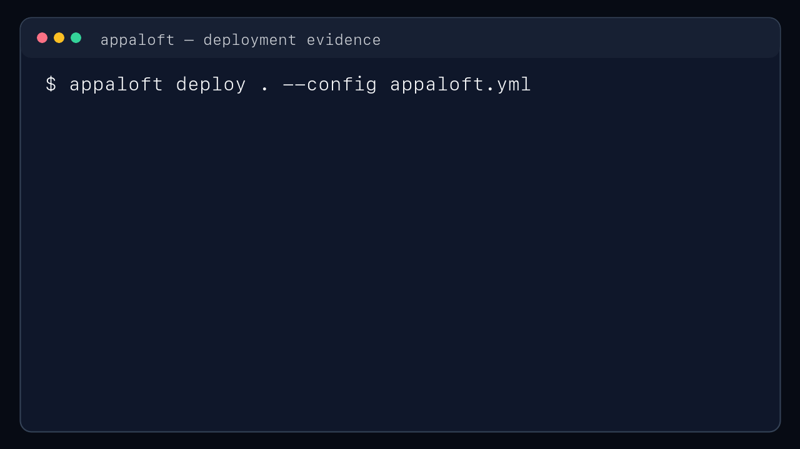

<div align="center">
  <a href="https://www.appaloft.com">
    
  </a>

  <p><code>/ˌæp əˈlɔːft/</code></p>
  <h3>Open-source Railway alternative.</h3>
  <p>
    Two doors. Pick one and start.
  </p>
  <p>
    <strong>Deploy</strong> — a folder becomes a URL. Git is optional.
    Hero command: <code>appaloft deploy .</code>. Success is a live URL for this app.<br />
    <strong>Agent</strong> — local skill + MCP so the Cursor or OpenCode you already have can use
    Appaloft. The experience is like Railway <code>setup agent</code>. Appaloft does not ship that
    command.
  </p>
  <p>
    <a href="https://www.appaloft.com">Website</a> ·
    <a href="https://docs.appaloft.com/en">Docs</a> ·
    <a href="https://www.appaloft.com/compare/railway">Compare Railway</a> ·
    <a href="https://github.com/appaloft/appaloft/releases/latest">Releases</a> ·
    <a href="./README.zh-CN.md">中文</a>
  </p>
  <p>
    That is positioning, not a 1:1 swap. The
    <a href="https://www.appaloft.com/compare/railway">Compare Railway</a>
    FAQ is explicit: Appaloft is not a complete Railway replacement.
  </p>
</div>

<p align="center">
  
</p>

Deploy from a folder, Git URL, image, Compose file, or zip is available today. Agent Workspace and
Sandbox surfaces are public alpha. That is an honesty line, not a formal correctness or compliance
claim.

## Install

Install the CLI first. You do not need the self-hosted stack to deploy.

```bash
npm install -g @appaloft/cli
```

```bash
brew install appaloft/tap/appaloft
```

Or download a platform archive from
[GitHub Releases](https://github.com/appaloft/appaloft/releases/latest).

Login and a registered server are one-line prerequisites when you need Cloud or BYOS — not the
story: `appaloft login` (add `--url` for a self-hosted plane) and, if you bring your own machine,
`appaloft server register`.

## Deploy

From any project folder. Git is optional. Success is a live URL for this app.

```bash
appaloft deploy .
```

Optional one-file config:

```yaml
name: my-app
source:
  path: .
runtime:
  method: workspace-commands
  installCommand: bun install --frozen-lockfile
  buildCommand: bun run build
  startCommand: bun run start
network:
  internalPort: 3000
access:
  default: public
```

```bash
appaloft deploy . --config appaloft.yml
```

The same command accepts a folder, a Git URL, a container image, a Compose file, or a zip:

```bash
appaloft init
appaloft deploy .
appaloft deploy ./dist --config appaloft.yml
appaloft deploy https://github.com/acme/web.git
appaloft deploy ghcr.io/acme/api:1.7.3
appaloft deploy ./docker-compose.yml
```

Want a known-good sample? Try the official
[`appaloft/examples/hello`](https://github.com/appaloft/examples/tree/main/hello) project after the
CLI is installed. It is optional — not the first command.

## Agent

Teach the coding agent you already have. Install a local skill and MCP so Cursor, OpenCode, Codex,
or Claude Code can call Appaloft. That experience is like Railway `setup agent`. Appaloft does not
ship that command.

Skill copy blocks use the hosts documented in this repo (`codex`, `claude-code`). Cursor and
OpenCode enter through MCP, not an invented `--agent` flag.

```bash
npx skills add appaloft/appaloft --skill appaloft --global --agent codex --copy --yes
```

```bash
npx skills add appaloft/appaloft --skill appaloft --global --agent claude-code --copy --yes
```

Verify with `npx skills list --global --agent <agent>`, then start a new agent session. Ask it to
deploy or operate through Appaloft. The skill tells the agent to use Appaloft operations instead of
calling Docker, SSH, databases, or cloud providers directly.

```bash
npx @appaloft/mcp
appaloft mcp stdio
```

## Occupancy (optional)

Not a door. After the two doors, `appaloft code` is an occupancy add-on: it opens remote OpenCode or
Pi on your server (analogous to Railway `ca`). `appaloft code --local` is Scratch on this machine.

These commands are listed in the in-repo CLI reference
([cli-entrypoints.md](./skills/appaloft/references/cli-entrypoints.md)). The currently published
docs.appaloft.com CLI page may not list them yet.

## Self-host (optional)

The Linux control-plane installer is optional. Do not start here unless you want to run Appaloft
yourself.

```bash
curl -fsSL https://appaloft.com/install.sh | sudo sh
```

Pin a release version:

```bash
curl -fsSL https://appaloft.com/install.sh | sudo sh -s -- --version 1.9.2
```

The installer verifies or installs Docker Engine and the Compose plugin, writes the stack to
`/opt/appaloft`, and starts the Appaloft backend, static console, and PostgreSQL.

| Surface | Command |
| --- | --- |
| npm CLI | `npm install -g @appaloft/cli` |
| Homebrew CLI | `brew install appaloft/tap/appaloft` |
| GitHub Release | Download platform archives from [latest releases](https://github.com/appaloft/appaloft/releases/latest). |
| MCP launcher | `npx @appaloft/mcp` |
| AI skill | `npx skills add appaloft/appaloft --skill appaloft --global --agent codex --copy --yes` |
| Self-hosted server | `curl -fsSL https://appaloft.com/install.sh \| sudo sh` |
| Self-hosted with PGlite | `curl -fsSL https://appaloft.com/install.sh \| sudo sh -s -- --database pglite` |
| Self-hosted with a domain | `curl -fsSL https://appaloft.com/install.sh \| sudo sh -s -- --domain console.example.com` |
| Docker image | `docker pull ghcr.io/appaloft/appaloft:latest` |
| Source checkout | `bun install && bun run --cwd apps/shell src/index.ts --help` |

## Common CLI

Deploy, observe, and recover. Full command list:
[skills/appaloft/references/cli-entrypoints.md](./skills/appaloft/references/cli-entrypoints.md).

```bash
appaloft --version
appaloft auth status
appaloft context show

appaloft deploy .
appaloft deployments list
appaloft deployments show <deploymentId>
appaloft deployments timeline <deploymentId> --follow --json
appaloft deployments retry <deploymentId>
appaloft deployments redeploy <resourceId>
appaloft deployments rollback <deploymentId> --candidate <deploymentId>

appaloft resource logs <resourceId>
appaloft resource health <resourceId>
appaloft work list
appaloft work watch <workId> --json

appaloft server register
appaloft server list
appaloft server test <serverId>
```

## GitHub Actions

Use the bundled deploy action when CI should deploy over pure SSH or through a self-hosted Appaloft
control plane:

```yaml
name: Deploy

on:
  push:
    branches: [main]

jobs:
  deploy:
    runs-on: ubuntu-latest
    steps:
      - uses: actions/checkout@v4
      - uses: appaloft/appaloft/.github/actions/deploy-action@main
        with:
          source: .
          ssh-host: ${{ secrets.APPALOFT_SSH_HOST }}
          ssh-user: root
          ssh-private-key: ${{ secrets.APPALOFT_SSH_PRIVATE_KEY }}
```

## Local Development

```bash
bun install
export APPALOFT_DATABASE_DRIVER=pglite
bun run db:migrate
bun run dev
```

For PostgreSQL local development, start `docker-compose.dev.yml` and set
`APPALOFT_DATABASE_DRIVER=postgres` plus `APPALOFT_DATABASE_URL`.

```bash
bun run lint:ci
bun run typecheck
bun run test
bun run build
bun run smoke:local:static
```

## Repository Map

| Path | Purpose |
| --- | --- |
| `apps/shell` | CLI and local server runtime entrypoint. |
| `apps/web` | Static web console. |
| `apps/docs` | Public documentation site. |
| `packages/application` | Command/query handlers and operation catalog. |
| `packages/adapters` | CLI, HTTP, persistence, runtime, and provider adapters. |
| `packages/ai/mcp` | MCP server transport. |
| `packages/npm` | npm CLI and MCP launcher packages. |
| `skills/appaloft` | AI-facing Appaloft skill and references. |
| `docs` | Architecture, operations, ADRs, specs, and release docs. |

## Documentation

- [Docs](https://docs.appaloft.com/en)
- [First deployment](https://docs.appaloft.com/en/start/first-deployment/)
- [Agents](https://docs.appaloft.com/en/agents/overview/)
- [TypeScript SDK](https://docs.appaloft.com/en/reference/typescript-sdk/)
- [Self-hosting install](https://docs.appaloft.com/en/self-hosting/install/)
- [Architecture](./docs/ARCHITECTURE.md)
- [Core operations](./docs/CORE_OPERATIONS.md)
- [MCP server](./docs/agent/appaloft-mcp-server.md)
- [Providers](./docs/PROVIDERS.md)
- [Plugins](./docs/PLUGINS.md)
- [Testing](./docs/TESTING.md)
- [Release](./docs/RELEASE.md)
- [Security](./docs/SECURITY.md)
- [Agent rules](./AGENTS.md)

## License

Apache-2.0.

The open source edition covers this repository's source code. Appaloft Cloud and other hosted
service-specific code may be distributed separately under different terms.

The Appaloft name, logo, and related brand assets are not granted by the Apache-2.0 license; see
[TRADEMARKS.md](./TRADEMARKS.md).
