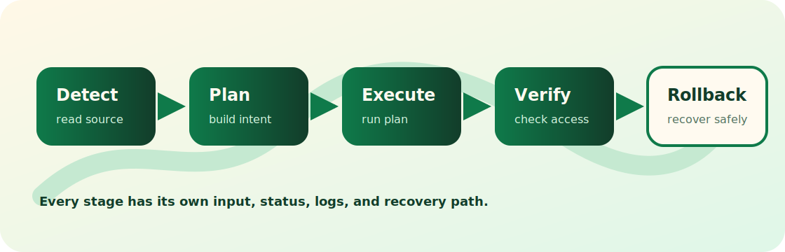

<div align="center">
  <a href="https://www.appaloft.com/zh-CN/">
    
  </a>

  <p><code>/ˌæp əˈlɔːft/</code></p>
  <h3>从 localhost 到你的服务器。</h3>
  <p>
    <strong>本地优先的 AI native 单文件 PaaS。</strong><br />
    一个文件，部署静态站点、本地项目、Git 仓库、Docker 和 Compose 应用；既可以手动操作，
    也可以让 Agent 从 MCP / skill 调用。
  </p>
  <p>
    <a href="https://www.appaloft.com/zh-CN/">官网</a> ·
    <a href="https://docs.appaloft.com/">文档</a> ·
    <a href="https://github.com/appaloft/appaloft/releases/latest">Releases</a> ·
    <a href="./README.md">English</a>
  </p>
</div>

<p align="center">
  
</p>



## Appaloft 是什么？

Appaloft 是一个开源部署控制面，用来把本地开发里的应用发布到你自己的服务器。CLI、HTTP
API、Web 控制台、MCP tools 和 AI skill 共享同一套 operation catalog，所以人和 Agent 都走同一条产品边界。

适合这些场景：

- 用一个 `appaloft.yml` 描述 source、runtime、network、access、dependency 和 deploy intent。
- 从本地目录、Git 仓库、zip、Docker 镜像或 Compose bundle 发布。
- 把部署变成可重复的闭环：detect、plan、execute、verify、observe、retry、redeploy、rollback。
- 让 AI 能操作部署，但不直接拿数据库、Docker、SSH 或云厂商权限绕过产品。
- 在自己的 Linux server 或 VM 上 self-host。

## 快速开始

在 Linux 服务器或 VM 上安装 self-hosted stack：

```bash
curl -fsSL https://appaloft.com/install.sh | sudo sh
```

固定某个发布版本：

```bash
curl -fsSL https://appaloft.com/install.sh | sudo sh -s -- --version 0.2.1
```

这个 installer 会安装或校验 Docker Engine 和 Compose plugin，把 self-hosted stack 写到
`/opt/appaloft`，并启动 Appaloft backend、static console 和 PostgreSQL。

## 安装方式

按你的使用入口选择安装方式：

| 入口 | 命令 |
| --- | --- |
| Self-hosted server | `curl -fsSL https://appaloft.com/install.sh \| sudo sh` |
| Self-hosted + PGlite | `curl -fsSL https://appaloft.com/install.sh \| sudo sh -s -- --database pglite` |
| Self-hosted + 域名 | `curl -fsSL https://appaloft.com/install.sh \| sudo sh -s -- --domain console.example.com` |
| Docker image | `docker pull ghcr.io/appaloft/appaloft:latest` |
| npm CLI | `npm install -g @appaloft/cli` |
| Homebrew CLI | `brew install appaloft/tap/appaloft` |
| GitHub Release | 从 [latest releases](https://github.com/appaloft/appaloft/releases/latest) 下载对应平台 archive。 |
| MCP launcher | `npx @appaloft/mcp` |
| AI skill | `npx skills add appaloft/appaloft` |
| 源码运行 | `bun install && bun run --cwd apps/shell src/index.ts --help` |

## 单文件部署配置

在项目里创建 `appaloft.yml`：

```yaml
name: my-app
source:
  path: .
runtime:
  method: workspace-commands
  installCommand: bun install --frozen-lockfile
  buildCommand: bun run build
  startCommand: bun run start
network:
  internalPort: 3000
access:
  default: public
```

然后部署：

```bash
appaloft deploy . --config appaloft.yml
```

## 常用 CLI 命令

这些命令覆盖日常最常用的路径。

```bash
# 查看 CLI 和当前本地 profile
appaloft --version
appaloft auth status
appaloft context show

# 从 repo、目录、Docker image 或 Compose 项目开始
appaloft init
appaloft deploy .
appaloft deploy ./dist --config appaloft.yml
appaloft deploy https://github.com/acme/web.git
appaloft deploy ghcr.io/acme/api:1.7.3
appaloft deploy ./docker-compose.yml

# 观察和操作 deployment
appaloft deployments list
appaloft deployments show <deploymentId>
appaloft deployments timeline <deploymentId> --follow --json
appaloft deployments retry <deploymentId>
appaloft deployments redeploy <resourceId>
appaloft deployments rollback <deploymentId> --candidate <deploymentId>

# 项目、环境、资源
appaloft project list
appaloft project create
appaloft env list
appaloft resource list
appaloft resource show <resourceId>
appaloft resource logs <resourceId>
appaloft resource health <resourceId>
appaloft resource runtime restart <resourceId>

# 注册和准备服务器
appaloft server register
appaloft server list
appaloft server test <serverId>
appaloft server runtime prepare <serverId>
appaloft server capacity inspect <serverId>

# 直接发布静态产物
appaloft static-artifacts publish ./dist
appaloft static-artifacts publish ./dist.zip

# 使用 Blueprints
appaloft blueprint list
appaloft blueprint show pocketbase
appaloft blueprint plan-install pocketbase
appaloft blueprint install pocketbase
appaloft blueprint installation show <installationId>

# 依赖、存储和定时任务
appaloft dependency list
appaloft dependency inspect <dependencyResourceId>
appaloft storage volume list
appaloft scheduled-task list

# 审计与恢复
appaloft work list
appaloft work watch <workId> --json
appaloft audit-event list --aggregate <aggregateId>
```

完整 operation 列表见
[skills/appaloft/references/cli-entrypoints.md](./skills/appaloft/references/cli-entrypoints.md)。

## MCP 和 AI Skill

Appaloft MCP 把同一套 operation catalog 暴露给 MCP client。它只是 transport surface，不是另一套自动化后门。

```bash
# 本地 stdio MCP server
appaloft mcp stdio

# 本地 HTTP MCP server，路径是 /mcp
appaloft mcp serve --host 127.0.0.1 --port 3939

# 给 MCP host 使用的独立 package launcher
npx @appaloft/mcp
npx @appaloft/mcp serve --host 127.0.0.1 --port 3939

# 面向 hosted 或 self-hosted control plane 的浏览器授权与 Codex bridge
appaloft auth mcp login
appaloft auth mcp codex install
```

在支持 skills 的 AI host 里安装 Appaloft skill：

```bash
npx skills add appaloft/appaloft
```

然后让 Agent 通过 Appaloft 部署或运维项目。skill 会约束 Agent 使用 Appaloft operation，而不是直接绕过产品去操作 Docker、SSH、数据库或云厂商。

## GitHub Actions

CI 可以用仓库内置 deploy action 走 pure SSH，或连接 self-hosted Appaloft control plane：

```yaml
name: Deploy

on:
  push:
    branches: [main]

jobs:
  deploy:
    runs-on: ubuntu-latest
    steps:
      - uses: actions/checkout@v4
      - uses: appaloft/appaloft/.github/actions/deploy-action@main
        with:
          source: .
          ssh-host: ${{ secrets.APPALOFT_SSH_HOST }}
          ssh-user: root
          ssh-private-key: ${{ secrets.APPALOFT_SSH_PRIVATE_KEY }}
```

## 本地开发

```bash
bun install
export APPALOFT_DATABASE_DRIVER=pglite
bun run db:migrate
bun run dev
```

如果本地要接 PostgreSQL，启动 `docker-compose.dev.yml`，然后设置
`APPALOFT_DATABASE_DRIVER=postgres` 和 `APPALOFT_DATABASE_URL`。

常用开发命令：

```bash
bun run lint:ci
bun run typecheck
bun run test
bun run build
bun run smoke:local:static
```

## 仓库结构

| 路径 | 用途 |
| --- | --- |
| `apps/shell` | CLI 和本地 server runtime 入口。 |
| `apps/web` | Static web console。 |
| `apps/docs` | Public documentation site。 |
| `packages/application` | Command/query handlers 和 operation catalog。 |
| `packages/adapters` | CLI、HTTP、persistence、runtime、provider adapters。 |
| `packages/ai/mcp` | MCP server transport。 |
| `packages/npm` | npm CLI 和 MCP launcher packages。 |
| `skills/appaloft` | 面向 AI 的 Appaloft skill 和 reference。 |
| `docs` | Architecture、operations、ADR、spec 和 release docs。 |

## 文档入口

- [Self-hosting install](./apps/docs/src/content/docs/self-hosting/install.md)
- [Architecture](./docs/ARCHITECTURE.md)
- [Core operations](./docs/CORE_OPERATIONS.md)
- [MCP server](./docs/agent/appaloft-mcp-server.md)
- [Providers](./docs/PROVIDERS.md)
- [Plugins](./docs/PLUGINS.md)
- [Testing](./docs/TESTING.md)
- [Release](./docs/RELEASE.md)
- [Security](./docs/SECURITY.md)
- [AGENTS](./AGENTS.md)

## License

Apache-2.0。

本仓库的源代码属于开源版本。Appaloft Cloud 以及其他托管服务专属代码可能会以不同条款单独分发。

Apache-2.0 不授予 Appaloft 名称、logo 和相关品牌资产的使用权；参见
[TRADEMARKS.md](./TRADEMARKS.md)。
