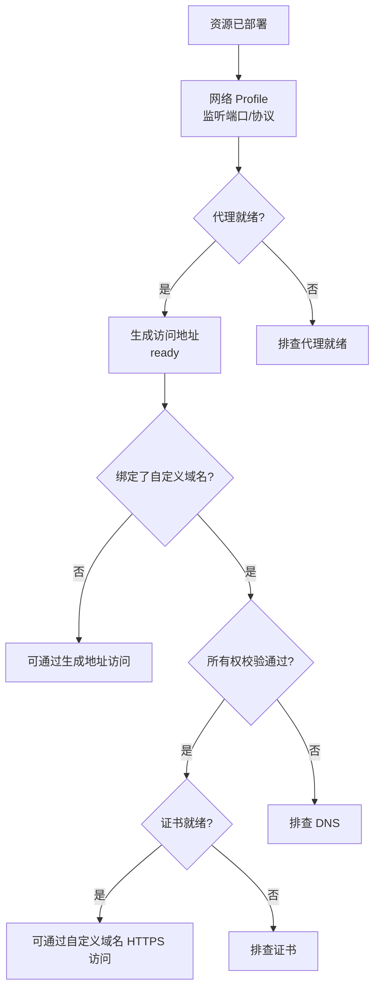

## 简要定义

一个部署成功的资源要变成"外部用户能打开的网站"，还需要经过独立的访问层：[生成的访问地址](/docs/access/generated-routes/)（无需任何配置即可获得的 URL）、[自定义域名](/docs/access/custom-domains/)（把你自己的域名指向资源）、[证书](/docs/access/certificates/)（HTTPS 是否就绪）。这三者是三个独立的状态维度，不能混为一谈。



## 为什么存在这个概念

"应用打不开"背后至少有四种完全不同的原因：应用没启动、代理没就绪、域名没验证、证书没签发。如果文档和界面把它们压缩成一个笼统的"访问失败"，用户会在错误的层面反复排查。把访问拆成独立、可分别观察的状态，是为了让每一层失败都指向明确的下一步。

## 在 Web / CLI / API 中的体现

```bash
# 查看资源当前选中的访问地址，以及生成地址/自定义域名/服务器路由是否同时存在
appaloft resource show res_web

# 一次性检查运行时、健康检查、代理和公网访问是否一致
appaloft resource health res_web --checks --public-access-probe
```

Web 控制台会在资源详情页把生成访问地址、自定义域名和证书状态分别展示；HTTP API 通过 `GET /api/resources/{id}/health` 返回结构化的 `runtime` / `health` / `proxy` / `generatedAccess` 字段。

## 常见误区

- **把证书问题当成部署失败**：一个资源可以已经成功部署、健康检查全部通过，但证书还没就绪——这是完全独立的状态。
- **跳过生成访问地址直接排查自定义域名**：先确认生成访问地址是否 ready，再排查域名层问题，这样能快速判断问题出在应用/代理层还是域名层。

## 相关任务

- [生成的访问地址](/docs/access/generated-routes/)
- [绑定自定义域名](/docs/access/custom-domains/)
- [证书](/docs/access/certificates/)
- [访问故障排查](/docs/access/troubleshooting/)

## 进阶细节

访问地址存在多种来源时，Appaloft 会按固定优先级选择"当前访问地址"用于展示：已就绪的持久自定义域名优先，其次是 SSH/CLI 模式下的服务器应用配置域名，最后才是最近一次生成的默认访问地址。
