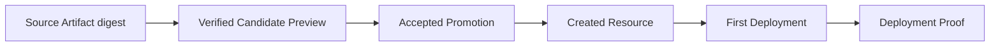

## 简要定义

Appaloft 会保存并可查询一条完整的证据链：



一个 Promotion 只有在其公开的 Proof Verdict 为 `verified` 之后，状态才会变为 `completed`；Proof 仍处于 `pending` 时，持久化 Worker 会继续轮询，如果最终判定失败，Resource、Deployment 和错误 Checkpoint 都会被保留下来，供后续重试或诊断使用。

## 为什么存在这个概念

当 Agent 自主完成"从 Sandbox 到生产部署"的整条链路时，用户需要一种方式确认"这次部署确实按预期发生了"，而不是仅凭 Agent 自己的文字汇报。交付证据链把每一步的输入输出都固化成可核对的记录，让证据本身独立于 Agent 的自我陈述。

## 这条证据链证明什么，不证明什么

这条链证明的是 **Appaloft 直接观察到的交付事实**，例如：

- 部署确实被执行过；
- 运行时身份、路由和健康状态符合预期；
- 最终产物的内容和捕获时的 Source Artifact digest 一致。

它**不证明**以下内容：

- Agent 生成的程序在形式上正确；
- 程序安全、无漏洞；
- 满足某项合规制度的要求。

需要这些保证时，仍然应该把测试、代码评审、安全扫描、策略检查和人工批准作为独立的、不可替代的把关环节，而不是依赖交付证据链本身。

## 相关任务

- [Agent 预览与提升](/docs/agents/preview-promote/)
- [Sandbox 模型](/docs/agents/sandboxes/)
- [部署生命周期](/docs/deliver/lifecycle/)

## 进阶细节

想要核对某次提升对应的完整证据链，可以查询：

```bash
appaloft sandbox promotion show <promotionId>
```
