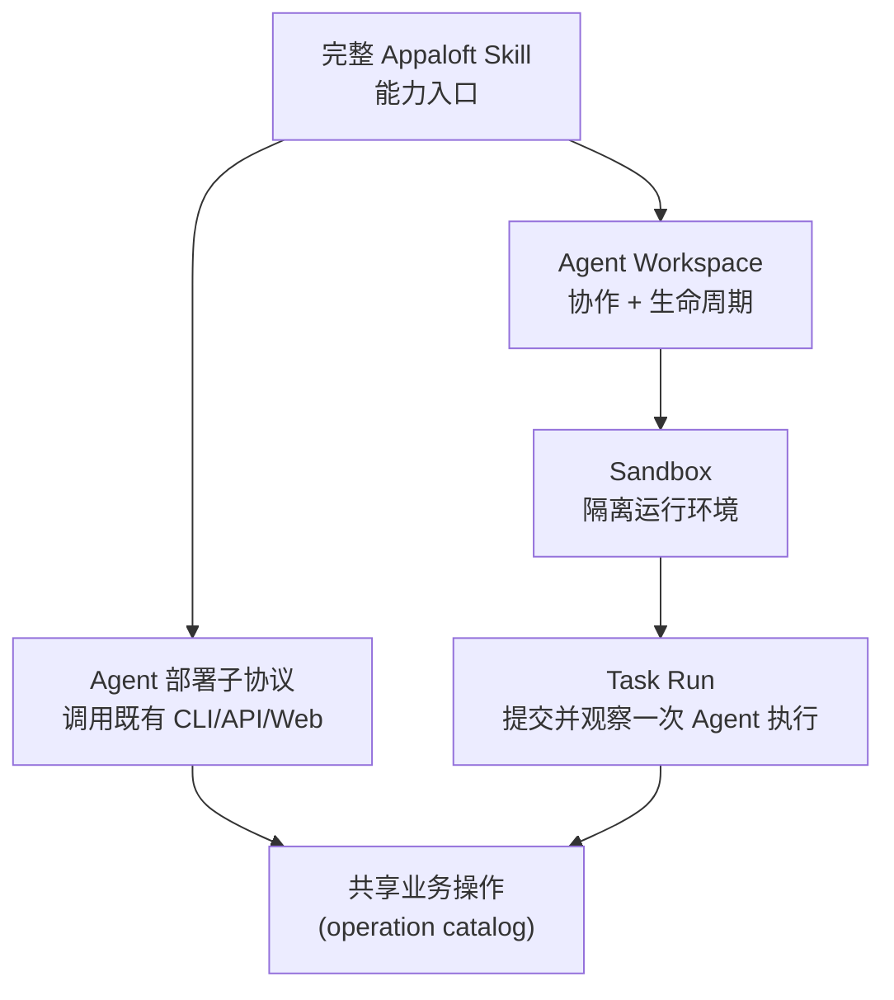

## 简要定义

本分组说明 AI Agent 如何安全地使用 Appaloft：通过[完整 Appaloft Skill](/docs/agents/skill/)获得能力说明，通过 [Agent 部署子协议](/docs/agents/deploy-skill/)完成部署，通过 [Agent Workspace](/docs/agents/workspaces/) 和 [Sandbox 模型](/docs/agents/sandboxes/)获得隔离的运行环境。

**成熟度说明**：Agent Workspace 与 Sandbox 目前处于 **Private Preview** 阶段——接口和行为可能变化，请在生产关键路径上谨慎依赖。

## 为什么存在这个分组

AI Agent 操作 Appaloft 时必须遵守和人类用户完全相同的边界：不能绕过应用层直接操作数据库、SSH 或 Provider SDK，不能读取密钥明文，也不能创造只有 Agent 才能调用的"专属操作"。这个分组把"Agent 应该如何安全使用 Appaloft"的规则集中在一处，而不是散落在每个功能页面里反复强调。

## 核心概念速览

| 概念 | 一句话说明 | 详情 |
| --- | --- | --- |
| Appaloft Skill | Agent 的完整能力说明书，映射到与 CLI/API/Web 相同的操作 | [完整 Appaloft Skill](/docs/agents/skill/) |
| 部署子协议 | Agent 如何安全触发部署 | [Agent 部署子协议](/docs/agents/deploy-skill/) |
| Agent Workspace | Agent 长期协作和运行的容器，建立在 Sandbox 之上 | [Agent Workspace](/docs/agents/workspaces/) |
| Sandbox | Workspace 背后的隔离执行环境模型 | [Sandbox 模型](/docs/agents/sandboxes/) |
| Task Run | 在 Sandbox 上提交、观察、审核一次 Agent 执行 | [Workspace 协作与休眠恢复](/docs/agents/tasks/) |
| Agent 适配器 | 如何安装和选择具体的 Agent 运行时 | [Agent 适配器](/docs/agents/adapters/) |
| 预览与提升 | Agent 驱动的预览部署和生产提升流程 | [Agent 预览与提升](/docs/agents/preview-promote/) |
| 交付证据 | 部署完成后可核对的证据 | [交付证据](/docs/agents/delivery-evidence/) |
| MCP | 面向工具调用的协议层 | [MCP 与工具协议](/docs/agents/mcp/) |

## 常见误区

- **把 Agent 部署当成新的业务操作**：Agent 部署只是把"部署这个项目"翻译成既有的项目、服务器、环境、资源操作，不会新增只有 Agent 能调用的能力。
- **让 Agent 直接读取 `.env`、私钥或 Token 文件**：Agent 应该始终通过 CLI/API/Web/MCP 入口工作，密钥应通过可信的 Secret Manager 或环境变量注入，而不是被 Agent 直接读取。
- **假设 Appaloft 会把产物上传到托管云**：除非用户显式选择 Appaloft Cloud 的托管能力，默认部署目标仍然是用户自己选择的 BYOS 服务器。

## 相关任务

- [完整 Appaloft Skill](/docs/agents/skill/)
- [Agent 部署子协议](/docs/agents/deploy-skill/)
- [Agent Workspace](/docs/agents/workspaces/)
- [Sandbox 模型](/docs/agents/sandboxes/)

## 进阶细节

MCP（Model Context Protocol）是 Appaloft 面向工具调用场景的协议层，和 CLI/HTTP API/Web 共享同一套 operation catalog；配置好 MCP 后，Skill 可以把它作为 callable tool layer 使用，未配置时 Skill 仍可通过 CLI/HTTP API/Web 正常工作。
