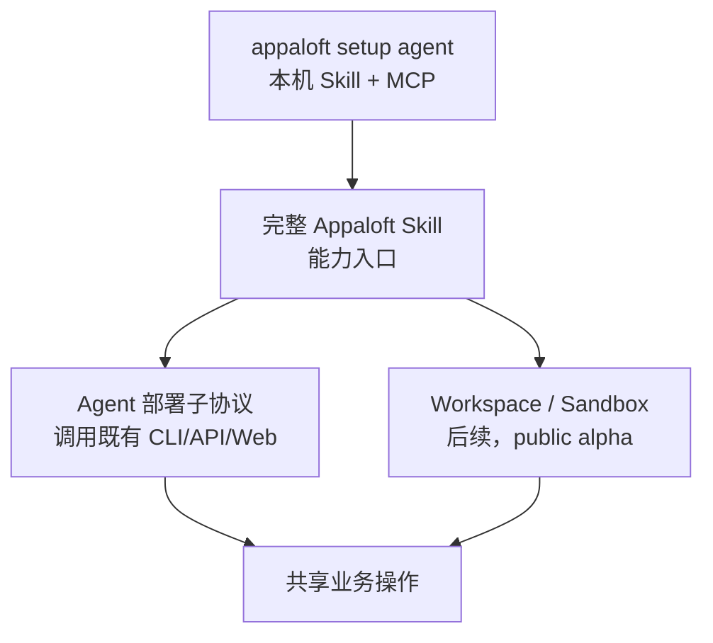

## 简要定义

面向用户的 Agent 门就是本机这一条命令：

```bash
appaloft setup agent
```

它会把 Appaloft Skill 复制到你已经在用的宿主，并写入 token-free MCP。它**不会部署**应用。部署仍然走 [`appaloft up`](/docs/start/first-deployment/)。

Workspace、Sandbox 和后续预览能力仍是 public alpha。它们不是起始页故事。



## 为什么存在这个分组

AI Agent 操作 Appaloft 时必须遵守和人类用户完全相同的边界：不能绕过应用层直接操作数据库、SSH 或 Provider SDK，不能读取密钥明文，也不能创造只有 Agent 才能调用的"专属操作"。这个分组把"Agent 应该如何安全使用 Appaloft"的规则集中在一处，而不是散落在每个功能页面里反复强调。

先跑 `appaloft setup agent`。只有需要那些后续能力时，再读 Workspace 和 Sandbox 页面。

## 核心概念速览

| 概念 | 一句话说明 | 详情 |
| --- | --- | --- |
| Appaloft Skill | Agent 的完整能力说明书，映射到与 CLI/API/Web 相同的操作 | [完整 Appaloft Skill](/docs/agents/skill/) |
| 部署子协议 | Agent 如何安全触发部署 | [Agent 部署子协议](/docs/agents/deploy-skill/) |
| Agent Workspace | 后续入口：建立在 Sandbox 上的长期协作，目前是 public alpha | [Agent Workspace](/docs/agents/workspaces/) |
| Sandbox | 后续入口：Workspace 背后的隔离执行环境，目前是 public alpha | [Sandbox 模型](/docs/agents/sandboxes/) |
| Task Run | 在 Sandbox 上提交、观察、审核一次 Agent 执行 | [Workspace 协作与休眠恢复](/docs/agents/tasks/) |
| Agent 适配器 | 如何安装和选择具体的 Agent 运行时 | [Agent 适配器](/docs/agents/adapters/) |
| 预览与提升 | Agent 驱动的预览部署和生产提升流程 | [Agent 预览与提升](/docs/agents/preview-promote/) |
| 交付证据 | 部署完成后可核对的证据 | [交付证据](/docs/agents/delivery-evidence/) |
| MCP | 面向工具调用的协议层 | [MCP 与工具协议](/docs/agents/mcp/) |
| Grok Bot 插件 | 在 Grok Bot 里安装 `skills/appaloft` 与托管 MCP | [Grok Bot 插件](/docs/agents/grok-bot-plugin/) |

## 常见误区

- **把 `appaloft setup agent` 当成部署**：它只教会本机宿主。部署用 `appaloft up`。
- **把 Agent 部署当成新的业务操作**：Agent 部署只是把"部署这个项目"翻译成既有的项目、服务器、环境、资源操作，不会新增只有 Agent 能调用的能力。
- **让 Agent 直接读取 `.env`、私钥或 Token 文件**：Agent 应该始终通过 CLI/API/Web/MCP 入口工作，密钥应通过可信的 Secret Manager 或环境变量注入，而不是被 Agent 直接读取。
- **假设 Appaloft 会把产物上传到托管云**：除非用户显式选择 Appaloft Cloud 的托管能力，默认部署目标仍然是用户自己选择的 BYOS 服务器。
- **从 Workspace 或 Sandbox 起步**：那些页面是后续入口，而且是 public alpha，不是 Agent 门。

## 相关任务

- [完整 Appaloft Skill](/docs/agents/skill/)
- [Agent 部署子协议](/docs/agents/deploy-skill/)
- [Agent Workspace](/docs/agents/workspaces/)
- [Sandbox 模型](/docs/agents/sandboxes/)
- [Grok Bot 插件](/docs/agents/grok-bot-plugin/)

## 进阶细节

MCP（Model Context Protocol）是 Appaloft 面向工具调用场景的协议层，和 CLI/HTTP API/Web 共享同一套 operation catalog；配置好 MCP 后，Skill 可以把它作为 callable tool layer 使用，未配置时 Skill 仍可通过 CLI/HTTP API/Web 正常工作。
