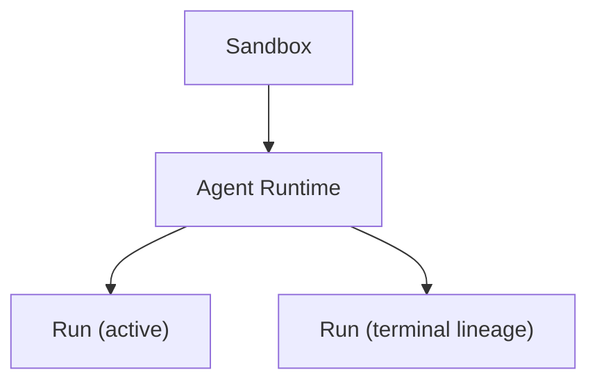

<Aside type="caution" title="成熟度：Private preview">
Execution Sandbox 的领域模型、API 和 Docker Provider 已经实现；Cloud Worker、gVisor 隔离、内部网络和网关能力是否可用取决于运营方的部署配置。
</Aside>

## 简要定义 <a id="sandbox-execution-model" />

Sandbox **不是一个 VPS 账户**。它是一次受控执行环境：拥有 Owner、生命周期、资源上限、网络策略、文件与进程 API、模板/快照来源，以及确定性的清理机制。VPS 或 Worker 只是 Sandbox Provider 背后的承载基础设施，不会直接暴露给应用开发者或 Agent。



Runtime 必须在某个 Sandbox 之下创建——它不能脱离 Sandbox 独立存在。

## 为什么存在这个概念

如果直接把一台裸机或 VPS 暴露给 Agent，就没有统一的资源上限、网络隔离和清理保证。Sandbox 把这些边界收敛成一个显式、可编程的模型：创建时声明隔离级别和资源上限，销毁时确定性清理，中间的所有操作（文件、进程、Agent Run）都通过统一 API 完成，而不是通过裸 SSH。

## 在 Web / CLI / API 中的体现 <a id="sandbox-agent-runtime" />

应用通常为每个用户任务或每条隔离工作分支创建一个短生命周期 Sandbox：

```ts
const sandbox = await appaloft.sandboxes.create({
  source: { kind: "template", templateId: process.env.APPALOFT_SANDBOX_TEMPLATE_ID! },
  requestedIsolation: "gvisor",
  limits: {
    cpuMillis: 2_000,
    memoryBytes: 2_147_483_648,
    diskBytes: 10_737_418_240,
    maxProcesses: 128,
  },
  networkPolicy: { mode: "deny", rules: [] },
  expiresAt: new Date(Date.now() + 60 * 60 * 1_000).toISOString(),
});

try {
  await sandbox.files.write({ path: "job/input.txt", contentBase64: "aGVsbG8=" });
  await sandbox.exec({ argv: ["python3", "/workspace/job.py"], timeoutMs: 10_000 });

  const agent = await sandbox.agents.create({ harness: "pi" });
  const run = await agent.stream({ task: "检查测试失败并修复生产代码" });
  for await (const envelope of run.fullStream) {
    if (envelope.kind === "event") console.log(envelope.data);
  }
} finally {
  await sandbox.terminate();
}
```

Run 事件会在执行过程中增量持久化；断线后可以用 `run.events.stream({ afterSequence })` 从已确认的 sequence 之后继续读取，不会丢失中间输出。终止浏览器或 API 连接**只会停止读取，不会取消 Run**——需要真正停止执行时，必须显式调用 Run 的取消操作。

## 常见产品模式

Agent Runtime 从属于一个已经 ready 的 Sandbox：应用开发者保留自己的 Chat/Session，Appaloft 负责隔离执行、每个 Runtime 同时只有一个活跃 Run、fresh/continue 血缘关系、事件回放和取消。三类常见产品故事：

- **Chat-to-App**：用户让你的 SaaS 创建或修改一个应用。产品保留 Chat 和用户 Session，Appaloft 只接收一个有边界的任务，并在会过期的 Sandbox 中执行。
- **代码库维护**：支持或工程工作流准备好 Workspace，让代码 Agent 修改，再把 Run 事件和最终结果回写到原始工单。
- **人工门控自动化**：Run 遇到高风险能力时暂停执行；应用展示能力、目标地址、请求摘要和过期时间，由用户决定是否放行。

SDK 提供便捷的 Workspace + Agent 组合：

```ts
const workspace = await appaloft.workspaces.create({ sandbox: sandboxInput, harness: "opencode" });
const run = await workspace.agent.runs.create({ task: "Build the requested app in /workspace/app" });
```

`Agent` 是 Sandbox Agent Runtime 的便捷别名，默认使用已准入的 Pi/OpenCode 模板并自动生成幂等键；需要显式锁定版本或续接上一次 Run 时，可以传入 `harnessTemplateId`、`context` 或 `idempotencyKey`。

Run 事件会限制数量、深度和字符串长度，并递归屏蔽 credential、secret、password、token 和 authorization 字段——**它们不是审计事件，也不能替代完整的模型 transcript**。取消操作会终止实际的客户端进程，并防止迟到的成功结果覆盖 `cancelled` 状态。当前 Agent 操作要求已登录的产品 Session；在正式提供作用域受限的长期应用凭据之前，不应该把 Deploy Token 当作等价的认证方式使用。

## 常见误区

- **把 Sandbox 当成长期运行的服务器**：Sandbox 通常是短生命周期的，用完即销毁，不适合作为长期运行服务的宿主——那是 [Server](/docs/servers/overview/) 和 [Resource](/docs/deliver/resources/) 的职责。
- **把生产凭据写进 Sandbox 环境变量或文件**：生产凭据不应该出现在 Sandbox 环境变量、文件、Run 事件或错误信息中；需要调用外部目标时应使用受目标地址约束的凭据代理（credential broker），目标、方法或有效期不匹配时应该直接拒绝，而不是放行。
- **认为隔离等于信任 Agent 生成的代码**：Appaloft 的隔离边界降低了宿主机的暴露面，但不会把任意依赖、模型输出或 Agent 生成的代码变成可信代码——仍然需要按不可信代码的标准去审查和限制权限。

## 相关任务

- [Agent Workspace](/docs/agents/workspaces/)
- [Workspace 协作与休眠恢复](/docs/agents/tasks/)
- [Agent 适配器](/docs/agents/adapters/)

## 进阶细节

官方 examples 仓库提供完整源码：[Chat-to-App](https://github.com/appaloft/examples/blob/main/sandbox-agent/src/chat-to-app.ts)、[人工审批](https://github.com/appaloft/examples/blob/main/sandbox-agent/src/approval-loop.ts)和 [Preview-to-Promotion](https://github.com/appaloft/examples/blob/main/sandbox-agent/src/preview-promote.ts)。
