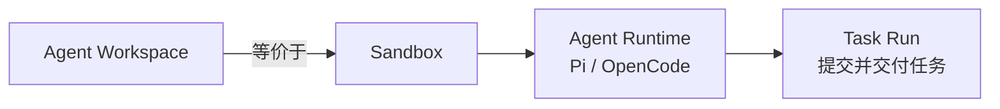

<Aside type="caution" title="成熟度：Public alpha">
Workspace 的 CLI、SDK 和底层操作属于公开 Appaloft 能力；具体 Sandbox Provider、模板、网关和公网地址能力取决于部署方的运营配置。
</Aside>

## 简要定义 <a id="agent-workspace" />

Agent Workspace 把一个 [Sandbox](/docs/agents/sandboxes/)（隔离执行环境）和其中一个 Agent Runtime（例如 Pi 或 OpenCode）组合成一个可远程开发的整体。`workspaceId` 就是 `sandboxId`——两者是同一个身份，没有第二份生命周期或数据库记录。



## 为什么存在这个概念

Sandbox 本身只是一个受控执行环境，不预设"应该跑什么"。Workspace 把 Sandbox 和一个具体的 Agent Runtime、仓库源码、Terminal Session 组合起来，变成一个用户可以直接远程开发、随时断线重连的环境——这是大多数"让 AI Agent 帮我改代码"场景真正需要的抽象层级。

## 从本地目录打开 Agent <a id="agent-workspace-open" />

登录后，团队已有默认 Server 时运行：

```bash
appaloft login
appaloft code
```

默认 `appaloft code` 占用团队默认已注册 Server 上的 **我的 Sandbox**。源是远端 SHA。
缺少 Adapter/Profile 时会创建不可见的 `appaloft-remote`。笔记本路径不是 Workspace
真相，脏树也不会上传。位置参数若是 git remote（`https://`、`ssh://`、`git@host:path`），
无需本地 clone 即可占用该仓库。横幅是：

```text
Remote · <project> · <repo@sha> · <server> · my sandbox · <workspaceId>
```

未登录或没有 Server 会 fail closed 并给出下一步，不会变成 Scratch。本机 Scratch 必须显式指定：

```bash
appaloft code --local
```

`--local` 仍是本机 OpenCode，否则 Pi；不要求 Git、登录、Binding 或 Cloud。横幅仍是
`Local scratch · this Mac · not saved remotely`。

交付用的 durable open 仍是：

```bash
appaloft workspace open
```

这条路径继续走 `workspaces.open`：只用 path 查找 Git root、upstream、branch 和 HEAD SHA，要求
clean 且已 push。`--profile` 选择 Agent Workspace Profile，不同于全局
`--control-plane-profile`。脏树、detached、缺 upstream 或 remote tip 不一致会在任何远端创建前
失败。V1 不做隐式 sync 或 patch upload。

`workspaces.open` 会先验证来源，再读取现有 Repository Binding 和 Project 默认 Profile。如果部署方
组合了可选的 activation initializer，缺少的 Project、Binding 或默认 Profile 可以在同一次显式
activation 中幂等创建或复用，随后必须重新读取公共权威状态；没有 initializer 的 Community/local
部署继续 fail closed。initializer 必须在创建前完成授权与 admission，且不能覆盖已有、冲突、
disabled 或未授权状态。

deploy 方的 entitlement、target policy 或容量失败必须在 Sandbox/provider effect 前失败。错误可以
提示等待、重试或显式接入其他执行位置，但 Appaloft 不会把一次 managed 请求静默改成本机 Scratch。

## 管理正在运行的 Workspace <a id="workspace-control-tui" />

在受支持的 macOS/Linux 交互终端中，无子命令运行：

```bash
appaloft workspace
```

会打开 Appaloft Workspace control TUI。进入 TUI 本身不会创建、暂停、恢复或终止任何
Workspace；它通过现有公开查询显示 Workspace、Agent Runtime、Preview port、Task 和 Promotion
摘要。选择带 attach capability 的 Runtime 后，Agent 自己的 TUI 会作为原生终端字节流嵌入右侧
窗格，Appaloft 不解析对话、tool call 或 hidden reasoning。

详情头部同时显示安全的 target class/source/reason 和 activation `created`/`reused` 状态；它与
headless `sandbox show`、HTTP 和 SDK 使用同一 readback，不显示主机或 provider identity。

- `↑` / `↓` 或 `j` / `k`：选择 Workspace；
- `Enter`：attach 或重新聚焦已经连接的 Agent；
- `a`：打开所选 Workspace 的生命周期操作。`ready` 状态可暂停或终止，`paused` 状态可恢复或
  终止；终止还需要单独按 `y` 确认；
- `d`：打开从当前 detail 推导的交付操作。可以创建默认 private、明确选择 1 小时/8 小时/24
  小时 TTL 的 Preview，撤销已有 Preview，批准或交付符合状态的 Task，以及接受/重试符合状态的
  Promotion；撤销、批准、Git/PR 交付和 Promotion 操作都需要单独按 `y` 确认；
- `s`：打开恢复操作。可以用 `filesystem` 或 `filesystem-memory` capability 创建保留 1、7 或
  30 天的 Snapshot，也可以删除当前 detail 中状态允许删除的精确 Snapshot；创建和删除都需要
  单独按 `y` 确认；
- `Ctrl+]`：把按键所有权从 Agent 交还给 Workspace 导航，不停止或 detach Agent；
- `f`：在同一个 Terminal Session/本地 PTY 上切换 Focus Mode，不启动第二个 Agent；
- `r`：刷新现有公开 read model；`R`：用同一 Session identity 手动重连；
- `q`：仅在 Workspace 导航获得焦点时退出；Agent 获得焦点时，普通按键仍发送给 Agent。

TUI 断开或退出只 detach 客户端。TUI 生命周期操作调用与显式 headless 子命令相同的公开命令；
暂停或终止前会先 detach 当前 Agent viewport，之后重新读取 Workspace 状态，而不是在本地乐观
修改状态。交付和 Snapshot 操作都不会 detach 当前 Agent Session。恢复区域还显示请求/实际隔离、
provision attempts、暂停连续性和当前 Workspace 的 Snapshot。终止/过期 Workspace 的
`Workspace-owned cleanup` 只根据有界 Runtime 与 Preview 查询判定 `clear` 或 `residual`；它不是
主机或 provider 零残留证明。带 deployment identity 的 Promotion 会查询
权威 Deployment Proof，并显示 verdict、mismatch 数和 unavailable evidence 数；Promotion status
不会被伪装成 proof。交付失败会保留有界表单值供修改或重试，credential 不会进入 renderer
协议。脚本、CI、无 TTY 环境或不希望加载 renderer 时使用：

```bash
appaloft workspace --no-tui
appaloft workspace --json
appaloft workspace list
```

等价的 headless 入口仍是 `workspace preview`、`sandbox port revoke`、`workspace task
approve/deliver`、`sandbox promote accept/retry`、`deployment proof`，以及 `sandbox show`、
`sandbox snapshot list/create/show/delete`。

这些路径不会初始化 renderer，并返回稳定的 headless 状态或继续执行现有子命令。Windows 当前仅
保证 help/headless 命令安全；嵌入模式需要独立的 release 与终端验收。Windows，或 `TERM`
缺失、为 `dumb`/`unknown` 的交互环境，会在 renderer 启动前返回
`platform-unsupported`/`terminal-unsupported`，避免把控制序列写入不支持的宿主终端。

## 使用 Profile 显式创建

需要在没有本地 Git context 的自动化中创建新 Workspace 时，使用 credential-free HTTPS
repository 和显式 Profile：

```bash
appaloft workspace create \
  --profile opencode-default \
  --repo https://github.com/acme/web.git \
  --ref refs/heads/feature/login \
  --branch feature/login \
  --attach
```

`--profile` 接受安装 id、Profile id 或唯一显示名。Appaloft 会先编译 Profile 并解析 Sandbox
Template、隔离级别、资源/网络策略、初始化步骤、默认端口、Adapter capability 和安装时配置的
named Credential Connections，再创建 Sandbox。缺失、disabled、stale、ambiguous 或无权限的
Profile/Credential/Template/capability，以及 placement 无容量，都在 Sandbox 创建前失败。
API Key、Token 和 Secret 不允许出现在 argv。

SDK 提供等价的组合式创建：

```ts
const workspace = await appaloft.workspaces.open({
  repository: "https://github.com/acme/web.git",
  repositoryIdentity: "github.com/acme/web",
  ref: "refs/heads/feature/login",
  branch: "feature/login",
  commitSha: "0123456789abcdef0123456789abcdef01234567",
  profile: "opencode-default",
});

console.log(
  workspace.workspaceId,
  workspace.agent.runtimeId,
  workspace.targetSelection,
  workspace.activation,
);
```

如果 Sandbox identity 产生后的步骤失败，错误会包含精确 phase、已有的
`workspaceId`/`runtimeId`、是否可重试以及恢复/终止入口；再次 open 会协调同一个部分创建身份，
不会静默创建重复 Sandbox。

## 断线重连

Terminal Session 由 Appaloft 托管的 PTY 支撑——客户端断线只是"detach"，只要 Session 的存活时间和 Sandbox 仍然有效，再次运行 `appaloft code` 就会重用 Session、重放有限历史输出并继续同一个 Agent 进程：

```bash
appaloft code
```

已有脚本可以继续使用 `appaloft workspace open .`；它不会被弃用或改变机器可读行为。

底层排障命令仍然保留：

```bash
appaloft workspace connect <workspaceId>
appaloft workspace attach <workspaceId>
```

native attach 只签发短期、可撤销的私有访问 capability；返回值不会包含原始服务器地址、
SSH Key 或长期凭据。

## 临时开发预览

```bash
appaloft workspace preview <workspaceId> \
  --port 3000 \
  --visibility private \
  --expires-at 2026-07-24T12:00:00.000Z
```

这是一个**实时开发预览**，不是不可变的候选预览（Promotion Candidate Preview）。URL、TLS、鉴权和路由由 Provider/网关适配器提供；到期、被撤销或 Sandbox 被清理后，地址必须立即失效。不同团队成员使用各自的 Sandbox 时，端口暴露、文件和进程都有独立身份，互不冲突。

## 生命周期

```bash
appaloft workspace list
appaloft workspace show <workspaceId>
appaloft workspace pause <workspaceId>
appaloft workspace resume <workspaceId>
appaloft workspace terminate <workspaceId>
```

`workspace list` 是 Sandbox 清单的组合视图，每一项都带 `agentRuntimes`；如果这个数组为空，说明它是一个可以重试或清理的"部分创建"状态，而不是隐藏在另一张表里的状态。

`pause` / `resume` 保留 Sandbox 身份（详见[休眠与恢复](/docs/agents/tasks/)）；`terminate` 会终止 Sandbox 及其拥有的全部 Runtime 状态，这一步不可逆。

## 提交一次 Task

在 Workspace 里给 Agent 布置一个任务、观察进度、批准并交付代码，使用 `workspace task` 子命令族：

```bash
appaloft workspace task run <workspaceId> \
  --runtime-id <runtimeId> \
  --task "修复 Issue #123 并运行测试" \
  --check-arg bun --check-arg test

appaloft workspace task show <workspaceId> <taskRunId>
appaloft workspace task deliver <workspaceId> <taskRunId> \
  --branch fix/issue-123 \
  --commit-message "fix: resolve issue 123" \
  --pull-request-title "Fix issue 123"
```

Task Run 由服务端持久化——客户端断开连接**不会取消 Agent 的执行**。批准和交付源码必须由外部用户或可信 CLI 操作者发起，Sandbox 内的 Runtime 身份不能自我批准自己的变更。

## 常见误区

- **把 Workspace 当成独立于 Sandbox 的资源**：`workspaceId` 和 `sandboxId` 是同一个 id，理解 Sandbox 的隔离和生命周期模型（见 [Sandbox 模型](/docs/agents/sandboxes/)）就理解了 Workspace 的底层行为。
- **认为客户端断线会取消正在运行的 Task**：Task Run 由服务端持久化和恢复，断线只影响观察，不影响执行。
- **把开发预览当成生产访问地址**：开发预览是临时、可过期的实时预览，和[生成的访问地址](/docs/access/generated-routes/)是完全不同的机制。
- **把 `.` 当成上传目录**：它只用于解析 Git context；未提交文件从不隐式上传。
- **在 HEAD 未 push 时继续创建**：Workspace 的来源必须是远端可解析的精确 SHA；先 push，
  或明确选择正确的 upstream，再重试。

## 相关任务

- [Sandbox 模型](/docs/agents/sandboxes/)
- [Workspace 协作与休眠恢复](/docs/agents/tasks/)
- [Agent 适配器](/docs/agents/adapters/)
- [Agent 预览与提升](/docs/agents/preview-promote/)

## 进阶细节

如果第一次创建 Task Run 时 Runtime 已经在忙于处理另一个 Task，运营方可以在适配器层配置并发策略；具体行为取决于所选 Agent 适配器，详见 [Agent 适配器](/docs/agents/adapters/)。
