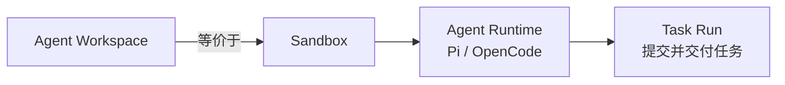

<Aside type="caution" title="成熟度：Public alpha">
Workspace 的 CLI、SDK 和底层操作属于公开 Appaloft 能力；具体 Sandbox Provider、模板、网关和公网地址能力取决于部署方的运营配置。
</Aside>

## 简要定义 <a id="agent-workspace" />

Agent Workspace 把一个 [Sandbox](/docs/agents/sandboxes/)（隔离执行环境）和其中一个 Agent Runtime（例如 Pi 或 OpenCode）组合成一个可远程开发的整体。`workspaceId` 就是 `sandboxId`——两者是同一个身份，没有第二份生命周期或数据库记录。



## 为什么存在这个概念

Sandbox 本身只是一个受控执行环境，不预设"应该跑什么"。Workspace 把 Sandbox 和一个具体的 Agent Runtime、仓库源码、Terminal Session 组合起来，变成一个用户可以直接远程开发、随时断线重连的环境——这是大多数"让 AI Agent 帮我改代码"场景真正需要的抽象层级。

## 创建一个 Workspace

```bash
appaloft workspace create \
  --harness opencode \
  --sandbox-template sbt_opencode \
  --repo https://github.com/acme/web.git \
  --branch feature/login \
  --isolation gvisor \
  --cpu-millis 2000 \
  --memory-bytes 2147483648 \
  --disk-bytes 10737418240 \
  --max-processes 128
```

把 `--harness opencode` 换成 `--harness pi` 即可创建 Pi Workspace。用 `appaloft workspace harness list` 可以查看当前部署实际注册的适配器、Sandbox 模板、交互方式、Session 恢复能力和任务能力——Web 控制台的创建入口读取的是同一份目录，不会为某个 Agent 名称写死按钮。

SDK 提供等价的组合式创建：

```ts
const workspace = await appaloft.workspaces.create({
  sandbox: sandboxInput,
  harness: "opencode",
});

console.log(workspace.workspaceId, workspace.agent.runtimeId);
```

如果 Runtime 创建这一步失败，SDK 会抛出 `AppaloftWorkspaceCreateError`，其中仍包含已经创建的 `workspaceId`（即 `sandboxId`），调用方可以重试 Runtime 创建，也可以显式终止这个 Sandbox。

该入口当前只接受不含用户名、密码或 token 的 HTTPS 仓库地址；私有仓库凭据不能嵌入 URL，需要由部署方的可信 Source 集成或模板提前准备好。

## 断线重连

Terminal Session 由 Appaloft 托管的 PTY 支撑——客户端断线只是"detach"，只要 Session 的存活时间和 Sandbox 仍然有效，用同一个 `terminalSessionId` 重连就能重放有限的历史输出并继续同一个进程：

```bash
appaloft workspace connect <workspaceId>
appaloft workspace connect <workspaceId> --session-id <terminalSessionId>
```

Web 控制台重新打开 Workspace 详情页时，也会自动查找并重连最新的活跃 Sandbox Session。

对于 OpenCode Runtime，还可以直接刷新远端服务并获得一次原生 attach：

```bash
appaloft workspace attach <workspaceId>
```

这个命令只签发一个最长一小时、可撤销的私有访问描述符，返回本地 `opencode attach` 的接入信息；不支持安全网关的 Provider 会明确返回"不可用"，而不是暴露未受保护的端口。

## 临时开发预览

```bash
appaloft workspace preview <workspaceId> \
  --port 3000 \
  --visibility private \
  --expires-at 2026-07-24T12:00:00.000Z
```

这是一个**实时开发预览**，不是不可变的候选预览（Promotion Candidate Preview）。URL、TLS、鉴权和路由由 Provider/网关适配器提供；到期、被撤销或 Sandbox 被清理后，地址必须立即失效。不同团队成员使用各自的 Sandbox 时，端口暴露、文件和进程都有独立身份，互不冲突。

## 生命周期

```bash
appaloft workspace list
appaloft workspace show <workspaceId>
appaloft workspace pause <workspaceId>
appaloft workspace resume <workspaceId>
appaloft workspace terminate <workspaceId>
```

`workspace list` 是 Sandbox 清单的组合视图，每一项都带 `agentRuntimes`；如果这个数组为空，说明它是一个可以重试或清理的"部分创建"状态，而不是隐藏在另一张表里的状态。

`pause` / `resume` 保留 Sandbox 身份（详见[休眠与恢复](/docs/agents/tasks/)）；`terminate` 会终止 Sandbox 及其拥有的全部 Runtime 状态，这一步不可逆。

## 提交一次 Task

在 Workspace 里给 Agent 布置一个任务、观察进度、批准并交付代码，使用 `workspace task` 子命令族：

```bash
appaloft workspace task run <workspaceId> \
  --runtime-id <runtimeId> \
  --task "修复 Issue #123 并运行测试" \
  --check-arg bun --check-arg test

appaloft workspace task show <workspaceId> <taskRunId>
appaloft workspace task deliver <workspaceId> <taskRunId> \
  --branch fix/issue-123 \
  --commit-message "fix: resolve issue 123" \
  --pull-request-title "Fix issue 123"
```

Task Run 由服务端持久化——客户端断开连接**不会取消 Agent 的执行**。批准和交付源码必须由外部用户或可信 CLI 操作者发起，Sandbox 内的 Runtime 身份不能自我批准自己的变更。

## 常见误区

- **把 Workspace 当成独立于 Sandbox 的资源**：`workspaceId` 和 `sandboxId` 是同一个 id，理解 Sandbox 的隔离和生命周期模型（见 [Sandbox 模型](/docs/agents/sandboxes/)）就理解了 Workspace 的底层行为。
- **认为客户端断线会取消正在运行的 Task**：Task Run 由服务端持久化和恢复，断线只影响观察，不影响执行。
- **把开发预览当成生产访问地址**：开发预览是临时、可过期的实时预览，和[生成的访问地址](/docs/access/generated-routes/)是完全不同的机制。

## 相关任务

- [Sandbox 模型](/docs/agents/sandboxes/)
- [Workspace 协作与休眠恢复](/docs/agents/tasks/)
- [Agent 适配器](/docs/agents/adapters/)
- [Agent 预览与提升](/docs/agents/preview-promote/)

## 进阶细节

如果第一次创建 Task Run 时 Runtime 已经在忙于处理另一个 Task，运营方可以在适配器层配置并发策略；具体行为取决于所选 Agent 适配器，详见 [Agent 适配器](/docs/agents/adapters/)。
