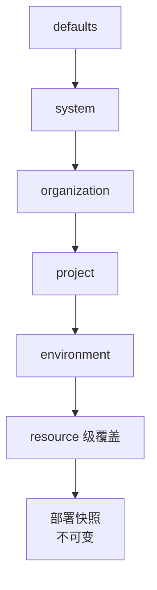

## 简要定义

部署时配置由三层组成：**Environment**（隔离配置的边界，如 staging / production）、**变量**（按优先级合并的键值对）、**Secret**（需要屏蔽明文的敏感变量）。每次部署都会把当时生效的配置保存为不可变快照。

## 为什么存在这个分组

配置错误是排查中最常见也最容易和"部署失败"混淆的一类问题。把环境、变量优先级和密钥处理独立成一个分组，是为了让"这个值到底从哪里来的""为什么修改了配置但线上没变"这类问题有清晰、单一的答案来源。

## 在 Web / CLI / API 中的体现

- **Web** — 项目下的 Environments 标签页展示变量列表、Secret 屏蔽状态和最近修改时间。
- **CLI** — `appaloft env` / `resource set-variable` / `resource secrets` 系列命令。
- **HTTP/API** — `environments.set-variable`、`environments.diff`、`environments.promote` 等操作。

## 常见误区

- **认为修改环境变量会立即影响正在运行的实例**：变量只影响**下一次**部署使用的快照，正在运行的工作负载不会被热更新。
- **把构建时变量当 Secret 使用**：会进入构建产物、暴露给浏览器的变量（如 `PUBLIC_` / `VITE_` 前缀）永远不能标记为 Secret。

## 相关任务

- [配置模型](/docs/configuration/model/)
- [配置优先级](/docs/configuration/precedence/)
- [安全处理密钥](/docs/configuration/secrets/)
- [配置差异与提升](/docs/configuration/diff-promote/)
- [配置文件参考](/docs/configuration/config-file/)

## 进阶细节

配置优先级从低到高依次是：默认值、系统级、组织级、项目级、环境级、资源级，最终在部署创建时冻结为一份不可变快照。理解这个链条，能帮你快速定位"为什么这个值和我预期的不一样"。
