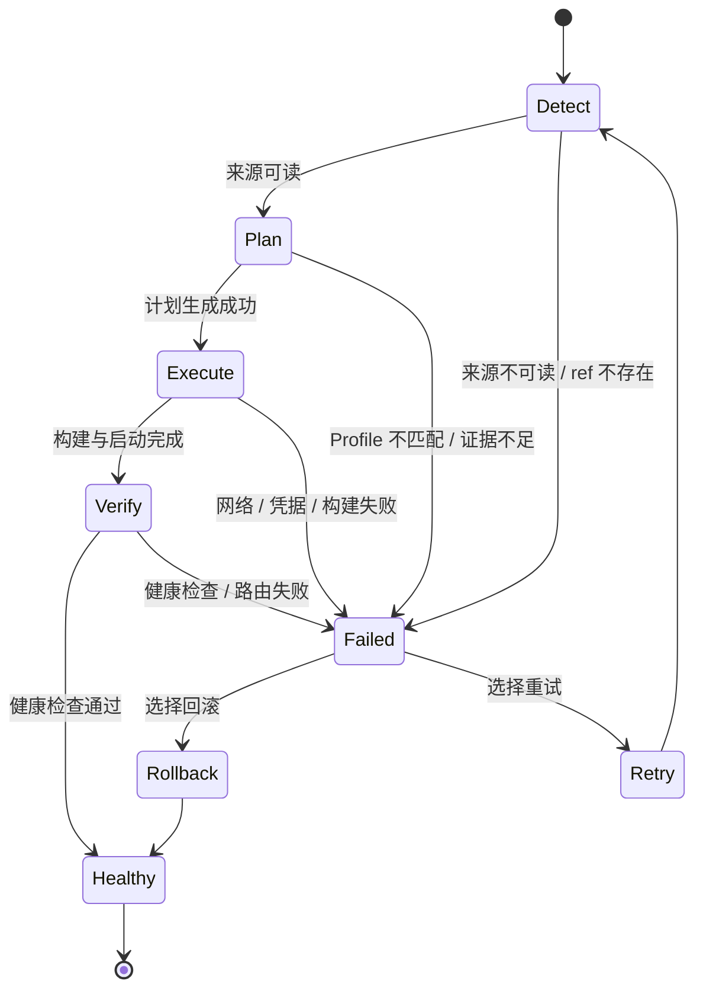

## 简要定义 <a id="deployment-lifecycle" />

Appaloft 把一次部署建模为五个阶段：`detect -> plan -> execute -> verify -> rollback`。这个生命周期用来解释你在 Web/CLI/API 里看到的部署状态，而不是内部实现细节——你需要知道当前卡在哪一步、这一步读取什么输入、失败后该怎么恢复。



## 为什么存在这个概念

如果没有明确的阶段划分，"部署失败了"这句话毫无信息量。把每次部署拆成五个可观察的阶段，是为了让失败信息天然带有"该往哪个方向排查"的线索。

### Detect

读取来源和配置线索，判断应用类型、构建方式、运行入口和网络暴露需求。常见失败：来源不可读取、仓库 ref 或目录不存在、应用类型无法判断且未提供 Runtime Profile。

### Plan

把 Source、Runtime、Health、Network Profile 转成可执行计划。计划应该能解释 Appaloft 准备运行什么（安装/构建/启动命令、监听端口、健康检查、访问路由摘要），而不是只显示一段不透明的 shell 命令。

### Execute

在目标服务器上构建、上传、启动和路由应用。这一阶段的失败通常和网络、凭据、镜像拉取、构建命令或服务器资源有关——先看运行时日志和诊断摘要，而不是急着改域名配置。

### Verify

检查进程、健康策略、代理路由和访问地址。**`docker compose up` 返回成功不等于部署成功**：Appaloft 还会确认容器确实在运行、原生健康检查没有失败，并在配置了 HTTP 健康检查或公网路由时验证该目标服务的每个不同“域名 + 路径”服务路由（重定向不算服务路由）。任一路由失败都会让候选失败；Local/SSH 会清理候选，Swarm 会恢复并验证上一个路由所有者后再清理候选。显式禁用健康检查时不会添加公网探测。

### Rollback

失败后的恢复路径，不是隐藏失败的手段。详见[回滚与恢复](/docs/deliver/recovery/)。

## 在 Web / CLI / API 中的体现

<a id="deployment-plan-preview" />

<a id="deployment-proof" />

```bash
# 只看计划，不创建部署（不会产生副作用）
appaloft deployments plan --project prj_prod --environment env_prod --resource res_web --server srv_prod

# 提交部署
appaloft deploy .

# 跟随实时时间线
appaloft deployments timeline <deploymentId> --follow --json

# 验证一次已接受的部署是否真的变成了当前工作负载
appaloft deployments proof <deploymentId> --json
```

`deployments proof` 会返回 `verified`、`partially-verified`、`unverified`、`stale` 或 `failed`。它比较源码/产物/配置指纹与实际运行中的工作负载身份、健康状态和访问路由归属——即使旧工作负载表面上仍然健康，这次部署也可能被判定为未生效。

## 常见误区

- **认为失败一定意味着应用没启动**：Verify 失败可能只是健康检查路径、监听端口或代理路由配置不对，应用进程可能已经在运行。
- **把 Execute 阶段失败当成域名问题**：Execute 阶段的问题几乎总是构建/网络/凭据相关，域名和证书是 Verify 之后的[访问](/docs/access/overview/)话题。
- **把 Retry 和 Rollback 混淆**：Retry 基于失败部署的快照重新尝试；Rollback 基于历史成功部署的快照创建新的部署，详见[回滚与恢复](/docs/deliver/recovery/)。

## 相关任务

- [配置部署来源](/docs/deliver/sources/)
- [回滚与恢复](/docs/deliver/recovery/)
- [查看日志与健康摘要](/docs/troubleshoot/logs-health/)
- [状态与事件](/docs/troubleshoot/status-events/)

## 进阶细节

如果原始 `appaloft deploy` 命令的终端会话已经断开，`appaloft deployments timeline <deploymentId> --follow --json` 仍然可以重新打开观测流。这个流可能返回 `entry`、`heartbeat`、`gap`、`closed` 或 `error` 事件；出现 `gap` 表示观测连续性不完整，应重新打开观测或查看部署详情后再决定下一步。
