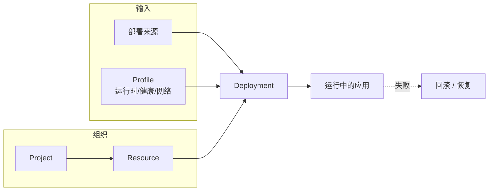

<a id="deploy-handoff-url" />

## 简要定义

"日常交付"指的是从一次代码或产物变更，到它变成运行中、可访问、可回滚部署的整条链路。它把[配置部署来源](/docs/deliver/sources/)、[部署生命周期](/docs/deliver/lifecycle/)、[项目](/docs/deliver/projects/)与[资源](/docs/deliver/resources/)、运行时/健康/网络 [Profile](/docs/deliver/profiles/)，以及 [GitHub 与集成](/docs/deliver/integrations/)组合在一起。

## 为什么存在这个分组

在旧版信息架构中，"部署""项目与资源""集成"是三个独立分组，但实践中它们几乎总是同时出现：配置一个来源的用户，往往已经在配置运行时和网络 Profile 了。把这些内容合并到"交付"分组，是为了让你在解决同一类问题时不需要跨越多个导航分组。

## 在 Web / CLI / API 中的体现

- **Web** — Resource 详情页把 Source、Runtime、Health、Network 配置、部署时间线和预览环境放在同一个页面的不同标签页下。
- **CLI** — `appaloft deploy`、`appaloft resource configure-*`、`appaloft deployments *` 系列命令共享同一套业务操作。
- **HTTP/API** — `/api/deployments`、`/api/resources/{id}/*` 路由复用同一套输入 schema，不为某个入口单独定义字段。

## 常见误区

- 把"部署"当成长期配置容器——实际上部署是一次尝试，长期配置保存在 Resource 的 Profile 中，见[产品心智模型](/docs/start/concepts/)。
- 把 GitHub/Provider/Plugin 集成当成与部署无关的"设置"——实际上它们直接决定部署来源和执行边界，见 [GitHub 与集成](/docs/deliver/integrations/)。

## 相关任务

- [配置部署来源](/docs/deliver/sources/)
- [部署生命周期](/docs/deliver/lifecycle/)
- [预览与清理](/docs/deliver/previews/)
- [回滚与恢复](/docs/deliver/recovery/)
- [资源](/docs/deliver/resources/)

## 进阶细节

一次部署失败时，先判断它卡在生命周期的哪个阶段（detect / plan / execute / verify），再决定该修 Source、Profile，还是走[回滚与恢复](/docs/deliver/recovery/)。逐阶段排查比"重新点一次部署"更快定位根因。
