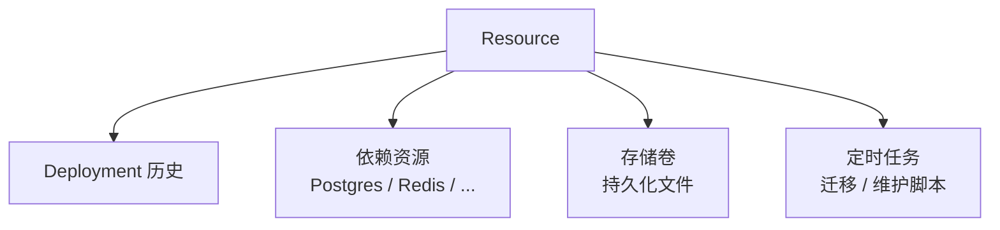

## 简要定义 <a id="concept-resource" />

Resource 是一个可部署的应用或服务——Web 应用、后端服务、静态站点、worker 或 Compose stack。它拥有自己的 Source、Runtime、Health、Network Profile（见[运行时 / 健康 / 网络 Profile](/docs/deliver/profiles/)），并被一次次部署使用。部署历史、运行时日志、健康状态和访问路径都要回到 Resource 视角来理解——Resource 是这些信息的稳定归属，而不是某一次部署。

一个 Resource 除了自己的部署历史，还可以拥有三类附属对象：**依赖资源**（数据库等托管服务）、**存储卷**（持久化文件）和**定时任务**（周期性维护脚本）。



## 为什么存在这个概念

把"要部署的东西"和"这次部署做了什么"分开，是为了让配置漂移可追踪、让回滚有稳定的比较基准。Resource 是配置的归属，Deployment 只是历史事件。

## 依赖资源 <a id="dependency-resource-lifecycle" />

依赖资源是 Appaloft 管理的数据库或服务依赖记录，支持 Postgres、Redis、MySQL、ClickHouse、S3/MinIO 对象存储和 OpenSearch，可以由 Appaloft 供给，也可以导入已有的外部实例。

<a id="dependency-runtime-injection" />

<a id="dependency-backup-restore" />

```bash
# 由 Appaloft 供给一个新的 Postgres 实例
appaloft dependency provision --kind postgres --project prj_prod --environment env_prod --name app-db

# 导入已有的外部依赖（通过标准输入传递连接串，避免出现在进程参数里）
printf '%s\n' "$DATABASE_URL" | appaloft dependency import --kind postgres --project prj_prod --environment env_prod --name external-db --connection-url-stdin

# 把依赖资源绑定到 Resource，Appaloft 只保存安全引用，不会把连接串写入 Resource 或提交的配置文件
appaloft resource dependency bind res_web --dependency dep_db --target DATABASE_URL

# 备份与恢复
appaloft dependency backup create dep_db
appaloft dependency backup restore bkp_123
```

绑定后，部署计划和部署详情会显示依赖运行时注入是否 `ready`：依赖必须处于就绪状态、绑定目标是合法的运行时环境变量名（如 `DATABASE_URL`），且目标运行环境支持依赖密钥交付。如果被标记为 `blocked`，`deployments.create` 会在创建部署前直接拒绝，不会创建一个注定失败的部署尝试，也不会在响应中暴露原始连接串。

## 存储卷 <a id="storage-volume-lifecycle" /><a id="storage-volume-backup-restore" />

存储卷是持久化存储意图的记录——可以是命名卷，也可以是受信任的绑定挂载。创建存储卷不会立即创建部署或修改运行中的容器；只有下一次部署才会真正应用挂载。

```bash
appaloft storage volume create --project prj_prod --environment env_prod --name uploads
appaloft resource storage attach res_web vol_uploads --destination-path /app/uploads
```

一个 Resource 不能在同一个容器内路径上挂载两个存储卷。删除存储卷前必须确认没有活动挂载或备份保留在阻塞；删除本身不会自动解除挂载或清理底层数据。

## 定时任务 <a id="scheduled-task-resource-lifecycle" />

定时任务是 Resource 拥有的重复任务定义，用来运行迁移、同步、缓存预热或维护脚本——它不会创建 Deployment，也不会写入部署历史。

```bash
# 创建定时任务
appaloft scheduled-task create res_web \
  --schedule "0 2 * * *" \
  --timezone UTC \
  --command "bun run migrate" \
  --timeout-seconds 600

# 立即手动运行一次
appaloft scheduled-task run tsk_daily_migration --resource-id res_web

# 查看运行历史和日志
appaloft scheduled-task runs list --task-id tsk_daily_migration
appaloft scheduled-task runs logs str_daily_migration_1 --task-id tsk_daily_migration
```

任务运行失败不会自动回滚或重新部署正在服务的 Resource；日志输出会自动屏蔽看起来像密钥的内容。

## 在 Web / CLI / API 中的体现

Web 控制台在 Resource 详情页把 Source/Runtime/Health/Network、依赖资源、存储卷、定时任务和部署时间线分标签展示。CLI 通过 `appaloft resource *`、`appaloft dependency *`、`appaloft storage volume *`、`appaloft scheduled-task *` 命名空间访问同一批操作；HTTP API 复用完全相同的输入/输出 schema。

## 常见误区

- **把依赖资源备份当成存储卷备份**：数据库类服务依赖走 `dependency-resources.*` 备份/恢复；挂载在 Resource 上的应用文件（如 SQLite、上传目录）走 `storage-volumes.*`，两者不能互相替代。
- **认为轮换依赖绑定密钥会重启应用**：轮换只替换未来部署使用的安全引用，不会修改数据库自身密码，也不会自动重启当前运行时；需要新配置生效必须触发一次新部署。
- **认为定时任务失败会自动处理**：定时任务运行失败需要手动修复命令、Profile 或依赖后重新运行，不会自动回滚线上服务。

## 相关任务

- [项目](/docs/deliver/projects/)
- [运行时 / 健康 / 网络 Profile](/docs/deliver/profiles/)
- [配置优先级](/docs/configuration/precedence/)

## 进阶细节 <a id="deploy-handoff-url" /><a id="blueprint-catalog-installation" />

依赖资源的 Blueprint 契约用中性字段（`kind`、`engine.family`、`version`、`outputs`）描述依赖需求，组件通过 `dependencyEnv` 消费依赖输出；Plan 阶段只记录环境变量名和字段名，不会保存真实密码或连接串。
