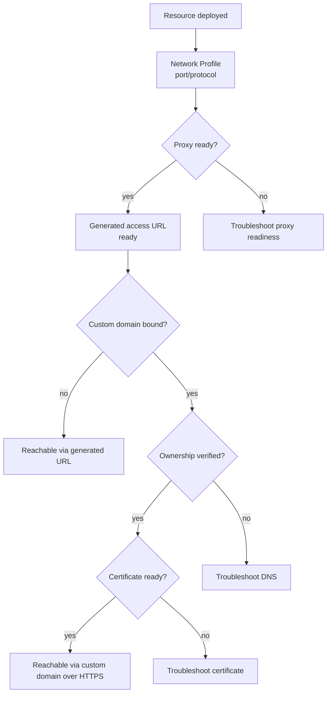

## Short definition

A successfully deployed resource needs an independent access layer to become "a website external users can open": [Generated Access URLs](/docs/en/access/generated-routes/) (a URL you get with zero configuration), [Custom Domains](/docs/en/access/custom-domains/) (pointing your own domain at the resource), and [Certificates](/docs/en/access/certificates/) (whether HTTPS is ready). These are three independent status dimensions that shouldn't be conflated.



## Why this concept exists

"The app won't open" can have at least four completely different causes: the app didn't start, the proxy isn't ready, the domain isn't verified, or the certificate wasn't issued. If docs and the UI collapse these into one generic "access failed" state, users end up troubleshooting at the wrong layer repeatedly. Splitting access into independent, separately observable states means each layer's failure points to a clear next step.

## Where you see it in Web, CLI, and API

```bash
# See the resource's currently selected access URL, and whether a generated URL/custom domain/server route all exist at once
appaloft resource show res_web

# Check runtime, health check, proxy, and public access consistency in one shot
appaloft resource health res_web --checks --public-access-probe
```

The Web console shows generated access URL, custom domain, and certificate status separately on the resource detail page; the HTTP API returns structured `runtime` / `health` / `proxy` / `generatedAccess` fields via `GET /api/resources/{id}/health`.

## Common mistakes

- **Treating a certificate problem as a deployment failure**: a resource can be successfully deployed with the health check fully passing, but the certificate still not ready — this is a completely independent state.
- **Skipping the generated access URL and going straight to custom domain troubleshooting**: confirm the generated access URL is ready first, then troubleshoot the domain layer — this quickly tells you whether the problem is in the app/proxy layer or the domain layer.

## Related tasks

- [Generated Access URLs](/docs/en/access/generated-routes/)
- [Binding A Custom Domain](/docs/en/access/custom-domains/)
- [Certificates](/docs/en/access/certificates/)
- [Access Troubleshooting](/docs/en/access/troubleshooting/)

## Advanced details

When multiple access URL sources exist, Appaloft picks the "current access URL" for display using a fixed priority: a ready, persistent custom domain first, then a server application-configured domain in SSH/CLI mode, and finally the most recently generated default access URL.
