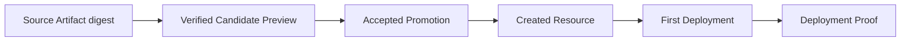

## Short definition

Appaloft saves and lets you query a complete evidence chain:



A Promotion only moves to `completed` status once its public Proof Verdict is `verified`; while a Proof is still `pending`, the persistent worker keeps polling — if the final verdict fails, the Resource, Deployment, and error checkpoint are all preserved for later retry or diagnosis.

## Why this concept exists

When an agent autonomously completes the entire "Sandbox to production deployment" chain, users need a way to confirm "this deployment actually happened as expected," rather than relying solely on the agent's own written report. The delivery evidence chain fixes the input and output of every step into a verifiable record, making the evidence itself independent of the agent's self-reporting.

## What this evidence chain proves — and doesn't prove

This chain proves **facts Appaloft directly observed about the delivery**, such as:

- the deployment was actually executed;
- runtime identity, routing, and health status match expectations;
- the final artifact's content matches the Source Artifact digest captured earlier.

It **does not prove**:

- that the agent-generated program is formally correct;
- that the program is secure or free of vulnerabilities;
- that it satisfies any particular compliance regime.

When you need those guarantees, tests, code review, security scanning, policy checks, and human approval should still be treated as independent, non-substitutable gates — not something the delivery evidence chain itself can replace.

## Related tasks

- [Agent Previews And Promotion](/docs/en/agents/preview-promote/)
- [Sandbox Model](/docs/en/agents/sandboxes/)
- [Deployment Lifecycle](/docs/en/deliver/lifecycle/)

## Advanced details

To review the complete evidence chain for a specific promotion, query:

```bash
appaloft sandbox promotion show <promotionId>
```
