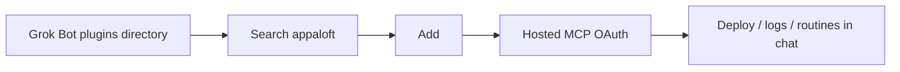

## Goal <a id="grok-bot-plugin" />

The Appaloft plugin for Grok Bot packages the existing `skills/appaloft` skill with Appaloft's hosted HTTP MCP. After you add it and finish OAuth, a bot can use Appaloft's two product doors from a conversation: **Deploy** (folder to URL) and **Agent** (`setup` + `code`).

This path **does not** replace `appaloft setup agent` or `appaloft mcp stdio` on your laptop. Those remain the local-host install.



## When to use this

Use this page when you want to operate Appaloft from Grok Bot. For Cursor, Claude Code, or other laptop hosts, stay on [MCP and tool protocols](/docs/en/agents/mcp/).

## Install the plugin <a id="grok-bot-plugin-install" />

Install Appaloft from the plugins directory in Grok Bot:

1. Launch Grok Bot.
2. Open the plugins directory.
3. Search `appaloft`.
4. Click **Add** next to the Appaloft plugin.

The plugin JSON does **not** contain a token. Authentication happens next, through OAuth on the hosted MCP.

## Authenticate with Appaloft <a id="grok-bot-plugin-authenticate" />

After adding the plugin, connect it to your Appaloft account. Authentication is the hosted MCP server's OAuth flow:

1. Open the Appaloft plugin page in Grok Bot.
2. Choose **Authenticate**.
3. Complete the hosted MCP OAuth flow when your browser opens.

The hosted MCP URL is [`https://app.appaloft.com/mcp`](https://app.appaloft.com/mcp).

## Use Appaloft in Grok Bot <a id="grok-bot-plugin-use-cases" />

Ask a bot for the Appaloft outcome you want. Common use cases include:

- **Deploy**: take a folder to a reachable URL (the Deploy door).
- **Logs**: query the logs your applications collect.
- **Routines**: create routines in Grok that summarize application usage daily.

## What's included <a id="grok-bot-plugin-included" />

The Grok Bot plugin installs these components:

- The existing `skills/appaloft` skill, with Appaloft workflows for setup, deployment, and operations.
- The hosted HTTP MCP at [`https://app.appaloft.com/mcp`](https://app.appaloft.com/mcp), which reaches your Appaloft account through OAuth. No token is stored in the plugin JSON.

## Laptop path stays <a id="grok-bot-plugin-laptop-path" />

On a laptop, keep writing the skill and Local MCP with:

```bash
appaloft login
appaloft setup agent
```

Or start local MCP directly:

```bash
appaloft mcp stdio
```

See [MCP and tool protocols](/docs/en/agents/mcp/). The Grok Bot plugin is a hosted MCP entry. It does not replace `appaloft setup agent`.

## Related tasks

- [MCP and tool protocols](/docs/en/agents/mcp/)
- [Full Appaloft Skill](/docs/en/agents/skill/)
- [Choosing an entrypoint](/docs/en/start/entrypoints/)
