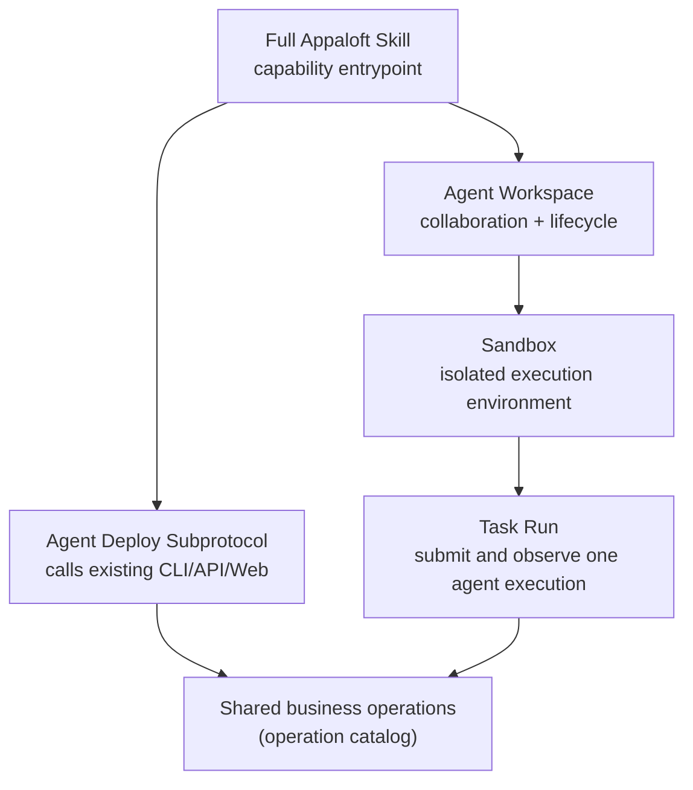

## Short definition

This group explains how an AI agent uses Appaloft safely: get capability documentation through the [Full Appaloft Skill](/docs/en/agents/skill/), complete deployments through the [Agent Deploy Subprotocol](/docs/en/agents/deploy-skill/), and get an isolated execution environment through [Agent Workspace](/docs/en/agents/workspaces/) and the [Sandbox Model](/docs/en/agents/sandboxes/).

**Maturity note**: Agent Workspace and Sandbox are currently in **Private Preview** — interfaces and behavior may change; depend on them cautiously on production-critical paths.

## Why this group exists

When an AI agent operates Appaloft, it must follow exactly the same boundaries as a human user: it can't bypass the application layer to operate the database, SSH, or a provider SDK directly, can't read plaintext secrets, and can't invent "agent-exclusive operations" that only it can call. This group collects the rules for "how an agent should use Appaloft safely" in one place, instead of repeating them scattered across every feature page.

## Core concepts at a glance

| Concept | One-line description | Detail |
| --- | --- | --- |
| Appaloft Skill | The agent's complete capability manual, mapped to the same operations as CLI/API/Web | [Full Appaloft Skill](/docs/en/agents/skill/) |
| Deploy subprotocol | How an agent safely triggers a deployment | [Agent Deploy Subprotocol](/docs/en/agents/deploy-skill/) |
| Agent Workspace | The container for an agent's long-lived collaboration and execution, built on Sandbox | [Agent Workspace](/docs/en/agents/workspaces/) |
| Sandbox | The isolated execution environment model behind Workspace | [Sandbox Model](/docs/en/agents/sandboxes/) |
| Task Run | Submitting, observing, and reviewing one agent execution on a Sandbox | [Workspace Collaboration And Pause/Resume](/docs/en/agents/tasks/) |
| Agent adapters | How to install and choose a specific agent runtime | [Agent Adapters](/docs/en/agents/adapters/) |
| Preview and promotion | Agent-driven preview deployment and production promotion flow | [Agent Previews And Promotion](/docs/en/agents/preview-promote/) |
| Delivery evidence | Verifiable evidence after a deployment completes | [Delivery Evidence](/docs/en/agents/delivery-evidence/) |
| MCP | The tool-calling protocol layer | [MCP And Tool Protocols](/docs/en/agents/mcp/) |

## Common mistakes

- **Treating agent deployment as a new business operation**: agent deployment only translates "deploy this project" into existing project, server, environment, and resource operations — it never adds capabilities only an agent can call.
- **Letting an agent read `.env`, private keys, or token files directly**: an agent should always work through the CLI/API/Web/MCP entrypoints — secrets should be injected through a trusted secret manager or environment variables, never read directly by the agent.
- **Assuming Appaloft uploads artifacts to a managed cloud**: unless the user explicitly opts into Appaloft Cloud's managed capability, the default deployment target is still the BYOS server the user chose themselves.

## Related tasks

- [Full Appaloft Skill](/docs/en/agents/skill/)
- [Agent Deploy Subprotocol](/docs/en/agents/deploy-skill/)
- [Agent Workspace](/docs/en/agents/workspaces/)
- [Sandbox Model](/docs/en/agents/sandboxes/)

## Advanced details

MCP (Model Context Protocol) is Appaloft's protocol layer for tool-calling scenarios, sharing the same operation catalog as CLI/HTTP API/Web. Once MCP is configured, the Skill can use it as a callable tool layer; without it configured, the Skill still works normally through CLI/HTTP API/Web.
