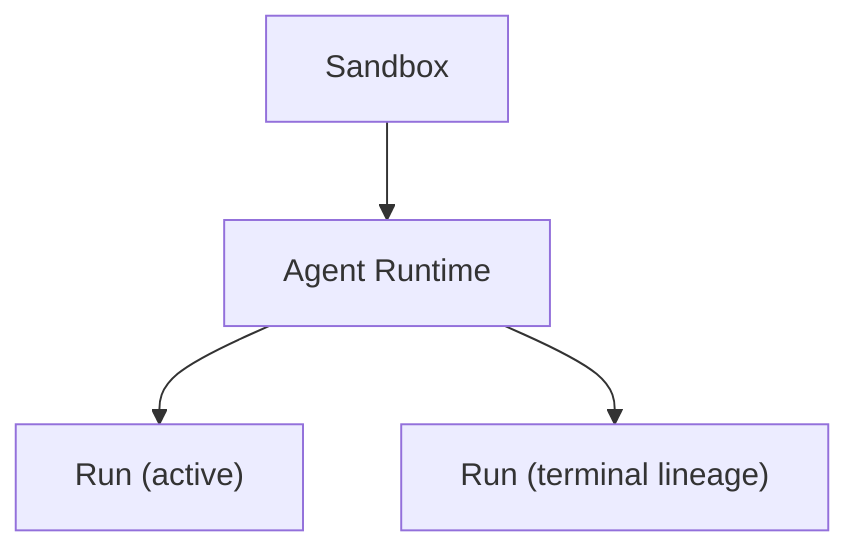

<Aside type="caution" title="Maturity: Private preview">
Execution Sandbox's domain model, API, and Docker provider are implemented; whether Cloud Worker, gVisor isolation, internal networking, and gateway capabilities are available depends on the operator's deployment configuration.
</Aside>

## Short definition <a id="sandbox-execution-model" />

A Sandbox **is not a VPS account**. It's a controlled execution environment: it has an owner, a lifecycle, resource limits, a network policy, file and process APIs, a template/snapshot source, and deterministic cleanup. A VPS or Worker is just the underlying infrastructure behind a Sandbox provider — it's never exposed directly to app developers or agents.



A Runtime must be created under a Sandbox — it can't exist independently outside of one.

## Why this concept exists

Exposing a bare machine or VPS directly to an agent gives you no unified resource limits, network isolation, or cleanup guarantee. Sandbox converges these boundaries into an explicit, programmable model: declare the isolation level and resource limits at creation time, guarantee deterministic cleanup at destruction time, and route every operation in between (files, processes, agent runs) through a unified API instead of raw SSH.

## Where you see it in Web, CLI, and API <a id="sandbox-agent-runtime" />

Applications typically create a short-lived Sandbox per user task or per isolated work branch:

```ts
const sandbox = await appaloft.sandboxes.create({
  source: { kind: "template", templateId: process.env.APPALOFT_SANDBOX_TEMPLATE_ID! },
  requestedIsolation: "gvisor",
  limits: {
    cpuMillis: 2_000,
    memoryBytes: 2_147_483_648,
    diskBytes: 10_737_418_240,
    maxProcesses: 128,
  },
  networkPolicy: { mode: "deny", rules: [] },
  expiresAt: new Date(Date.now() + 60 * 60 * 1_000).toISOString(),
});

try {
  await sandbox.files.write({ path: "job/input.txt", contentBase64: "aGVsbG8=" });
  await sandbox.exec({ argv: ["python3", "/workspace/job.py"], timeoutMs: 10_000 });

  const agent = await sandbox.agents.create({ harness: "pi" });
  const run = await agent.stream({ task: "Check the failing tests and fix the production code" });
  for await (const envelope of run.fullStream) {
    if (envelope.kind === "event") console.log(envelope.data);
  }
} finally {
  await sandbox.terminate();
}
```

Run events are persisted incrementally as execution proceeds; after a disconnect you can use `run.events.stream({ afterSequence })` to keep reading from the last confirmed sequence without losing output in between. Closing a browser or API connection **only stops reading — it doesn't cancel the Run**; to actually stop execution, you must explicitly call the Run's cancel operation.

## Common product patterns

An Agent Runtime belongs to an already-ready Sandbox: the application developer keeps their own chat/session, while Appaloft handles isolated execution, one active Run per runtime at a time, fresh/continue lineage, event replay, and cancellation. Three common product stories:

- **Chat-to-App**: a user asks your SaaS to create or modify an app. The product keeps the chat and user session, and Appaloft only receives a bounded task, executed inside an expirable Sandbox.
- **Codebase maintenance**: a support or engineering workflow prepares a Workspace, lets a code agent make changes, then writes the Run events and final result back to the original ticket.
- **Human-gated automation**: a Run pauses execution when it hits a high-risk capability; the app shows the capability, target address, request summary, and expiration, and the user decides whether to allow it.

The SDK provides a convenient Workspace + Agent composition:

```ts
const workspace = await appaloft.workspaces.create({ sandbox: sandboxInput, harness: "opencode" });
const run = await workspace.agent.runs.create({ task: "Build the requested app in /workspace/app" });
```

`Agent` is a convenience alias for the Sandbox Agent Runtime — by default it uses an already-admitted Pi/OpenCode template and auto-generates an idempotency key; pass `harnessTemplateId`, `context`, or `idempotencyKey` when you need to explicitly pin a version or continue a previous Run.

Run events are bounded in count, depth, and string length, and recursively mask `credential`, `secret`, `password`, `token`, and `authorization` fields — **they are not audit events and can't substitute for a full model transcript**. Cancellation terminates the actual client process and prevents a late-arriving success result from overwriting the `cancelled` status. Current agent operations require a logged-in product session; until scoped, long-lived application credentials are formally offered, a deploy token should not be treated as an equivalent authentication method.

## Common mistakes

- **Treating a Sandbox as a long-running server**: a Sandbox is typically short-lived and gets destroyed after use — it's not suitable as a host for a long-running service, which is the job of [Server](/docs/en/servers/overview/) and [Resource](/docs/en/deliver/resources/).
- **Writing production credentials into Sandbox environment variables or files**: production credentials shouldn't appear in Sandbox environment variables, files, run events, or error messages; when calling an external target, use a credential broker constrained to the target address — it should reject a mismatched target, method, or expiration outright rather than allow it.
- **Assuming isolation equals trusting agent-generated code**: Appaloft's isolation boundary reduces the host machine's exposure surface, but it doesn't turn arbitrary dependencies, model output, or agent-generated code into trusted code — it still needs to be reviewed and permission-limited by the standards of untrusted code.

## Related tasks

- [Agent Workspace](/docs/en/agents/workspaces/)
- [Workspace Collaboration And Pause/Resume](/docs/en/agents/tasks/)
- [Agent Adapters](/docs/en/agents/adapters/)

## Advanced details

The official examples repository provides full source code: [Chat-to-App](https://github.com/appaloft/examples/blob/main/sandbox-agent/src/chat-to-app.ts), [Human Approval](https://github.com/appaloft/examples/blob/main/sandbox-agent/src/approval-loop.ts), and [Preview-to-Promotion](https://github.com/appaloft/examples/blob/main/sandbox-agent/src/preview-promote.ts).
