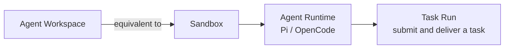

<Aside type="caution" title="Maturity: Public alpha">
Workspace's CLI, SDK, and underlying operations are a public Appaloft capability; the specific Sandbox provider, templates, gateway, and public-address capabilities depend on the operator's deployment configuration.
</Aside>

## Short definition <a id="agent-workspace" />

An Agent Workspace combines a [Sandbox](/docs/en/agents/sandboxes/) (an isolated execution environment) with an Agent Runtime inside it (like Pi or OpenCode) into one remotely-developable unit. `workspaceId` **is** `sandboxId` — they're the same identity, with no second lifecycle or database record.



## Why this concept exists

A Sandbox by itself is just a controlled execution environment — it doesn't presuppose "what should run in it." Workspace combines a Sandbox with a specific agent runtime, repository source, and terminal session into an environment the user can develop in remotely and reconnect to anytime after disconnecting — this is the abstraction level most "let an AI agent help me change code" scenarios actually need.

## Open a Workspace from a local repository <a id="agent-workspace-open" />

After configuring the Repository Binding, Project default Agent Profile, Server Pool, and Profile
Credential Connections, run this from a clean, pushed Git branch:

```bash
appaloft code
```

`appaloft code [path]` is the primary task-oriented entry; path defaults to `.`. The compatibility
command `appaloft workspace open [path]` delegates to the same `workspaces.open` operation. The CLI
uses the path only to find the Git root, upstream remote, branch, and HEAD SHA. It does not
upload the local directory or uncommitted files. It normalizes the remote to a Repository identity,
finds the Project through its Repository Binding, selects `--profile` or the Project default
Profile, then creates or resumes the remote Workspace. By default it enters the Agent-owned
interface:

- a managed-terminal Adapter launches or reuses the Agent TUI Terminal Session and connects;
- a native-attach Adapter obtains a short-lived revocable capability and executes or displays its
  declared local-client handoff;
- an Adapter without attach support returns an explicit capability error.

Attach behavior comes only from Adapter capabilities, never Pi, OpenCode, or another Agent name.

The same command resumes the preferred Workspace when its source SHA still matches. Use `--new` for
a new isolated Workspace, or `--no-attach` to return only the descriptor:

```bash
appaloft code . --new
appaloft code . --no-attach
```

`--profile` selects an Agent Workspace Profile. It is distinct from the global
`--control-plane-profile`, which selects a saved local control-plane connection. The first slice
does not add `--keep-awake` or automatic-removal shortcuts; use explicit Workspace lifecycle
commands to pause, resume, or terminate.

Staged, unstaged, or untracked files; no upstream; an unpushed HEAD; or a remote branch tip that
differs from HEAD all fail before any remote creation. The error shows the exact HEAD SHA and safe
clean/push guidance. V1 never performs implicit sync or patch upload.

## Explicit Profile-aware creation

For automation without local Git context, use a credential-free HTTPS repository and an explicit
Profile:

```bash
appaloft workspace create \
  --profile opencode-default \
  --repo https://github.com/acme/web.git \
  --ref refs/heads/feature/login \
  --branch feature/login \
  --attach
```

`--profile` accepts an installation id, Profile id, or unique display name. Appaloft compiles the
Profile and resolves its Sandbox Template, isolation, resource/network policy, initialization,
default ports, Adapter capabilities, and installation-configured named Credential Connections
before creating a Sandbox. Missing, disabled, stale, ambiguous, or unauthorized
Profile/Credential/Template/capability state and placement capacity fail before effects. API keys,
tokens, and secrets are not accepted in argv.

The SDK provides an equivalent composable creation call:

```ts
const workspace = await appaloft.workspaces.open({
  repository: "https://github.com/acme/web.git",
  repositoryIdentity: "github.com/acme/web",
  ref: "refs/heads/feature/login",
  branch: "feature/login",
  commitSha: "0123456789abcdef0123456789abcdef01234567",
  profile: "opencode-default",
});

console.log(workspace.workspaceId, workspace.agent.runtimeId);
```

If the runtime creation step fails, the SDK throws `AppaloftWorkspaceCreateError`, which still carries the already-created `workspaceId` (that is, `sandboxId`) — the caller can retry runtime creation, or explicitly terminate the Sandbox.

This entrypoint only accepts an HTTPS repository address with no username, password, token, query, or fragment embedded. A trusted server-side composition can resolve transient private-source credentials without adding them to the Workspace input:

```ts
const appaloft = createAppaloftClient({
  baseUrl,
  workspaceSourceCredentialProvider: async ({ repository }) => {
    const credential = await trustedSourceIntegration.resolve(repository);
    return credential
      ? {
          kind: "http-basic",
          username: credential.username,
          password: credential.password,
        }
      : null;
  },
});
```

Use this provider only in a trusted backend or operator process, not in a browser bundle. The SDK validates the returned material and delivers its derived authorization header to network Git commands through Sandbox stdin and process-scoped Git configuration; it does not place credentials in the repository URL or process argv. A template may still prepare private-source access when the operator owns that lifecycle.

If a step fails after the Sandbox identity exists, the error carries the exact phase, existing
`workspaceId`/`runtimeId`, retryability, and recovery/terminate entrypoints. Reopening coordinates
against that same partial identity instead of silently creating a duplicate Sandbox.

## Reconnecting after disconnect

Terminal sessions are backed by a PTY managed by Appaloft — a client disconnect is just a "detach."
While the session TTL and Sandbox remain valid, running `appaloft code` again reuses the Session,
replays bounded output, and continues the same Agent process:

```bash
appaloft code
```

Existing automation can keep using `appaloft workspace open .`; it is not deprecated and its
machine-readable behavior is unchanged.

Lower-level diagnostic commands remain available:

```bash
appaloft workspace connect <workspaceId>
appaloft workspace attach <workspaceId>
```

Native attach issues only short-lived revocable private access. It never returns a raw server
address, SSH key, or long-lived credential.

## Temporary development preview

```bash
appaloft workspace preview <workspaceId> \
  --port 3000 \
  --visibility private \
  --expires-at 2026-07-24T12:00:00.000Z
```

This is a **live development preview**, not an immutable Promotion Candidate Preview. The URL, TLS, auth, and routing are provided by a provider/gateway adapter; once expired, revoked, or the Sandbox is cleaned up, the address must become invalid immediately. When different team members use their own Sandboxes, port exposure, files, and processes each have independent identity and don't conflict with each other.

## Lifecycle

```bash
appaloft workspace list
appaloft workspace show <workspaceId>
appaloft workspace pause <workspaceId>
appaloft workspace resume <workspaceId>
appaloft workspace terminate <workspaceId>
```

`workspace list` is a combined view of the Sandbox inventory, with each item carrying `agentRuntimes`; if that array is empty, it means the item is in a retryable or cleanable "partially created" state, rather than a state hidden in another table.

`pause` / `resume` preserve the Sandbox identity (see [Pause And Resume](/docs/en/agents/tasks/) for details); `terminate` terminates the Sandbox and all runtime state it owns — this step is irreversible.

## Submitting a Task

To assign an agent a task inside a Workspace, watch its progress, and approve and deliver the resulting code, use the `workspace task` command family:

```bash
appaloft workspace task run <workspaceId> \
  --runtime-id <runtimeId> \
  --task "Fix issue #123 and run tests" \
  --check-arg bun --check-arg test

appaloft workspace task show <workspaceId> <taskRunId>
appaloft workspace task deliver <workspaceId> <taskRunId> \
  --branch fix/issue-123 \
  --commit-message "fix: resolve issue 123" \
  --pull-request-title "Fix issue 123"
```

A Task Run is persisted server-side — a client disconnecting **does not cancel the agent's execution**. Approving and delivering source code must be initiated by an external user or a trusted CLI operator — a runtime identity inside the Sandbox can never approve its own changes.

## Common mistakes

- **Treating Workspace as a resource independent from Sandbox**: `workspaceId` and `sandboxId` are the same id — understanding the Sandbox's isolation and lifecycle model (see [Sandbox Model](/docs/en/agents/sandboxes/)) means understanding Workspace's underlying behavior.
- **Assuming a client disconnect cancels a running Task**: a Task Run is persisted and recovered server-side — disconnecting only affects observation, not execution.
- **Treating a development preview as a production access URL**: a development preview is a temporary, expirable live preview — a completely different mechanism from a [Generated Access URL](/docs/en/access/generated-routes/).
- **Treating `.` as an upload directory**: it is used only to resolve Git context; local changes are
  never uploaded implicitly.
- **Creating before HEAD is pushed**: Workspace source must resolve to an exact remote SHA; push or
  select the correct upstream first.

## Related tasks

- [Sandbox Model](/docs/en/agents/sandboxes/)
- [Workspace Collaboration And Pause/Resume](/docs/en/agents/tasks/)
- [Agent Adapters](/docs/en/agents/adapters/)
- [Agent Previews And Promotion](/docs/en/agents/preview-promote/)

## Advanced details

If a runtime is already busy handling another Task when a new Task Run is first submitted, the operator can configure concurrency policy at the adapter layer; the exact behavior depends on the chosen agent adapter — see [Agent Adapters](/docs/en/agents/adapters/) for details.
