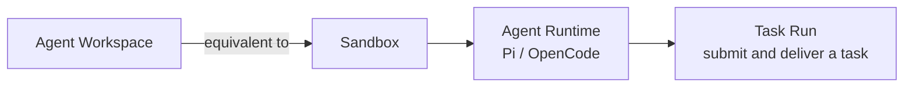

<Aside type="caution" title="Maturity: Public alpha">
Workspace's CLI, SDK, and underlying operations are a public Appaloft capability; the specific Sandbox provider, templates, gateway, and public-address capabilities depend on the operator's deployment configuration.
</Aside>

## Short definition <a id="agent-workspace" />

An Agent Workspace combines a [Sandbox](/docs/en/agents/sandboxes/) (an isolated execution environment) with an Agent Runtime inside it (like Pi or OpenCode) into one remotely-developable unit. `workspaceId` **is** `sandboxId` — they're the same identity, with no second lifecycle or database record.



## Why this concept exists

A Sandbox by itself is just a controlled execution environment — it doesn't presuppose "what should run in it." Workspace combines a Sandbox with a specific agent runtime, repository source, and terminal session into an environment the user can develop in remotely and reconnect to anytime after disconnecting — this is the abstraction level most "let an AI agent help me change code" scenarios actually need.

## Creating a Workspace

```bash
appaloft workspace create \
  --harness opencode \
  --sandbox-template sbt_opencode \
  --repo https://github.com/acme/web.git \
  --branch feature/login \
  --isolation gvisor \
  --cpu-millis 2000 \
  --memory-bytes 2147483648 \
  --disk-bytes 10737418240 \
  --max-processes 128
```

Swap `--harness opencode` for `--harness pi` to create a Pi Workspace instead. Use `appaloft workspace harness list` to see the adapters, sandbox templates, interaction modes, session recovery capabilities, and task capabilities actually registered on the current deployment — the Web console's creation entrypoint reads the same catalog, and doesn't hardcode a button for any particular agent name.

The SDK provides an equivalent composable creation call:

```ts
const workspace = await appaloft.workspaces.create({
  sandbox: sandboxInput,
  harness: "opencode",
});

console.log(workspace.workspaceId, workspace.agent.runtimeId);
```

If the runtime creation step fails, the SDK throws `AppaloftWorkspaceCreateError`, which still carries the already-created `workspaceId` (that is, `sandboxId`) — the caller can retry runtime creation, or explicitly terminate the Sandbox.

This entrypoint currently only accepts an HTTPS repository address with no username, password, or token embedded; private repository credentials can't be embedded in the URL and must be prepared ahead of time by a trusted operator source integration or template.

## Reconnecting after disconnect

Terminal sessions are backed by a PTY managed by Appaloft — a client disconnect is just a "detach." As long as the session's TTL and the Sandbox are both still valid, reconnecting with the same `terminalSessionId` replays a bounded amount of history output and continues the same process:

```bash
appaloft workspace connect <workspaceId>
appaloft workspace connect <workspaceId> --session-id <terminalSessionId>
```

Reopening a Workspace detail page in the Web console also automatically finds and reconnects to the latest active Sandbox session.

For the OpenCode runtime, you can also refresh the remote service directly and get a native attach:

```bash
appaloft workspace attach <workspaceId>
```

This command only issues a private, revocable access descriptor valid for at most one hour, returning the connection info for a local `opencode attach`. Providers that don't support the secure gateway explicitly return "unavailable" rather than exposing an unprotected port.

## Temporary development preview

```bash
appaloft workspace preview <workspaceId> \
  --port 3000 \
  --visibility private \
  --expires-at 2026-07-24T12:00:00.000Z
```

This is a **live development preview**, not an immutable Promotion Candidate Preview. The URL, TLS, auth, and routing are provided by a provider/gateway adapter; once expired, revoked, or the Sandbox is cleaned up, the address must become invalid immediately. When different team members use their own Sandboxes, port exposure, files, and processes each have independent identity and don't conflict with each other.

## Lifecycle

```bash
appaloft workspace list
appaloft workspace show <workspaceId>
appaloft workspace pause <workspaceId>
appaloft workspace resume <workspaceId>
appaloft workspace terminate <workspaceId>
```

`workspace list` is a combined view of the Sandbox inventory, with each item carrying `agentRuntimes`; if that array is empty, it means the item is in a retryable or cleanable "partially created" state, rather than a state hidden in another table.

`pause` / `resume` preserve the Sandbox identity (see [Pause And Resume](/docs/en/agents/tasks/) for details); `terminate` terminates the Sandbox and all runtime state it owns — this step is irreversible.

## Submitting a Task

To assign an agent a task inside a Workspace, watch its progress, and approve and deliver the resulting code, use the `workspace task` command family:

```bash
appaloft workspace task run <workspaceId> \
  --runtime-id <runtimeId> \
  --task "Fix issue #123 and run tests" \
  --check-arg bun --check-arg test

appaloft workspace task show <workspaceId> <taskRunId>
appaloft workspace task deliver <workspaceId> <taskRunId> \
  --branch fix/issue-123 \
  --commit-message "fix: resolve issue 123" \
  --pull-request-title "Fix issue 123"
```

A Task Run is persisted server-side — a client disconnecting **does not cancel the agent's execution**. Approving and delivering source code must be initiated by an external user or a trusted CLI operator — a runtime identity inside the Sandbox can never approve its own changes.

## Common mistakes

- **Treating Workspace as a resource independent from Sandbox**: `workspaceId` and `sandboxId` are the same id — understanding the Sandbox's isolation and lifecycle model (see [Sandbox Model](/docs/en/agents/sandboxes/)) means understanding Workspace's underlying behavior.
- **Assuming a client disconnect cancels a running Task**: a Task Run is persisted and recovered server-side — disconnecting only affects observation, not execution.
- **Treating a development preview as a production access URL**: a development preview is a temporary, expirable live preview — a completely different mechanism from a [Generated Access URL](/docs/en/access/generated-routes/).

## Related tasks

- [Sandbox Model](/docs/en/agents/sandboxes/)
- [Workspace Collaboration And Pause/Resume](/docs/en/agents/tasks/)
- [Agent Adapters](/docs/en/agents/adapters/)
- [Agent Previews And Promotion](/docs/en/agents/preview-promote/)

## Advanced details

If a runtime is already busy handling another Task when a new Task Run is first submitted, the operator can configure concurrency policy at the adapter layer; the exact behavior depends on the chosen agent adapter — see [Agent Adapters](/docs/en/agents/adapters/) for details.
