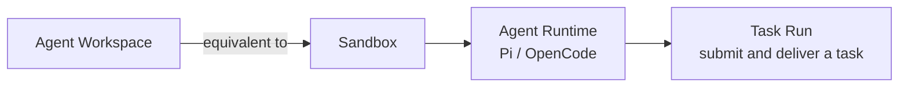

<Aside type="caution" title="Maturity: Public alpha">
Workspace's CLI, SDK, and underlying operations are a public Appaloft capability; the specific Sandbox provider, templates, gateway, and public-address capabilities depend on the operator's deployment configuration.
</Aside>

## Short definition <a id="agent-workspace" />

An Agent Workspace combines a [Sandbox](/docs/en/agents/sandboxes/) (an isolated execution environment) with an Agent Runtime inside it (like Pi or OpenCode) into one remotely-developable unit. `workspaceId` **is** `sandboxId` — they're the same identity, with no second lifecycle or database record.



## Why this concept exists

A Sandbox by itself is just a controlled execution environment — it doesn't presuppose "what should run in it." Workspace combines a Sandbox with a specific agent runtime, repository source, and terminal session into an environment the user can develop in remotely and reconnect to anytime after disconnecting — this is the abstraction level most "let an AI agent help me change code" scenarios actually need.

## Open an Agent from a local directory <a id="agent-workspace-open" />

Run this after login when the team has a default enrolled Server:

```bash
appaloft login
appaloft code
```

Default `appaloft code` occupies **my Sandbox** on the team's default enrolled Server.
Source is the remote SHA. Adapter and Profile are created if missing. The laptop path
is not Workspace truth, and dirty files are not uploaded. A positional git remote
(`https://`, `ssh://`, or `git@host:path`) occupies that repository without a local
clone. The banner is:

```text
Remote · <project> · <repo@sha> · <server> · my sandbox · <workspaceId>
```

Missing login or Server fails closed with guidance. It never becomes Scratch. This-Mac
Scratch remains explicit:

```bash
appaloft code --local
```


`--local` still opens OpenCode if present, otherwise Pi, without Git, login, Binding, or Cloud.
The scratch banner is `Local scratch · this Mac · not saved remotely`.

Durable delivery open still uses:

```bash
appaloft workspace open
```

That path still dispatches `workspaces.open`. The CLI uses the path only to find the Git root,
upstream remote, branch, and HEAD SHA. Dirty trees, detached HEAD, missing upstream, and remote
tip mismatch fail before remote creation. V1 never performs implicit sync or patch upload.
`--profile` selects an Agent Workspace Profile. It is distinct from
`--control-plane-profile`.

`workspaces.open` validates the source before reading the existing Repository Binding and Project
default Profile. A deployment may compose the optional activation initializer so missing Project,
Binding, or default Profile state is idempotently created or reused during the same explicit
activation, followed by a canonical public-state re-read. Community/local deployments without an
initializer keep the existing fail-closed setup guidance. The initializer must perform its
deployment-specific authorization and admission before creating context, and it cannot overwrite
existing, conflicting, disabled, or unauthorized state.

Deployment-specific entitlement, target-policy, or capacity failures must happen before any
Sandbox/provider effect. Recovery may offer wait, retry, or explicit alternative enrollment, but
Appaloft never silently changes a managed request into local scratch.

## Manage running Workspaces <a id="workspace-control-tui" />

On a supported interactive macOS/Linux terminal, run the command without a subcommand:

```bash
appaloft workspace
```

This opens the Appaloft Workspace control TUI. Entering the TUI does not create, pause, resume, or
terminate a Workspace. It reads existing public state for Workspaces, Agent Runtimes, Preview
ports, Tasks, and Promotions. When a selected Runtime declares an attach capability, the Agent's
own TUI is embedded as a native terminal byte stream. Appaloft does not parse conversations, tool
calls, or hidden reasoning.

The detail header shows the same safe target class/source/reason and activation `created`/`reused`
state returned by headless `sandbox show`, HTTP, and SDK surfaces. It never displays host or provider
identity.

- `↑` / `↓` or `j` / `k`: select a Workspace;
- `Enter`: attach or focus an already connected Agent;
- `a`: open lifecycle actions for the selected Workspace. `ready` Workspaces can pause or terminate;
  `paused` Workspaces can resume or terminate. Termination requires a separate `y` confirmation;
- `d`: open delivery actions derived from the selected detail. Create a private-by-default Preview
  with an explicit 1-hour, 8-hour, or 24-hour TTL; revoke an existing Preview; approve or deliver
  an eligible Task; or accept/retry an eligible Promotion. Revoke, approval, Git/PR delivery, and
  Promotion actions require a separate `y` confirmation;
- `s`: open recovery actions. Create a Snapshot with `filesystem` or `filesystem-memory`
  capability and a fixed 1-day, 7-day, or 30-day retention, or delete an exact status-valid
  Snapshot from the current detail. Create and delete both require a separate `y` confirmation;
- `Ctrl+]`: return input ownership to Workspace navigation without stopping or detaching the Agent;
- `f`: toggle Focus Mode over the same Terminal Session/local PTY without starting another Agent;
- `r`: refresh existing public read models; `R`: reconnect with the same Session identity;
- `q`: quit only while Workspace navigation owns focus. Bare keys remain Agent-owned while the
  Agent pane is focused.

Leaving or disconnecting the TUI detaches only the client. TUI lifecycle actions dispatch the same
public commands as the explicit headless subcommands, detach an active Agent viewport before pause
or terminate, and read the resulting Workspace state back instead of keeping an optimistic local
copy. Delivery and Snapshot actions keep the current Agent Session attached. Recovery detail also
shows requested/realized isolation, provision attempts, suspension continuity, and Snapshots for
the current Workspace. For a terminated or expired Workspace, `Workspace-owned cleanup` derives
`clear` or `residual` only from bounded Runtime and Preview queries; it is not host/provider
zero-residual proof. Promotion rows with deployment
identity query authoritative Deployment Proof and show its verdict plus mismatch and unavailable
evidence counts; a Promotion status is never presented as proof. Failed delivery submissions keep
their bounded form values for correction or retry without exposing credentials to the renderer.
For scripts, CI, a non-TTY environment, or when the renderer should not load, use:

```bash
appaloft workspace --no-tui
appaloft workspace --json
appaloft workspace list
```

The equivalent headless surfaces remain `workspace preview`, `sandbox port revoke`, `workspace
task approve/deliver`, `sandbox promote accept/retry`, `deployment proof`, and `sandbox show` plus
`sandbox snapshot list/create/show/delete`.

These paths never initialize the renderer and return a stable headless status or continue through
the existing subcommand. Windows currently guarantees safe help/headless behavior only; embedded
mode needs separate release and terminal acceptance. Windows and interactive environments with a
missing, `dumb`, or `unknown` `TERM` return `platform-unsupported` or `terminal-unsupported` before
renderer startup, so control sequences are never written to an unsupported host terminal.

## Explicit Profile-aware creation

For automation without local Git context, use a credential-free HTTPS repository and an explicit
Profile:

```bash
appaloft workspace create \
  --profile opencode-default \
  --repo https://github.com/acme/web.git \
  --ref refs/heads/feature/login \
  --branch feature/login \
  --attach
```

`--profile` accepts an installation id, Profile id, or unique display name. Appaloft compiles the
Profile and resolves its Sandbox Template, isolation, resource/network policy, initialization,
default ports, Adapter capabilities, and installation-configured named Credential Connections
before creating a Sandbox. Missing, disabled, stale, ambiguous, or unauthorized
Profile/Credential/Template/capability state and placement capacity fail before effects. API keys,
tokens, and secrets are not accepted in argv.

The SDK provides an equivalent composable creation call:

```ts
const workspace = await appaloft.workspaces.open({
  repository: "https://github.com/acme/web.git",
  repositoryIdentity: "github.com/acme/web",
  ref: "refs/heads/feature/login",
  branch: "feature/login",
  commitSha: "0123456789abcdef0123456789abcdef01234567",
  profile: "opencode-default",
});

console.log(
  workspace.workspaceId,
  workspace.agent.runtimeId,
  workspace.targetSelection,
  workspace.activation,
);
```

If the runtime creation step fails, the SDK throws `AppaloftWorkspaceCreateError`, which still carries the already-created `workspaceId` (that is, `sandboxId`) — the caller can retry runtime creation, or explicitly terminate the Sandbox.

This entrypoint only accepts an HTTPS repository address with no username, password, token, query, or fragment embedded. A trusted server-side composition can resolve transient private-source credentials without adding them to the Workspace input:

```ts
const appaloft = createAppaloftClient({
  baseUrl,
  workspaceSourceCredentialProvider: async ({ repository }) => {
    const credential = await trustedSourceIntegration.resolve(repository);
    return credential
      ? {
          kind: "http-basic",
          username: credential.username,
          password: credential.password,
        }
      : null;
  },
});
```

Use this provider only in a trusted backend or operator process, not in a browser bundle. The SDK validates the returned material and delivers its derived authorization header to network Git commands through Sandbox stdin and process-scoped Git configuration; it does not place credentials in the repository URL or process argv. A template may still prepare private-source access when the operator owns that lifecycle.

If a step fails after the Sandbox identity exists, the error carries the exact phase, existing
`workspaceId`/`runtimeId`, retryability, and recovery/terminate entrypoints. Reopening coordinates
against that same partial identity instead of silently creating a duplicate Sandbox.

## Reconnecting after disconnect

Terminal sessions are backed by a PTY managed by Appaloft — a client disconnect is just a "detach."
While the session TTL and Sandbox remain valid, running `appaloft code` again reuses the Session,
replays bounded output, and continues the same Agent process:

```bash
appaloft code
```

Existing automation can keep using `appaloft workspace open .`; it is not deprecated and its
machine-readable behavior is unchanged.

Lower-level diagnostic commands remain available:

```bash
appaloft workspace connect <workspaceId>
appaloft workspace attach <workspaceId>
```

Native attach issues only short-lived revocable private access. It never returns a raw server
address, SSH key, or long-lived credential.

## Temporary development preview

```bash
appaloft workspace preview <workspaceId> \
  --port 3000 \
  --visibility private \
  --expires-at 2026-07-24T12:00:00.000Z
```

This is a **live development preview**, not an immutable Promotion Candidate Preview. The URL, TLS, auth, and routing are provided by a provider/gateway adapter; once expired, revoked, or the Sandbox is cleaned up, the address must become invalid immediately. When different team members use their own Sandboxes, port exposure, files, and processes each have independent identity and don't conflict with each other.

## Lifecycle

```bash
appaloft workspace list
appaloft workspace show <workspaceId>
appaloft workspace pause <workspaceId>
appaloft workspace resume <workspaceId>
appaloft workspace terminate <workspaceId>
```

`workspace list` is a combined view of the Sandbox inventory, with each item carrying `agentRuntimes`; if that array is empty, it means the item is in a retryable or cleanable "partially created" state, rather than a state hidden in another table.

`pause` / `resume` preserve the Sandbox identity (see [Pause And Resume](/docs/en/agents/tasks/) for details); `terminate` terminates the Sandbox and all runtime state it owns — this step is irreversible.

## Submitting a Task

To assign an agent a task inside a Workspace, watch its progress, and approve and deliver the resulting code, use the `workspace task` command family:

```bash
appaloft workspace task run <workspaceId> \
  --runtime-id <runtimeId> \
  --task "Fix issue #123 and run tests" \
  --check-arg bun --check-arg test

appaloft workspace task show <workspaceId> <taskRunId>
appaloft workspace task deliver <workspaceId> <taskRunId> \
  --branch fix/issue-123 \
  --commit-message "fix: resolve issue 123" \
  --pull-request-title "Fix issue 123"
```

A Task Run is persisted server-side — a client disconnecting **does not cancel the agent's execution**. Approving and delivering source code must be initiated by an external user or a trusted CLI operator — a runtime identity inside the Sandbox can never approve its own changes.

## Common mistakes

- **Treating Workspace as a resource independent from Sandbox**: `workspaceId` and `sandboxId` are the same id — understanding the Sandbox's isolation and lifecycle model (see [Sandbox Model](/docs/en/agents/sandboxes/)) means understanding Workspace's underlying behavior.
- **Assuming a client disconnect cancels a running Task**: a Task Run is persisted and recovered server-side — disconnecting only affects observation, not execution.
- **Treating a development preview as a production access URL**: a development preview is a temporary, expirable live preview — a completely different mechanism from a [Generated Access URL](/docs/en/access/generated-routes/).
- **Treating `.` as an upload directory**: it is used only to resolve Git context; local changes are
  never uploaded implicitly.
- **Creating before HEAD is pushed**: Workspace source must resolve to an exact remote SHA; push or
  select the correct upstream first.

## Related tasks

- [Sandbox Model](/docs/en/agents/sandboxes/)
- [Workspace Collaboration And Pause/Resume](/docs/en/agents/tasks/)
- [Agent Adapters](/docs/en/agents/adapters/)
- [Agent Previews And Promotion](/docs/en/agents/preview-promote/)

## Advanced details

If a runtime is already busy handling another Task when a new Task Run is first submitted, the operator can configure concurrency policy at the adapter layer; the exact behavior depends on the chosen agent adapter — see [Agent Adapters](/docs/en/agents/adapters/) for details.
