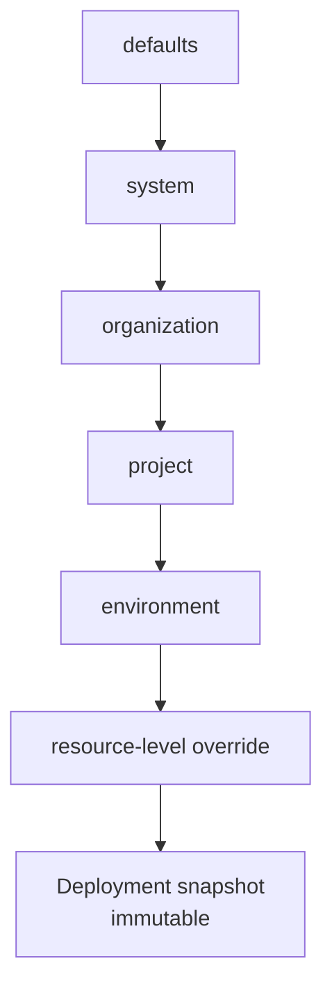

## Short definition

Deploy-time configuration is made of three layers: **Environment** (an isolation boundary like staging or production), **variables** (key-value pairs merged by precedence), and **Secrets** (sensitive variables that must be masked). Every deployment saves the configuration in effect at that moment as an immutable snapshot.

## Why this group exists

Configuration mistakes are one of the most common problems during troubleshooting, and one of the easiest to confuse with "the deployment failed." Splitting environments, variable precedence, and secret handling into their own group gives a single, clear place to answer questions like "where did this value actually come from" and "why hasn't production changed even though I edited the config."

## Where you see it in Web, CLI, and API

- **Web** — the Environments tab under a project shows the variable list, secret masking status, and last-modified time.
- **CLI** — the `appaloft env` / `resource set-variable` / `resource secrets` command families.
- **HTTP/API** — operations like `environments.set-variable`, `environments.diff`, `environments.promote`.

## Common mistakes

- **Assuming an environment variable change immediately affects the running instance**: a variable change only affects the snapshot used by the **next** deployment — a running workload is never hot-updated.
- **Using build-time variables as secrets**: a variable that ends up in the build artifact and gets exposed to the browser (like a `PUBLIC_` or `VITE_` prefixed variable) can never be marked as a Secret.

## Related tasks

- [Configuration Model](/docs/en/configuration/model/)
- [Configuration Precedence](/docs/en/configuration/precedence/)
- [Handling Secrets Safely](/docs/en/configuration/secrets/)
- [Configuration Diff And Promote](/docs/en/configuration/diff-promote/)
- [Configuration File Reference](/docs/en/configuration/config-file/)

## Advanced details

Configuration precedence, from lowest to highest, is: defaults, system, organization, project, environment, resource — and it's finally frozen into an immutable snapshot when a deployment is created. Understanding this chain helps you quickly figure out "why doesn't this value match what I expected."
