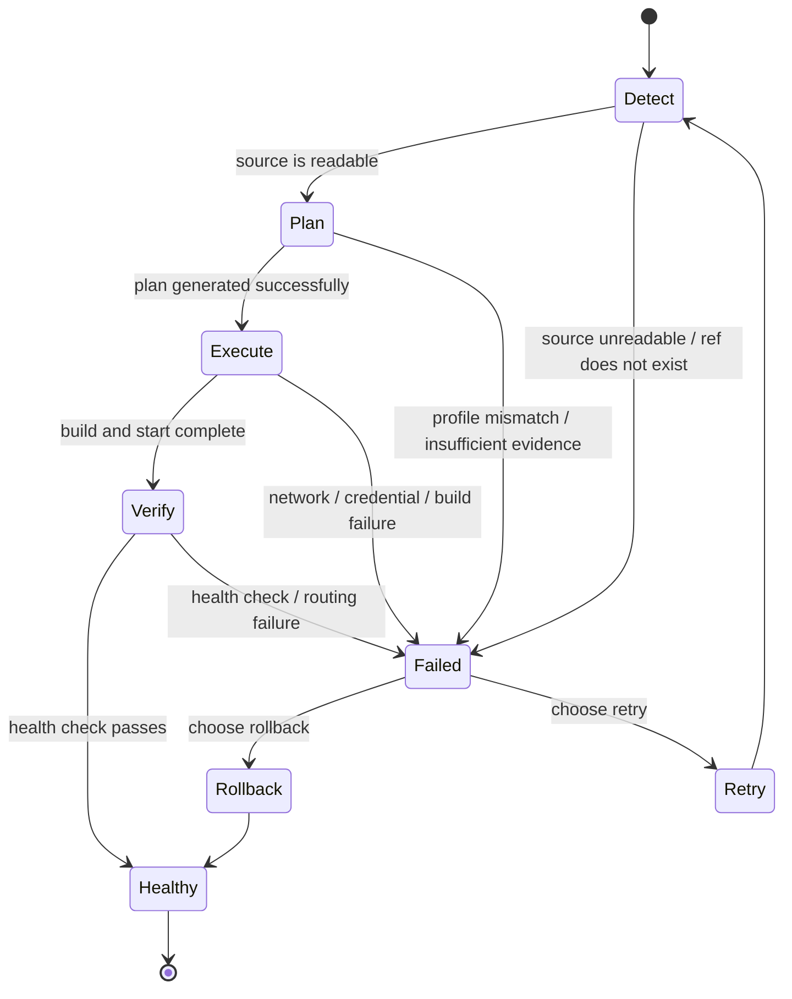

## Short definition <a id="deployment-lifecycle" />

Appaloft models a deployment as five phases: `detect -> plan -> execute -> verify -> rollback`. This lifecycle explains the deployment status you see in Web/CLI/API — it isn't an internal implementation detail. What you need to know is which step you're stuck on, what input that step reads, and how to recover from a failure.



## Why this concept exists

Without a clear phase breakdown, "the deployment failed" carries zero information. Splitting every deployment into five observable phases means a failure message naturally comes with a clue about which direction to investigate.

### Detect

Reads the source and configuration clues to determine app type, build method, entry point, and network exposure needs. Common failures: source unreadable, repository ref or directory doesn't exist, app type can't be determined and no Runtime Profile was supplied.

### Plan

Turns the Source, Runtime, Health, and Network Profiles into an executable plan. A good plan should explain what Appaloft is about to run — install/build/start commands, listening port, health check, access route summary — rather than showing an opaque shell command.

### Execute

Builds, uploads, starts, and routes the app on the target server. Failures here are usually related to network, credentials, image pulls, build commands, or server resources — check runtime logs and the diagnostic summary first, rather than rushing to change domain configuration.

### Verify

Checks the process, health policy, proxy routing, and access URLs. **`docker compose up` returning success does not mean the deployment succeeded** — Appaloft also confirms the container is running, native health checks have not failed, and every distinct served hostname/path route for the target service passes (redirects are not served-route proofs). One failing route fails the candidate. Local/SSH clean it up; Swarm restores and verifies the previous route owner before candidate cleanup. An explicitly disabled health policy adds no public probe.

### Rollback

The recovery path after a failure, not a way to hide it. See [Rollback And Recovery](/docs/en/deliver/recovery/) for details.

## Where you see it in Web, CLI, and API

<a id="deployment-plan-preview" />

<a id="deployment-proof" />

```bash
# Preview only, no deployment created (no side effects)
appaloft deployments plan --project prj_prod --environment env_prod --resource res_web --server srv_prod

# Submit a deployment
appaloft deploy .

# Follow the live timeline
appaloft deployments timeline <deploymentId> --follow --json

# Verify that an accepted deployment actually became the current workload
appaloft deployments proof <deploymentId> --json
```

`deployments proof` returns `verified`, `partially-verified`, `unverified`, `stale`, or `failed`. It compares the source/artifact/config fingerprint against the identity, health status, and access-route ownership of the actually running workload — even if the old workload still appears healthy on the surface, this deployment can still be judged as never having taken effect.

## Common mistakes

- **Assuming a failure always means the app never started**: a Verify failure can just be a wrong health check path, listening port, or proxy route configuration — the app process might already be running.
- **Treating an Execute-phase failure as a domain problem**: Execute-phase problems are almost always build/network/credential related; domains and certificates are an [Access](/docs/en/access/overview/) topic that comes after Verify.
- **Confusing Retry with Rollback**: Retry re-attempts based on a snapshot of the failed deployment; Rollback creates a new deployment based on a snapshot of a historical successful deployment — see [Rollback And Recovery](/docs/en/deliver/recovery/).

## Related tasks

- [Configuring Deployment Sources](/docs/en/deliver/sources/)
- [Rollback And Recovery](/docs/en/deliver/recovery/)
- [Viewing Logs And Health Summaries](/docs/en/troubleshoot/logs-health/)
- [Status And Events](/docs/en/troubleshoot/status-events/)

## Advanced details

If the terminal session that ran the original `appaloft deploy` command got disconnected, `appaloft deployments timeline <deploymentId> --follow --json` can still reopen the observation stream. This stream can return `entry`, `heartbeat`, `gap`, `closed`, or `error` events; seeing a `gap` means observation continuity was incomplete, and you should reopen observation or check the deployment detail before deciding on next steps.
