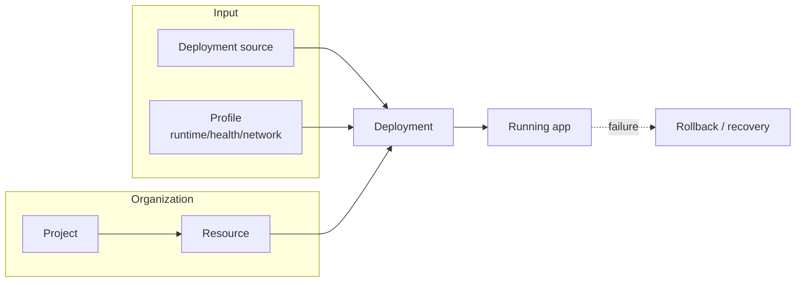

<a id="deploy-handoff-url" />

## Short definition

"Everyday delivery" is the whole chain from a code or artifact change to a running, reachable, rollback-ready deployment. It brings together [Configuring Deployment Sources](/docs/en/deliver/sources/), [Deployment Lifecycle](/docs/en/deliver/lifecycle/), [Projects](/docs/en/deliver/projects/) and [Resources](/docs/en/deliver/resources/), the runtime/health/network [Profiles](/docs/en/deliver/profiles/), and [GitHub And Integrations](/docs/en/deliver/integrations/).

## Why this group exists

In the previous information architecture, "Deploy," "Projects And Resources," and "Integrations" were three separate groups, but in practice they almost always show up together — someone configuring a source is usually already configuring runtime and network profiles too. This content is merged into "Deliver" so you don't have to jump across multiple navigation groups to solve one class of problem.

## Where you see it in Web, CLI, and API

- **Web** — the resource detail page puts Source, Runtime, Health, Network configuration, the deployment timeline, and preview environments on different tabs of the same page.
- **CLI** — `appaloft deploy`, `appaloft resource configure-*`, and the `appaloft deployments *` command family share the same business operations.
- **HTTP/API** — the `/api/deployments` and `/api/resources/{id}/*` routes reuse the same input schema; no entrypoint gets its own private fields.

## Common mistakes

- Treating a "deployment" as a long-lived configuration container — a deployment is actually one attempt; long-lived configuration lives in a Resource's Profile, see [Product Mental Model](/docs/en/start/concepts/).
- Treating GitHub/provider/plugin integrations as unrelated "settings" — they directly decide your deployment source and execution boundary, see [GitHub And Integrations](/docs/en/deliver/integrations/).

## Related tasks

- [Configuring Deployment Sources](/docs/en/deliver/sources/)
- [Deployment Lifecycle](/docs/en/deliver/lifecycle/)
- [Previews And Cleanup](/docs/en/deliver/previews/)
- [Rollback And Recovery](/docs/en/deliver/recovery/)
- [Resources](/docs/en/deliver/resources/)

## Advanced details

When a deployment fails, first figure out which lifecycle phase it's stuck in (detect / plan / execute / verify), and only then decide whether to fix the Source, the Profile, or go through [Rollback And Recovery](/docs/en/deliver/recovery/). Diagnosing phase by phase finds the root cause faster than "just click deploy again."
