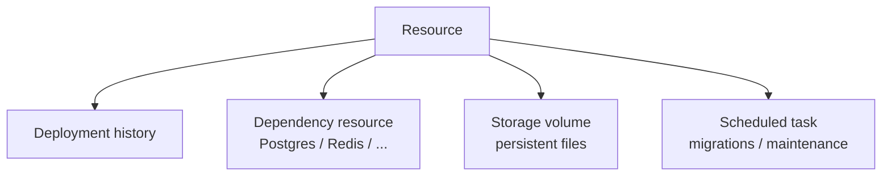

## Short definition <a id="concept-resource" />

A Resource is a deployable application or service — a web app, backend service, static site, worker, or Compose stack. It owns its own Source, Runtime, Health, and Network Profile (see [Runtime, Health, And Network Profiles](/docs/en/deliver/profiles/)) and is used by deployment after deployment. Deployment history, runtime logs, health status, and access paths should all be understood from the Resource's point of view — the Resource is the stable owner of this information, not any single deployment.

Beyond its own deployment history, a Resource can own three kinds of attached objects: **dependency resources** (managed services like databases), **storage volumes** (persistent files), and **scheduled tasks** (periodic maintenance scripts).



## Why this concept exists

Separating "the thing being deployed" from "what this particular deployment did" makes configuration drift traceable and gives rollback a stable point of comparison. The Resource owns configuration; a Deployment is just a historical event.

## Dependency resources <a id="dependency-resource-lifecycle" />

Dependency resources are Appaloft-managed database or service dependency records. Postgres, Redis, MySQL, ClickHouse, S3/MinIO object storage, and OpenSearch are supported — they can be provisioned by Appaloft or imported from an existing external instance.

<a id="dependency-runtime-injection" />

<a id="dependency-backup-restore" />

```bash
# Provision a new Postgres instance through Appaloft
appaloft dependency provision --kind postgres --project prj_prod --environment env_prod --name app-db

# Import an existing external dependency (pass the connection string over stdin to avoid it showing up in process args)
printf '%s\n' "$DATABASE_URL" | appaloft dependency import --kind postgres --project prj_prod --environment env_prod --name external-db --connection-url-stdin

# Bind a dependency resource to a Resource — Appaloft only stores a safe reference, never writing the connection string into the resource or committed config
appaloft resource dependency bind res_web --dependency dep_db --target DATABASE_URL

# Backup and restore
appaloft dependency backup create dep_db
appaloft dependency backup restore bkp_123
```

Once bound, the deployment plan and deployment detail show whether dependency runtime injection is `ready`: the dependency must be in a ready state, the binding target must be a legal runtime environment variable name (like `DATABASE_URL`), and the target runtime environment must support delivering dependency secrets. If it's marked `blocked`, `deployments.create` rejects the deployment outright before creating it, rather than creating a deployment attempt that's doomed to fail, and it never exposes a raw connection string in the response.

## Storage volumes <a id="storage-volume-lifecycle" /><a id="storage-volume-backup-restore" />

A storage volume is a record of persistent storage intent — either a named volume or a trusted bind mount. Creating a storage volume doesn't immediately create a deployment or modify a running container; only the next deployment actually applies the mount.

```bash
appaloft storage volume create --project prj_prod --environment env_prod --name uploads
appaloft resource storage attach res_web vol_uploads --destination-path /app/uploads
```

A Resource can't mount two storage volumes onto the same in-container path. Deleting a storage volume requires confirming no active mounts or backup retentions are blocking it first; deletion itself doesn't automatically unmount or clean up underlying data.

Runtime volume cleanup is a separate dry-run-first operation, `storage-volumes.cleanup-runtime`. Destructive cleanup requires `--dry-run false`. Web can also run dry-run-first runtime cleanup for one storage volume on one server: it previews candidates and blockers first, then sends destructive cleanup only after confirmation.

```bash
appaloft storage volume cleanup-runtime vol_uploads --server srv_primary --before 2026-01-01T00:00:00.000Z
appaloft storage volume cleanup-runtime vol_uploads --server srv_primary --before 2026-01-01T00:00:00.000Z --dry-run false
```

## Scheduled tasks <a id="scheduled-task-resource-lifecycle" />

A scheduled task is a recurring task definition owned by a Resource, used to run migrations, syncs, cache warming, or maintenance scripts — it never creates a Deployment and never writes to deployment history.

Scheduled task execution currently covers supported Docker runtime targets: local-shell Docker, generic-SSH Docker, Docker Compose, or Docker Swarm image services. Appaloft starts a temporary execution context against the Resource's retained target; Docker Swarm image-service deployments run as a replicated job shape.

```bash
# Create a scheduled task
appaloft scheduled-task create res_web \
  --schedule "0 2 * * *" \
  --timezone UTC \
  --command "bun run migrate" \
  --timeout-seconds 600

# Run it once immediately
appaloft scheduled-task run tsk_daily_migration --resource-id res_web

# View run history and logs
appaloft scheduled-task runs list --task-id tsk_daily_migration
appaloft scheduled-task runs logs str_daily_migration_1 --task-id tsk_daily_migration
```

A failed task run doesn't automatically roll back or redeploy the resource that's currently serving traffic; log output automatically masks anything that looks like a secret.

## Where you see it in Web, CLI, and API

The Web console shows Source/Runtime/Health/Network, dependency resources, storage volumes, scheduled tasks, and the deployment timeline as separate tabs on the resource detail page. The CLI accesses the same operations through the `appaloft resource *`, `appaloft dependency *`, `appaloft storage volume *`, and `appaloft scheduled-task *` namespaces; the HTTP API reuses the exact same input/output schema.

## Common mistakes

- **Treating dependency resource backup as storage volume backup**: database-like service dependencies go through `dependency-resources.*` backup/restore; app files mounted on a resource (like SQLite or an uploads directory) go through `storage-volumes.*` — the two are not interchangeable.
- **Assuming rotating a dependency binding secret restarts the app**: rotation only replaces the safe reference used by future deployments — it doesn't change the database's own password and doesn't automatically restart the current runtime; a new deployment must be triggered for the new configuration to take effect.
- **Assuming scheduled task failures are handled automatically**: a failed scheduled task run needs a manual fix to the command, profile, or dependency, then a manual rerun — it never automatically rolls back the live service.

## Related tasks

- [Projects](/docs/en/deliver/projects/)
- [Runtime, Health, And Network Profiles](/docs/en/deliver/profiles/)
- [Configuration Precedence](/docs/en/configuration/precedence/)

## Advanced details <a id="deploy-handoff-url" /><a id="blueprint-catalog-installation" />

The dependency resource Blueprint contract describes dependency requirements with neutral fields (`kind`, `engine.family`, `version`, `outputs`); components consume dependency outputs through `dependencyEnv`. The Plan phase only records environment variable names and field names — it never stores real passwords or connection strings.
