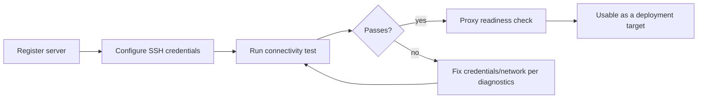

## Short definition

A Server is a target machine Appaloft can connect to, inspect, and deploy applications on. Appaloft is a BYOS (Bring Your Own Server) model — you register your own servers, and Appaloft handles connecting, orchestrating, and routing; it doesn't provide hosted compute.

## Why this concept exists

Deployment target, deployment source, and deployment configuration are three independent questions: the source answers "what to deploy," configuration answers "what parameters to run it with," and the server answers "where does the code ultimately run." Modeling the server independently means the same source and configuration can be reused across different machines (for example migrating from a test box to production) without redefining the deployment itself.

A single server can host multiple resources; whether a particular resource is actually reachable also depends on its own [Network Profile](/docs/en/deliver/profiles/) and the server's proxy readiness.

## Where you see it in Web, CLI, and API

- **Web** — the Servers list shows host, connection status, and proxy readiness; the detail page can run connectivity tests, change the proxy type, deactivate, or delete.
- **CLI** — `appaloft server register` / `test` / `show` / `rename` / `deactivate` / `delete`.
- **HTTP/API** — `POST /api/servers`, `GET /api/servers/{id}` reuse the same fields.

## Common mistakes

- **Assuming servers are hosted by Appaloft**: by default a server is your own machine; the hosted form only exists in Appaloft Cloud's Sandbox scenario, see [Managed Sandbox](/docs/en/cloud/sandbox-managed/).
- **Treating a connectivity test failure as a deployment failure**: a connectivity test failure only blocks **new** deployments that depend on that server — it doesn't affect workloads already running.
- **Assuming deactivation stops existing running tasks**: deactivation only blocks the server from being chosen as a target for new deployments/scheduling/proxy configuration — it doesn't stop existing running tasks, and doesn't delete deployment history, domains, certificates, or credentials.

## Related tasks

- [Register And Connect A Server](/docs/en/servers/register-connect/)
- [Managing SSH Credentials](/docs/en/servers/ssh-keys/)
- [Proxy Readiness And Terminal Sessions](/docs/en/servers/proxy-and-terminal/)

## Advanced details

A server can be registered as a single machine (`single-server`) or as a cluster-shaped deployment target (`orchestrator-cluster`, for example a Docker Swarm manager). Cluster shapes currently require explicitly selecting the matching provider, and whether they're actually usable depends on the registered runtime backend's capabilities and connectivity check results, not on registration alone.
