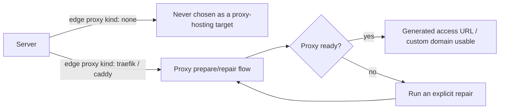

## Short definition

Proxy readiness determines whether generated access URLs and custom domain routing will actually work. A terminal session is an independent entrypoint for controlled troubleshooting on a server or resource — it is not part of the ordinary deployment path.

## Why this concept exists

Proxy configuration and the deployment itself are two different things: a server can successfully run an application container, but if the proxy isn't ready, external users still can't reach it. Making proxy readiness an independent, diagnosable state gives "the app is up but I can't open it" a clear troubleshooting direction, instead of being misread as a deployment failure. Terminal sessions need to be independent of the deployment path because they involve more privileged, direct troubleshooting operations that require their own audit boundary.



## Where you see it in Web, CLI, and API

### Proxy configuration

<a id="server-proxy-readiness" />

```bash
# Change the proxy type a server will use going forward (only saves the intent, doesn't start a proxy immediately)
appaloft server proxy configure srv_primary --kind traefik

# Explicitly repair proxy readiness
appaloft server proxy repair srv_primary
```

Changing the proxy type to `none` means later generated access URLs or custom domain routing no longer treat this server as a proxy-hosting target; switching to `traefik` or `caddy` marks it as a target for later proxy configuration. This operation doesn't immediately start a proxy, doesn't delete existing route snapshots, and doesn't affect historical deployments or domain audit records.

### Terminal sessions <a id="server-terminal-session" />

```bash
# Open a server terminal session (prints a session descriptor by default, convenient for scripts)
appaloft server terminal <serverId>

# Open and attach directly to a local terminal (wires the current TTY into the session)
appaloft server terminal <serverId> --attach

# Open a terminal for a resource
appaloft resource terminal <resourceId> --attach
```

With a logged-in remote profile, the same command opens the session through the remote control plane and wires the local TTY into the returned WebSocket — this process doesn't initialize any local state store, and doesn't read the server's SSH private key.

## Common mistakes

- **Treating a not-ready proxy as a deployment failure**: the app container can be running fine, but a not-ready proxy will still cause external access to fail — check proxy readiness first, not redeploy the app.
- **Assuming changing the proxy type takes effect immediately**: changing it only saves the intent for "which proxy future routing should use" — actually taking effect requires the prepare/repair flow to complete.
- **Treating a terminal session as part of the deployment path**: a terminal session is an independent, controlled troubleshooting entrypoint with its own session lifecycle and audit trail — it's never invoked by the ordinary deployment flow.

## Related tasks

- [Generated Access URLs](/docs/en/access/generated-routes/)
- [Access Troubleshooting](/docs/en/access/troubleshooting/)
- [Generating A Safe Diagnostic Summary](/docs/en/troubleshoot/diagnostics/)

## Advanced details

Terminal session lifecycle operations (listing active sessions, viewing a single session's safe metadata, closing a session, expiring old sessions) only return the session id, scope, target id, transport path, timestamps, and state — they **never** expose terminal input, terminal output, raw commands, private keys, or the actual values of environment variables. Opening and closing a session both write safe audit metadata (session id, scope, target, actor, entrypoint, time, close reason), which also never contains the terminal content itself. When copying logs or diagnostic information for help, prefer the diagnostic summary in [Generating A Safe Diagnostic Summary](/docs/en/troubleshoot/diagnostics/) instead of sharing private keys or full environment variable values.
