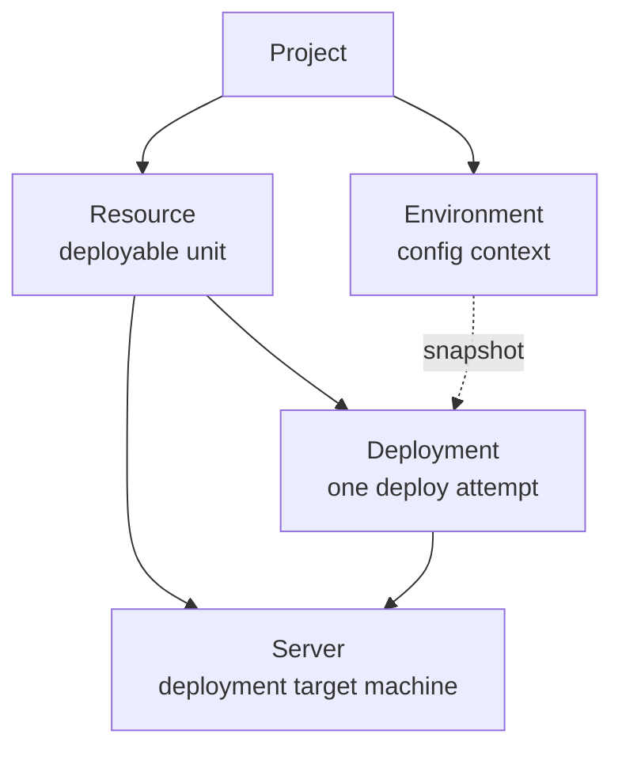

## Short definition

Appaloft organizes your work around five core objects: **Project**, **Resource**, **Server**, **Environment**, and **Deployment**. Understanding how these five words relate to each other explains most of Appaloft's behavior.

## Why these concepts exist

Appaloft needs separate answers to four questions — "what do I want to deploy," "where does it deploy to," "what configuration does it use," and "what happened during this deployment" — otherwise configuration changes, multiple environments, and deployment history end up polluting each other. Each of the five objects answers exactly one of these questions:

- **Project** answers only "these things belong to the same working boundary."
- **Resource** answers only "which addressable running unit am I deploying."
- **Server** answers only "which machine does the code ultimately run on."
- **Environment** answers only "what configuration context existed before this deployment."
- **Deployment** answers only "what happened during this one attempt, and what was the result."

### Project

A Project is the working boundary for a group of resources, environments, and deployment history. Users typically pick a project first, then create resources or view deployments inside it. Most teams only need a handful of projects — for example, split by product line or by customer.

### Resource

A Resource is a deployable unit — a web app, backend service, static site, worker, or Compose stack. Deployment history, runtime logs, health status, and access paths should all be understood from the resource's point of view — the resource is the stable owner of this information, not any single deployment.

### Server

A Server is a target machine that Appaloft can connect to and operate. It carries SSH connection details, proxy readiness state, and the runtime environment needed to run your applications. Appaloft is a BYOS (Bring Your Own Server) model: you register your own servers, and Appaloft doesn't provide hosted compute — the one exception is Appaloft Cloud's managed Sandbox, see [Managed Sandbox](/docs/en/cloud/sandbox-managed/).

### Environment

An Environment holds the configuration context in effect before a deployment (variables, secret references). Variables are snapshotted at deploy time, so later configuration edits never silently rewrite a deployment that already happened.

### Deployment

A Deployment is one attempt, not a long-lived configuration container. Appaloft runs `detect`, `plan`, `execute`, and `verify` around a deployment, and keeps the clues needed for rollback when necessary. See [Deployment Lifecycle](/docs/en/deliver/lifecycle/) for the complete state flow.

## Where you see it in Web, CLI, and API

| Concept | Web console | CLI | HTTP/API |
| --- | --- | --- | --- |
| Project | Top project switcher | `appaloft projects create` / `list` / `show` | `POST /api/projects` |
| Resource | Resources list and detail page | `appaloft resource show <resourceId>` | `GET /api/resources/{id}` |
| Server | Servers list and detail page | `appaloft server register` / `server capacity inspect` | `POST /api/servers` |
| Environment | Environments tab under a project | Environment variable commands, see [Configuration Precedence](/docs/en/configuration/precedence/) | `GET /api/environments/{id}` |
| Deployment | Deployment timeline on the resource detail page | `appaloft deployments timeline` / `retry` / `rollback` | `POST /api/deployments` |

## Common mistakes

- **Treating a Resource as a Deployment**: a resource is stable; a deployment is one event in that resource's history. Deleting or recreating a deployment does not delete the resource's own identity or history.
- **Treating an Environment as a runtime container**: an Environment only provides a pre-deploy configuration snapshot — it is not a running process or sandbox.
- **Assuming Servers are hosted by Appaloft**: by default a Server is your own machine, and Appaloft only handles connecting and orchestrating it; the hosted form exists only in Appaloft Cloud's Sandbox scenario.

## Related tasks

- [Your First Deployment](/docs/en/start/first-deployment/)
- [Choosing an Entrypoint](/docs/en/start/entrypoints/)
- [Projects](/docs/en/deliver/projects/)
- [Resources](/docs/en/deliver/resources/)
- [Register And Connect A Server](/docs/en/servers/register-connect/)

## Advanced details

Multiple Servers can belong to different Resources within the same Project, and a single Resource can move to a different target Server over its lifetime (for example, migrating machines) — historical Deployment records keep the reference to the original target machine and are never retroactively rewritten.
