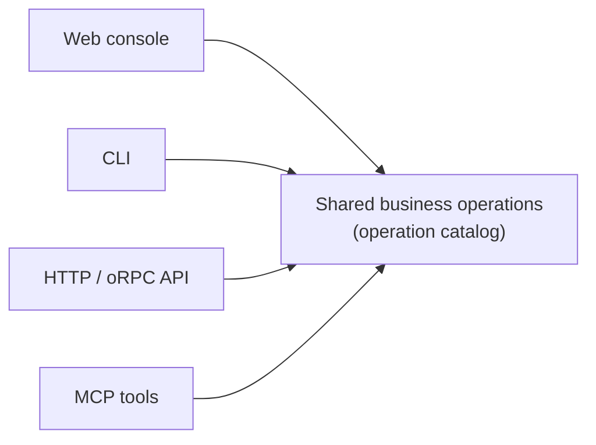

## Short definition

Every business operation in Appaloft — creating a resource, starting a deployment, registering a server — can be triggered through four entrypoints: the Web console, the CLI, the HTTP/API, and MCP tools for AI agents. All four entrypoints share the same business operations and input validation rules; only the interaction style differs.



## Why this concept exists

If every entrypoint implemented its own input semantics, the same operation could end up with one name on the Web, another on the CLI, and docs, error messages, and automation integrations would drift apart. Appaloft requires every entrypoint to call the same operation catalog — entrypoints only collect input and render output, they never redefine business rules.

## Where you see it in Web, CLI, and API

### Web console

Good for first-time configuration, checking status, understanding what an input field means, and following the `?` help links on a page. Choose the Web console when you:

- aren't sure what to put in a field;
- need to compare the status of several resources side by side;
- want a graphical deployment timeline and log-viewing experience.

The default BYOS shape of a GitHub Action is also a CLI surface: the Pure SSH Action uses `control-plane-mode: none`, installs and runs the CLI inside the Action runner, deploys over SSH, and keeps state on the target server itself with no dependency on any remote control plane.

### CLI

Good for local development, SSH server bootstrap, CI scripts, and operations that need interactive confirmation. Choose the CLI when you:

- are already working in a terminal and want to deploy directly from a project directory;
- need to script the whole flow inside a CI/CD pipeline;
- are operating directly on a server where the network can't reach the Web console.

### HTTP/API

Good for automation systems and third-party integrations. Choose HTTP/API when you:

- are building your own ops platform or internal tool that needs to trigger deployments programmatically;
- need precise control over the request/response shape without going through the CLI's interactive layer.

The Self-hosted Server Action uses the HTTP API surface: an explicit `control-plane-url` selects the target Appaloft instance, and `appaloft-token` provides deploy-token authentication. This kind of Action never runs the CLI, never connects over SSH, and never scans the target machine to discover a control plane.

Full routes and input/output shapes are in the [HTTP API reference](/docs/en/reference/http-api/).

### MCP tools (for AI agents)

When an agent host is configured with Appaloft MCP, `appaloft mcp stdio`, `appaloft mcp serve`, or `npx appaloft-mcp` expose the same operation catalog:

```bash
# Start over stdio (the default transport for most agent hosts)
appaloft mcp stdio

# Start as a standalone process for multiple clients to connect to
appaloft mcp serve
```

MCP tools reuse the exact same operations, input interpretation, and recovery guidance as the CLI/API — see [MCP And Tool Protocols](/docs/en/agents/mcp/).

## Common mistakes

- **Assuming the CLI and API have different capabilities**: both share the same business operations; if an operation is only available on one entrypoint, that's an explicit entrypoint-coverage gap, not intended design.
- **Calling the database or SSH directly in an agent scenario**: an AI agent should always operate Appaloft through one of the four entrypoints above, never by bypassing the application layer to read or write state directly. See [Agent Deploy Subprotocol](/docs/en/agents/deploy-skill/).
- **Treating the Web console as the single source of truth**: Web, CLI, and API all render the same underlying state; a change made through the CLI or API shows up in the Web console immediately, and vice versa.

## Related tasks

- [Your First Deployment](/docs/en/start/first-deployment/)
- [CLI Reference](/docs/en/reference/cli/)
- [HTTP API Reference](/docs/en/reference/http-api/)
- [Full Appaloft Skill](/docs/en/agents/skill/)

## Advanced details

Remote dispatch: when the CLI detects a logged-in profile, or receives an explicit `--control-plane-mode cloud|self-hosted` / `--control-plane-url <url>`, ordinary business commands first resolve the execution target and then dispatch the operation through the same typed protocol as the HTTP/API. Without a trusted remote source, the CLI falls back to local mode — it never contacts a public control plane and never scans the network. A small set of commands (`serve`, `db`, `remote-state`, `init`, and a few others) currently only support local or explicit remote modes; an unsupported combination returns `control_plane_unsupported` rather than silently falling back to local execution.
