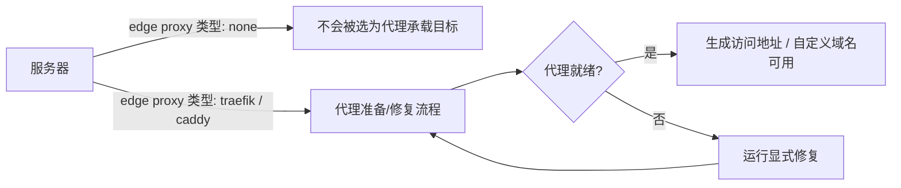

## 简要定义

代理就绪状态决定生成的访问地址和自定义域名路由是否能正常工作。终端会话是对服务器或资源执行受控排查的独立入口，不属于普通部署路径。

## 为什么存在这个概念

代理配置和部署本身是两件事：一台服务器可以成功运行应用容器，但如果代理没有就绪，外部用户依然无法访问它。把代理就绪作为独立、可诊断的状态，是为了让"应用起来了但打不开"这种情况有明确的排查方向，而不是被误判为部署失败。终端会话则需要独立于部署路径，因为它涉及更高权限的直接排查操作，必须有自己的审计边界。



## 在 Web / CLI / API 中的体现

### 代理配置

<a id="server-proxy-readiness" />

```bash
# 修改服务器未来使用的代理类型（只保存意图，不会立即启动代理）
appaloft server proxy configure srv_primary --kind traefik

# 显式修复代理准备状态
appaloft server proxy repair srv_primary
```

修改代理类型为 `none` 会让后续的生成访问地址或自定义域名路由不再把这台服务器当作代理承载目标；改为 `traefik` 或 `caddy` 会把它标记为后续代理配置的目标。这个操作不会立即启动代理、不会删除已有路由快照，也不会影响历史部署或域名的审计记录。

### 终端会话 <a id="server-terminal-session" />

```bash
# 打开一个服务器终端会话（默认打印 session descriptor，方便脚本处理）
appaloft server terminal <serverId>

# 打开并直接接入本地终端（把当前 TTY 接到会话上）
appaloft server terminal <serverId> --attach

# 对某个资源打开终端
appaloft resource terminal <resourceId> --attach
```

使用已登录的远程 Profile 时，同一命令会通过远程控制面打开会话，并把本地 TTY 接到返回的 WebSocket——这个过程不会在本地初始化状态存储，也不会读取服务器的 SSH 私钥。

## 常见误区

- **把代理未就绪当成部署失败**：应用容器可以正常运行，但代理未就绪会导致外部访问失败——先看代理就绪状态，而不是重新部署应用。
- **认为修改代理类型会立即生效**：修改只是保存"未来路由使用哪种代理"的意图，真正生效需要代理准备/修复流程完成。
- **把终端会话当成部署路径的一部分**：终端会话是独立的受控排查入口，有自己的会话生命周期和审计记录，不会被普通部署流程调用。

## 相关任务

- [生成的访问地址](/docs/access/generated-routes/)
- [访问故障排查](/docs/access/troubleshooting/)
- [生成安全诊断信息](/docs/troubleshoot/diagnostics/)

## 进阶细节

终端会话的生命周期操作（列出活跃会话、查看单个会话的安全元数据、关闭会话、让旧会话过期）只返回 session id、scope、目标 id、传输路径、时间戳和状态，**不会**暴露终端输入、终端输出、原始命令、私钥或环境变量的实际值。打开和关闭会话都会写入安全审计元数据（会话 id、scope、目标、操作者、入口、时间、关闭原因），同样不包含终端内容本身。复制日志或诊断信息求助时，优先使用[生成安全诊断信息](/docs/troubleshoot/diagnostics/)中的诊断摘要，避免分享私钥或完整环境变量值。
