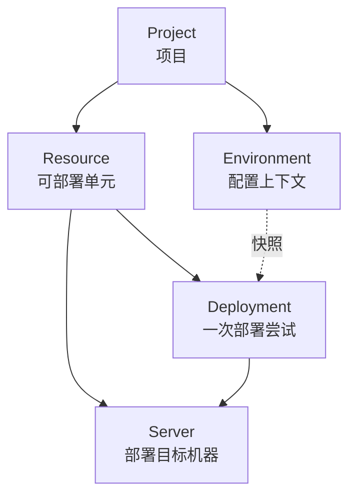

## 简要定义

Appaloft 围绕五个核心对象组织你的工作：Project（项目）、Resource（资源）、Server（服务器）、Environment（环境）、Deployment（部署）。理解这五个词之间的关系，就理解了 Appaloft 的大部分行为。

## 为什么存在这些概念

Appaloft 需要把"我想部署什么""部署到哪""用什么配置""这次部署发生了什么"这四个问题分开回答，否则配置变更、多环境和部署历史会互相污染。这五个对象各自只回答其中一个问题：

- **Project** 只回答"这些东西属于同一个工作边界"。
- **Resource** 只回答"我要部署的是哪个可寻址的运行单元"。
- **Server** 只回答"代码最终运行在哪台机器上"。
- **Environment** 只回答"部署前的配置上下文是什么"。
- **Deployment** 只回答"这一次尝试发生了什么，结果如何"。

### Project

Project 是一组资源、环境和部署历史的工作边界。用户通常先选择项目，再在项目里创建资源或查看部署。一个团队通常只需要少量项目，例如按产品线或按客户划分。

### Resource

Resource 是一个可部署单元，例如 Web 应用、后端服务、静态站点、worker 或 Compose stack。部署历史、运行时日志、健康状态和访问路径都要回到资源视角来理解——资源是这些信息的稳定归属，而不是某一次部署。

### Server

Server 是 Appaloft 可以连接和操作的部署目标机器。它包含 SSH 连接信息、代理就绪状态，以及运行应用所需的执行环境。Appaloft 是 BYOS（Bring Your Own Server）模型：你注册自己的服务器，Appaloft 不提供托管计算资源（Cloud 托管 Sandbox 是例外，见 [托管 Sandbox](/docs/cloud/sandbox-managed/)）。

### Environment

Environment 保存部署前的配置上下文（变量、密钥引用）。变量会在部署时形成快照，这样后续修改配置不会悄悄改写已经发生过的历史部署。

### Deployment

Deployment 是一次尝试，不是长期配置容器。Appaloft 会围绕一次部署执行检测（detect）、规划（plan）、执行（execute）、验证（verify），并在需要时保留回滚所需的线索。完整的状态流转见[部署生命周期](/docs/deliver/lifecycle/)。

## 在 Web / CLI / API 中的体现

| 概念 | Web 控制台 | CLI | HTTP/API |
| --- | --- | --- | --- |
| Project | 顶部项目切换器 | `appaloft projects create` / `list` / `show` | `POST /api/projects` |
| Resource | Resources 列表与详情页 | `appaloft resource show <resourceId>` | `GET /api/resources/{id}` |
| Server | Servers 列表与详情页 | `appaloft server register` / `server capacity inspect` | `POST /api/servers` |
| Environment | 项目下的 Environments 标签页 | 环境变量相关命令见[配置优先级](/docs/configuration/precedence/) | `GET /api/environments/{id}` |
| Deployment | 资源详情页的部署时间线 | `appaloft deployments timeline` / `retry` / `rollback` | `POST /api/deployments` |

## 常见误区

- **把 Resource 当成 Deployment**：资源是稳定的，部署是资源历史上的一个事件。删除或重建部署不会删除资源本身的身份和历史。
- **把 Environment 当成运行时容器**：Environment 只提供部署前的配置快照，不是一个正在运行的进程或沙箱。
- **认为 Server 由 Appaloft 托管**：默认情况下 Server 是你自己的机器，Appaloft 只负责连接和编排；托管形态仅在 Appaloft Cloud 的 Sandbox 场景下存在。

## 相关任务

- [第一次部署](/docs/start/first-deployment/)
- [选择入口](/docs/start/entrypoints/)
- [项目](/docs/deliver/projects/)
- [资源](/docs/deliver/resources/)
- [注册并连接服务器](/docs/servers/register-connect/)

## 进阶细节

多个 Server 可以属于同一个 Project 下的不同 Resource；同一个 Resource 在其生命周期中可以更换目标 Server（例如迁移机器），这时历史 Deployment 记录会保留原始目标机器的引用，不会被追溯性改写。
