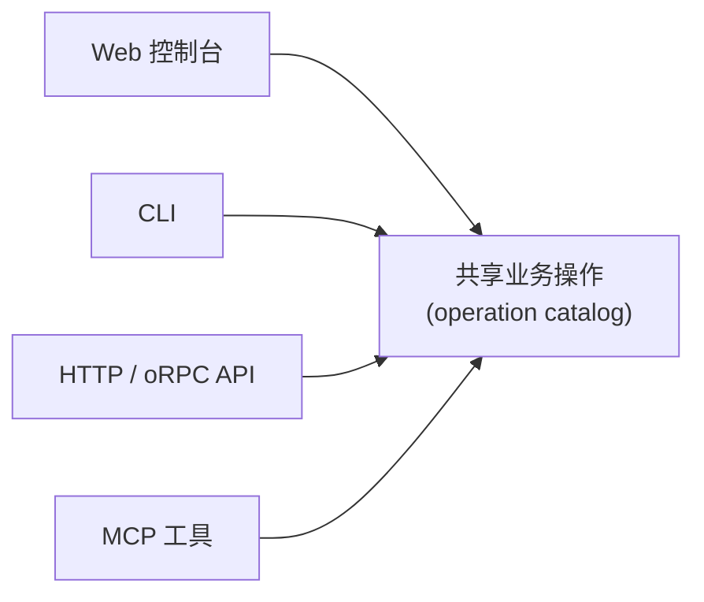

## 简要定义

Appaloft 的每一个业务操作（创建资源、发起部署、注册服务器……）都可以通过四种入口触发：Web 控制台、CLI、HTTP/API，以及面向 AI Agent 的 MCP 工具。四种入口共享同一套业务操作和输入校验规则，只是交互方式不同。



## 为什么存在这个概念

如果每个入口各自实现一套输入语义，同一个操作在 Web 上叫一个名字、CLI 上叫另一个名字，会让文档、错误提示和自动化集成互相脱节。Appaloft 要求所有入口都调用同一套 operation catalog，入口只负责收集输入、展示输出，不重新定义业务规则。

## 在 Web / CLI / API 中的体现

### Web 控制台

适合第一次配置、查看状态、理解输入字段含义，以及跟随页面上的 `?` 帮助链接完成任务。选择 Web 控制台，当你：

- 不确定某个字段应该填什么；
- 需要同时查看多个资源的状态做对比；
- 想要图形化的部署时间线和日志查看体验。

### CLI

适合本地开发、SSH 服务器 bootstrap、CI 脚本，以及需要交互式确认的操作。选择 CLI，当你：

- 已经在终端里工作，想直接从项目目录发起部署；
- 需要在 CI/CD 流水线中脚本化整个流程；
- 在服务器上直接操作，网络无法访问 Web 控制台。

GitHub Action 的默认 BYOS 形态也是 CLI 表面：Pure SSH Action 使用 `control-plane-mode: none`，在 Action 运行环境中安装并运行 CLI，通过 SSH 部署，状态保存在目标服务器本地，不依赖任何远程控制面。

### HTTP/API

适合自动化系统和第三方集成。选择 HTTP/API，当你：

- 在构建自己的运维平台或内部工具，需要以编程方式触发部署；
- 需要精确控制请求/响应结构而不经过 CLI 的交互层。

Self-hosted Server Action 使用 HTTP API 表面：显式的 `control-plane-url` 选择目标 Appaloft 实例，`appaloft-token` 提供 deploy-token 认证。这种 Action 不运行 CLI、不通过 SSH 连接，也不会扫描目标机器发现控制面。

完整路由和输入输出结构见 [HTTP API 参考](/docs/reference/http-api/)。

### MCP 工具（面向 AI Agent）

当 Agent 宿主配置了 Appaloft MCP 时，使用 `appaloft mcp stdio`、`appaloft mcp serve` 或 `npx appaloft-mcp` 暴露同一套 operation catalog：

```bash
# 以 stdio 方式启动（大多数 Agent host 的默认接入方式）
appaloft mcp stdio

# 以独立进程方式启动，供多个客户端连接
appaloft mcp serve
```

MCP 工具复用与 CLI/API 相同的操作、输入解释和恢复说明，详见 [MCP 与工具协议](/docs/agents/mcp/)。

## 常见误区

- **认为 CLI 和 API 的能力不一样**：两者共享同一套业务操作；如果某个操作只在其中一个入口可用，这属于一个明确的入口覆盖缺口，而不是设计预期。
- **在 Agent 场景下直接调用数据库或 SSH**：AI Agent 应该始终通过上面四种入口之一操作 Appaloft，而不是绕过应用层直接读写状态。见 [Agent 部署子协议](/docs/agents/deploy-skill/)。
- **把 Web 控制台当成唯一权威来源**：Web、CLI、API 展示的是同一份状态；通过 CLI 或 API 发起的变更会立即反映在 Web 控制台上，反之亦然。

## 相关任务

- [第一次部署](/docs/start/first-deployment/)
- [CLI 参考](/docs/reference/cli/)
- [HTTP API 参考](/docs/reference/http-api/)
- [完整 Appaloft Skill](/docs/agents/skill/)

## 进阶细节

远程 dispatch：当 CLI 检测到已登录的 profile，或显式传入 `--control-plane-mode cloud|self-hosted`、`--control-plane-url <url>` 时，普通业务命令会先解析执行目标，再通过与 HTTP/API 相同的 typed 协议下发操作。没有可信的远程来源时，CLI 会回落到本地模式，不会联系公网控制面、不会扫描网络。`serve`、`db`、`remote-state`、`init` 等少数命令目前仍只支持本地或显式远程模式，不支持的组合会返回 `control_plane_unsupported`，而不是静默改走本地执行。
