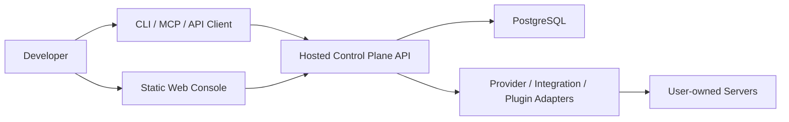
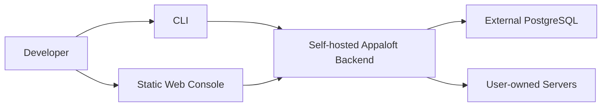
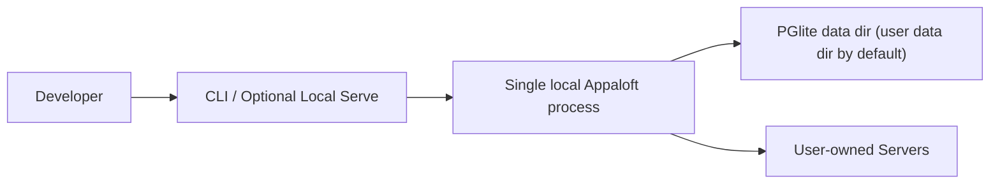
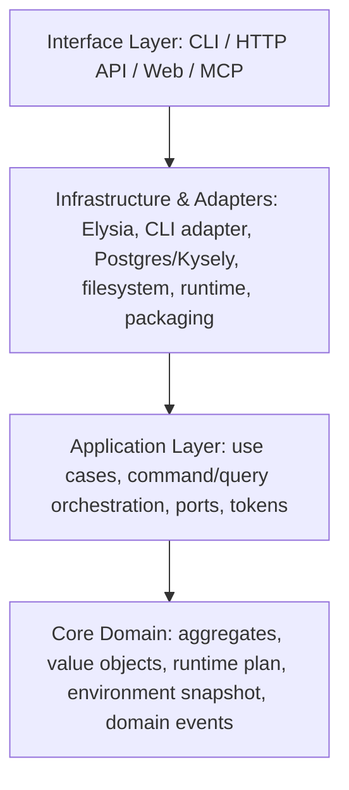
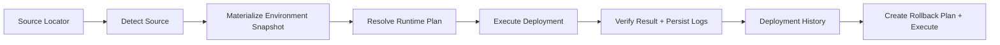

# Architecture

## Product Goal

Appaloft is an intent-first deployment platform:

- users say "deploy this project to that server"
- the system detects source shape, selects a runtime strategy, materializes environment snapshot state, and executes a deployment plan

## Non-Goals

- not a SvelteKit full-stack app
- not a GitHub-only deployment product
- not a single-binary-only architecture
- not an embedded-database-only product

## Topology

Hosted:

Self-hosted:

Local embedded mode:

## Layering

## Package Boundaries

- `packages/core`
  - bounded contexts live under `shared`, `workspace`, `configuration`, `runtime-topology`, `workload-delivery`, `dependency-resources`, and `release-orchestration`
  - currently implemented aggregates: `Project`, `Environment`, `DeploymentTarget`, `Destination`, `Resource`, `Deployment`, foundational `Workload`, foundational `Release`, foundational `ResourceInstance`, foundational `ResourceBinding`
  - value-ish domain data: `RuntimePlan`, `EnvironmentSnapshot`, `EnvironmentConfigSet`
  - domain events, explicit result/error model
- `packages/application`
  - command/query messages, buses, decorator-registered handlers, application services/use cases
  - query services
  - repository/read-model/provider/plugin/integration ports
  - deployment-context defaults stay split between policy and semantic factory
  - policy decides whether identifiers are required or which preset applies
  - factory exposes meaningful preset methods such as local project/server/destination/environment selection and creation
- `packages/orpc`
  - typed transport contracts
  - oRPC RPC handlers mounted at `/api/rpc` for first-party clients such as `apps/web`
  - OpenAPI/REST handlers mounted at `/api` for stable external HTTP consumers
  - typed client and TanStack Query helpers consumed by `apps/web`
- `packages/persistence/pg`
  - Kysely schema, migrations, repositories, spec visitors, read models, diagnostics
  - selection spec visitors own full Kysely query translation
  - repositories pass a `SelectQueryBuilder` into the selection visitor and execute the returned builder
  - repositories must not split query translation into ad-hoc intermediate clause objects
- `packages/adapters/*`
  - HTTP transport shell, CLI transport shell, filesystem source detection, runtime execution, packaging manifests
- `packages/providers/*`
  - cloud/deploy target provider descriptors and future provider adapters
- `packages/integrations/*`
  - VCS and ecosystem integration descriptors
- `packages/plugins/*`
  - plugin manifest, compatibility checks, host, built-ins, system-plugin runtime definitions
- `apps/shell`
  - composition root, only place where `tsyringe` assembles the app
- `apps/web`
  - static interface that talks to the backend API through `@appaloft/orpc/client` and `@tanstack/svelte-query`

## Interface Relationship

- `CLI`
  - dispatches commands and queries through the shared buses
- `HTTP API`
  - exposes infrastructure endpoints such as health/readiness/version directly from the HTTP adapter
- `oRPC RPC`
  - exposes first-party business procedures under `/api/rpc`
- `OpenAPI REST`
  - exposes the same business capability under `/api` for external clients and contract visibility
- `Web`
  - uses the shared `@appaloft/orpc/client` package plus TanStack Query, rather than hand-written fetch calls for business routes
- `MCP`
  - remains a future interface that must call the same application layer

## Core Business Surface

- the human-facing and AI-facing business capability contract lives in
  [CORE_OPERATIONS.md](/Users/nichenqin/projects/appaloft/docs/CORE_OPERATIONS.md)
- the human-facing and AI-facing business operation relationship map lives in
  [BUSINESS_OPERATION_MAP.md](/Users/nichenqin/projects/appaloft/docs/BUSINESS_OPERATION_MAP.md)
- the human-facing and AI-facing domain boundary contract lives in
  [DOMAIN_MODEL.md](/Users/nichenqin/projects/appaloft/docs/DOMAIN_MODEL.md)
- the executable mirror of that contract lives in
  [operation-catalog.ts](/Users/nichenqin/projects/appaloft/packages/application/src/operation-catalog.ts)
- CLI, oRPC, HTTP, and future MCP tools must add or consume operations through those two files in
  lockstep
- infrastructure endpoints such as `health`, `readiness`, and `version` are adapter concerns and
  intentionally sit outside that business operation catalog

## Provider vs Strategy vs Integration vs Plugin

- Provider:
  - represents a deploy target or infrastructure service family
  - examples: `generic-ssh`, `aliyun`, `tencent-cloud`
- Strategy:
  - runtime decision for source/build/deploy mode
  - examples: `dockerfile`, `compose-deploy`, `prebuilt-image`, `workspace-commands`
- Integration:
  - external system bridge with explicit capability flags
  - examples: `github`, `gitlab`, future `local-vcs`
- Plugin:
  - extension unit with manifest, compatibility range, lifecycle hooks, capabilities
  - split into user plugins and system plugins
  - system plugins are operator-installed and may extend backend routes, middleware, and control-plane pages

These are not interchangeable terms.

## Detect To Rollback Flow

## Deployment Method And Execution Strategy

Appaloft now treats deployment method as an explicit planning input, not just an implementation detail.

- deployment method:
  - the operator-facing choice supplied to the command layer
  - current values: `auto`, `dockerfile`, `docker-compose`, `prebuilt-image`, `workspace-commands`
- execution strategy:
  - the runtime plan result that tells adapters how to actually run the workload
  - current values: `docker-container`, `docker-compose-stack`, `host-process`

Current mapping:

- `dockerfile` -> container build + `docker-container`
- `docker-compose` -> compose bundle + `docker-compose-stack`
- `prebuilt-image` -> prebuilt image + `docker-container`
- `workspace-commands` -> command-driven build/start + `host-process`

This is intentionally broader than a container-only platform model because Appaloft needs to support
local-first validation and non-Docker targets as first-class flows.

## Domain Terminology Compatibility

- the core domain term is `DeploymentTarget`, while current transport paths still expose `server`
- the core domain term is `Environment`, while `EnvironmentProfile` remains a temporary compatibility alias
- root-level files in `packages/core/src` are compatibility exports; new domain work should use the bounded-context directories

## Why Web Is Not The Core

- Web cannot be the only interface for an AI-native deployment product.
- Agents, IDEs, and scripts need CLI/API/MCP parity.
- Deployment planning, environment snapshots, rollback, and provider interactions belong in the backend.
- The static console exists to observe and operate the same system, not to define a parallel one.
- Hosted-only pages such as login may surface in the web console, but auth/session runtime remains a first-party backend capability rather than a web-owned workflow.

## Why Core Cannot Depend On Frameworks

- aggregate rules must survive HTTP, CLI, and future MCP entry points
- persistence technology and provider SDKs must remain replaceable
- domain logic should be testable without database, network, or framework runtime

## Why tsyringe Is Restricted

- composition belongs at the application edge
- letting `container.resolve()` leak into business code turns DI into service location
- use cases should be explicit constructor graphs, not hidden runtime lookups

## Packaging

Supported output targets:

- split deployment
- all-in-one Docker
- Compose self-hosted bundle
- future optional binary mode

Important:

- binary mode is only a distribution choice
- PostgreSQL remains the main hosted and production backend
- PGlite is an embedded option for single-instance installs and defaults to platform user-level storage
- release artifacts currently map to `appaloft-backend`, `appaloft-web-static`, `Dockerfile`, and `docker-compose.selfhost.yml`
- hosted auth is optional and additive; self-hosted/local mode can remain anonymous

## Anonymous vs Hosted Mode

- self-hosted mode:
  - default runtime mode
  - no required login
  - suitable for local-first and single-team installs
- hosted-control-plane mode:
  - intended for operator-run multi-user control planes
  - keeps auth optional at startup, then prompts for sign-in only when a workflow actually needs it, such as GitHub repository import
  - enables first-party Better Auth runtime support and reserves organization-based tenant isolation
  - still allows system plugins to extend middleware, routes, and control-plane pages without owning the core session model

## PostgreSQL Relationship To Distribution

The release form does not change the data model:

- `appaloft-backend` can talk to external PostgreSQL or embedded PGlite depending on config
- all-in-one Docker usually talks to external PostgreSQL
- `docker-compose.selfhost.yml` provides a recommended self-hosted stack with PostgreSQL as a separate service
- a future optional binary can use embedded PGlite for local-first installs without changing application/core layers
