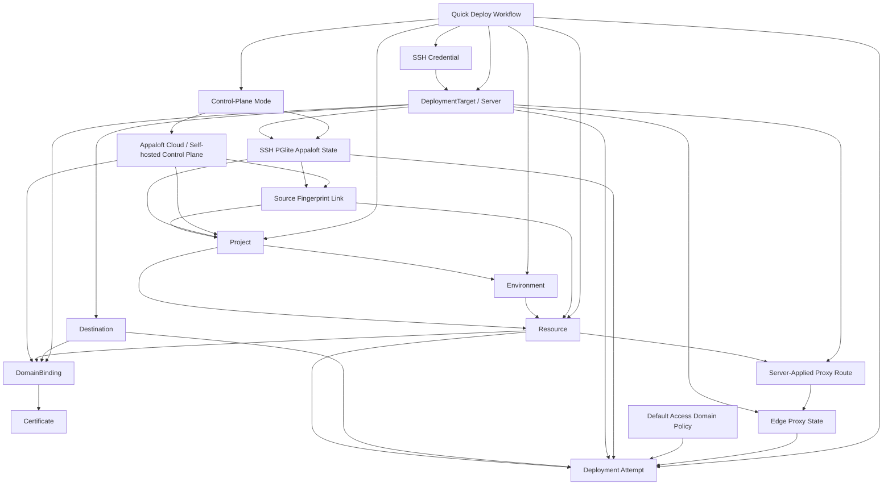

# Business Operation Map

> CORE DOCUMENT
>
> This file is the human-facing and AI-facing source of truth for how Appaloft commands, queries,
> workflows, events, read models, and implementation plans relate to each other.
>
> [DOMAIN_MODEL.md](/Users/nichenqin/projects/appaloft/docs/DOMAIN_MODEL.md) defines the domain
> boundaries and aggregate language.
>
> [CORE_OPERATIONS.md](/Users/nichenqin/projects/appaloft/docs/CORE_OPERATIONS.md) defines the public
> command/query catalog and must stay mirrored by
> [operation-catalog.ts](/Users/nichenqin/projects/appaloft/packages/application/src/operation-catalog.ts).
>
> This file defines where a behavior sits before agents write ADRs, local specs, tests, or code.

## Normative Contract

Every business behavior must be positioned in this map before it enters implementation.

If a requested behavior is already listed as an active command, query, workflow, or accepted
candidate here, agents must start from the linked ADRs and specs before changing code.

If a requested behavior is not listed here, agents must add or update this map in a Spec Round
before creating local command/event/workflow/error/testing specs or implementation code.

If a requested behavior is listed as future, deferred, removed, or rebuild-required, agents must not
implement it directly. They must first create or update the governing ADR, then add local specs,
then create an implementation plan, then enter Code Round.

Generic aggregate-root update operations are not valid business behavior positions. Per
[ADR-026: Aggregate Mutation Command Boundary](./decisions/ADR-026-aggregate-mutation-command-boundary.md),
each aggregate mutation must be positioned under an intention-revealing command or workflow such as
`rename`, `configure-*`, `set-*`, `unset-*`, `archive`, `confirm-*`, or another domain verb accepted
by its governing spec. If the only proposed name is `{aggregate}.update`, the behavior is not ready
for local specs or implementation.

## Governing Source Order

Read these files in order before changing a behavior:

1. [Decision Records](./decisions/README.md) and relevant ADRs.
2. [Business Operation Map](./BUSINESS_OPERATION_MAP.md).
3. [Core Operations](./CORE_OPERATIONS.md).
4. [Domain Model](./DOMAIN_MODEL.md).
5. Global contracts:
   - [Error Model](./errors/model.md)
   - [neverthrow Conventions](./errors/neverthrow-conventions.md)
   - [Async Lifecycle And Acceptance](./architecture/async-lifecycle-and-acceptance.md)
6. Local command, query, event, workflow, error, testing, and implementation-plan docs.

`docs/ai/**` is background analysis only and cannot override this map.

## Operation State Terms

| State | Meaning |
| --- | --- |
| Active command | Public write operation in the v1 business surface. Must appear in `CORE_OPERATIONS.md` and `operation-catalog.ts`. |
| Active query | Public read operation in the v1 business surface. Must appear in `CORE_OPERATIONS.md` and `operation-catalog.ts` when it is business-facing. |
| Workflow | Entry flow, UX flow, or process flow that sequences explicit operations. It is not itself a command unless a later ADR says so. |
| Accepted candidate | Command/query boundary is accepted by ADR or spec, but implementation may still be incomplete. Must not be exposed as active until catalog/API/CLI/Web/tests are aligned. |
| Rebuild-required | Previously implemented or expected behavior that is not part of the current public surface. It must restart at ADR/spec/plan before code. |
| Internal capability | Core/runtime/persistence mechanism that may support future behavior but is not exposed as a public business operation. |

## V1 Minimum Loop

The v1 loop is the first-class closure path. New behavior should be prioritized by whether it
improves this loop.

```text
create/select project
  -> create/select environment
  -> create/select deployment target/server
  -> create/configure credential when needed
  -> create/select resource with source/runtime/network profile
  -> deployments.create
  -> observe deployment progress, status, logs, and generated or server-applied access route when policy allows it
  -> observe current resource health and access/proxy state
  -> observe resource runtime logs when an application instance is running
  -> copy resource diagnostic summary when access, logs, or proxy state need support/debug context
  -> optionally domain-bindings.create
  -> optionally certificates.issue-or-renew
  -> observe domain readiness
```

Quick Deploy, CLI interactive deploy, and repository config driven headless deploys are workflow
entrypoints over this loop. A source-adjacent Appaloft config file is the non-interactive profile
expression of the same Quick Deploy draft normalization, not a separate deployment command or a
shortcut around the explicit operations.

For pure CLI and GitHub Actions deployments to an SSH server, Appaloft state is durable on that SSH
server by default through the `ssh-pglite` backend governed by
[ADR-024](./decisions/ADR-024-pure-cli-ssh-state-and-server-applied-domains.md). A config file may
declare provider-neutral server-applied domain intent for the target's edge proxy; this is
server-local route desired/applied state in pure CLI mode and is distinct from managed
`DomainBinding` lifecycle state. The same route intent may include canonical redirects such as
`www.example.com -> example.com`; those redirects remain edge-proxy route behavior, not deployment
input and not proof of managed domain ownership.

Control-plane mode selection is an entry-workflow concern governed by
[ADR-025](./decisions/ADR-025-control-plane-modes-and-action-execution.md). Execution owner and
state/control-plane owner are separate dimensions: GitHub Actions may remain the execution owner
when Appaloft Cloud or a self-hosted Appaloft server owns state, and pure CLI/GitHub Actions with
`controlPlane.mode = none` remains a durable product line. Repository config may select connection
policy such as `none`, `auto`, `cloud`, or `self-hosted`, but it must not select project, resource,
server, destination, credential, organization, or tenant identity.

## Relationship Diagram



## Active Command And Query Surface

### Workspace

| Behavior | Type | Operation | Owner | Main relationship | Governing docs |
| --- | --- | --- | --- | --- | --- |
| Create project | Command | `projects.create` | Project | Starts a resource collection boundary. | [Core Operations](./CORE_OPERATIONS.md) |
| List projects | Product-session member query | `projects.list` | Project read model | Lets authenticated workflows select existing project context. | [Core Operations](./CORE_OPERATIONS.md) |
| Show project | Product-session member query | `projects.show` | Project read model | Reads one project identity and lifecycle surface before resource selection. | [projects.show](./queries/projects.show.md), [Project Lifecycle](./workflows/project-lifecycle.md), [ADR-013](./decisions/ADR-013-project-resource-navigation-and-deployment-ownership.md), [ADR-026](./decisions/ADR-026-aggregate-mutation-command-boundary.md) |
| Rename project | Active command | `projects.rename` | Project | Changes only project display name and derived slug. | [projects.rename](./commands/projects.rename.md), [Project Lifecycle](./workflows/project-lifecycle.md), [project-renamed](./events/project-renamed.md), [ADR-026](./decisions/ADR-026-aggregate-mutation-command-boundary.md) |
| Set project description | Active command | `projects.set-description` | Project | Sets or clears only project description metadata without changing name, slug, lifecycle, resources, environments, deployments, or runtime state. | [projects.set-description](./commands/projects.set-description.md), [Project Lifecycle](./workflows/project-lifecycle.md), [project-description-set](./events/project-description-set.md), [ADR-026](./decisions/ADR-026-aggregate-mutation-command-boundary.md) |
| Archive project | Active command | `projects.archive` | Project | Retires a project from new project-scoped mutations while retaining child history/read access. | [projects.archive](./commands/projects.archive.md), [Project Lifecycle](./workflows/project-lifecycle.md), [project-archived](./events/project-archived.md), [ADR-013](./decisions/ADR-013-project-resource-navigation-and-deployment-ownership.md), [ADR-026](./decisions/ADR-026-aggregate-mutation-command-boundary.md) |
| Restore project | Active command | `projects.restore` | Project | Reopens an archived project for future project-scoped mutations without creating deployments or mutating child/runtime state. | [projects.restore](./commands/projects.restore.md), [Project Lifecycle](./workflows/project-lifecycle.md), [project-restored](./events/project-restored.md), [ADR-013](./decisions/ADR-013-project-resource-navigation-and-deployment-ownership.md), [ADR-026](./decisions/ADR-026-aggregate-mutation-command-boundary.md) |
| Check project delete safety | Active query | `projects.delete-check` | Project read model / delete blocker reader | Previews whether an archived project can be deleted without hiding retained child or support state. | [projects.delete-check](./queries/projects.delete-check.md), [Project Lifecycle](./workflows/project-lifecycle.md), [Project Lifecycle Test Matrix](./testing/project-lifecycle-test-matrix.md), [ADR-013](./decisions/ADR-013-project-resource-navigation-and-deployment-ownership.md), [ADR-026](./decisions/ADR-026-aggregate-mutation-command-boundary.md) |
| Delete project | Active command | `projects.delete` | Project | Soft-deletes only an archived project after delete-check blockers are clear and exact typed confirmation matches. | [projects.delete](./commands/projects.delete.md), [project-deleted](./events/project-deleted.md), [projects.delete-check](./queries/projects.delete-check.md), [Project Lifecycle](./workflows/project-lifecycle.md), [Project Lifecycle Test Matrix](./testing/project-lifecycle-test-matrix.md), [ADR-013](./decisions/ADR-013-project-resource-navigation-and-deployment-ownership.md), [ADR-026](./decisions/ADR-026-aggregate-mutation-command-boundary.md) |
| Create environment | Command | `environments.create` | Environment | Creates deployment/config scope inside a project. | [Core Operations](./CORE_OPERATIONS.md) |
| List environments | Product-session member query | `environments.list` | Environment read model | Lets authenticated workflows select environment context. | [Core Operations](./CORE_OPERATIONS.md) |
| Show environment | Product-session member query | `environments.show` | Environment read model | Exposes config context for one environment after product-session authorization. | [Core Operations](./CORE_OPERATIONS.md) |
| Rename environment | Active command | `environments.rename` | Environment | Changes only environment display name inside the owning project without mutating variables, resources, deployments, or runtime state. | [environments.rename](./commands/environments.rename.md), [Environment Lifecycle](./workflows/environment-lifecycle.md), [environment-renamed](./events/environment-renamed.md), [Environment Lifecycle Test Matrix](./testing/environment-lifecycle-test-matrix.md), [ADR-026](./decisions/ADR-026-aggregate-mutation-command-boundary.md) |
| Set environment variable | Command | `environments.set-variable` | Environment | Mutates environment config before deployment snapshot. | [Core Operations](./CORE_OPERATIONS.md) |
| Unset environment variable | Command | `environments.unset-variable` | Environment | Removes environment config before deployment snapshot. | [Core Operations](./CORE_OPERATIONS.md) |
| Read environment effective precedence | Active query | `environments.effective-precedence` | Environment configuration read model | Exposes masked environment-owned variables and the environment-level effective value for each `key + exposure` identity before resource overrides or deployment snapshots apply. | [environments.effective-precedence](./queries/environments.effective-precedence.md), [Environment Effective Precedence Test Matrix](./testing/environment-effective-precedence-test-matrix.md), [ADR-012](./decisions/ADR-012-resource-runtime-profile-and-deployment-snapshot-boundary.md) |
| Diff environments | Query | `environments.diff` | Environment read model | Compares configuration scopes. | [Core Operations](./CORE_OPERATIONS.md) |
| Clone environment | Active command | `environments.clone` | Environment | Creates a new active environment in the same project from an active source environment's owned configuration without copying resources, deployments, or runtime state. | [environments.clone](./commands/environments.clone.md), [Environment Lifecycle](./workflows/environment-lifecycle.md), [Environment Lifecycle Test Matrix](./testing/environment-lifecycle-test-matrix.md), [ADR-026](./decisions/ADR-026-aggregate-mutation-command-boundary.md) |
| Promote environment | Command | `environments.promote` | Environment | Creates a promoted environment state. | [Core Operations](./CORE_OPERATIONS.md) |
| Lock environment | Active command | `environments.lock` | Environment | Freezes an environment from new configuration writes, promotion, resource creation, and deployment admission while keeping reads/history visible. | [environments.lock](./commands/environments.lock.md), [Environment Lifecycle](./workflows/environment-lifecycle.md), [environment-locked](./events/environment-locked.md), [Environment Lifecycle Test Matrix](./testing/environment-lifecycle-test-matrix.md), [ADR-032](./decisions/ADR-032-environment-lock-lifecycle.md), [ADR-026](./decisions/ADR-026-aggregate-mutation-command-boundary.md) |
| Unlock environment | Active command | `environments.unlock` | Environment | Returns a locked environment to active so it can accept environment mutations and deployment admission again. | [environments.unlock](./commands/environments.unlock.md), [Environment Lifecycle](./workflows/environment-lifecycle.md), [environment-unlocked](./events/environment-unlocked.md), [Environment Lifecycle Test Matrix](./testing/environment-lifecycle-test-matrix.md), [ADR-032](./decisions/ADR-032-environment-lock-lifecycle.md), [ADR-026](./decisions/ADR-026-aggregate-mutation-command-boundary.md) |
| Archive environment | Active command | `environments.archive` | Environment | Retires an environment from new configuration writes, resource creation, and deployment admission while retaining environment/resource/deployment history. | [environments.archive](./commands/environments.archive.md), [Environment Lifecycle](./workflows/environment-lifecycle.md), [environment-archived](./events/environment-archived.md), [Environment Lifecycle Test Matrix](./testing/environment-lifecycle-test-matrix.md), [ADR-026](./decisions/ADR-026-aggregate-mutation-command-boundary.md) |

### Deployment Target And Credential

| Behavior | Type | Operation | Owner | Main relationship | Governing docs |
| --- | --- | --- | --- | --- | --- |
| Register deployment target | Command | `servers.register` | DeploymentTarget | Creates target/server metadata and proxy intent. | [Server Bootstrap Workflow](./workflows/server-bootstrap-and-proxy.md), [ADR-003](./decisions/ADR-003-server-connect-public-vs-internal.md), [ADR-004](./decisions/ADR-004-server-readiness-state-storage.md) |
| Configure target credential | Command | `servers.configure-credential` | DeploymentTarget | Attaches credential context to a target. | [Core Operations](./CORE_OPERATIONS.md) |
| Create reusable SSH credential | Command | `credentials.create-ssh` | Credential | Stores reusable target access material. | [Core Operations](./CORE_OPERATIONS.md) |
| List reusable SSH credentials | Query | `credentials.list-ssh` | Credential read model | Lets workflows select existing access material. | [Core Operations](./CORE_OPERATIONS.md) |
| Show reusable SSH credential usage | Active query | `credentials.show` | Credential read model / usage reader | Reads one reusable SSH credential as masked metadata plus safe deployment-target/server usage visibility before rotate or delete decisions. | [credentials.show](./queries/credentials.show.md), [SSH Credential Lifecycle](./workflows/ssh-credential-lifecycle.md), [SSH Credential Lifecycle Error Spec](./errors/credentials.lifecycle.md), [SSH Credential Lifecycle Test Matrix](./testing/ssh-credential-lifecycle-test-matrix.md), [SSH Credential Lifecycle Implementation Plan](./implementation/ssh-credential-lifecycle-plan.md) |
| Delete reusable SSH credential when unused | Active command | `credentials.delete-ssh` | Credential / usage safety reader | Permanently removes a stored reusable SSH private-key credential only after durable active/inactive visible server usage is proven empty. Usage-read failure is not zero usage. | [credentials.delete-ssh](./commands/credentials.delete-ssh.md), [credentials.show](./queries/credentials.show.md), [SSH Credential Lifecycle](./workflows/ssh-credential-lifecycle.md), [SSH Credential Lifecycle Error Spec](./errors/credentials.lifecycle.md), [SSH Credential Lifecycle Test Matrix](./testing/ssh-credential-lifecycle-test-matrix.md), [SSH Credential Lifecycle Implementation Plan](./implementation/ssh-credential-lifecycle-plan.md) |
| Rotate reusable SSH credential | Active command | `credentials.rotate-ssh` | Credential / usage safety reader | Replaces stored reusable SSH private-key material while preserving the credential id and existing server references. Nonzero active/inactive visible server usage is allowed only after explicit usage acknowledgement; rotation success does not prove connectivity. | [credentials.rotate-ssh](./commands/credentials.rotate-ssh.md), [credentials.show](./queries/credentials.show.md), [SSH Credential Lifecycle](./workflows/ssh-credential-lifecycle.md), [SSH Credential Lifecycle Error Spec](./errors/credentials.lifecycle.md), [SSH Credential Lifecycle Test Matrix](./testing/ssh-credential-lifecycle-test-matrix.md), [SSH Credential Lifecycle Implementation Plan](./implementation/ssh-credential-lifecycle-plan.md), [Reusable SSH Credential Rotation Spec](./specs/001-reusable-ssh-credential-rotation/spec.md) |
| List deployment targets | Product-session member query | `servers.list` | DeploymentTarget read model | Lets authenticated workflows select target/server context. | [Core Operations](./CORE_OPERATIONS.md) |
| Show deployment target | Product-session member query | `servers.show` | DeploymentTarget detail read model | Reads one target/server identity, credential summary, proxy readiness, and deployment/resource/domain rollups without mutating lifecycle state after product-session authorization. | [servers.show](./queries/servers.show.md), [Deployment Target Lifecycle](./workflows/deployment-target-lifecycle.md), [Deployment Target Lifecycle Test Matrix](./testing/deployment-target-lifecycle-test-matrix.md), [ADR-004](./decisions/ADR-004-server-readiness-state-storage.md) |
| Inspect deployment target capacity | Active query | `servers.capacity.inspect` | DeploymentTarget runtime observation | Reads disk, inode, memory, CPU, Docker image/build-cache usage, Appaloft runtime roots, safe reclaimable estimates, and capacity warnings without pruning, deleting, or repairing target state. | [Deployment Runtime Target Abstraction](./workflows/deployment-runtime-target-abstraction.md), [Runtime Target Abstraction Implementation Plan](./implementation/runtime-target-abstraction-plan.md), [Deployment Config File Test Matrix](./testing/deployment-config-file-test-matrix.md), [ADR-023](./decisions/ADR-023-runtime-orchestration-target-boundary.md) |
| Inspect runtime usage attribution | Active query | `runtime-usage.inspect` | DeploymentTarget runtime observation / runtime usage read model | Reads safe CPU, memory, disk, Docker artifact/cache, source workspace, and optional network usage attribution for server, project, environment, resource, and deployment scopes without pruning, repairing, stopping, starting, redeploying, or enforcing quota. | [Runtime Usage Attribution And Monitoring](./specs/068-runtime-usage-attribution-and-monitoring/spec.md), [runtime-usage.inspect](./queries/runtime-usage.inspect.md), [Runtime Usage Attribution Test Matrix](./testing/runtime-usage-attribution-test-matrix.md), [Deployment Runtime Target Abstraction](./workflows/deployment-runtime-target-abstraction.md), [ADR-062](./decisions/ADR-062-runtime-usage-attribution-boundary.md), [ADR-023](./decisions/ADR-023-runtime-orchestration-target-boundary.md), [ADR-047](./decisions/ADR-047-runtime-artifact-workspace-prune-boundary.md), [ADR-050](./decisions/ADR-050-docker-cache-and-image-prune-boundary.md) |
| List runtime monitoring samples | Active query | `runtime-monitoring.samples.list` | DeploymentTarget runtime observation / runtime monitoring read model | Reads bounded sanitized retained sample windows for server, project, environment, resource, or deployment scopes through application, PG/PGlite, CLI, HTTP/oRPC, server/resource Web Monitor readback, SDK metadata, and generated MCP/tool descriptors. It must not expose raw runtime output, collect new samples, mutate targets, or replace runtime log retention. | [runtime-monitoring.samples.list](./queries/runtime-monitoring.samples.list.md), [Runtime Monitoring Observation Boundary](./specs/069-runtime-monitoring-observation-boundary/spec.md), [Runtime Monitoring Observation Test Matrix](./testing/runtime-monitoring-observation-test-matrix.md), [ADR-063](./decisions/ADR-063-runtime-monitoring-observation-boundary.md), [ADR-062](./decisions/ADR-062-runtime-usage-attribution-boundary.md), [ADR-018](./decisions/ADR-018-resource-runtime-log-observation.md), [ADR-053](./decisions/ADR-053-resource-runtime-log-archive-retention-boundary.md) |
| Read runtime monitoring rollups | Active query | `runtime-monitoring.rollup` | DeploymentTarget runtime observation / runtime monitoring read model | Reads bounded retained-sample time-window rollups and chart series with deployment markers for server, project, environment, resource, or deployment scopes through application, PG/PGlite, CLI, HTTP/oRPC, server/resource Web Monitor readback, SDK metadata, and generated MCP/tool descriptors. It correlates charts with logs/events/diagnostics without claiming causality or becoming a dashboard query engine. | [runtime-monitoring.rollup](./queries/runtime-monitoring.rollup.md), [Runtime Monitoring Observation Boundary](./specs/069-runtime-monitoring-observation-boundary/spec.md), [Runtime Monitoring Observation Test Matrix](./testing/runtime-monitoring-observation-test-matrix.md), [ADR-063](./decisions/ADR-063-runtime-monitoring-observation-boundary.md), [ADR-062](./decisions/ADR-062-runtime-usage-attribution-boundary.md), [ADR-020](./decisions/ADR-020-resource-health-observation.md) |
| Configure runtime monitoring thresholds | Active command / CLI / HTTP-oRPC / Web | `runtime-monitoring.thresholds.configure` | Runtime monitoring threshold policy | Persists non-enforcing warning/critical threshold policy for one exact monitoring scope through the shared command/use-case boundary, PG/PGlite policy storage, CLI, HTTP/oRPC, server/resource Web Monitor CPU `containerCpuPercent`, memory `usedBytes`, and disk `usedBytes` configuration, SDK metadata, and generated MCP/tool descriptor/handler dispatch. Writes remain exact-scope; the Web entrypoint preserves other advanced rules for exact-scope edits and creates an exact-scope override when saving inherited readback. Thresholds may create operator visibility but must not prune, stop, restart, redeploy, reject, throttle, resize, scale, or bill anything. | [Runtime Monitoring Observation Boundary](./specs/069-runtime-monitoring-observation-boundary/spec.md), [runtime-monitoring.thresholds.configure](./commands/runtime-monitoring-thresholds.configure.md), [Runtime Monitoring Observation Test Matrix](./testing/runtime-monitoring-observation-test-matrix.md), [ADR-063](./decisions/ADR-063-runtime-monitoring-observation-boundary.md), [ADR-062](./decisions/ADR-062-runtime-usage-attribution-boundary.md) |
| Show runtime monitoring thresholds | Active query / CLI / HTTP-oRPC / Web | `runtime-monitoring.thresholds.show` | Runtime monitoring threshold read model | Reads safe threshold policy and latest warning/critical evaluation state from retained samples through CLI, HTTP/oRPC, server/resource Web Monitor readback, SDK metadata, and generated MCP/tool descriptor/handler dispatch without enforcing limits or mutating runtime targets. Exact-scope policy wins; when absent, retained sample scope evidence can inherit the nearest resource, environment, project, or server policy. | [Runtime Monitoring Observation Boundary](./specs/069-runtime-monitoring-observation-boundary/spec.md), [runtime-monitoring.thresholds.show](./queries/runtime-monitoring-thresholds.show.md), [Runtime Monitoring Observation Test Matrix](./testing/runtime-monitoring-observation-test-matrix.md), [ADR-063](./decisions/ADR-063-runtime-monitoring-observation-boundary.md), [ADR-062](./decisions/ADR-062-runtime-usage-attribution-boundary.md) |
| Prune deployment target capacity | Active command | `servers.capacity.prune` | DeploymentTarget runtime observation / runtime target adapter | Dry-runs by default and deletes only safe target-owned stopped containers or materialized workspace candidates older than the cutoff; Docker build cache, unused image, and remote-state marker prune are explicit opt-in categories. The command preserves active runtimes, rollback candidates, Docker volumes, Appaloft state roots, live remote `ssh-pglite` state, audit/events, deployment snapshots, and resource/server state. | [servers.capacity.prune](./commands/servers.capacity.prune.md), [Runtime Artifact And Workspace Prune](./specs/055-runtime-artifact-workspace-prune/spec.md), [Runtime Target Capacity Test Matrix](./testing/runtime-target-capacity-test-matrix.md), [ADR-047](./decisions/ADR-047-runtime-artifact-workspace-prune-boundary.md), [ADR-050](./decisions/ADR-050-docker-cache-and-image-prune-boundary.md), [ADR-023](./decisions/ADR-023-runtime-orchestration-target-boundary.md), [ADR-034](./decisions/ADR-034-deployment-recovery-readiness.md) |
| Configure scheduled runtime prune policy | Active command / CLI / HTTP-oRPC | `scheduled-runtime-prune-policies.configure` | DeploymentTarget runtime observation / retention policy | Persists one safe scheduled runtime prune policy record with scope, target selector, retention duration, categories, destructive enablement, retry behavior, enabled state, and version for scheduler readback. Exposed through `appaloft server capacity policy configure` and `POST /api/servers/capacity/policies`. | [scheduled-runtime-prune-policies.configure](./commands/scheduled-runtime-prune-policies.configure.md), [Scheduled Runtime Prune Automation](./specs/061-scheduled-runtime-prune-automation/spec.md), [Runtime Target Capacity Test Matrix](./testing/runtime-target-capacity-test-matrix.md), [ADR-055](./decisions/ADR-055-scheduled-runtime-prune-automation.md) |
| List scheduled runtime prune policies | Active query / CLI / HTTP-oRPC | `scheduled-runtime-prune-policies.list` | Runtime prune policy read model | Lists safe scheduled runtime prune policy readback records, optionally filtered by server, scope, or enabled state, without exposing secret-bearing runtime output. Exposed through `appaloft server capacity policy list` and `GET /api/servers/capacity/policies`. | [scheduled-runtime-prune-policies.list](./queries/scheduled-runtime-prune-policies.list.md), [Scheduled Runtime Prune Automation](./specs/061-scheduled-runtime-prune-automation/spec.md), [Runtime Target Capacity Test Matrix](./testing/runtime-target-capacity-test-matrix.md), [ADR-055](./decisions/ADR-055-scheduled-runtime-prune-automation.md) |
| Show scheduled runtime prune policy | Active query / CLI / HTTP-oRPC | `scheduled-runtime-prune-policies.show` | Runtime prune policy read model | Reads one safe scheduled runtime prune policy record by id or returns null when it is absent. Exposed through `appaloft server capacity policy show <policyId>` and `GET /api/servers/capacity/policies/{policyId}`. | [scheduled-runtime-prune-policies.show](./queries/scheduled-runtime-prune-policies.show.md), [Scheduled Runtime Prune Automation](./specs/061-scheduled-runtime-prune-automation/spec.md), [Runtime Target Capacity Test Matrix](./testing/runtime-target-capacity-test-matrix.md), [ADR-055](./decisions/ADR-055-scheduled-runtime-prune-automation.md) |
| Run scheduled runtime prune | Internal workflow / implemented worker | no public operation | DeploymentTarget runtime observation / retention policy / process attempt journal | Periodically selects deployment targets from explicit runtime prune policy, computes a cutoff, records durable process state, and dispatches existing `servers.capacity.prune` through the command bus. Destructive scheduled prune remains disabled unless policy explicitly enables it for the target scope and categories. | [Scheduled Runtime Prune Automation](./specs/061-scheduled-runtime-prune-automation/spec.md), [Runtime Target Capacity Test Matrix](./testing/runtime-target-capacity-test-matrix.md), [ADR-055](./decisions/ADR-055-scheduled-runtime-prune-automation.md), [ADR-047](./decisions/ADR-047-runtime-artifact-workspace-prune-boundary.md), [ADR-050](./decisions/ADR-050-docker-cache-and-image-prune-boundary.md), [ADR-054](./decisions/ADR-054-durable-process-delivery-baseline.md) |
| Rename deployment target | Active command | `servers.rename` | DeploymentTarget | Changes only the operator-facing display name for an active or inactive target/server while preserving server id, host, provider, credential, proxy, lifecycle state, and historical references. | [servers.rename](./commands/servers.rename.md), [server-renamed](./events/server-renamed.md), [Deployment Target Lifecycle](./workflows/deployment-target-lifecycle.md), [Deployment Target Lifecycle Test Matrix](./testing/deployment-target-lifecycle-test-matrix.md), [ADR-004](./decisions/ADR-004-server-readiness-state-storage.md), [ADR-026](./decisions/ADR-026-aggregate-mutation-command-boundary.md) |
| Configure deployment target edge proxy | Active command | `servers.configure-edge-proxy` | DeploymentTarget | Changes only an active target/server's desired edge proxy kind for future proxy-backed route eligibility, without changing identity, host, provider, credential, lifecycle, historical deployment/domain/audit references, or provider-owned artifacts. | [servers.configure-edge-proxy](./commands/servers.configure-edge-proxy.md), [server-edge-proxy-configured](./events/server-edge-proxy-configured.md), [Deployment Target Lifecycle](./workflows/deployment-target-lifecycle.md), [Server Bootstrap And Proxy](./workflows/server-bootstrap-and-proxy.md), [Deployment Target Lifecycle Test Matrix](./testing/deployment-target-lifecycle-test-matrix.md), [ADR-004](./decisions/ADR-004-server-readiness-state-storage.md), [ADR-017](./decisions/ADR-017-default-access-domain-and-proxy-routing.md), [ADR-019](./decisions/ADR-019-edge-proxy-provider-and-observable-configuration.md), [ADR-026](./decisions/ADR-026-aggregate-mutation-command-boundary.md) |
| Deactivate deployment target | Active command | `servers.deactivate` | DeploymentTarget | Marks a target/server inactive so it remains readable but cannot be selected for new deployments, scheduling, or proxy configuration targets. | [servers.deactivate](./commands/servers.deactivate.md), [server-deactivated](./events/server-deactivated.md), [Deployment Target Lifecycle](./workflows/deployment-target-lifecycle.md), [Deployment Target Lifecycle Test Matrix](./testing/deployment-target-lifecycle-test-matrix.md), [ADR-004](./decisions/ADR-004-server-readiness-state-storage.md), [ADR-026](./decisions/ADR-026-aggregate-mutation-command-boundary.md) |
| Check deployment target delete safety | Active query | `servers.delete-check` | DeploymentTarget safety read/query service | Previews whether a deactivated target/server can be deleted and returns typed blocker reasons for retained deployments, resources, domains, certificates, credentials, routes, terminal sessions, logs, audit, or runtime tasks. | [servers.delete-check](./queries/servers.delete-check.md), [Deployment Target Lifecycle](./workflows/deployment-target-lifecycle.md), [Deployment Target Lifecycle Test Matrix](./testing/deployment-target-lifecycle-test-matrix.md), [Deployment Target Lifecycle Error Spec](./errors/servers.lifecycle.md) |
| Delete deployment target | Active command | `servers.delete` | DeploymentTarget | Soft-deletes only an inactive target/server after the shared delete-safety blocker reader proves no retained server-scoped state remains. | [servers.delete](./commands/servers.delete.md), [server-deleted](./events/server-deleted.md), [servers.delete-check](./queries/servers.delete-check.md), [Deployment Target Lifecycle](./workflows/deployment-target-lifecycle.md), [Deployment Target Lifecycle Test Matrix](./testing/deployment-target-lifecycle-test-matrix.md), [Deployment Target Lifecycle Error Spec](./errors/servers.lifecycle.md), [ADR-004](./decisions/ADR-004-server-readiness-state-storage.md), [ADR-026](./decisions/ADR-026-aggregate-mutation-command-boundary.md) |
| Test target connectivity | Command | `servers.test-connectivity` | DeploymentTarget/application service | Validates connectivity and provider-rendered proxy diagnostics for an existing target without mutating lifecycle state. | [Server Bootstrap Workflow](./workflows/server-bootstrap-and-proxy.md) |
| Test draft target connectivity | Command | `servers.test-draft-connectivity` | Application service | Validates credentials before target persistence. | [Server Bootstrap Workflow](./workflows/server-bootstrap-and-proxy.md) |
| Repair target edge proxy | Command | `servers.bootstrap-proxy` | DeploymentTarget proxy lifecycle | Starts a new provider-backed proxy bootstrap attempt for an existing connected/operable target. | [Server Bootstrap Workflow](./workflows/server-bootstrap-and-proxy.md), [server proxy repair plan](./implementation/server-proxy-bootstrap-repair-plan.md) |
| Open server terminal session | Command | `terminal-sessions.open` | TerminalSession/server operator access | Opens an ephemeral interactive shell on a selected deployment target through a terminal gateway port and records safe open audit metadata when audit persistence is configured. | [Operator Terminal Session](./workflows/operator-terminal-session.md), [terminal-sessions.open](./commands/terminal-sessions.open.md), [ADR-022](./decisions/ADR-022-operator-terminal-session-boundary.md) |
| List terminal sessions | Active query | `terminal-sessions.list` | TerminalSession gateway/readback | Lists active ephemeral terminal sessions and safe scope metadata without terminal output, input, command text, private keys, access tokens, or environment secrets. | [Operator Terminal Session](./workflows/operator-terminal-session.md), [terminal-sessions.lifecycle](./queries/terminal-sessions.lifecycle.md), [Operator Terminal Session Test Matrix](./testing/operator-terminal-session-test-matrix.md), [ADR-022](./decisions/ADR-022-operator-terminal-session-boundary.md) |
| Show terminal session | Active query | `terminal-sessions.show` | TerminalSession gateway/readback | Reads one active ephemeral terminal session's safe descriptor and lifecycle timestamps without exposing terminal output or secret-bearing transport details. | [Operator Terminal Session](./workflows/operator-terminal-session.md), [terminal-sessions.lifecycle](./queries/terminal-sessions.lifecycle.md), [Operator Terminal Session Test Matrix](./testing/operator-terminal-session-test-matrix.md), [ADR-022](./decisions/ADR-022-operator-terminal-session-boundary.md) |
| Close terminal session | Active command | `terminal-sessions.close` | TerminalSession gateway lifecycle | Closes one active ephemeral terminal session through the gateway, releases PTY/SSH/process resources, and records safe close audit metadata when audit persistence is configured. It does not persist terminal output or mutate resource/deployment/server aggregates. | [Operator Terminal Session](./workflows/operator-terminal-session.md), [terminal-sessions.lifecycle](./commands/terminal-sessions.lifecycle.md), [Operator Terminal Session Test Matrix](./testing/operator-terminal-session-test-matrix.md), [ADR-022](./decisions/ADR-022-operator-terminal-session-boundary.md) |
| Expire terminal sessions | Active command | `terminal-sessions.expire` | TerminalSession gateway lifecycle | Closes active ephemeral terminal sessions older than the supplied cutoff or current gateway timeout policy, recording safe close audit metadata and returning only safe counts and session ids. | [Operator Terminal Session](./workflows/operator-terminal-session.md), [terminal-sessions.lifecycle](./commands/terminal-sessions.lifecycle.md), [Operator Terminal Session Test Matrix](./testing/operator-terminal-session-test-matrix.md), [ADR-022](./decisions/ADR-022-operator-terminal-session-boundary.md) |

### Resource And Workload Delivery

| Behavior | Type | Operation | Owner | Main relationship | Governing docs |
| --- | --- | --- | --- | --- | --- |
| Create resource | Command | `resources.create` | Resource | Creates deployable unit with source/runtime/network profile when supplied. | [resources.create](./commands/resources.create.md), [ADR-011](./decisions/ADR-011-resource-create-minimum-lifecycle.md), [ADR-012](./decisions/ADR-012-resource-runtime-profile-and-deployment-snapshot-boundary.md), [ADR-015](./decisions/ADR-015-resource-network-profile.md), [ADR-017](./decisions/ADR-017-default-access-domain-and-proxy-routing.md) |
| Show resource profile | Product-session member query | `resources.show` | Resource detail query service | Reads one resource detail/profile surface and optional Resource Profile Drift Visibility diagnostics without mutating deployment, runtime, route, or lifecycle state after product-session authorization. | [resources.show](./queries/resources.show.md), [Resource Profile Lifecycle](./workflows/resource-profile-lifecycle.md), [Resource Profile Drift Visibility](./specs/011-resource-profile-drift-visibility/spec.md), [ADR-012](./decisions/ADR-012-resource-runtime-profile-and-deployment-snapshot-boundary.md), [ADR-013](./decisions/ADR-013-project-resource-navigation-and-deployment-ownership.md), [ADR-015](./decisions/ADR-015-resource-network-profile.md) |
| Configure resource source profile | Active command | `resources.configure-source` | Resource | Changes only the durable `ResourceSourceBinding` used by future deployments and resource profile reads. | [resources.configure-source](./commands/resources.configure-source.md), [Resource Profile Lifecycle](./workflows/resource-profile-lifecycle.md), [ADR-012](./decisions/ADR-012-resource-runtime-profile-and-deployment-snapshot-boundary.md), [ADR-014](./decisions/ADR-014-deployment-admission-uses-resource-profile.md) |
| Configure resource runtime profile | Active command | `resources.configure-runtime` | Resource | Changes only durable runtime planning defaults used by future deployment admission, including reusable install/build/start defaults, strategy-specific paths, and optional runtime naming intent used to derive effective Docker container or Compose project names. Health policy remains `resources.configure-health`. | [resources.configure-runtime](./commands/resources.configure-runtime.md), [Resource Profile Lifecycle](./workflows/resource-profile-lifecycle.md), [ADR-012](./decisions/ADR-012-resource-runtime-profile-and-deployment-snapshot-boundary.md), [ADR-021](./decisions/ADR-021-docker-oci-workload-substrate.md), [ADR-023](./decisions/ADR-023-runtime-orchestration-target-boundary.md) |
| Configure resource network profile | Active command | `resources.configure-network` | Resource | Changes the durable workload endpoint profile used by future deployments and route planning. It does not bind domains or apply proxy routes. | [resources.configure-network](./commands/resources.configure-network.md), [Resource Profile Lifecycle](./workflows/resource-profile-lifecycle.md), [ADR-015](./decisions/ADR-015-resource-network-profile.md), [ADR-017](./decisions/ADR-017-default-access-domain-and-proxy-routing.md) |
| Configure resource access profile | Active command | `resources.configure-access` | Resource | Changes the durable generated-access preference and generated route path prefix used by future deployments and planned access previews. It does not bind domains, issue certificates, edit default access policy records, or apply proxy routes. | [resources.configure-access](./commands/resources.configure-access.md), [resource-access-configured](./events/resource-access-configured.md), [Resource Profile Lifecycle](./workflows/resource-profile-lifecycle.md), [ADR-012](./decisions/ADR-012-resource-runtime-profile-and-deployment-snapshot-boundary.md), [ADR-017](./decisions/ADR-017-default-access-domain-and-proxy-routing.md), [ADR-026](./decisions/ADR-026-aggregate-mutation-command-boundary.md) |
| Set resource variable | Active command | `resources.set-variable` | Resource | Stores one resource-scoped runtime or build-time variable override used by future deployment snapshot materialization after environment precedence is resolved. | [resources.set-variable](./commands/resources.set-variable.md), [Resource Profile Lifecycle](./workflows/resource-profile-lifecycle.md), [ADR-012](./decisions/ADR-012-resource-runtime-profile-and-deployment-snapshot-boundary.md) |
| Create resource secret reference | Active command | `resources.secrets.create` | Resource | Creates one Resource-owned runtime secret reference and returns only safe id/key/exposure metadata. | [resources.secrets.create](./commands/resources.secrets.create.md), [Resource Profile Lifecycle](./workflows/resource-profile-lifecycle.md), [Resource Profile Lifecycle Test Matrix](./testing/resource-profile-lifecycle-test-matrix.md), [ADR-012](./decisions/ADR-012-resource-runtime-profile-and-deployment-snapshot-boundary.md) |
| Rotate resource secret reference | Active command | `resources.secrets.rotate` | Resource | Rotates the value of one existing Resource-owned secret reference without exposing raw secret material; this is the explicit update operation for Resource secret value lifecycle. | [resources.secrets.rotate](./commands/resources.secrets.rotate.md), [Resource Profile Lifecycle](./workflows/resource-profile-lifecycle.md), [Resource Profile Lifecycle Test Matrix](./testing/resource-profile-lifecycle-test-matrix.md), [ADR-012](./decisions/ADR-012-resource-runtime-profile-and-deployment-snapshot-boundary.md) |
| Delete resource secret reference | Active command | `resources.secrets.delete` | Resource | Removes one existing Resource-owned secret reference without touching environment secrets, dependency binding secrets, certificate material, deployment snapshots, or provider-native secret stores. | [resources.secrets.delete](./commands/resources.secrets.delete.md), [Resource Profile Lifecycle](./workflows/resource-profile-lifecycle.md), [Resource Profile Lifecycle Test Matrix](./testing/resource-profile-lifecycle-test-matrix.md), [ADR-012](./decisions/ADR-012-resource-runtime-profile-and-deployment-snapshot-boundary.md) |
| List resource secret references | Active query | `resources.secrets.list` | Resource configuration read model | Lists Resource-owned secret references with masked `value = "****"` only. | [resources.secrets.list](./queries/resources.secrets.list.md), [Resource Profile Lifecycle](./workflows/resource-profile-lifecycle.md), [Resource Profile Lifecycle Test Matrix](./testing/resource-profile-lifecycle-test-matrix.md), [ADR-012](./decisions/ADR-012-resource-runtime-profile-and-deployment-snapshot-boundary.md) |
| Show resource secret reference | Active query | `resources.secrets.show` | Resource configuration read model | Reads one Resource-owned secret reference with masked `value = "****"` only. | [resources.secrets.show](./queries/resources.secrets.show.md), [Resource Profile Lifecycle](./workflows/resource-profile-lifecycle.md), [Resource Profile Lifecycle Test Matrix](./testing/resource-profile-lifecycle-test-matrix.md), [ADR-012](./decisions/ADR-012-resource-runtime-profile-and-deployment-snapshot-boundary.md) |
| Import resource variables | Active command | `resources.import-variables` | Resource | Parses pasted `.env` content into resource-scoped variables and secrets, rejects unsafe keys or build-time secret exposure, and reports duplicate/override metadata without echoing raw secrets. | [resources.import-variables](./commands/resources.import-variables.md), [Resource Secret Operations And Effective Config Baseline](./specs/031-resource-secret-operations-and-effective-config/spec.md), [Resource Profile Lifecycle](./workflows/resource-profile-lifecycle.md), [ADR-012](./decisions/ADR-012-resource-runtime-profile-and-deployment-snapshot-boundary.md), [ADR-026](./decisions/ADR-026-aggregate-mutation-command-boundary.md) |
| Unset resource variable | Active command | `resources.unset-variable` | Resource | Removes one resource-scoped variable override for future deployment snapshot materialization. | [resources.unset-variable](./commands/resources.unset-variable.md), [Resource Profile Lifecycle](./workflows/resource-profile-lifecycle.md), [ADR-012](./decisions/ADR-012-resource-runtime-profile-and-deployment-snapshot-boundary.md) |
| Create storage volume | Command | `storage-volumes.create` | StorageVolume | Creates a provider-neutral named volume or bind mount identity for future Resource attachment without provisioning provider-native storage. | [storage-volumes.create](./commands/storage-volumes.create.md), [Storage Volume Lifecycle](./workflows/storage-volume-lifecycle.md), [Storage Volume Test Matrix](./testing/storage-volume-test-matrix.md), [Storage Volume Lifecycle And Resource Attachment](./specs/032-storage-volume-lifecycle-and-resource-attachment/spec.md) |
| List storage volumes | Query | `storage-volumes.list` | StorageVolume read model | Lists non-deleted storage volumes with safe attachment summaries. | [storage-volumes.list](./queries/storage-volumes.list.md), [Storage Volume Lifecycle](./workflows/storage-volume-lifecycle.md), [Storage Volume Test Matrix](./testing/storage-volume-test-matrix.md) |
| Show storage volume | Query | `storage-volumes.show` | StorageVolume read model | Reads one storage volume with safe Resource attachment summaries and backup relationship metadata. | [storage-volumes.show](./queries/storage-volumes.show.md), [Storage Volume Lifecycle](./workflows/storage-volume-lifecycle.md), [Storage Volume Test Matrix](./testing/storage-volume-test-matrix.md) |
| Rename storage volume | Command | `storage-volumes.rename` | StorageVolume | Changes only the operator-facing storage name/slug without changing attachments, backup metadata, runtime state, or snapshots. | [storage-volumes.rename](./commands/storage-volumes.rename.md), [Storage Volume Lifecycle](./workflows/storage-volume-lifecycle.md), [ADR-026](./decisions/ADR-026-aggregate-mutation-command-boundary.md) |
| Delete storage volume | Command | `storage-volumes.delete` | StorageVolume | Deletes only unattached storage without backup blockers; it does not detach resources, prune runtime, or delete backup data. | [storage-volumes.delete](./commands/storage-volumes.delete.md), [Storage Volume Lifecycle](./workflows/storage-volume-lifecycle.md), [Storage Volume Test Matrix](./testing/storage-volume-test-matrix.md) |
| Clean up storage runtime realization | Command | `storage-volumes.cleanup-runtime` | StorageVolume / runtime target adapter | Dry-run-first operation that previews or removes Docker named-volume runtime realizations for one StorageVolume on one local-shell or generic-SSH server only when attachment, runtime, snapshot, rollback, backup, cutoff, and provider safety evidence pass. Swarm Compose stack realization happens during deployment execution through generated overrides; bind-mount source paths remain blocked; cleanup is not `storage-volumes.delete` and not `servers.capacity.prune`. | [storage-volumes.cleanup-runtime](./commands/storage-volumes.cleanup-runtime.md), [Storage Volume Runtime Realization And Cleanup](./specs/070-storage-volume-runtime-realization-and-cleanup/spec.md), [Storage Volume Lifecycle](./workflows/storage-volume-lifecycle.md), [Storage Volume Test Matrix](./testing/storage-volume-test-matrix.md), [ADR-064](./decisions/ADR-064-storage-volume-runtime-realization-and-cleanup.md) |
| Provision Postgres dependency resource | Active command | `dependency-resources.provision-postgres` | ResourceInstance / realization attempt | Creates an Appaloft-managed Postgres dependency resource, admits a durable managed Postgres realization attempt through provider ports when supported, and mirrors provider attempt progress into operator-visible process state. | [dependency-resources.provision-postgres](./commands/dependency-resources.provision-postgres.md), [Dependency Resource Lifecycle](./workflows/dependency-resource-lifecycle.md), [Dependency Resource Test Matrix](./testing/dependency-resource-test-matrix.md), [Postgres Dependency Resource Lifecycle](./specs/033-postgres-dependency-resource-lifecycle/spec.md), [Postgres Provider-Native Realization](./specs/038-postgres-provider-native-realization/spec.md), [ADR-026](./decisions/ADR-026-aggregate-mutation-command-boundary.md) |
| Import Postgres dependency resource | Command | `dependency-resources.import-postgres` | ResourceInstance | Registers an external Postgres dependency resource with a masked connection read model and secret boundary. | [dependency-resources.import-postgres](./commands/dependency-resources.import-postgres.md), [Dependency Resource Lifecycle](./workflows/dependency-resource-lifecycle.md), [Dependency Resource Test Matrix](./testing/dependency-resource-test-matrix.md), [Postgres Dependency Resource Lifecycle](./specs/033-postgres-dependency-resource-lifecycle/spec.md) |
| Provision Redis dependency resource | Active command | `dependency-resources.provision-redis` | ResourceInstance / realization attempt | Creates an Appaloft-managed Redis dependency resource, admits durable managed Redis realization through provider ports when supported, and mirrors provider attempt progress into operator-visible process state. | [dependency-resources.provision-redis](./commands/dependency-resources.provision-redis.md), [Redis Dependency Resource Lifecycle](./specs/037-redis-dependency-resource-lifecycle/spec.md), [Redis Provider-Native Realization](./specs/049-redis-provider-native-realization/spec.md), [Dependency Resource Lifecycle](./workflows/dependency-resource-lifecycle.md), [Dependency Resource Test Matrix](./testing/dependency-resource-test-matrix.md), [ADR-026](./decisions/ADR-026-aggregate-mutation-command-boundary.md) |
| Import Redis dependency resource | Active command | `dependency-resources.import-redis` | ResourceInstance | Registers an external Redis dependency resource with a masked connection read model and secret boundary. | [dependency-resources.import-redis](./commands/dependency-resources.import-redis.md), [Redis Dependency Resource Lifecycle](./specs/037-redis-dependency-resource-lifecycle/spec.md), [Dependency Resource Lifecycle](./workflows/dependency-resource-lifecycle.md), [Dependency Resource Test Matrix](./testing/dependency-resource-test-matrix.md), [ADR-026](./decisions/ADR-026-aggregate-mutation-command-boundary.md) |
| List dependency resources | Query | `dependency-resources.list` | Dependency resource read model | Lists non-deleted dependency resources with safe ownership, status, binding readiness, and backup relationship summaries. | [dependency-resources.list](./queries/dependency-resources.list.md), [Dependency Resource Lifecycle](./workflows/dependency-resource-lifecycle.md), [Dependency Resource Test Matrix](./testing/dependency-resource-test-matrix.md) |
| Show dependency resource | Query | `dependency-resources.show` | Dependency resource read model | Reads one dependency resource with masked connection metadata, binding readiness, backup relationship metadata, and delete-safety summary. | [dependency-resources.show](./queries/dependency-resources.show.md), [Dependency Resource Lifecycle](./workflows/dependency-resource-lifecycle.md), [Dependency Resource Test Matrix](./testing/dependency-resource-test-matrix.md) |
| Rename dependency resource | Command | `dependency-resources.rename` | ResourceInstance | Changes only the operator-facing dependency resource name/slug without mutating bindings, backup metadata, provider state, runtime state, or snapshots. | [dependency-resources.rename](./commands/dependency-resources.rename.md), [Dependency Resource Lifecycle](./workflows/dependency-resource-lifecycle.md), [Dependency Resource Test Matrix](./testing/dependency-resource-test-matrix.md), [ADR-026](./decisions/ADR-026-aggregate-mutation-command-boundary.md) |
| Delete dependency resource | Active command | `dependency-resources.delete` | ResourceInstance / provider cleanup | Deletes only dependency resources with no binding, backup, provider-managed unsafe, or snapshot/reference blockers; imported external delete removes only Appaloft's record, and realized Appaloft-managed Postgres or Redis is deleted only after provider cleanup succeeds with safe operator-visible process state. | [dependency-resources.delete](./commands/dependency-resources.delete.md), [Dependency Resource Lifecycle](./workflows/dependency-resource-lifecycle.md), [Dependency Resource Test Matrix](./testing/dependency-resource-test-matrix.md), [Postgres Dependency Resource Lifecycle](./specs/033-postgres-dependency-resource-lifecycle/spec.md), [Postgres Provider-Native Realization](./specs/038-postgres-provider-native-realization/spec.md), [Redis Provider-Native Realization](./specs/049-redis-provider-native-realization/spec.md) |
| Create dependency resource backup | Active command | `dependency-resources.create-backup` | DependencyResourceBackup / provider backup attempt | Accepts a backup request for a ready dependency resource, records durable backup attempt state plus operator-visible process-attempt projection, and creates a safe restore point when provider backup succeeds. | [dependency-resources.create-backup](./commands/dependency-resources.create-backup.md), [Dependency Resource Backup And Restore](./specs/039-dependency-resource-backup-restore/spec.md), [Dependency Resource Lifecycle](./workflows/dependency-resource-lifecycle.md), [Dependency Resource Test Matrix](./testing/dependency-resource-test-matrix.md), [ADR-036](./decisions/ADR-036-dependency-resource-backup-restore-lifecycle.md) |
| Restore dependency resource backup | Active command | `dependency-resources.restore-backup` | DependencyResourceBackup / provider restore attempt | Accepts an explicit in-place restore request from a ready restore point back to its owning dependency resource, records operator-visible process-attempt projection, and does not redeploy or restart workloads. | [dependency-resources.restore-backup](./commands/dependency-resources.restore-backup.md), [Dependency Resource Backup And Restore](./specs/039-dependency-resource-backup-restore/spec.md), [Dependency Resource Lifecycle](./workflows/dependency-resource-lifecycle.md), [Dependency Resource Test Matrix](./testing/dependency-resource-test-matrix.md), [ADR-036](./decisions/ADR-036-dependency-resource-backup-restore-lifecycle.md) |
| List dependency resource backups | Active query | `dependency-resources.list-backups` | DependencyResourceBackup read model | Lists safe backup and restore point summaries for one dependency resource without exposing dumps, raw connection material, or provider payloads. | [dependency-resources.list-backups](./queries/dependency-resources.list-backups.md), [Dependency Resource Backup And Restore](./specs/039-dependency-resource-backup-restore/spec.md), [Dependency Resource Lifecycle](./workflows/dependency-resource-lifecycle.md), [Dependency Resource Test Matrix](./testing/dependency-resource-test-matrix.md), [ADR-036](./decisions/ADR-036-dependency-resource-backup-restore-lifecycle.md) |
| Show dependency resource backup | Active query | `dependency-resources.show-backup` | DependencyResourceBackup read model | Reads one safe backup detail, restore point, retention state, and latest restore attempt metadata. | [dependency-resources.show-backup](./queries/dependency-resources.show-backup.md), [Dependency Resource Backup And Restore](./specs/039-dependency-resource-backup-restore/spec.md), [Dependency Resource Lifecycle](./workflows/dependency-resource-lifecycle.md), [Dependency Resource Test Matrix](./testing/dependency-resource-test-matrix.md), [ADR-036](./decisions/ADR-036-dependency-resource-backup-restore-lifecycle.md) |
| Configure dependency resource backup policy | Active command | `dependency-resources.backup-policies.configure` | DependencyResourceBackupPolicy | Creates or updates one opt-in scheduled backup policy for a dependency resource, storing interval, retention metadata, enabled state, next run time, retry preference, and optional provider key without running a backup immediately. | [dependency-resources.backup-policies.configure](./commands/dependency-resources.backup-policies.configure.md), [Dependency Resource Scheduled Backup Policy](./specs/070-dependency-resource-scheduled-backup-policy/spec.md), [Dependency Resource Lifecycle](./workflows/dependency-resource-lifecycle.md), [Dependency Resource Test Matrix](./testing/dependency-resource-test-matrix.md), [ADR-036](./decisions/ADR-036-dependency-resource-backup-restore-lifecycle.md) |
| List dependency resource backup policies | Active query | `dependency-resources.backup-policies.list` | DependencyResourceBackupPolicy read model | Lists scheduled backup policies by dependency resource, enabled state, or due timestamp without exposing provider payloads or raw backup artifacts. | [dependency-resources.backup-policies.list](./queries/dependency-resources.backup-policies.list.md), [Dependency Resource Scheduled Backup Policy](./specs/070-dependency-resource-scheduled-backup-policy/spec.md), [Dependency Resource Test Matrix](./testing/dependency-resource-test-matrix.md) |
| Show dependency resource backup policy | Active query | `dependency-resources.backup-policies.show` | DependencyResourceBackupPolicy read model | Reads one scheduled backup policy with interval, retention metadata, enabled state, and last/next run timestamps. | [dependency-resources.backup-policies.show](./queries/dependency-resources.backup-policies.show.md), [Dependency Resource Scheduled Backup Policy](./specs/070-dependency-resource-scheduled-backup-policy/spec.md), [Dependency Resource Test Matrix](./testing/dependency-resource-test-matrix.md) |
| Materialize dependency binding runtime environment | Active internal capability | no public operation; invoked by `deployments.plan` and `deployments.create` | Release orchestration / Dependency Resources / runtime target adapters | Resolves active ready Resource dependency bindings into immutable safe runtime injection snapshots and runtime target secret delivery without adding dependency fields to `deployments.create`. Store-backed secret value resolution is implemented for imported Postgres, imported Redis, managed Postgres Appaloft-owned refs, managed Redis refs, single-server local-shell/generic-SSH runtimes, Docker Swarm, unresolved-ref deployment blocking, and retained rotated binding refs. | [Dependency Binding Runtime Injection](./specs/047-dependency-binding-runtime-injection/spec.md), [Dependency Runtime Secret Value Resolution](./specs/048-dependency-runtime-secret-value-resolution/spec.md), [Dependency Resource Lifecycle](./workflows/dependency-resource-lifecycle.md), [Dependency Resource Test Matrix](./testing/dependency-resource-test-matrix.md), [deployments.create Test Matrix](./testing/deployments.create-test-matrix.md), [ADR-040](./decisions/ADR-040-dependency-binding-runtime-injection-boundary.md), [ADR-041](./decisions/ADR-041-dependency-runtime-secret-value-resolution.md), [ADR-012](./decisions/ADR-012-resource-runtime-profile-and-deployment-snapshot-boundary.md), [ADR-023](./decisions/ADR-023-runtime-orchestration-target-boundary.md) |
| Bind dependency to resource | Active command | `resources.bind-dependency` | ResourceBinding | Binds a ready Postgres dependency resource, imported Redis dependency resource, or realized ready managed Redis dependency resource to an active Resource in the same project/environment with safe target metadata. New deployment attempts may copy active bindings as safe snapshot references and runtime injection refs without rewriting historical snapshots. Provider-native managed Postgres and Redis must be realized ready before binding. | [resources.bind-dependency](./commands/resources.bind-dependency.md), [Dependency Resource Lifecycle](./workflows/dependency-resource-lifecycle.md), [Dependency Resource Test Matrix](./testing/dependency-resource-test-matrix.md), [Dependency Resource Binding Baseline](./specs/034-dependency-resource-binding-baseline/spec.md), [Dependency Binding Deployment Snapshot Reference Baseline](./specs/035-dependency-binding-snapshot-reference-baseline/spec.md), [Postgres Provider-Native Realization](./specs/038-postgres-provider-native-realization/spec.md), [Redis Dependency Resource Lifecycle](./specs/037-redis-dependency-resource-lifecycle/spec.md), [Redis Provider-Native Realization](./specs/049-redis-provider-native-realization/spec.md), [ADR-012](./decisions/ADR-012-resource-runtime-profile-and-deployment-snapshot-boundary.md), [ADR-026](./decisions/ADR-026-aggregate-mutation-command-boundary.md) |
| Unbind dependency from resource | Command | `resources.unbind-dependency` | ResourceBinding | Removes one Resource dependency binding without deleting the dependency resource, external/provider database, runtime state, backup data, or historical snapshots. | [resources.unbind-dependency](./commands/resources.unbind-dependency.md), [Dependency Resource Lifecycle](./workflows/dependency-resource-lifecycle.md), [Dependency Resource Test Matrix](./testing/dependency-resource-test-matrix.md), [Dependency Resource Binding Baseline](./specs/034-dependency-resource-binding-baseline/spec.md), [ADR-012](./decisions/ADR-012-resource-runtime-profile-and-deployment-snapshot-boundary.md), [ADR-026](./decisions/ADR-026-aggregate-mutation-command-boundary.md) |
| Rotate resource dependency binding secret | Active command | `resources.rotate-dependency-binding-secret` | ResourceBinding | Replaces the binding-scoped safe secret reference/version used by future deployment snapshot references without rotating provider-native database credentials, injecting runtime env, or rewriting historical snapshots. | [resources.rotate-dependency-binding-secret](./commands/resources.rotate-dependency-binding-secret.md), [Dependency Binding Secret Rotation](./specs/036-dependency-binding-secret-rotation/spec.md), [Dependency Resource Lifecycle](./workflows/dependency-resource-lifecycle.md), [Dependency Resource Test Matrix](./testing/dependency-resource-test-matrix.md), [Dependency Binding Deployment Snapshot Reference Baseline](./specs/035-dependency-binding-snapshot-reference-baseline/spec.md), [ADR-012](./decisions/ADR-012-resource-runtime-profile-and-deployment-snapshot-boundary.md), [ADR-026](./decisions/ADR-026-aggregate-mutation-command-boundary.md) |
| List resource dependency bindings | Query | `resources.list-dependency-bindings` | ResourceBinding read model | Lists safe Resource dependency binding summaries with masked dependency connection metadata, snapshot-reference readiness, and runtime injection readiness. | [resources.list-dependency-bindings](./queries/resources.list-dependency-bindings.md), [Dependency Resource Lifecycle](./workflows/dependency-resource-lifecycle.md), [Dependency Resource Test Matrix](./testing/dependency-resource-test-matrix.md), [Dependency Resource Binding Baseline](./specs/034-dependency-resource-binding-baseline/spec.md), [Dependency Binding Deployment Snapshot Reference Baseline](./specs/035-dependency-binding-snapshot-reference-baseline/spec.md) |
| Show resource dependency binding | Query | `resources.show-dependency-binding` | ResourceBinding read model | Reads one safe Resource dependency binding summary with masked dependency connection metadata, snapshot-reference readiness, and runtime injection readiness. | [resources.show-dependency-binding](./queries/resources.show-dependency-binding.md), [Dependency Resource Lifecycle](./workflows/dependency-resource-lifecycle.md), [Dependency Resource Test Matrix](./testing/dependency-resource-test-matrix.md), [Dependency Resource Binding Baseline](./specs/034-dependency-resource-binding-baseline/spec.md), [Dependency Binding Deployment Snapshot Reference Baseline](./specs/035-dependency-binding-snapshot-reference-baseline/spec.md) |
| Attach storage to resource | Active command / Web | `resources.attach-storage` | Resource | Adds a Resource-owned storage attachment at a validated workload destination path for future deployment snapshot materialization. Web Resource detail dispatches the same command and does not provision provider-native volumes. | [resources.attach-storage](./commands/resources.attach-storage.md), [Storage Volume Lifecycle](./workflows/storage-volume-lifecycle.md), [Resource Profile Lifecycle](./workflows/resource-profile-lifecycle.md), [ADR-012](./decisions/ADR-012-resource-runtime-profile-and-deployment-snapshot-boundary.md) |
| Detach storage from resource | Active command / Web | `resources.detach-storage` | Resource | Removes one Resource storage attachment without deleting the StorageVolume or rewriting historical deployment snapshots. Web Resource detail dispatches the same command and leaves volume deletion to `storage-volumes.delete`. | [resources.detach-storage](./commands/resources.detach-storage.md), [Storage Volume Lifecycle](./workflows/storage-volume-lifecycle.md), [Resource Profile Lifecycle](./workflows/resource-profile-lifecycle.md), [ADR-012](./decisions/ADR-012-resource-runtime-profile-and-deployment-snapshot-boundary.md) |
| Archive resource | Active command | `resources.archive` | Resource | Marks a resource unavailable for new profile mutations and deployments while retaining history, diagnostics, logs, and read access. | [resources.archive](./commands/resources.archive.md), [Resource Profile Lifecycle](./workflows/resource-profile-lifecycle.md), [ADR-011](./decisions/ADR-011-resource-create-minimum-lifecycle.md), [ADR-013](./decisions/ADR-013-project-resource-navigation-and-deployment-ownership.md) |
| Delete resource | Active command | `resources.delete` | Resource | Removes only an archived resource from normal active state after slug confirmation and deletion guards prove there is no retained runtime, deployment, route, domain, certificate, source-link, dependency, terminal, log, or audit blocker. | [resources.delete](./commands/resources.delete.md), [Resource Profile Lifecycle](./workflows/resource-profile-lifecycle.md), [ADR-011](./decisions/ADR-011-resource-create-minimum-lifecycle.md), [ADR-013](./decisions/ADR-013-project-resource-navigation-and-deployment-ownership.md) |
| First-class static site deployment | Active workflow | `resources.create -> deployments.create` | Resource / Deployment attempt | Creates or selects a `static-site` resource with source, `RuntimePlanStrategy = static`, static publish directory, and network profile, then deploys it as a Docker/OCI static-server artifact. | [resources.create](./commands/resources.create.md), [deployments.create](./commands/deployments.create.md), [Resource Create And First Deploy](./workflows/resources.create-and-first-deploy.md), [Quick Deploy](./workflows/quick-deploy.md), [ADR-012](./decisions/ADR-012-resource-runtime-profile-and-deployment-snapshot-boundary.md), [ADR-014](./decisions/ADR-014-deployment-admission-uses-resource-profile.md), [ADR-015](./decisions/ADR-015-resource-network-profile.md), [ADR-017](./decisions/ADR-017-default-access-domain-and-proxy-routing.md), [ADR-021](./decisions/ADR-021-docker-oci-workload-substrate.md), [ADR-023](./decisions/ADR-023-runtime-orchestration-target-boundary.md), [ADR-031](./decisions/ADR-031-static-server-routing-policy.md), [Static Site Deployment Plan](./implementation/static-site-deployment-plan.md) |
| Detect workload framework and resolve planner | Internal capability | no public operation | Resource profile / workload planning | Inspects normalized source evidence, selects a framework/runtime planner, and resolves base image plus install/build/start/package steps into a Docker/OCI artifact intent without adding deployment command fields. Unsupported, ambiguous, and missing evidence returns a shared blocked/fix/override contract before execution. Supported catalog entries must pass the zero-to-SSH acceptance harness before Phase 5 support is claimed. | [Workload Framework Detection And Planning](./workflows/workload-framework-detection-and-planning.md), [Runtime Plan Resolution Unsupported/Override Contract](./specs/018-runtime-plan-resolution-unsupported-override-contract/spec.md), [Zero-to-SSH Supported Catalog Acceptance Harness](./specs/019-zero-to-ssh-supported-catalog-acceptance-harness/spec.md), [Workload Framework Detection And Planning Test Matrix](./testing/workload-framework-detection-and-planning-test-matrix.md), [Deployment Runtime Substrate Plan](./implementation/deployment-runtime-substrate-plan.md), [ADR-012](./decisions/ADR-012-resource-runtime-profile-and-deployment-snapshot-boundary.md), [ADR-021](./decisions/ADR-021-docker-oci-workload-substrate.md), [ADR-023](./decisions/ADR-023-runtime-orchestration-target-boundary.md) |
| Configure resource health policy | Active command | `resources.configure-health` | Resource | Mutates the resource-owned reusable health policy consumed by future deployments and current `resources.health` observation without creating a deployment, proving runtime reachability, or restarting current runtime. | [resources.configure-health](./commands/resources.configure-health.md), [resource-health-policy-configured](./events/resource-health-policy-configured.md), [ADR-020](./decisions/ADR-020-resource-health-observation.md), [resources.health](./queries/resources.health.md), [Resource Health Observation](./workflows/resource-health-observation.md), [Resource Health Test Matrix](./testing/resource-health-test-matrix.md) |
| Reset resource health policy | Active command | `resources.reset-health` | Resource | Clears the resource-owned reusable health policy fields while preserving other runtime profile settings, current runtime, deployment history, and health observation state. | [resources.reset-health](./commands/resources.reset-health.md), [resource-health-policy-reset](./events/resource-health-policy-reset.md), [ADR-020](./decisions/ADR-020-resource-health-observation.md), [resources.health](./queries/resources.health.md), [Resource Health Observation](./workflows/resource-health-observation.md), [Resource Health Test Matrix](./testing/resource-health-test-matrix.md) |
| List resources | Product-session member query | `resources.list` | Resource read model | Lets authenticated workflows select deployable units and lets project pages show resources. | [Project Resource Console](./workflows/project-resource-console.md), [ADR-013](./decisions/ADR-013-project-resource-navigation-and-deployment-ownership.md) |
| Read resource runtime logs | Active query | `resources.runtime-logs` | Resource runtime observation | Tails or streams application stdout/stderr for a resource-owned runtime instance through an injected runtime log reader port. | [resources.runtime-logs](./queries/resources.runtime-logs.md), [Resource Runtime Log Observation](./workflows/resource-runtime-log-observation.md), [ADR-018](./decisions/ADR-018-resource-runtime-log-observation.md) |
| Stop resource runtime | Active command | `resources.runtime.stop` | Resource runtime control application service / runtime target adapter | Stops the current runtime instance for one Resource placement without deleting Resource state, deployment history, artifacts, routes, storage, dependencies, logs, or audit data. | [resources.runtime.stop](./commands/resources.runtime.stop.md), [Resource Runtime Controls](./specs/043-resource-runtime-controls/spec.md), [Resource Runtime Controls Error Spec](./errors/resource-runtime-controls.md), [resources.health](./queries/resources.health.md), [Resource Runtime Controls Test Matrix](./testing/resource-runtime-controls-test-matrix.md), [Resource Runtime Controls Plan](./implementation/resource-runtime-controls-plan.md), [ADR-038](./decisions/ADR-038-resource-runtime-control-ownership.md), [ADR-018](./decisions/ADR-018-resource-runtime-log-observation.md), [ADR-023](./decisions/ADR-023-runtime-orchestration-target-boundary.md), [ADR-028](./decisions/ADR-028-command-coordination-scope-and-mutation-admission.md) |
| Start resource runtime | Active command | `resources.runtime.start` | Resource runtime control application service / runtime target adapter | Starts the last stopped Resource runtime instance only when retained runtime metadata is still safe, without re-planning, rebuilding, refreshing config, or creating a Deployment attempt. | [resources.runtime.start](./commands/resources.runtime.start.md), [Resource Runtime Controls](./specs/043-resource-runtime-controls/spec.md), [Resource Runtime Controls Error Spec](./errors/resource-runtime-controls.md), [resources.health](./queries/resources.health.md), [Resource Runtime Controls Test Matrix](./testing/resource-runtime-controls-test-matrix.md), [Resource Runtime Controls Plan](./implementation/resource-runtime-controls-plan.md), [ADR-038](./decisions/ADR-038-resource-runtime-control-ownership.md), [ADR-018](./decisions/ADR-018-resource-runtime-log-observation.md), [ADR-023](./decisions/ADR-023-runtime-orchestration-target-boundary.md), [ADR-028](./decisions/ADR-028-command-coordination-scope-and-mutation-admission.md) |
| Restart resource runtime | Active command | `resources.runtime.restart` | Resource runtime control application service / runtime target adapter | Performs stop then start over the current Resource runtime instance without re-running detect/plan, applying Resource profile changes, or replacing redeploy/retry/rollback recovery semantics. | [resources.runtime.restart](./commands/resources.runtime.restart.md), [Resource Runtime Controls](./specs/043-resource-runtime-controls/spec.md), [Resource Runtime Controls Error Spec](./errors/resource-runtime-controls.md), [resources.health](./queries/resources.health.md), [Resource Runtime Controls Test Matrix](./testing/resource-runtime-controls-test-matrix.md), [Resource Runtime Controls Plan](./implementation/resource-runtime-controls-plan.md), [ADR-038](./decisions/ADR-038-resource-runtime-control-ownership.md), [ADR-018](./decisions/ADR-018-resource-runtime-log-observation.md), [ADR-023](./decisions/ADR-023-runtime-orchestration-target-boundary.md), [ADR-028](./decisions/ADR-028-command-coordination-scope-and-mutation-admission.md), [deployments.recovery-readiness](./queries/deployments.recovery-readiness.md) |
| Read resource effective configuration | Active query | `resources.effective-config` | Resource configuration read model | Returns resource-owned variables plus the masked effective deployment snapshot view after environment and resource precedence are resolved, including safe override summaries for winning and overridden scopes. | [resources.effective-config](./queries/resources.effective-config.md), [Resource Secret Operations And Effective Config Baseline](./specs/031-resource-secret-operations-and-effective-config/spec.md), [Resource Profile Lifecycle](./workflows/resource-profile-lifecycle.md), [ADR-012](./decisions/ADR-012-resource-runtime-profile-and-deployment-snapshot-boundary.md) |
| Preview resource proxy configuration | Active query | `resources.proxy-configuration.preview` | Resource access/runtime topology read model | Shows read-only provider-rendered proxy configuration for planned, latest, or deployment-snapshot resource routes. | [resources.proxy-configuration.preview](./queries/resources.proxy-configuration.preview.md), [ADR-019](./decisions/ADR-019-edge-proxy-provider-and-observable-configuration.md), [Edge Proxy Provider And Route Realization](./workflows/edge-proxy-provider-and-route-realization.md) |
| Read resource diagnostic summary | Active query | `resources.diagnostic-summary` | Resource observation/read model | Produces a copyable support/debug payload with stable ids, deployment/access/proxy/log statuses, source errors, and safe local/system context when access or logs are missing. | [resources.diagnostic-summary](./queries/resources.diagnostic-summary.md), [Resource Diagnostic Summary](./workflows/resource-diagnostic-summary.md), [Resource Diagnostic Summary Test Matrix](./testing/resource-diagnostic-summary-test-matrix.md), [Resource Diagnostic Summary Implementation Plan](./implementation/resource-diagnostic-summary-plan.md) |
| Read resource health | Active query | `resources.health` | Resource health observation | Produces the current resource health summary from latest deployment/runtime context, configured health policy, proxy route, and public access observations. | [ADR-020](./decisions/ADR-020-resource-health-observation.md), [resources.health](./queries/resources.health.md), [Resource Health Observation](./workflows/resource-health-observation.md), [Resource Health Test Matrix](./testing/resource-health-test-matrix.md), [Resource Health Implementation Plan](./implementation/resource-health-plan.md) |
| Read resource health history | Active query | `resources.health-history` | Resource health observation read model | Reads retained `ResourceHealthSummary` observations for one Resource and bounded window without running live probes or mutating health/proxy/runtime/deployment state. | [ADR-020](./decisions/ADR-020-resource-health-observation.md), [resources.health-history](./queries/resources.health-history.md), [Resource Health Observation](./workflows/resource-health-observation.md), [Resource Health Test Matrix](./testing/resource-health-test-matrix.md), [Resource Health Implementation Plan](./implementation/resource-health-plan.md) |
| Lookup resource access failure evidence | Active query | `resources.access-failure-evidence.lookup` | Resource access observation/read model | Looks up a short-retention, copy-safe `resource-access-failure/v1` envelope by request id, optionally narrowed by resource id, hostname, or path, and returns matched source, related ids, next action, capture time, expiry, or stable safe not-found copy. | [Access Failure Evidence Lookup](./specs/024-access-failure-evidence-lookup/spec.md), [Resource Access Failure Diagnostics](./workflows/resource-access-failure-diagnostics.md), [Resource Access Failure Diagnostics Error Spec](./errors/resource-access-failure-diagnostics.md), [Resource Access Failure Diagnostics Test Matrix](./testing/resource-access-failure-diagnostics-test-matrix.md), [ADR-019](./decisions/ADR-019-edge-proxy-provider-and-observable-configuration.md) |
| Render resource access failure diagnostic | Internal transport/read workflow | no public operation | Resource access observation / edge adapter | Classifies gateway-generated public access failures with stable Appaloft codes, may enrich missing route ids from automatic hostname/path context lookup, and renders safe HTML or problem responses without mutating resource, deployment, proxy, or health state. | [Resource Access Failure Diagnostics](./workflows/resource-access-failure-diagnostics.md), [Automatic Route Context Lookup](./specs/025-automatic-route-context-lookup/spec.md), [Resource Access Failure Diagnostics Error Spec](./errors/resource-access-failure-diagnostics.md), [Resource Access Failure Diagnostics Test Matrix](./testing/resource-access-failure-diagnostics-test-matrix.md), [ADR-019](./decisions/ADR-019-edge-proxy-provider-and-observable-configuration.md) |
| Compose route intent/status and access diagnostics | Internal read contract | no public operation | Resource access observation contract | Normalizes generated access, durable domain routes, server-applied routes, deployment snapshot routes, proxy preview, health, runtime log availability, and access failure diagnostics into one provider-neutral route/access observation vocabulary without adding deployment admission or lifecycle mutation commands. | [Route Intent/Status And Access Diagnostics](./specs/020-route-intent-status-and-access-diagnostics/spec.md), [Default Access Domain And Proxy Routing](./workflows/default-access-domain-and-proxy-routing.md), [Edge Proxy Provider And Route Realization](./workflows/edge-proxy-provider-and-route-realization.md), [Resource Health Observation](./workflows/resource-health-observation.md), [Resource Diagnostic Summary](./workflows/resource-diagnostic-summary.md), [Resource Access Failure Diagnostics](./workflows/resource-access-failure-diagnostics.md) |
| Open resource terminal session | Command | `terminal-sessions.open` | TerminalSession/resource operator access | Opens an ephemeral interactive shell on the resource's selected or latest deployment target, starting in the resolved deployment workspace directory. | [Operator Terminal Session](./workflows/operator-terminal-session.md), [terminal-sessions.open](./commands/terminal-sessions.open.md), [Operator Terminal Session Test Matrix](./testing/operator-terminal-session-test-matrix.md), [ADR-022](./decisions/ADR-022-operator-terminal-session-boundary.md) |
| List source fingerprint links | Active query | `source-links.list` | Source link application state | Lists safe source fingerprint link records for deployment identity diagnostics and operator support without mutating link state or deployment identity. | [source-links.list](./queries/source-links.list.md), [ADR-024](./decisions/ADR-024-pure-cli-ssh-state-and-server-applied-domains.md), [Repository Deployment Config File Bootstrap](./workflows/deployment-config-file-bootstrap.md), [Source Link State Test Matrix](./testing/source-link-state-test-matrix.md) |
| Show source fingerprint link | Active query | `source-links.show` | Source link application state | Reads one safe source fingerprint link record for deployment identity diagnostics and operator support without mutating link state. | [source-links.show](./queries/source-links.show.md), [ADR-024](./decisions/ADR-024-pure-cli-ssh-state-and-server-applied-domains.md), [Repository Deployment Config File Bootstrap](./workflows/deployment-config-file-bootstrap.md), [Source Link State Test Matrix](./testing/source-link-state-test-matrix.md) |
| Relink source fingerprint | Active command | `source-links.relink` | Source link application state | Explicitly moves a normalized source fingerprint to a selected project/environment/resource/server context so future config deploys reuse the intended identity. PG/PGlite persistence makes this state durable and visible to `resources.delete` source-link blockers. | [source-links.relink](./commands/source-links.relink.md), [ADR-024](./decisions/ADR-024-pure-cli-ssh-state-and-server-applied-domains.md), [ADR-028](./decisions/ADR-028-command-coordination-scope-and-mutation-admission.md), [Repository Deployment Config File Bootstrap](./workflows/deployment-config-file-bootstrap.md), [Source Link State Test Matrix](./testing/source-link-state-test-matrix.md), [Source Link Durable Persistence Plan](./implementation/source-link-durable-persistence-plan.md) |
| Delete source fingerprint link | Active command | `source-links.delete` | Source link application state | Explicitly removes one source fingerprint link so later config deploys must resolve or create identity again; it does not delete projects, resources, deployments, or runtime state. | [source-links.delete](./commands/source-links.delete.md), [ADR-024](./decisions/ADR-024-pure-cli-ssh-state-and-server-applied-domains.md), [ADR-028](./decisions/ADR-028-command-coordination-scope-and-mutation-admission.md), [Repository Deployment Config File Bootstrap](./workflows/deployment-config-file-bootstrap.md), [Source Link State Test Matrix](./testing/source-link-state-test-matrix.md) |
| Resolve Action source-link deployment target | Internal command | no public operation | Source link application state | Resolves or bootstraps a GitHub Action source fingerprint before dispatching ids-only deployment admission; transport routes dispatch the internal command and do not read or upsert source-link repositories directly. | [action-source-link-deployment.create](./commands/action-source-link-deployment.create.md), [action-server-config-deployment-target.resolve](./commands/action-server-config-deployment-target.resolve.md), [Control-Plane Mode Selection And Adoption](./workflows/control-plane-mode-selection-and-adoption.md), [Action Server Config Deploy](./workflows/action-server-config-deploy.md), [Adapter Command/Query Boundary](./architecture/adapter-command-query-boundary.md) |
| Configure resource auto-deploy policy | Active command | `resources.configure-auto-deploy` | Resource / source binding auto-deploy policy | Enables, disables, or replaces one Resource-owned policy that allows trusted source events to create deployment attempts from the Resource's existing source binding. It must not retarget source binding or add source fields to `deployments.create`; source binding changes block the policy until explicit acknowledgement. | [resources.configure-auto-deploy](./commands/resources.configure-auto-deploy.md), [Source Binding And Auto Deploy](./specs/042-source-binding-auto-deploy/spec.md), [Source Event Auto Deploy Error Spec](./errors/source-events.md), [Source Binding Auto Deploy Test Matrix](./testing/source-binding-auto-deploy-test-matrix.md), [Source Binding Auto Deploy Plan](./implementation/source-binding-auto-deploy-plan.md), [Resource Profile Lifecycle](./workflows/resource-profile-lifecycle.md), [ADR-037](./decisions/ADR-037-source-event-auto-deploy-ownership.md), [ADR-012](./decisions/ADR-012-resource-runtime-profile-and-deployment-snapshot-boundary.md), [ADR-014](./decisions/ADR-014-deployment-admission-uses-resource-profile.md), [ADR-024](./decisions/ADR-024-pure-cli-ssh-state-and-server-applied-domains.md), [ADR-025](./decisions/ADR-025-control-plane-modes-and-action-execution.md), [ADR-028](./decisions/ADR-028-command-coordination-scope-and-mutation-admission.md) |
| Ingest source event | Active command / integration boundary | `source-events.ingest` | Source event application service / integration adapter | Verifies and normalizes Resource-scoped generic signed source events and system-scoped GitHub push webhooks, persists a source event record for dedupe/diagnostics, evaluates active Resource auto-deploy policies, and dispatches matching deployments through the existing `deployments.create` admission path. | [source-events.ingest](./commands/source-events.ingest.md), [Source Binding And Auto Deploy](./specs/042-source-binding-auto-deploy/spec.md), [Source Event Auto Deploy Error Spec](./errors/source-events.md), [Source Binding Auto Deploy Test Matrix](./testing/source-binding-auto-deploy-test-matrix.md), [Source Binding Auto Deploy Plan](./implementation/source-binding-auto-deploy-plan.md), [Deployment Config File Bootstrap](./workflows/deployment-config-file-bootstrap.md), [ADR-037](./decisions/ADR-037-source-event-auto-deploy-ownership.md), [ADR-025](./decisions/ADR-025-control-plane-modes-and-action-execution.md), [ADR-028](./decisions/ADR-028-command-coordination-scope-and-mutation-admission.md), [Async Lifecycle And Acceptance](./architecture/async-lifecycle-and-acceptance.md) |
| Resolve source event transport context | Internal query | no public operation | Source event application service / Resource policy | Resolves generic signed webhook resource-secret material and GitHub pull-request preview context through application queries and Resource/domain behavior so transport routes do not inspect aggregates or source-event policy readers directly. | [source-events.resolve-generic-signed-secret](./queries/source-events.resolve-generic-signed-secret.md), [source-events.resolve-preview-pull-request-context](./queries/source-events.resolve-preview-pull-request-context.md), [source-events.ingest](./commands/source-events.ingest.md), [Source Binding And Auto Deploy](./specs/042-source-binding-auto-deploy/spec.md), [Adapter Command/Query Boundary](./architecture/adapter-command-query-boundary.md) |
| List source events | Active query | `source-events.list` | Source event read model | Lists recent safe project/resource-scoped source event deliveries, dedupe status, ignored reasons, matched Resources, and created deployment ids for operator diagnostics. | [source-events.list](./queries/source-events.list.md), [Source Binding And Auto Deploy](./specs/042-source-binding-auto-deploy/spec.md), [Source Event Auto Deploy Error Spec](./errors/source-events.md), [Source Binding Auto Deploy Test Matrix](./testing/source-binding-auto-deploy-test-matrix.md), [Source Binding Auto Deploy Plan](./implementation/source-binding-auto-deploy-plan.md), [ADR-037](./decisions/ADR-037-source-event-auto-deploy-ownership.md) |
| Show source event | Active query | `source-events.show` | Source event read model | Reads one safe project/resource-scoped source event delivery with normalized source facts, verification result, matched policies, ignored/deduped outcome, and created deployment ids. | [source-events.show](./queries/source-events.show.md), [Source Binding And Auto Deploy](./specs/042-source-binding-auto-deploy/spec.md), [Source Event Auto Deploy Error Spec](./errors/source-events.md), [Source Binding Auto Deploy Test Matrix](./testing/source-binding-auto-deploy-test-matrix.md), [Source Binding Auto Deploy Plan](./implementation/source-binding-auto-deploy-plan.md), [ADR-037](./decisions/ADR-037-source-event-auto-deploy-ownership.md) |
| Replay source event | Active command | `source-events.replay` | Source event application service / read model | Replays one retained safe source event delivery through current Resource-owned auto-deploy policy matching and ordinary `deployments.create` admission without re-reading raw webhook payloads, signatures, provider tokens, or webhook secret values. | [source-events.replay](./commands/source-events.replay.md), [source-events.show](./queries/source-events.show.md), [Source Binding And Auto Deploy](./specs/042-source-binding-auto-deploy/spec.md), [Source Event Auto Deploy Error Spec](./errors/source-events.md), [Source Binding Auto Deploy Test Matrix](./testing/source-binding-auto-deploy-test-matrix.md), [ADR-037](./decisions/ADR-037-source-event-auto-deploy-ownership.md) |
| Prune source events | Active command | `source-events.prune` | Source event retention store | Dry-runs or prunes retained safe source event diagnostic rows by cutoff and optional project/resource/status/source-kind filters; it does not replay webhook payloads, delete Resources or deployments, or touch secret material. | [source-events.prune](./commands/source-events.prune.md), [Source Binding And Auto Deploy](./specs/042-source-binding-auto-deploy/spec.md), [Source Event Auto Deploy Error Spec](./errors/source-events.md), [Source Binding Auto Deploy Test Matrix](./testing/source-binding-auto-deploy-test-matrix.md), [ADR-037](./decisions/ADR-037-source-event-auto-deploy-ownership.md) |

### Deployment

| Behavior | Type | Operation | Owner | Main relationship | Governing docs |
| --- | --- | --- | --- | --- | --- |
| Create deployment | Command | `deployments.create` | Deployment attempt | Accepts an attempt for an existing project/environment/resource/server/destination context, coordinates admission at the resource-runtime scope, may supersede one previous same-resource active attempt through internal cancellation plus durable write fencing, and resolves the accepted request to an OCI-backed workload plan plus runtime orchestration target backend. | [deployments.create](./commands/deployments.create.md), [ADR-001](./decisions/ADR-001-deploy-api-required-fields.md), [ADR-014](./decisions/ADR-014-deployment-admission-uses-resource-profile.md), [ADR-015](./decisions/ADR-015-resource-network-profile.md), [ADR-016](./decisions/ADR-016-deployment-command-surface-reset.md), [ADR-017](./decisions/ADR-017-default-access-domain-and-proxy-routing.md), [ADR-021](./decisions/ADR-021-docker-oci-workload-substrate.md), [ADR-023](./decisions/ADR-023-runtime-orchestration-target-boundary.md), [ADR-027](./decisions/ADR-027-deployment-supersede-and-execution-fencing.md), [ADR-028](./decisions/ADR-028-command-coordination-scope-and-mutation-admission.md) |
| Cleanup preview deployment | Command | `deployments.cleanup-preview` | Preview deployment maintenance | Stops preview-scoped runtime state for the linked preview and any stale deployments still carrying the same preview fingerprint, coordinates cleanup at the preview-lifecycle scope, removes preview-owned inert runtime artifacts and materialized workspaces when ownership can be proven, removes preview route desired state, and unlinks preview source identity without deleting resource or deployment history. | [deployments.cleanup-preview](./commands/deployments.cleanup-preview.md), [GitHub Action PR Preview Deploy](./workflows/github-action-pr-preview-deploy.md), [deployments.cleanup-preview Test Matrix](./testing/deployments.cleanup-preview-test-matrix.md), [ADR-016](./decisions/ADR-016-deployment-command-surface-reset.md), [ADR-024](./decisions/ADR-024-pure-cli-ssh-state-and-server-applied-domains.md), [ADR-025](./decisions/ADR-025-control-plane-modes-and-action-execution.md), [ADR-028](./decisions/ADR-028-command-coordination-scope-and-mutation-admission.md) |
| Preview deployment plan without execution | Active query | `deployments.plan` | Deployment plan preview query service | Reads current project/environment/resource/server/destination context and returns the safe `detect -> plan` result, including source evidence, planner/support tier, Docker/OCI artifact intent, command specs, network, health, access summary, warnings, and unsupported reasons without creating a deployment attempt, publishing deployment events, or executing runtime work. | [Deployment Plan Preview](./specs/013-deployment-plan-preview/spec.md), [deployments.plan](./queries/deployments.plan.md), [Deployment Plan Preview Error Spec](./errors/deployments.plan.md), [Deployment Plan Preview Test Matrix](./testing/deployment-plan-preview-test-matrix.md), [Deployment Plan Preview Implementation Plan](./implementation/deployment-plan-preview-plan.md), [Workload Framework Detection And Planning](./workflows/workload-framework-detection-and-planning.md), [ADR-012](./decisions/ADR-012-resource-runtime-profile-and-deployment-snapshot-boundary.md), [ADR-014](./decisions/ADR-014-deployment-admission-uses-resource-profile.md), [ADR-016](./decisions/ADR-016-deployment-command-surface-reset.md), [ADR-021](./decisions/ADR-021-docker-oci-workload-substrate.md), [ADR-023](./decisions/ADR-023-runtime-orchestration-target-boundary.md) |
| Coordinate mutation admission by logical scope | Internal capability | no public operation | Shared mutation admission | Distinguishes low-level state-root coordination from operation-level coordination, resolves command policy and scope, and delegates bounded waiting, serialization, or supersede behavior to the selected backend/provider implementation. | [ADR-028](./decisions/ADR-028-command-coordination-scope-and-mutation-admission.md), [deployments.create](./commands/deployments.create.md), [deployments.cleanup-preview](./commands/deployments.cleanup-preview.md), [source-links.relink](./commands/source-links.relink.md), [Repository Deployment Config File Bootstrap](./workflows/deployment-config-file-bootstrap.md), [Mutation Coordination Implementation Plan](./implementation/mutation-coordination-plan.md) |
| Resolve and execute runtime orchestration target | Internal capability | no public operation | Release orchestration / runtime topology | Selects and invokes the runtime target backend for the accepted deployment snapshot. Active v1 backends cover single-server Docker/Compose and Docker Swarm cluster execution behind the same ids-only `deployments.create` surface; Kubernetes remains a later backend behind the same command boundary. | [ADR-023](./decisions/ADR-023-runtime-orchestration-target-boundary.md), [Deployment Runtime Target Abstraction](./workflows/deployment-runtime-target-abstraction.md), [Runtime Target Abstraction Implementation Plan](./implementation/runtime-target-abstraction-plan.md), [Docker Swarm Runtime Target](./specs/045-docker-swarm-runtime-target/spec.md) |
| List deployments | Product-session member query | `deployments.list` | Deployment read model | Observes deployment attempts across project/resource filters after product-session authorization. | [Core Operations](./CORE_OPERATIONS.md) |
| Show deployment detail | Product-session member query | `deployments.show` | Deployment detail read model | Reads one deployment attempt as immutable attempt context plus current derived observation state without reintroducing redeploy, rollback, or deployment-owned resource health after product-session authorization. | [deployments.show](./queries/deployments.show.md), [Deployment Detail And Observation](./workflows/deployment-detail-and-observation.md), [Deployment Detail Error Spec](./errors/deployments.show.md), [Deployment Detail Test Matrix](./testing/deployments.show-test-matrix.md), [Deployment Detail Implementation Plan](./implementation/deployments.show-plan.md), [ADR-013](./decisions/ADR-013-project-resource-navigation-and-deployment-ownership.md), [ADR-016](./decisions/ADR-016-deployment-command-surface-reset.md) |
| Stream deployment events | Active query | `deployments.stream-events` | Deployment event observation read model | Replays and optionally follows one accepted deployment attempt's ordered lifecycle/progress event envelopes so observation can continue after initial command acceptance without reintroducing `deployments.reattach` as a write command. | [deployments.stream-events](./queries/deployments.stream-events.md), [Deployment Event Stream Error Spec](./errors/deployments.stream-events.md), [Deployment Event Stream Test Matrix](./testing/deployments.stream-events-test-matrix.md), [Deployment Event Stream Implementation Plan](./implementation/deployments.stream-events-plan.md), [Deployment Detail And Observation](./workflows/deployment-detail-and-observation.md), [ADR-029](./decisions/ADR-029-deployment-event-stream-and-recovery-boundary.md) |
| Read deployment recovery readiness | Active query | `deployments.recovery-readiness` | Deployment recovery read model / application policy | Reads one deployment/resource context and returns shared retry, redeploy, rollback candidate, rollback readiness, typed blocked reasons, and recommended safe next actions. Candidate listing belongs here unless future pagination requires a separate query. Retry, redeploy, and rollback write commands are active when their readiness gates allow them. | [deployments.recovery-readiness](./queries/deployments.recovery-readiness.md), [Deployment Recovery Readiness](./specs/012-deployment-recovery-readiness/spec.md), [Recovery Error Spec](./errors/deployment-recovery-readiness.md), [Recovery Test Matrix](./testing/deployment-recovery-readiness-test-matrix.md), [Recovery Implementation Plan](./implementation/deployment-recovery-readiness-plan.md), [ADR-034](./decisions/ADR-034-deployment-recovery-readiness.md), [deployments.show](./queries/deployments.show.md), [deployments.stream-events](./queries/deployments.stream-events.md) |
| Retry deployment attempt | Active command | `deployments.retry` | Deployment attempt | Creates a new deployment attempt from a failed/interrupted/canceled/superseded attempt's immutable snapshot intent; it does not replay old events or mutate the old attempt. | [deployments.retry](./commands/deployments.retry.md), [Deployment Retry And Redeploy](./specs/040-deployment-retry-redeploy/spec.md), [Deployment Recovery Readiness](./specs/012-deployment-recovery-readiness/spec.md), [Recovery Error Spec](./errors/deployment-recovery-readiness.md), [Recovery Test Matrix](./testing/deployment-recovery-readiness-test-matrix.md), [ADR-034](./decisions/ADR-034-deployment-recovery-readiness.md), [Async Lifecycle And Acceptance](./architecture/async-lifecycle-and-acceptance.md), [ADR-016](./decisions/ADR-016-deployment-command-surface-reset.md) |
| Redeploy current resource profile | Active command | `deployments.redeploy` | Deployment attempt / Resource profile | Creates a new deployment attempt from the current Resource profile, effective configuration, target, and destination at admission time; it is not a retry of an old snapshot. | [deployments.redeploy](./commands/deployments.redeploy.md), [Deployment Retry And Redeploy](./specs/040-deployment-retry-redeploy/spec.md), [Deployment Recovery Readiness](./specs/012-deployment-recovery-readiness/spec.md), [Recovery Error Spec](./errors/deployment-recovery-readiness.md), [Recovery Test Matrix](./testing/deployment-recovery-readiness-test-matrix.md), [Resource Profile Drift Visibility](./specs/011-resource-profile-drift-visibility/spec.md), [ADR-034](./decisions/ADR-034-deployment-recovery-readiness.md), [ADR-012](./decisions/ADR-012-resource-runtime-profile-and-deployment-snapshot-boundary.md), [ADR-014](./decisions/ADR-014-deployment-admission-uses-resource-profile.md), [ADR-016](./decisions/ADR-016-deployment-command-surface-reset.md) |
| Roll back deployment | Active command | `deployments.rollback` | Deployment attempt / rollback candidate | Creates a new rollback deployment attempt from a retained successful deployment candidate snapshot and Docker/OCI artifact identity; it does not re-plan from the current Resource profile and does not roll back stateful data. | [deployments.rollback](./commands/deployments.rollback.md), [Deployment Rollback](./specs/041-deployment-rollback/spec.md), [Deployment Recovery Readiness](./specs/012-deployment-recovery-readiness/spec.md), [Recovery Error Spec](./errors/deployment-recovery-readiness.md), [Recovery Test Matrix](./testing/deployment-recovery-readiness-test-matrix.md), [ADR-034](./decisions/ADR-034-deployment-recovery-readiness.md), [ADR-021](./decisions/ADR-021-docker-oci-workload-substrate.md), [ADR-023](./decisions/ADR-023-runtime-orchestration-target-boundary.md), [ADR-016](./decisions/ADR-016-deployment-command-surface-reset.md) |
| Cancel active deployment attempt | Active command | `deployments.cancel` | Deployment attempt | Cancels one non-terminal deployment attempt with exact id confirmation, resource-runtime coordination, runtime backend cancel for running attempts, and immutable canceled history. It does not delete attempts, routes, logs, artifacts, or resources. | [deployments.cancel](./commands/deployments.cancel.md), [deployments.cancel workflow](./workflows/deployments.cancel.md), [deployments.cancel errors](./errors/deployments.cancel.md), [Deployments Cancel Test Matrix](./testing/deployments.cancel-test-matrix.md), [ADR-016](./decisions/ADR-016-deployment-command-surface-reset.md), [ADR-027](./decisions/ADR-027-deployment-supersede-and-execution-fencing.md), [ADR-028](./decisions/ADR-028-command-coordination-scope-and-mutation-admission.md) |
| Archive deployment attempt | Active command | `deployments.archive` | Deployment attempt history | Archives one terminal deployment attempt after exact id confirmation, hiding it from default list history while preserving direct show/readback and retained evidence. It does not delete logs, events, runtime artifacts, provider logs, audit rows, routes, rollback candidates, or operator-work evidence. | [deployments.archive](./commands/deployments.archive.md), [Deployment Archive And Prune Test Matrix](./testing/deployment-archive-prune-test-matrix.md), [Deployment Recovery Readiness](./specs/012-deployment-recovery-readiness/spec.md), [ADR-016](./decisions/ADR-016-deployment-command-surface-reset.md) |
| Prune archived deployment attempts | Active command | `deployments.prune` | Deployment attempt retention | Dry-runs by default and deletes only archived terminal deployment rows older than the cutoff when no source/retry/rollback/supersede/provider-log/runtime-log/runtime-control retained references guard them. | [deployments.prune](./commands/deployments.prune.md), [Deployment Archive And Prune Test Matrix](./testing/deployment-archive-prune-test-matrix.md), [ADR-016](./decisions/ADR-016-deployment-command-surface-reset.md), [Async Lifecycle And Acceptance](./architecture/async-lifecycle-and-acceptance.md) |
| Read deployment logs | Query | `deployments.logs` | Deployment read model/log projection | Observes logs for one deployment attempt. | [Core Operations](./CORE_OPERATIONS.md) |
| Deployment progress stream | Transport observation | tied to `deployments.create` | Deployment progress projection | Shows progress for accepted deployment creation. Not a separate business command. | [Quick Deploy Workflow](./workflows/quick-deploy.md), [ADR-016](./decisions/ADR-016-deployment-command-surface-reset.md) |

### Routing, Domain, And TLS

| Behavior | Type | Operation | Owner | Main relationship | Governing docs |
| --- | --- | --- | --- | --- | --- |
| Create domain binding | Command | `domain-bindings.create` | DomainBinding | Creates durable domain ownership/routing lifecycle for a resource/destination/target, optionally as a canonical redirect alias to an existing served binding, records initial DNS observation expectations, and mirrors the initial ownership verification attempt into operator-visible process state. | [domain-bindings.create](./commands/domain-bindings.create.md), [Routing Domain TLS Workflow](./workflows/routing-domain-and-tls.md), [ADR-002](./decisions/ADR-002-routing-domain-tls-boundary.md), [ADR-005](./decisions/ADR-005-domain-binding-owner-scope.md), [ADR-006](./decisions/ADR-006-domain-verification-strategy.md), [Durable Process Delivery Baseline](./specs/060-durable-process-delivery-baseline/spec.md) |
| Show domain binding | Active query | `domain-bindings.show` | DomainBinding readback | Reads one binding's ownership, route readiness, proxy readiness, generated access fallback, selected route/access diagnostic state, delete safety, and read-only certificate readiness context. | [domain-bindings.show](./queries/domain-bindings.show.md), [Domain Binding Lifecycle](./specs/021-domain-binding-lifecycle/spec.md), [Routing Domain TLS Workflow](./workflows/routing-domain-and-tls.md), [Route Intent/Status And Access Diagnostics](./specs/020-route-intent-status-and-access-diagnostics/spec.md) |
| Configure domain binding route behavior | Active command | `domain-bindings.configure-route` | DomainBinding | Configures a binding to serve traffic or redirect to an existing served canonical binding in the same owner/path scope. This is the specific route-behavior update operation; generic `domain-bindings.update` remains forbidden. | [domain-bindings.configure-route](./commands/domain-bindings.configure-route.md), [Domain Binding Lifecycle](./specs/021-domain-binding-lifecycle/spec.md), [ADR-002](./decisions/ADR-002-routing-domain-tls-boundary.md), [ADR-026](./decisions/ADR-026-aggregate-mutation-command-boundary.md) |
| Confirm domain binding ownership | Command | `domain-bindings.confirm-ownership` | DomainBinding verification attempt | Confirms the current verification attempt for an accepted binding. Default mode verifies public DNS evidence before publishing `domain-bound`; explicit manual mode is an operator/trusted-automation override. TLS-disabled bindings may then progress to `domain-ready` through the domain-ready process manager. | [domain-bindings.confirm-ownership](./commands/domain-bindings.confirm-ownership.md), [Routing Domain TLS Workflow](./workflows/routing-domain-and-tls.md), [ADR-006](./decisions/ADR-006-domain-verification-strategy.md) |
| List domain bindings | Query | `domain-bindings.list` | DomainBinding read model | Observes accepted domain binding records, DNS observation, verification state, and ready/not-ready lifecycle state. | [Routing Domain TLS Workflow](./workflows/routing-domain-and-tls.md) |
| Check domain binding delete safety | Active query | `domain-bindings.delete-check` | DomainBinding readback | Explains whether deleting the managed route intent is safe without revoking certificates, deleting generated access, rewriting deployment snapshots, or erasing server-applied route audit. | [domain-bindings.delete-check](./queries/domain-bindings.delete-check.md), [Domain Binding Lifecycle](./specs/021-domain-binding-lifecycle/spec.md) |
| Delete domain binding | Active command | `domain-bindings.delete` | DomainBinding | Marks managed domain route intent deleted after exact id confirmation and safety checks. Certificate revoke/delete, generated access removal, deployment snapshot cleanup, and server-applied route audit deletion are explicitly out of scope. | [domain-bindings.delete](./commands/domain-bindings.delete.md), [Domain Binding Lifecycle](./specs/021-domain-binding-lifecycle/spec.md), [ADR-002](./decisions/ADR-002-routing-domain-tls-boundary.md), [ADR-026](./decisions/ADR-026-aggregate-mutation-command-boundary.md) |
| Retry domain binding ownership verification | Active command | `domain-bindings.retry-verification` | DomainBinding verification attempt | Creates a new ownership verification attempt for a pending/not-ready binding after DNS or evidence changes and mirrors the accepted retry attempt into operator-visible process state. It does not retry certificate issuance or route repair. | [domain-bindings.retry-verification](./commands/domain-bindings.retry-verification.md), [Domain Binding Lifecycle](./specs/021-domain-binding-lifecycle/spec.md), [ADR-006](./decisions/ADR-006-domain-verification-strategy.md), [Async Lifecycle And Acceptance](./architecture/async-lifecycle-and-acceptance.md), [Durable Process Delivery Baseline](./specs/060-durable-process-delivery-baseline/spec.md) |
| Issue or renew certificate | Command | `certificates.issue-or-renew` | Certificate lifecycle | Requests provider-managed certificate issuance/renewal after domain ownership context exists. | [certificates.issue-or-renew](./commands/certificates.issue-or-renew.md), [ADR-007](./decisions/ADR-007-certificate-provider-and-challenge-default.md), [ADR-008](./decisions/ADR-008-renewal-trigger-model.md) |
| List certificates | Query | `certificates.list` | Certificate read model | Observes certificate state and latest issuance/renewal attempts for domain bindings. | [certificates.issue-or-renew](./commands/certificates.issue-or-renew.md), [Routing Domain TLS Workflow](./workflows/routing-domain-and-tls.md), [ADR-007](./decisions/ADR-007-certificate-provider-and-challenge-default.md) |
| Import certificate | Command | `certificates.import` | Certificate lifecycle | Imports operator-supplied certificate/key material for a durably owned manual-policy binding through a separate security boundary, persists secret material through the certificate secret-store boundary, publishes `certificate-imported`, mirrors successful import into operator-visible process state without PEM/key/passphrase material, and never reuses `certificate-issued`. | [ADR-009](./decisions/ADR-009-certificates-import-command.md), [certificates.import](./commands/certificates.import.md), [certificate-imported](./events/certificate-imported.md), [certificates.import test matrix](./testing/certificates.import-test-matrix.md), [Routing Domain TLS Workflow](./workflows/routing-domain-and-tls.md), [Routing Domain TLS Errors](./errors/routing-domain-tls.md), [certificates.import plan](./implementation/certificates.import-plan.md) |
| Show certificate | Active query | `certificates.show` | Certificate readback | Reads one certificate's safe metadata, source, active lifecycle status, and attempt history without exposing PEM, private key, passphrase, secret refs, or provider credentials. | [certificates.show](./queries/certificates.show.md), [Certificate Lifecycle Closure](./specs/023-certificate-lifecycle-closure/spec.md), [ADR-035](./decisions/ADR-035-certificate-lifecycle-closure.md) |
| Retry certificate | Active command | `certificates.retry` | Certificate lifecycle | Creates a new provider-issued attempt from the latest retryable managed failure through `certificates.issue-or-renew`; imported certificates are not retried and must be replaced by a new import. | [certificates.retry](./commands/certificates.retry.md), [Certificate Lifecycle Closure](./specs/023-certificate-lifecycle-closure/spec.md), [ADR-008](./decisions/ADR-008-renewal-trigger-model.md), [ADR-035](./decisions/ADR-035-certificate-lifecycle-closure.md) |
| Revoke certificate | Active command | `certificates.revoke` | Certificate lifecycle | Makes a certificate no longer usable for Appaloft-managed TLS. Provider-issued certificates coordinate through the provider boundary when supported; imported certificates record Appaloft-local TLS disablement. | [certificates.revoke](./commands/certificates.revoke.md), [certificate-revoked](./events/certificate-revoked.md), [Certificate Lifecycle Closure](./specs/023-certificate-lifecycle-closure/spec.md), [ADR-035](./decisions/ADR-035-certificate-lifecycle-closure.md) |
| Delete certificate | Active command | `certificates.delete` | Certificate lifecycle | Removes a non-active certificate from visible active lifecycle while retaining necessary audit history. It does not revoke certificates, delete domain bindings, generated access, deployment snapshots, or server-applied route audit. | [certificates.delete](./commands/certificates.delete.md), [certificate-deleted](./events/certificate-deleted.md), [Certificate Lifecycle Closure](./specs/023-certificate-lifecycle-closure/spec.md), [ADR-035](./decisions/ADR-035-certificate-lifecycle-closure.md) |
| Serve HTTP challenge token | Internal capability | no public operation | Certificate provider / HTTP adapter | Serves provider-published HTTP-01 challenge token responses for certificate validation. | [ADR-007](./decisions/ADR-007-certificate-provider-and-challenge-default.md), [Routing Domain TLS Workflow](./workflows/routing-domain-and-tls.md), [Routing Domain TLS Test Matrix](./testing/routing-domain-and-tls-test-matrix.md) |
| Run certificate retry scheduler | Internal capability | no public operation | Certificate lifecycle process manager | Scans durable retry-scheduled certificate attempts and dispatches `certificates.issue-or-renew` to create new attempts when due. | [ADR-008](./decisions/ADR-008-renewal-trigger-model.md), [Routing Domain TLS Workflow](./workflows/routing-domain-and-tls.md), [Routing Domain TLS Test Matrix](./testing/routing-domain-and-tls-test-matrix.md) |
| Record domain route realization failure | Internal capability | no public operation | Domain binding route readiness process manager | Consumes route/deployment failure facts, marks affected active domain bindings `not_ready`, and publishes `domain-route-realization-failed`. | [ADR-019](./decisions/ADR-019-edge-proxy-provider-and-observable-configuration.md), [Routing Domain TLS Workflow](./workflows/routing-domain-and-tls.md), [domain-route-realization-failed](./events/domain-route-realization-failed.md) |
| Configure default access domain policy | Active command | `default-access-domain-policies.configure` | Default access policy | Configures provider-neutral generated access domain policy for system default or deployment-target override without rewriting existing deployment route snapshots. | [default-access-domain-policies.configure](./commands/default-access-domain-policies.configure.md), [ADR-017](./decisions/ADR-017-default-access-domain-and-proxy-routing.md), [Default Access Domain And Proxy Routing](./workflows/default-access-domain-and-proxy-routing.md) |
| List default access domain policies | Active query | `default-access-domain-policies.list` | Default access policy readback | Lists persisted provider-neutral default access policy records without resolving generated hostnames or static fallback config. | [default-access-domain-policies.list](./queries/default-access-domain-policies.list.md), [ADR-017](./decisions/ADR-017-default-access-domain-and-proxy-routing.md), [Default Access Domain And Proxy Routing](./workflows/default-access-domain-and-proxy-routing.md), [Default Access Policy Readback](./specs/004-default-access-policy-readback/spec.md) |
| Show default access domain policy | Active query | `default-access-domain-policies.show` | Default access policy readback | Reads one system or deployment-target policy scope, returning `policy = null` when no durable policy exists. | [default-access-domain-policies.show](./queries/default-access-domain-policies.show.md), [ADR-017](./decisions/ADR-017-default-access-domain-and-proxy-routing.md), [Default Access Domain And Proxy Routing](./workflows/default-access-domain-and-proxy-routing.md), [Default Access Policy Readback](./specs/004-default-access-policy-readback/spec.md) |
| Resolve generated access route | Internal capability | no public operation | Resource access/runtime topology | Resolves provider-neutral generated access hostnames from resource, server, proxy readiness, and policy state. | [ADR-017](./decisions/ADR-017-default-access-domain-and-proxy-routing.md), [Default Access Domain And Proxy Routing](./workflows/default-access-domain-and-proxy-routing.md) |
| Realize edge proxy route | Internal capability | no public operation | Edge proxy provider/runtime topology | Converts route snapshots, generated access routes, durable domain routes, and SSH-mode server-applied config domain routes, including canonical redirect aliases, into provider-produced proxy ensure/route/reload plans and executes them idempotently. PG/PGlite persistence for server-applied route desired/applied state is an internal persistence slice under this capability, not a new public operation. | [ADR-019](./decisions/ADR-019-edge-proxy-provider-and-observable-configuration.md), [ADR-024](./decisions/ADR-024-pure-cli-ssh-state-and-server-applied-domains.md), [Edge Proxy Provider And Route Realization](./workflows/edge-proxy-provider-and-route-realization.md), [Server-Applied Route Durable Persistence Plan](./implementation/server-applied-route-durable-persistence-plan.md) |

### System

| Behavior | Type | Operation | Owner | Main relationship | Governing docs |
| --- | --- | --- | --- | --- | --- |
| List providers | Query | `system.providers.list` | Provider registry | Exposes provider capabilities and safe configuration diagnostics without leaking provider SDK types or secrets. | [Core Operations](./CORE_OPERATIONS.md), [Providers](./PROVIDERS.md), [System Diagnostics Test Matrix](./testing/system-diagnostics-test-matrix.md) |
| List plugins | Query | `system.plugins.list` | Plugin registry | Exposes plugin capabilities, compatibility, and safe configuration diagnostics without leaking plugin internals or secrets. | [Core Operations](./CORE_OPERATIONS.md), [Plugins](./PLUGINS.md), [System Diagnostics Test Matrix](./testing/system-diagnostics-test-matrix.md) |
| List GitHub repositories | Query | `system.github-repositories.list` | Integration read adapter | Lets source selection choose GitHub repositories. | [Core Operations](./CORE_OPERATIONS.md) |
| Doctor diagnostics | Query / CLI / HTTP-oRPC / Web | `system.doctor` | Application/system diagnostics | Diagnoses local installation health and reports configured maintenance worker activation through CLI, HTTP/oRPC, and the Web Instance page without starting, stopping, ticking, or dispatching workers. | [Core Operations](./CORE_OPERATIONS.md), [System Diagnostics Test Matrix](./testing/system-diagnostics-test-matrix.md) |
| Check instance upgrade | Query | `system.instance-upgrade.check` | Application/system diagnostics | Reads current, target, and latest Appaloft version metadata and returns the SSH installer command without mutating the host. | [Core Operations](./CORE_OPERATIONS.md), [Self-Hosting Upgrades](../apps/docs/src/content/docs/self-hosting/upgrades.md) |
| Apply instance upgrade | Command | `system.instance-upgrade.apply` | Application/system operation | Runs the self-hosted installer for an explicit target version only when host-side upgrade execution is enabled and confirmed. | [Core Operations](./CORE_OPERATIONS.md), [Self-Hosting Upgrades](../apps/docs/src/content/docs/self-hosting/upgrades.md) |
| Database status | Query | `system.db-status` | Persistence/system diagnostics | Observes database migration state. | [Core Operations](./CORE_OPERATIONS.md) |
| Database migrate | Command | `system.db-migrate` | Persistence/system operation | Applies schema migration. | [Core Operations](./CORE_OPERATIONS.md) |

### Identity Governance And Self-Hosted Auth

| Behavior | Type | Operation | Owner | Main relationship | Governing docs |
| --- | --- | --- | --- | --- | --- |
| Authenticate self-hosted Action request | Active admission capability | no public operation; admission gate before Action workflow commands | Identity governance / Action authorization | Verifies a bearer deploy token and builds a safe authenticated Action actor before source-link, config, route, preview, or deployment mutation. | [ADR-043](./decisions/ADR-043-self-hosted-action-deploy-token-authorization.md), [Self-Hosted Action Deploy Token Auth](./specs/052-self-hosted-action-deploy-token-auth/spec.md), [Self-Hosted Action API Authentication](./workflows/self-hosted-action-api-authentication.md), [Self-Hosted Auth Test Matrix](./testing/self-hosted-auth-test-matrix.md) |
| Create deploy token | Active admin/operator-protected command | `deploy-tokens.create` | DeployToken / Organization | Creates an organization-owned machine credential for Action/API automation and returns the raw value only once. | [deploy-tokens.create](./commands/deploy-tokens.create.md), [ADR-043](./decisions/ADR-043-self-hosted-action-deploy-token-authorization.md), [Self-Hosted Action Deploy Token Auth](./specs/052-self-hosted-action-deploy-token-auth/spec.md) |
| List deploy tokens | Active admin/operator-protected query | `deploy-tokens.list` | DeployToken read model | Lists safe deploy-token metadata and scope summaries without raw token or verifier values. | [deploy-tokens.list](./queries/deploy-tokens.list.md), [ADR-043](./decisions/ADR-043-self-hosted-action-deploy-token-authorization.md), [Self-Hosted Action Deploy Token Auth](./specs/052-self-hosted-action-deploy-token-auth/spec.md) |
| Show deploy token | Active admin/operator-protected query | `deploy-tokens.show` | DeployToken read model | Reads one deploy token's safe metadata, lifecycle state, and scope details without raw token or verifier values. | [deploy-tokens.show](./queries/deploy-tokens.show.md), [ADR-043](./decisions/ADR-043-self-hosted-action-deploy-token-authorization.md), [Self-Hosted Action Deploy Token Auth](./specs/052-self-hosted-action-deploy-token-auth/spec.md) |
| Rotate deploy token | Active admin/operator-protected command | `deploy-tokens.rotate` | DeployToken / Organization | Replaces the token verifier, returns the new raw value only once, preserves scopes unless a later create/configure operation changes them, and immediately stops the old verifier. | [deploy-tokens.rotate](./commands/deploy-tokens.rotate.md), [ADR-043](./decisions/ADR-043-self-hosted-action-deploy-token-authorization.md), [Self-Hosted Action Deploy Token Auth](./specs/052-self-hosted-action-deploy-token-auth/spec.md) |
| Revoke deploy token | Active admin/operator-protected command | `deploy-tokens.revoke` | DeployToken / Organization | Marks a deploy token revoked so future Action requests using it fail authentication. | [deploy-tokens.revoke](./commands/deploy-tokens.revoke.md), [ADR-043](./decisions/ADR-043-self-hosted-action-deploy-token-authorization.md), [Self-Hosted Action Deploy Token Auth](./specs/052-self-hosted-action-deploy-token-auth/spec.md) |
| Read first-admin bootstrap status | Active public bootstrap query | `auth.bootstrap-status` | Identity governance / product auth read model | Reports whether local first-admin bootstrap is required or complete, which login methods are configured, and safe next steps without exposing secrets. | [ADR-044](./decisions/ADR-044-self-hosted-first-admin-bootstrap.md), [Self-Hosted First Admin Bootstrap](./specs/053-self-hosted-first-admin-bootstrap/spec.md), [Self-Hosted First Admin Bootstrap Workflow](./workflows/self-hosted-first-admin-bootstrap.md), [Self-Hosted Product Auth Test Matrix](./testing/self-hosted-product-auth-test-matrix.md) |
| Bootstrap first admin | Active public one-time bootstrap command | `auth.bootstrap-first-admin` | Identity governance / product auth adapter | Creates the first local admin and initial organization owner only when no admin exists, using Appaloft-owned ports implemented by the auth adapter. | [ADR-044](./decisions/ADR-044-self-hosted-first-admin-bootstrap.md), [Self-Hosted First Admin Bootstrap](./specs/053-self-hosted-first-admin-bootstrap/spec.md), [Self-Hosted First Admin Bootstrap Workflow](./workflows/self-hosted-first-admin-bootstrap.md), [Self-Hosted Product Auth Error Spec](./errors/self-hosted-product-auth.md) |
| Read current organization context | Active product-session protected query | `organizations.current-context` | Organization context read model / product auth adapter | Reads safe current user, current organization, role, selectable organizations, and login methods for a signed-in product session. | [ADR-045](./decisions/ADR-045-self-hosted-organization-team-operations.md), [organizations.current-context](./queries/organizations.current-context.md), [Self-Hosted Organization Team Operations](./specs/054-self-hosted-organization-team-operations/spec.md) |
| Switch current organization | Active product-session protected command | `organizations.switch-current` | Product auth adapter / organization context | Selects an organization already visible to the signed-in product user as the current organization for the active product session, returning the refreshed safe context without creating organizations or exposing session/provider payloads. | [ADR-045](./decisions/ADR-045-self-hosted-organization-team-operations.md), [organizations.switch-current](./commands/organizations.switch-current.md), [Self-Hosted Organization Team Operations](./specs/054-self-hosted-organization-team-operations/spec.md) |
| List organization members | Active admin/operator-protected query | `organizations.list-members` | Organization member read model | Lists safe member metadata and roles for an authorized organization operator. | [ADR-045](./decisions/ADR-045-self-hosted-organization-team-operations.md), [organizations.list-members](./queries/organizations.list-members.md), [Self-Hosted Organization Team Operations](./specs/054-self-hosted-organization-team-operations/spec.md) |
| List organization invitations | Active admin/operator-protected query | `organizations.list-invitations` | Organization invitation read model / product auth adapter | Lists safe pending invitation metadata without raw invite tokens or provider payloads. | [ADR-045](./decisions/ADR-045-self-hosted-organization-team-operations.md), [organizations.list-invitations](./queries/organizations.list-invitations.md), [Self-Hosted Organization Team Operations](./specs/054-self-hosted-organization-team-operations/spec.md) |
| Invite organization member | Active admin/operator-protected command | `organizations.invite-member` | Organization / product auth adapter | Creates a safe organization invitation for an email address and target role through an Appaloft-owned port. | [ADR-045](./decisions/ADR-045-self-hosted-organization-team-operations.md), [organizations.invite-member](./commands/organizations.invite-member.md), [Self-Hosted Organization Team Operations](./specs/054-self-hosted-organization-team-operations/spec.md) |
| Change organization member role | Active admin/operator-protected command | `organizations.change-member-role` | Organization | Changes a member role while preserving at least one organization owner. | [ADR-045](./decisions/ADR-045-self-hosted-organization-team-operations.md), [organizations.change-member-role](./commands/organizations.change-member-role.md), [Self-Hosted Organization Team Operations](./specs/054-self-hosted-organization-team-operations/spec.md) |
| Remove organization member | Active admin/operator-protected command | `organizations.remove-member` | Organization | Removes or deactivates a member while preserving at least one organization owner and leaving historical deployment/token state intact. | [ADR-045](./decisions/ADR-045-self-hosted-organization-team-operations.md), [organizations.remove-member](./commands/organizations.remove-member.md), [Self-Hosted Organization Team Operations](./specs/054-self-hosted-organization-team-operations/spec.md) |

## Workflow Map

Workflows coordinate commands and queries. They do not own aggregate invariants.

| Workflow | Type | Operation sequence | Final business operation | Governing docs |
| --- | --- | --- | --- | --- |
| Quick Deploy | Entry workflow | Select/create project, server, credential, environment, resource, optional config/profile defaults, and optional variable, then deploy through the Docker/OCI-backed workload substrate and selected runtime target backend. Optional custom domains become server-applied proxy routes in SSH CLI mode or managed routing/domain/TLS follow-up work in control-plane mode; they are not deployment admission fields. | `deployments.create` | [Quick Deploy](./workflows/quick-deploy.md), [ADR-010](./decisions/ADR-010-quick-deploy-workflow-boundary.md), [ADR-021](./decisions/ADR-021-docker-oci-workload-substrate.md), [ADR-023](./decisions/ADR-023-runtime-orchestration-target-boundary.md), [ADR-024](./decisions/ADR-024-pure-cli-ssh-state-and-server-applied-domains.md) |
| Repository deployment config file bootstrap | Entry workflow | Non-interactive Quick Deploy profile input: discover and validate a source-adjacent Appaloft config profile, resolve project/resource/server identity outside the committed file, apply profile fields through explicit resource/environment commands when needed, resolve `access.domains[]` as server-applied proxy routes for SSH CLI mode or managed domain intent for control-plane mode, perform backend state-root preparation plus logical command coordination as required, then deploy with ids only. | `deployments.create` | [Repository Deployment Config File Bootstrap](./workflows/deployment-config-file-bootstrap.md), [Deployment Config File Test Matrix](./testing/deployment-config-file-test-matrix.md), [Deployment Config File Plan](./implementation/deployment-config-file-plan.md), [Pure CLI SSH State And Domains Roadmap](./implementation/pure-cli-ssh-state-and-domains-roadmap.md), [Quick Deploy](./workflows/quick-deploy.md), [ADR-010](./decisions/ADR-010-quick-deploy-workflow-boundary.md), [ADR-012](./decisions/ADR-012-resource-runtime-profile-and-deployment-snapshot-boundary.md), [ADR-014](./decisions/ADR-014-deployment-admission-uses-resource-profile.md), [ADR-024](./decisions/ADR-024-pure-cli-ssh-state-and-server-applied-domains.md), [ADR-028](./decisions/ADR-028-command-coordination-scope-and-mutation-admission.md) |
| Headless CI deploy from repository config | Entry workflow | Headless Quick Deploy executor: CI runner invokes the Appaloft binary directly or through the thin `appaloft/deploy-action` install wrapper, resolves control-plane mode before state/identity work, resolves the SSH target, uses SSH-server PGlite state by default unless local-only or control-plane state is explicitly selected, resolves `ci-env:` secret references from runner environment variables, applies environment variables through `environments.set-variable`, applies config domains through the target edge proxy when declared, and coordinates mutation admission by logical scope before dispatching ids-only commands. In the first `control-plane-mode: self-hosted` server API slice, the Action skips CLI/SSH/config bootstrap and calls an existing self-hosted server's `POST /api/deployments` with trusted ids for an already configured resource profile, or `POST /api/action/deployments/from-source-link` with a derived source fingerprint so the server resolves context from existing source-link state. The active self-hosted server config slice lets the Action hand a bounded source package reference and selected config path to the server, which owns config bootstrap and still dispatches ids-only deployment admission. GitHub Actions may remain execution owner even when Cloud or self-hosted Appaloft owns state. | `deployments.create` | [Repository Deployment Config File Bootstrap](./workflows/deployment-config-file-bootstrap.md), [Control-Plane Mode Selection And Adoption](./workflows/control-plane-mode-selection-and-adoption.md), [Action Server Config Deploy](./workflows/action-server-config-deploy.md), [Action Server Config Deploy Spec](./specs/050-action-server-config-deploy/spec.md), [Deployment Config File Test Matrix](./testing/deployment-config-file-test-matrix.md), [Control-Plane Modes Test Matrix](./testing/control-plane-modes-test-matrix.md), [Deployment Config File Plan](./implementation/deployment-config-file-plan.md), [GitHub Action Deploy Wrapper Plan](./implementation/github-action-deploy-action-plan.md), [Pure CLI SSH State And Domains Roadmap](./implementation/pure-cli-ssh-state-and-domains-roadmap.md), [Control-Plane Modes Roadmap](./implementation/control-plane-modes-roadmap.md), [Quick Deploy](./workflows/quick-deploy.md), [ADR-010](./decisions/ADR-010-quick-deploy-workflow-boundary.md), [ADR-014](./decisions/ADR-014-deployment-admission-uses-resource-profile.md), [ADR-024](./decisions/ADR-024-pure-cli-ssh-state-and-server-applied-domains.md), [ADR-025](./decisions/ADR-025-control-plane-modes-and-action-execution.md), [ADR-028](./decisions/ADR-028-command-coordination-scope-and-mutation-admission.md) |
| Self-hosted instance bootstrap proxy | Entry/bootstrap workflow | Operator or GitHub Action runs the released installer on an SSH host. The installer validates the selected database, orchestrator, direct host port, optional console domain, and proxy mode; writes the Appaloft stack; starts PostgreSQL by default; starts the resident Traefik edge by default; keeps direct console access on port `3721`; when a domain is supplied, applies the special Appaloft instance console route through that same edge; reads first-admin bootstrap status and safe login output; and reads the deploy-token bootstrap handoff from the app container so the initial Action token is printed once to trusted install output. This bootstrap route is installer-owned infrastructure for the Appaloft instance, not a project Resource route, deployment snapshot route, or DomainBinding operation. | active `auth.bootstrap-status`, `auth.bootstrap-first-admin`; no deployment operation | [ADR-042](./decisions/ADR-042-self-hosted-instance-bootstrap-proxy.md), [ADR-044](./decisions/ADR-044-self-hosted-first-admin-bootstrap.md), [Self-Hosted Instance Bootstrap Proxy](./specs/051-self-hosted-instance-bootstrap-proxy/spec.md), [Self-Hosted First Admin Bootstrap](./specs/053-self-hosted-first-admin-bootstrap/spec.md), [Control-Plane Modes Test Matrix](./testing/control-plane-modes-test-matrix.md), [Edge Proxy Provider And Route Realization](./workflows/edge-proxy-provider-and-route-realization.md), [Self-Hosted Action Deploy Token Auth](./specs/052-self-hosted-action-deploy-token-auth/spec.md) |
| Self-hosted first-admin bootstrap | Entry/bootstrap workflow / active baseline | Installer or bootstrap UI checks whether a first admin exists, creates a local email/password admin and initial organization owner through the auth adapter only when required, prints or writes generated one-time password material only to trusted output, and leaves OAuth optional for later setup. | `auth.bootstrap-status -> auth.bootstrap-first-admin` | [ADR-044](./decisions/ADR-044-self-hosted-first-admin-bootstrap.md), [Self-Hosted First Admin Bootstrap](./specs/053-self-hosted-first-admin-bootstrap/spec.md), [Self-Hosted First Admin Bootstrap Workflow](./workflows/self-hosted-first-admin-bootstrap.md), [Self-Hosted Product Auth Test Matrix](./testing/self-hosted-product-auth-test-matrix.md) |
| Self-hosted Action API authentication | Entry/admission workflow / active baseline | GitHub Action reads a deploy token from trusted secret input, sends it as bearer auth to the self-hosted server, the server verifies the token and evaluates scope before any Action mutation endpoint can dispatch source-link, config, route, preview cleanup, or deployment work. Docker installer bootstrap can create the first `org_self_hosted` deploy token through the application command/query boundary and prints raw token material only once from trusted install output. | no public deployment operation; active `deploy-tokens.*` lifecycle operations across CLI, HTTP/oRPC, and Web; concrete future MCP descriptors remain a Phase 8 gap | [ADR-043](./decisions/ADR-043-self-hosted-action-deploy-token-authorization.md), [Self-Hosted Action Deploy Token Auth](./specs/052-self-hosted-action-deploy-token-auth/spec.md), [Self-Hosted Action API Authentication](./workflows/self-hosted-action-api-authentication.md), [Self-Hosted Auth Test Matrix](./testing/self-hosted-auth-test-matrix.md), [Action Server Config Deploy](./workflows/action-server-config-deploy.md) |
| Source binding auto-deploy | Source/integration workflow / active baseline | Configure a Resource-owned auto-deploy policy, verify and normalize a source event, persist source event dedupe/diagnostic state, match the event to enabled Resource policies, dispatch ordinary deployment attempts through `deployments.create` for each match, replay retained safe deliveries when dispatch recovery is operator-requested, and prune retained safe delivery diagnostics by explicit operator cutoff. Generic signed Resource-scoped ingestion, GitHub push ingestion, Web Resource auto-deploy settings, and Web Resource detail diagnostics are active. | `resources.configure-auto-deploy -> source-events.ingest/source-events.replay/source-events.prune -> deployments.create` | [Source Binding And Auto Deploy](./specs/042-source-binding-auto-deploy/spec.md), [Source Binding Auto Deploy Test Matrix](./testing/source-binding-auto-deploy-test-matrix.md), [Source Binding Auto Deploy Plan](./implementation/source-binding-auto-deploy-plan.md), [Deployment Config File Bootstrap](./workflows/deployment-config-file-bootstrap.md), [ADR-037](./decisions/ADR-037-source-event-auto-deploy-ownership.md), [ADR-014](./decisions/ADR-014-deployment-admission-uses-resource-profile.md), [ADR-025](./decisions/ADR-025-control-plane-modes-and-action-execution.md), [ADR-028](./decisions/ADR-028-command-coordination-scope-and-mutation-admission.md), [ADR-029](./decisions/ADR-029-deployment-event-stream-and-recovery-boundary.md) |
| GitHub Action PR preview deploy | Entry workflow / active baseline with public wrapper hardening follow-ups | User-authored GitHub Actions workflow subscribes to `pull_request` opened/reopened/synchronize events, runs the reference `appaloft/deploy-action` wrapper or the Appaloft CLI with trusted PR context, resolves a preview-scoped source fingerprint and environment/resource identity outside committed config, defaults SSH state to server PGlite, coordinates preview deployment admission by logical resource-runtime scope, derives a preview runtime-name seed in the form `preview-{pr_number}` when preview-specific profile input does not override it, deploys with ids-only `deployments.create`, and emits a generated or custom preview URL when route realization succeeds. | `deployments.create` | [GitHub Action PR Preview Deploy](./workflows/github-action-pr-preview-deploy.md), [Repository Deployment Config File Bootstrap](./workflows/deployment-config-file-bootstrap.md), [GitHub Action Deploy Wrapper Plan](./implementation/github-action-deploy-action-plan.md), [Deployment Config File Test Matrix](./testing/deployment-config-file-test-matrix.md), [ADR-017](./decisions/ADR-017-default-access-domain-and-proxy-routing.md), [ADR-024](./decisions/ADR-024-pure-cli-ssh-state-and-server-applied-domains.md), [ADR-025](./decisions/ADR-025-control-plane-modes-and-action-execution.md), [ADR-028](./decisions/ADR-028-command-coordination-scope-and-mutation-admission.md) |
| GitHub Action PR preview cleanup | Entry workflow / active baseline with public wrapper hardening follow-ups | User-authored GitHub Actions workflow subscribes to `pull_request` closed events, runs the Appaloft CLI or reference wrapper with trusted PR context, derives the preview-scoped source fingerprint, dispatches `deployments.cleanup-preview` with preview-lifecycle scoped coordination, and may also delete GitHub preview deployment/environment metadata after Appaloft cleanup reports success or already-clean. | `deployments.cleanup-preview` | [GitHub Action PR Preview Deploy](./workflows/github-action-pr-preview-deploy.md), [deployments.cleanup-preview](./commands/deployments.cleanup-preview.md), [deployments.cleanup-preview Test Matrix](./testing/deployments.cleanup-preview-test-matrix.md), [Deployment Config File Test Matrix](./testing/deployment-config-file-test-matrix.md), [ADR-024](./decisions/ADR-024-pure-cli-ssh-state-and-server-applied-domains.md), [ADR-025](./decisions/ADR-025-control-plane-modes-and-action-execution.md), [ADR-028](./decisions/ADR-028-command-coordination-scope-and-mutation-admission.md) |
| Product-grade preview deployments | Control-plane workflow / active baseline with public enablement follow-ups | Appaloft Cloud or a self-hosted control plane receives verified GitHub App pull request events, applies preview/fork/secret/quota policy, creates or updates durable preview environment identity as a temporary runtime surface derived from a parent Resource, dispatches ids-only `deployments.create`, writes idempotent comments/checks/status feedback, and owns close/expiry/delete cleanup with retries and audit. Secret-gated live GitHub PR-comment feedback smoke is active; full GitHub App installation-token onboarding, broader hosted provider smoke coverage, and managed-domain public enablement remain future hardening work. | active CLI/HTTP/oRPC/generated future MCP descriptors for `preview-policies.configure/show` and `preview-environments.list/show/delete`; Web Resource detail preview tab is the primary surface, `/preview-environments` is a secondary all-project rollup, default `resources.list` omits legacy preview-kind Environment Resources, direct legacy preview Resource deletion is an explicit operator recovery action, and cleanup compensation flows through close-event ingestion, explicit Resource-scoped delete, and retry/manual-review state; plus `source-events.ingest -> deployments.create -> deployments.cleanup-preview` | [Product-Grade Preview Deployments](./specs/046-product-grade-preview-deployments/spec.md), [Product-Grade Preview Deployments Test Matrix](./testing/product-grade-preview-deployments-test-matrix.md), [Source Binding And Auto Deploy](./specs/042-source-binding-auto-deploy/spec.md), [GitHub Action PR Preview Deploy](./workflows/github-action-pr-preview-deploy.md), [deployments.cleanup-preview](./commands/deployments.cleanup-preview.md), [ADR-016](./decisions/ADR-016-deployment-command-surface-reset.md), [ADR-025](./decisions/ADR-025-control-plane-modes-and-action-execution.md), [ADR-028](./decisions/ADR-028-command-coordination-scope-and-mutation-admission.md), [ADR-037](./decisions/ADR-037-source-event-auto-deploy-ownership.md) |
| Control-plane mode selection and adoption | Entry workflow / active self-hosted baseline with governed follow-ups | Resolve execution owner and control-plane/state owner from defaults, repository config, env, CLI/action inputs, local login, or future MCP/API input; perform compatibility handshake before mutation when self-hosted server API or server-config-deploy mode is selected; keep backend state-root coordination separate from command-level mutation coordination. The active baseline covers state-backend selection, safe `controlPlane` config parsing, self-hosted `/api/version` handshake, source-link Action API dispatch, and server-config package dispatch. Cloud-assisted API mode, OIDC exchange, and full SSH-server PGlite adoption marker flows remain governed follow-ups. | no standalone public operation; governs entry workflows before `deployments.create` and active self-hosted Action API routes | [ADR-025](./decisions/ADR-025-control-plane-modes-and-action-execution.md), [ADR-028](./decisions/ADR-028-command-coordination-scope-and-mutation-admission.md), [Control-Plane Mode Selection And Adoption](./workflows/control-plane-mode-selection-and-adoption.md), [Control-Plane Modes Test Matrix](./testing/control-plane-modes-test-matrix.md), [Control-Plane Modes Roadmap](./implementation/control-plane-modes-roadmap.md), [Repository Deployment Config File Bootstrap](./workflows/deployment-config-file-bootstrap.md) |
| Pure CLI SSH state and server-applied domain routing | Entry/runtime workflow | Resolve SSH target and credential from trusted entrypoint inputs, ensure and state-root coordinate remote `ssh-pglite` state, migrate remote state, resolve/create project/environment/server/resource identity from source fingerprint link state or trusted state, normalize config `access.domains[]` into server-applied proxy route desired state, validate canonical redirect aliases, run explicit Quick Deploy operations with logical command coordination, realize proxy route state on the SSH target, and expose route/redirect status through resource/proxy read models. | `deployments.create` plus proxy route realization state | [ADR-024](./decisions/ADR-024-pure-cli-ssh-state-and-server-applied-domains.md), [ADR-028](./decisions/ADR-028-command-coordination-scope-and-mutation-admission.md), [Repository Deployment Config File Bootstrap](./workflows/deployment-config-file-bootstrap.md), [Quick Deploy](./workflows/quick-deploy.md), [source-links.relink](./commands/source-links.relink.md), [Source Link State Test Matrix](./testing/source-link-state-test-matrix.md), [Edge Proxy Provider And Route Realization](./workflows/edge-proxy-provider-and-route-realization.md), [Deployment Config File Test Matrix](./testing/deployment-config-file-test-matrix.md), [Quick Deploy Test Matrix](./testing/quick-deploy-test-matrix.md), [Edge Proxy Provider And Route Configuration Test Matrix](./testing/edge-proxy-provider-and-route-configuration-test-matrix.md), [Pure CLI SSH State And Domains Roadmap](./implementation/pure-cli-ssh-state-and-domains-roadmap.md), [Server-Applied Route Durable Persistence Plan](./implementation/server-applied-route-durable-persistence-plan.md) |
| Resource create and first deploy | Entry workflow | `resources.create -> deployments.create` after context selection. | `deployments.create` | [Resource Create And First Deploy](./workflows/resources.create-and-first-deploy.md) |
| Static site first deploy | Entry/runtime workflow | Create/select a `static-site` resource with source base directory, static publish directory, optional build commands, and a reverse-proxy HTTP network profile, then deploy as a static-server Docker/OCI artifact. | `deployments.create` | [Static Site Deployment Plan](./implementation/static-site-deployment-plan.md), [Resource Create And First Deploy](./workflows/resources.create-and-first-deploy.md), [Quick Deploy](./workflows/quick-deploy.md), [ADR-012](./decisions/ADR-012-resource-runtime-profile-and-deployment-snapshot-boundary.md), [ADR-015](./decisions/ADR-015-resource-network-profile.md), [ADR-021](./decisions/ADR-021-docker-oci-workload-substrate.md), [ADR-023](./decisions/ADR-023-runtime-orchestration-target-boundary.md), [ADR-031](./decisions/ADR-031-static-server-routing-policy.md) |
| Project lifecycle | UI/API/CLI workflow / active | `projects.show`, `projects.rename`, `projects.set-description`, `projects.archive`, `projects.restore`, `projects.delete-check`, and guarded `projects.delete` are active. Project detail/settings composes read-only resource/environment/deployment/access rollups, and project lifecycle commands do not cascade child cleanup, create deployments, mutate historical deployment snapshots, or immediately affect runtime state. | varies by selected operation | [Project Lifecycle](./workflows/project-lifecycle.md), [Project Lifecycle Test Matrix](./testing/project-lifecycle-test-matrix.md), [Project Lifecycle Implementation Plan](./implementation/project-lifecycle-plan.md), [Project Lifecycle Settings Closure](./specs/008-project-lifecycle-settings-closure/spec.md), [ADR-013](./decisions/ADR-013-project-resource-navigation-and-deployment-ownership.md), [ADR-026](./decisions/ADR-026-aggregate-mutation-command-boundary.md) |
| Resource profile lifecycle | UI/API/CLI workflow / active | `resources.show`, `resources.configure-source`, `resources.configure-runtime`, `resources.configure-network`, `resources.configure-health`, `resources.set-variable`, `resources.secrets.create/rotate/delete/list/show`, `resources.unset-variable`, `resources.effective-config`, `resources.archive`, and `resources.delete` are active. Each mutation changes one explicit resource concern at a time. Resource Profile Drift Visibility is a `resources.show` diagnostic/config-deploy admission guard, not a new operation. | varies by selected operation | [Resource Profile Lifecycle](./workflows/resource-profile-lifecycle.md), [Resource Profile Drift Visibility](./specs/011-resource-profile-drift-visibility/spec.md), [Resource Profile Lifecycle Test Matrix](./testing/resource-profile-lifecycle-test-matrix.md), [Resource Profile Lifecycle Implementation Plan](./implementation/resource-profile-lifecycle-plan.md), [ADR-012](./decisions/ADR-012-resource-runtime-profile-and-deployment-snapshot-boundary.md), [ADR-013](./decisions/ADR-013-project-resource-navigation-and-deployment-ownership.md), [ADR-015](./decisions/ADR-015-resource-network-profile.md) |
| Deployment target lifecycle | UI/API/CLI workflow / active lifecycle slice | `servers.show`, `servers.rename`, `servers.configure-edge-proxy`, `servers.deactivate`, `servers.delete-check`, and guarded `servers.delete` are active across API/CLI; Web reads server detail and delete-check for lifecycle/delete-safety status and exposes owner-scoped rename and edge-proxy intent actions when the detail surface carries them. | varies by selected operation | [Deployment Target Lifecycle](./workflows/deployment-target-lifecycle.md), [servers.show](./queries/servers.show.md), [servers.rename](./commands/servers.rename.md), [servers.configure-edge-proxy](./commands/servers.configure-edge-proxy.md), [servers.deactivate](./commands/servers.deactivate.md), [servers.delete-check](./queries/servers.delete-check.md), [servers.delete](./commands/servers.delete.md), [server-renamed](./events/server-renamed.md), [server-edge-proxy-configured](./events/server-edge-proxy-configured.md), [server-deleted](./events/server-deleted.md), [Deployment Target Lifecycle Test Matrix](./testing/deployment-target-lifecycle-test-matrix.md), [Deployment Target Lifecycle Implementation Plan](./implementation/deployment-target-lifecycle-plan.md), [ADR-004](./decisions/ADR-004-server-readiness-state-storage.md), [ADR-017](./decisions/ADR-017-default-access-domain-and-proxy-routing.md), [ADR-019](./decisions/ADR-019-edge-proxy-provider-and-observable-configuration.md), [ADR-026](./decisions/ADR-026-aggregate-mutation-command-boundary.md) |
| SSH credential lifecycle | UI/API/CLI workflow / active lifecycle slice | `credentials.show` reads one reusable SSH credential's masked detail and safe server usage summary. `credentials.delete-ssh` deletes only unused stored SSH private-key credentials after the same active/inactive visible usage surface proves zero usage. `credentials.rotate-ssh` replaces stored reusable SSH private-key material in place after usage visibility, exact confirmation, and in-use acknowledgement when required. | varies by selected operation | [SSH Credential Lifecycle](./workflows/ssh-credential-lifecycle.md), [credentials.show](./queries/credentials.show.md), [credentials.delete-ssh](./commands/credentials.delete-ssh.md), [credentials.rotate-ssh](./commands/credentials.rotate-ssh.md), [SSH Credential Lifecycle Error Spec](./errors/credentials.lifecycle.md), [SSH Credential Lifecycle Test Matrix](./testing/ssh-credential-lifecycle-test-matrix.md), [SSH Credential Lifecycle Implementation Plan](./implementation/ssh-credential-lifecycle-plan.md), [Reusable SSH Credential Rotation Spec](./specs/001-reusable-ssh-credential-rotation/spec.md) |
| Workload framework detection and planning | Internal workflow | `ResourceSourceBinding + ResourceRuntimeProfile + ResourceNetworkProfile -> SourceInspectionSnapshot -> framework/runtime planner -> Docker/OCI artifact intent`, with Phase 5 supported entries closed through the zero-to-SSH acceptance harness. | no public operation | [Workload Framework Detection And Planning](./workflows/workload-framework-detection-and-planning.md), [Zero-to-SSH Supported Catalog Acceptance Harness](./specs/019-zero-to-ssh-supported-catalog-acceptance-harness/spec.md), [Workload Framework Detection And Planning Test Matrix](./testing/workload-framework-detection-and-planning-test-matrix.md), [Deployment Runtime Substrate Plan](./implementation/deployment-runtime-substrate-plan.md), [ADR-012](./decisions/ADR-012-resource-runtime-profile-and-deployment-snapshot-boundary.md), [ADR-021](./decisions/ADR-021-docker-oci-workload-substrate.md), [ADR-023](./decisions/ADR-023-runtime-orchestration-target-boundary.md) |
| Deployment runtime target abstraction | Internal workflow | `RuntimePlanSnapshot + DeploymentTarget + Destination -> target backend plan/render/apply/observe/cleanup/capacity-diagnose/prune`. Capacity diagnostics, artifact retention, and safe prune behavior are runtime target backend responsibilities, not deployment admission fields. Single-server Docker/Compose and Docker Swarm now use this boundary without changing the public deployment admission surface. | no public operation | [Deployment Runtime Target Abstraction](./workflows/deployment-runtime-target-abstraction.md), [ADR-023](./decisions/ADR-023-runtime-orchestration-target-boundary.md), [Runtime Target Abstraction Implementation Plan](./implementation/runtime-target-abstraction-plan.md), [Docker Swarm Runtime Target](./specs/045-docker-swarm-runtime-target/spec.md), [Docker Swarm Runtime Target Test Matrix](./testing/docker-swarm-runtime-target-test-matrix.md) |
| Runtime usage attribution and monitoring | Active read workflow / scoped observability boundary | `servers.capacity.inspect` and target runtime observations -> runtime usage attribution -> runtime monitoring samples -> rollups/charts -> log/event/diagnostic links -> optional non-enforcing threshold state. The retained sample/rollup query boundary now has application and PG/PGlite read models, PG/PGlite sample write/prune stores, an internal collector service with durable process visibility through the runtime-usage query boundary, disabled-by-default active-server/resource/deployment/project/environment collector runner, scheduled retention dispatch, CLI, HTTP/oRPC, SDK metadata, and generated MCP/tool descriptors. Server/resource Web Monitor surfaces read retained samples, backend rollup summaries/deployment marker counts, threshold state, and exact-scope CPU/memory/disk threshold configuration when available, with browser-local live samples as fallback; project/environment surfaces stay rollup-only with deep links. Threshold policy persistence/readback/evaluation is active through CLI, HTTP/oRPC, Web CPU/memory/disk configuration/readback, sample-evidence-based parent policy inheritance, SDK metadata, and generated MCP/tool descriptor/handler dispatch. Richer charts and cross-surface time-window filtering remain governed follow-up slices. External alert routing, Prometheus/PromQL storage, custom metrics, APM/tracing, quotas, runtime sizing, cleanup, and enforcement remain separate or external observability responsibilities. | active operations: `runtime-usage.inspect`, `runtime-monitoring.samples.list`, `runtime-monitoring.rollup`, `runtime-monitoring.thresholds.configure`, `runtime-monitoring.thresholds.show`; no future runtime-monitoring operation is accepted without a new spec | [Runtime Usage Attribution And Monitoring](./specs/068-runtime-usage-attribution-and-monitoring/spec.md), [Runtime Monitoring Observation Boundary](./specs/069-runtime-monitoring-observation-boundary/spec.md), [runtime-usage.inspect](./queries/runtime-usage.inspect.md), [Runtime Usage Attribution Test Matrix](./testing/runtime-usage-attribution-test-matrix.md), [Runtime Monitoring Observation Test Matrix](./testing/runtime-monitoring-observation-test-matrix.md), [Deployment Runtime Target Abstraction](./workflows/deployment-runtime-target-abstraction.md), [Runtime Target Capacity Test Matrix](./testing/runtime-target-capacity-test-matrix.md), [ADR-063](./decisions/ADR-063-runtime-monitoring-observation-boundary.md), [ADR-062](./decisions/ADR-062-runtime-usage-attribution-boundary.md), [ADR-023](./decisions/ADR-023-runtime-orchestration-target-boundary.md), [ADR-047](./decisions/ADR-047-runtime-artifact-workspace-prune-boundary.md), [ADR-050](./decisions/ADR-050-docker-cache-and-image-prune-boundary.md), [ADR-054](./decisions/ADR-054-durable-process-delivery-baseline.md) |
| Server bootstrap and proxy | Async/process workflow | `servers.register -> server-connected -> proxy-bootstrap-requested -> proxy-installed/proxy-install-failed -> server-ready` | server readiness state | [Server Bootstrap And Proxy](./workflows/server-bootstrap-and-proxy.md), [ADR-003](./decisions/ADR-003-server-connect-public-vs-internal.md), [ADR-004](./decisions/ADR-004-server-readiness-state-storage.md) |
| Default access domain and proxy routing | Internal workflow | `resource network profile + server proxy readiness + default access provider -> generated route snapshot -> edge proxy provider route realization` | generated access route snapshot/read-model state | [Default Access Domain And Proxy Routing](./workflows/default-access-domain-and-proxy-routing.md), [ADR-017](./decisions/ADR-017-default-access-domain-and-proxy-routing.md), [ADR-019](./decisions/ADR-019-edge-proxy-provider-and-observable-configuration.md) |
| Edge proxy provider and route realization | Internal workflow | `proxy intent + route snapshot -> EdgeProxyProvider -> ensure/render/apply/config-view` | proxy route realization and observable config | [Edge Proxy Provider And Route Realization](./workflows/edge-proxy-provider-and-route-realization.md), [ADR-019](./decisions/ADR-019-edge-proxy-provider-and-observable-configuration.md) |
| Routing/domain/TLS | Async/process workflow | `domain-bindings.create -> domain-binding-requested -> domain-bindings.confirm-ownership -> domain-bound -> route readiness evaluation -> certificate-requested/certificate-issued when auto policy applies or certificates.import/certificate-imported when manual policy applies -> domain-ready` | domain readiness state and durable domain route observability | [Routing Domain And TLS](./workflows/routing-domain-and-tls.md), ADR-002 through ADR-009, [ADR-017](./decisions/ADR-017-default-access-domain-and-proxy-routing.md), [ADR-019](./decisions/ADR-019-edge-proxy-provider-and-observable-configuration.md) |
| Project/resource console | UI workflow | Project list/detail surfaces query projects/resources/deployments and route owner-scoped actions to resources. | varies by selected action | [Project Resource Console](./workflows/project-resource-console.md), [ADR-013](./decisions/ADR-013-project-resource-navigation-and-deployment-ownership.md) |
| Resource runtime log observation | UI/read workflow | Resource detail resolves a resource runtime log query and renders bounded or streaming line events. | `resources.runtime-logs` | [Resource Runtime Log Observation](./workflows/resource-runtime-log-observation.md), [ADR-018](./decisions/ADR-018-resource-runtime-log-observation.md) |
| Resource runtime log archive retention | Operator retention workflow / active | Operators explicitly capture bounded redacted runtime-log archive snapshots from `resources.runtime-logs`, list/show retained snapshots, and dry-run/prune old Appaloft-owned archive records without mutating live backend logs or other retention stores. | `resources.runtime-logs.archive`, `resources.runtime-log-archives.list`, `resources.runtime-log-archives.show`, `resources.runtime-log-archives.prune` | [Resource Runtime Log Archive Retention](./specs/059-resource-runtime-log-archive-retention/spec.md), [Resource Runtime Log Archive Retention Test Matrix](./testing/resource-runtime-log-archive-retention-test-matrix.md), [ADR-053](./decisions/ADR-053-resource-runtime-log-archive-retention-boundary.md), [ADR-018](./decisions/ADR-018-resource-runtime-log-observation.md) |
| Durable process delivery baseline | Internal workflow / implemented baseline | Accepted long-running work records durable process attempts, uses atomic worker claims, dedupe authority, retry-scheduled state, and operator-work visibility before production automation depends on background execution. Scheduled-task runs, scheduled runtime prune, scheduled history retention, disabled-by-default active-server/resource/deployment/project/environment runtime monitoring collection, and preview cleanup retry dispatch are implemented process-attempt claim/completion bindings when a journal is available; dependency resource backup/restore are implemented process-attempt claim/completion bindings for provider attempt handoff when a journal is available. Certificate issuance, certificate import, proxy bootstrap, resource runtime control, source-event auto-deploy, provider-native dependency resource realization/delete, deployment create execution, domain-binding verification retry, domain-binding create verification, deployment retry execution, and deployment rollback execution remain operator-visible process-attempt projection bindings until governed worker slices promote them; other workflows require governed explicitly-enabled worker slices before automatic retry execution can run provider or runtime work. | no public operation; visible through `operator-work.*` | [Durable Process Delivery Baseline](./specs/060-durable-process-delivery-baseline/spec.md), [Durable Process Delivery Test Matrix](./testing/durable-process-delivery-test-matrix.md), [ADR-054](./decisions/ADR-054-durable-process-delivery-baseline.md), [Async Lifecycle And Acceptance](./architecture/async-lifecycle-and-acceptance.md) |
| Resource runtime controls | Runtime operation workflow / active | Resolve Resource and retained runtime placement, persist runtime-control attempt state, coordinate through `resource-runtime`, dispatch provider-neutral stop/start/restart to the runtime target adapter, and expose safe status without creating Deployment attempts. | `resources.runtime.stop`, `resources.runtime.start`, `resources.runtime.restart` | [Resource Runtime Controls](./specs/043-resource-runtime-controls/spec.md), [Resource Runtime Controls Test Matrix](./testing/resource-runtime-controls-test-matrix.md), [Resource Runtime Controls Plan](./implementation/resource-runtime-controls-plan.md), [ADR-038](./decisions/ADR-038-resource-runtime-control-ownership.md), [ADR-023](./decisions/ADR-023-runtime-orchestration-target-boundary.md), [ADR-028](./decisions/ADR-028-command-coordination-scope-and-mutation-admission.md) |
| Scheduled task resource lifecycle | Runtime operation workflow / active baseline | Create Resource-owned scheduled task definitions, admit manual or scheduler-fired task run attempts, execute one-off Docker/OCI workload commands without creating Deployment attempts or replacing serving runtime, and expose task-run history/logs through CLI, HTTP/oRPC, Web Resource-detail controls, generated MCP descriptors, and task-specific queries. Shell scheduling remains explicitly operator-enabled for long-running processes, while manual run-now and worker delivery are active. | active operations: `scheduled-tasks.create`, `scheduled-tasks.list`, `scheduled-tasks.show`, `scheduled-tasks.configure`, `scheduled-tasks.delete`, `scheduled-tasks.run-now`, `scheduled-task-runs.list`, `scheduled-task-runs.show`, `scheduled-task-runs.logs` | [Scheduled Task Resource Shape](./specs/044-scheduled-task-resource-shape/spec.md), [Scheduled Task Resource Test Matrix](./testing/scheduled-task-resource-test-matrix.md), [ADR-039](./decisions/ADR-039-scheduled-task-resource-ownership.md), [ADR-012](./decisions/ADR-012-resource-runtime-profile-and-deployment-snapshot-boundary.md), [ADR-021](./decisions/ADR-021-docker-oci-workload-substrate.md), [ADR-023](./decisions/ADR-023-runtime-orchestration-target-boundary.md), [ADR-028](./decisions/ADR-028-command-coordination-scope-and-mutation-admission.md), [ADR-029](./decisions/ADR-029-deployment-event-stream-and-recovery-boundary.md) |
| Resource diagnostic summary | UI/read workflow | Resource detail, deployment detail, or Quick Deploy completion resolves a copyable support/debug summary for one resource and optional deployment. | `resources.diagnostic-summary` | [Resource Diagnostic Summary](./workflows/resource-diagnostic-summary.md), [Resource Diagnostic Summary Test Matrix](./testing/resource-diagnostic-summary-test-matrix.md) |
| Deployment detail and observation | UI/read workflow / active | Deployment history or a deployment deep link resolves immutable deployment detail through `deployments.show`, reads timeline/watch state through active query `deployments.stream-events`, and reads attempt logs through `deployments.logs`. Snapshot output may include safe dependency binding references copied at admission time. Create-time transport progress remains an entrypoint affordance, not the long-term standalone observation contract. The `0.12.x` pre-rc reconnect/gap/CLI hardening blocker is closed; standalone browser-flow coverage remains a deferred e2e quality row, not a new observation operation. | `deployments.show`, `deployments.stream-events`, and `deployments.logs` | [Deployment Observation And Recovery Hardening](./specs/071-deployment-observation-and-recovery/spec.md), [Deployment Detail And Observation](./workflows/deployment-detail-and-observation.md), [deployments.show](./queries/deployments.show.md), [Dependency Binding Deployment Snapshot Reference Baseline](./specs/035-dependency-binding-snapshot-reference-baseline/spec.md), [deployments.stream-events](./queries/deployments.stream-events.md), [Deployment Detail Test Matrix](./testing/deployments.show-test-matrix.md), [Deployment Event Stream Test Matrix](./testing/deployments.stream-events-test-matrix.md), [ADR-013](./decisions/ADR-013-project-resource-navigation-and-deployment-ownership.md), [ADR-016](./decisions/ADR-016-deployment-command-surface-reset.md), [ADR-029](./decisions/ADR-029-deployment-event-stream-and-recovery-boundary.md) |
| Deployment plan preview | UI/API/CLI/future MCP workflow / active read-only | Quick Deploy, Resource detail, CLI/API, or future tool calls resolve the current Resource profile into a safe plan preview before execution, showing detected evidence, planner/support tier, artifact kind, command specs, port/health/access planning, dependency binding snapshot-reference readiness, warnings, and fixes. | `deployments.plan` | [Deployment Plan Preview](./specs/013-deployment-plan-preview/spec.md), [deployments.plan](./queries/deployments.plan.md), [Dependency Binding Deployment Snapshot Reference Baseline](./specs/035-dependency-binding-snapshot-reference-baseline/spec.md), [Deployment Plan Preview Test Matrix](./testing/deployment-plan-preview-test-matrix.md), [Workload Framework Detection And Planning](./workflows/workload-framework-detection-and-planning.md), [ADR-012](./decisions/ADR-012-resource-runtime-profile-and-deployment-snapshot-boundary.md), [ADR-014](./decisions/ADR-014-deployment-admission-uses-resource-profile.md), [ADR-016](./decisions/ADR-016-deployment-command-surface-reset.md), [ADR-021](./decisions/ADR-021-docker-oci-workload-substrate.md), [ADR-023](./decisions/ADR-023-runtime-orchestration-target-boundary.md) |
| Deployment recovery readiness | UI/API/CLI/future MCP workflow / active read-only | Deployment detail, CLI/API inspection, or future tool call resolves shared retry/redeploy/rollback readiness and rollback candidate reasons before recovery write commands are offered. Retry, redeploy, rollback, and the pre-RC rebuilt cancel command are active and re-evaluate admission server-side. | `deployments.recovery-readiness`, then active `deployments.retry`, `deployments.redeploy`, `deployments.rollback`, or `deployments.cancel` when appropriate | [Deployment Observation And Recovery Hardening](./specs/071-deployment-observation-and-recovery/spec.md), [Deployment Recovery Readiness](./specs/012-deployment-recovery-readiness/spec.md), [deployments.cancel](./commands/deployments.cancel.md), [Deployments Cancel Test Matrix](./testing/deployments.cancel-test-matrix.md), [ADR-034](./decisions/ADR-034-deployment-recovery-readiness.md), [ADR-016](./decisions/ADR-016-deployment-command-surface-reset.md), [ADR-029](./decisions/ADR-029-deployment-event-stream-and-recovery-boundary.md) |
| TypeScript SDK operation client and interface parity | Public interface workflow / planned post-auth candidate | After the self-hosted auth and organization baseline is accepted, publish a TypeScript SDK generated from the OpenAPI SDK contract plus Appaloft operation metadata. The SDK is a sibling adapter/client surface beside CLI, HTTP/oRPC, Web, and generated MCP/tool descriptors; it must not import `core`, `application`, repository ports, handlers, use cases, or shell composition. | varies by selected operation; no SDK-only business operation | [TypeScript SDK And Interface Parity](./specs/052-typescript-sdk-interface-parity/spec.md), [Adapter Command/Query Boundary](./architecture/adapter-command-query-boundary.md), [Core Operations](./CORE_OPERATIONS.md) |
| Resource health observation | UI/read workflow | Resource detail, project resource lists, sidebar, CLI, and API resolve current resource health from runtime, health policy, proxy, and public-access observations. | `resources.health` | [Resource Health Observation](./workflows/resource-health-observation.md), [ADR-020](./decisions/ADR-020-resource-health-observation.md), [Resource Health Test Matrix](./testing/resource-health-test-matrix.md) |
| Resource access failure diagnostics | Transport/read workflow | Edge proxy/provider failure signal -> provider-neutral diagnostic envelope -> optional automatic hostname/path route context lookup -> HTML error page or problem response -> owner follows `resources.health` or `resources.diagnostic-summary` for detail. | no public operation; relates to `resources.health` and `resources.diagnostic-summary` | [Resource Access Failure Diagnostics](./workflows/resource-access-failure-diagnostics.md), [Automatic Route Context Lookup](./specs/025-automatic-route-context-lookup/spec.md), [Resource Access Failure Diagnostics Test Matrix](./testing/resource-access-failure-diagnostics-test-matrix.md), [Resource Access Failure Diagnostics Plan](./implementation/resource-access-failure-diagnostics-plan.md), [ADR-019](./decisions/ADR-019-edge-proxy-provider-and-observable-configuration.md) |
| Route intent/status and access diagnostics | Internal read contract | Generated access, durable domain routes, server-applied routes, deployment snapshot routes, proxy preview, health, logs/access availability, and diagnostic copy share one route/access descriptor vocabulary. The 2026-04-30 Phase 6 verification kept this embedded in existing observations because no separate route read/repair operation is required for the current slice. | no public operation; implemented through existing resource access/proxy/health/log/diagnostic queries | [Route Intent/Status And Access Diagnostics](./specs/020-route-intent-status-and-access-diagnostics/spec.md), [Default Access Domain And Proxy Routing](./workflows/default-access-domain-and-proxy-routing.md), [Edge Proxy Provider And Route Realization](./workflows/edge-proxy-provider-and-route-realization.md), [Resource Diagnostic Summary](./workflows/resource-diagnostic-summary.md) |
| Operator terminal session | UI/interactive workflow | Selected server or resource context dispatches `terminal-sessions.open`, then attaches to a bidirectional terminal transport until close. | `terminal-sessions.open` | [Operator Terminal Session](./workflows/operator-terminal-session.md), [ADR-022](./decisions/ADR-022-operator-terminal-session-boundary.md), [Operator Terminal Session Test Matrix](./testing/operator-terminal-session-test-matrix.md) |

### Operator Work And Internal State

| Behavior | Type | Operation | Owner | Main relationship | Governing docs |
| --- | --- | --- | --- | --- | --- |
| List operator work ledger | Active query | `operator-work.list` | Operator work read model | Reads durable process attempts first, then aggregates existing deployment attempts, proxy bootstrap state, and certificate latest attempts into one read-only ledger so operators can see background work, failures, retry-scheduled state, and diagnostic next actions without invoking recovery mutations. | [operator-work.list](./queries/operator-work.list.md), [Operator Work Ledger Spec](./specs/010-operator-work-ledger/spec.md), [Operator Work Ledger Test Matrix](./testing/operator-work-ledger-test-matrix.md), [ADR-016](./decisions/ADR-016-deployment-command-surface-reset.md), [ADR-028](./decisions/ADR-028-command-coordination-scope-and-mutation-admission.md), [ADR-029](./decisions/ADR-029-deployment-event-stream-and-recovery-boundary.md) |
| Show operator work item | Active query | `operator-work.show` | Operator work read model | Reads one ledger item by work id without retrying, canceling, pruning, marking recovered, or dead-lettering the underlying workflow. | [operator-work.show](./queries/operator-work.show.md), [Operator Work Ledger Spec](./specs/010-operator-work-ledger/spec.md), [Operator Work Ledger Test Matrix](./testing/operator-work-ledger-test-matrix.md), [Async Lifecycle And Acceptance](./architecture/async-lifecycle-and-acceptance.md) |
| Mark operator work recovered | Active command | `operator-work.mark-recovered` | Process attempt journal | Marks one durable failed, retry-scheduled, or dead-lettered process attempt as manually recovered, clears retry eligibility, and leaves deployment/resource/server/runtime state untouched. | [operator-work.mark-recovered](./commands/operator-work.mark-recovered.md), [Operator Work Ledger Spec](./specs/010-operator-work-ledger/spec.md), [Operator Work Ledger Test Matrix](./testing/operator-work-ledger-test-matrix.md), [Async Lifecycle And Acceptance](./architecture/async-lifecycle-and-acceptance.md), [ADR-016](./decisions/ADR-016-deployment-command-surface-reset.md), [ADR-028](./decisions/ADR-028-command-coordination-scope-and-mutation-admission.md), [ADR-029](./decisions/ADR-029-deployment-event-stream-and-recovery-boundary.md) |
| Dead-letter operator work | Active command | `operator-work.dead-letter` | Process attempt journal | Marks one durable failed or retry-scheduled process attempt as dead-lettered, clears retry eligibility, keeps manual review visible, and leaves deployment/resource/server/runtime state untouched. | [operator-work.dead-letter](./commands/operator-work.dead-letter.md), [Operator Work Ledger Spec](./specs/010-operator-work-ledger/spec.md), [Operator Work Ledger Test Matrix](./testing/operator-work-ledger-test-matrix.md), [Async Lifecycle And Acceptance](./architecture/async-lifecycle-and-acceptance.md), [ADR-016](./decisions/ADR-016-deployment-command-surface-reset.md), [ADR-028](./decisions/ADR-028-command-coordination-scope-and-mutation-admission.md), [ADR-029](./decisions/ADR-029-deployment-event-stream-and-recovery-boundary.md) |
| Cancel operator work | Active command | `operator-work.cancel` | Process attempt journal | Marks one durable pending or retry-scheduled process attempt as canceled, clears retry eligibility, and leaves already-running runtime/provider work untouched. | [operator-work.cancel](./commands/operator-work.cancel.md), [Operator Work Ledger Spec](./specs/010-operator-work-ledger/spec.md), [Operator Work Ledger Test Matrix](./testing/operator-work-ledger-test-matrix.md), [Async Lifecycle And Acceptance](./architecture/async-lifecycle-and-acceptance.md), [ADR-016](./decisions/ADR-016-deployment-command-surface-reset.md), [ADR-028](./decisions/ADR-028-command-coordination-scope-and-mutation-admission.md), [ADR-029](./decisions/ADR-029-deployment-event-stream-and-recovery-boundary.md) |
| Retry operator work | Active command | `operator-work.retry` | Process attempt journal | Creates a new pending durable process attempt from one failed or retry-scheduled retriable attempt, preserving safe lineage while leaving runtime/provider execution to operation-specific workers. | [operator-work.retry](./commands/operator-work.retry.md), [Operator Work Ledger Spec](./specs/010-operator-work-ledger/spec.md), [Operator Work Ledger Test Matrix](./testing/operator-work-ledger-test-matrix.md), [Async Lifecycle And Acceptance](./architecture/async-lifecycle-and-acceptance.md), [ADR-016](./decisions/ADR-016-deployment-command-surface-reset.md), [ADR-028](./decisions/ADR-028-command-coordination-scope-and-mutation-admission.md), [ADR-029](./decisions/ADR-029-deployment-event-stream-and-recovery-boundary.md) |
| Prune operator work journal | Active command | `operator-work.prune` | Process attempt journal | Dry-runs or deletes only old terminal durable process attempt rows by cutoff and status, leaving runtime artifacts, audit/events, remote-state backups, deployment snapshots, and compatibility ledger rows untouched. | [operator-work.prune](./commands/operator-work.prune.md), [Operator Work Ledger Spec](./specs/010-operator-work-ledger/spec.md), [Operator Work Ledger Test Matrix](./testing/operator-work-ledger-test-matrix.md), [Async Lifecycle And Acceptance](./architecture/async-lifecycle-and-acceptance.md), [ADR-016](./decisions/ADR-016-deployment-command-surface-reset.md), [ADR-028](./decisions/ADR-028-command-coordination-scope-and-mutation-admission.md), [ADR-029](./decisions/ADR-029-deployment-event-stream-and-recovery-boundary.md) |
| List audit events | Active query | `audit-events.list` | Audit event read model | Lists retained aggregate-scoped audit event summaries without exposing payloads, global audit export, retention mutation, recovery mutation, or retry behavior. | [audit-events.list](./queries/audit-events.list.md), [Audit Event Read Surface Test Matrix](./testing/audit-event-read-surface-test-matrix.md), [Adapter Command/Query Boundary](./architecture/adapter-command-query-boundary.md) |
| Show audit event | Active query | `audit-events.show` | Audit event read model | Reads one retained aggregate-scoped audit event with safe redacted payload fields and not-found-on-scope-mismatch behavior. | [audit-events.show](./queries/audit-events.show.md), [Audit Event Read Surface Test Matrix](./testing/audit-event-read-surface-test-matrix.md), [Error Model](./errors/model.md) |
| Export audit events | Active query | `audit-events.export` | Audit event read model | Exports a bounded, aggregate-scoped, redacted set of retained audit rows for operator support or prune/delete review without creating a legal hold, immutable archive, or global audit export. | [audit-events.export](./queries/audit-events.export.md), [Audit Event Read Surface Test Matrix](./testing/audit-event-read-surface-test-matrix.md), [ADR-051](./decisions/ADR-051-audit-event-export-boundary.md), [Adapter Command/Query Boundary](./architecture/adapter-command-query-boundary.md) |
| Export global audit events | Active query | `audit-events.export-global` | Audit event read model | Exports a bounded, time-windowed, redacted set of retained audit rows across aggregates for operator support without creating a legal hold, immutable archive, replay source, organization default, or scheduled retention policy. | [audit-events.export-global](./queries/audit-events.export-global.md), [Global Audit Event Export](./specs/062-global-audit-event-export/spec.md), [Audit Event Read Surface Test Matrix](./testing/audit-event-read-surface-test-matrix.md), [ADR-056](./decisions/ADR-056-global-audit-event-export-boundary.md) |
| Configure audit event legal hold | Active command | `audit-events.legal-holds.configure` | Audit event legal hold store | Records an active retention guard over retained audit rows for one aggregate or a bounded global time window, with reason and safe metadata, without creating immutable archive storage. | [audit-events.legal-holds.configure](./commands/audit-events.legal-holds.configure.md), [Audit Event Legal Hold](./specs/063-audit-event-legal-hold/spec.md), [Audit Event Read Surface Test Matrix](./testing/audit-event-read-surface-test-matrix.md), [ADR-057](./decisions/ADR-057-audit-event-legal-hold-boundary.md) |
| List audit event legal holds | Active query | `audit-events.legal-holds.list` | Audit event legal hold read model | Lists safe legal hold summaries by status, aggregate, or event type without exposing audit payloads or mutating retention state. | [audit-events.legal-holds.list](./queries/audit-events.legal-holds.list.md), [Audit Event Legal Hold](./specs/063-audit-event-legal-hold/spec.md), [Audit Event Read Surface Test Matrix](./testing/audit-event-read-surface-test-matrix.md), [ADR-057](./decisions/ADR-057-audit-event-legal-hold-boundary.md) |
| Show audit event legal hold | Active query | `audit-events.legal-holds.show` | Audit event legal hold read model | Reads one safe legal hold detail with scope, status, reason, and release metadata without exposing audit payloads. | [audit-events.legal-holds.show](./queries/audit-events.legal-holds.show.md), [Audit Event Legal Hold](./specs/063-audit-event-legal-hold/spec.md), [Audit Event Read Surface Test Matrix](./testing/audit-event-read-surface-test-matrix.md), [ADR-057](./decisions/ADR-057-audit-event-legal-hold-boundary.md) |
| Release audit event legal hold | Active command | `audit-events.legal-holds.release` | Audit event legal hold store | Marks one active legal hold released while preserving hold history; later prune may delete matching rows only when no active hold still applies. | [audit-events.legal-holds.release](./commands/audit-events.legal-holds.release.md), [Audit Event Legal Hold](./specs/063-audit-event-legal-hold/spec.md), [Audit Event Read Surface Test Matrix](./testing/audit-event-read-surface-test-matrix.md), [ADR-057](./decisions/ADR-057-audit-event-legal-hold-boundary.md) |
| Create audit event immutable archive | Active command | `audit-events.archives.create` | Audit event archive store | Captures a bounded redacted immutable archive snapshot from retained audit rows with source filters, reason, item count, truncation state, digest metadata, and optional source-row reference retention. | [audit-events.archives.create](./commands/audit-events.archives.create.md), [Audit Event Immutable Archive](./specs/064-audit-event-immutable-archive/spec.md), [Audit Event Read Surface Test Matrix](./testing/audit-event-read-surface-test-matrix.md), [ADR-058](./decisions/ADR-058-audit-event-immutable-archive-boundary.md) |
| List audit event immutable archives | Active query | `audit-events.archives.list` | Audit event archive read model | Lists safe immutable archive summaries by source scope, event type, and created window without exposing archived item payloads or mutating retention state. | [audit-events.archives.list](./queries/audit-events.archives.list.md), [Audit Event Immutable Archive](./specs/064-audit-event-immutable-archive/spec.md), [Audit Event Read Surface Test Matrix](./testing/audit-event-read-surface-test-matrix.md), [ADR-058](./decisions/ADR-058-audit-event-immutable-archive-boundary.md) |
| Show audit event immutable archive | Active query | `audit-events.archives.show` | Audit event archive read model | Reads one immutable archive with stored redacted items and digest metadata without re-reading source audit rows or exposing raw payloads. | [audit-events.archives.show](./queries/audit-events.archives.show.md), [Audit Event Immutable Archive](./specs/064-audit-event-immutable-archive/spec.md), [Audit Event Read Surface Test Matrix](./testing/audit-event-read-surface-test-matrix.md), [ADR-058](./decisions/ADR-058-audit-event-immutable-archive-boundary.md) |
| Prune audit event immutable archives | Active command | `audit-events.archives.prune` | Audit event archive store | Dry-runs or deletes only old retained immutable archive records and items by cutoff and optional source filters, without deleting source audit rows or other retention stores. | [audit-events.archives.prune](./commands/audit-events.archives.prune.md), [Audit Event Immutable Archive](./specs/064-audit-event-immutable-archive/spec.md), [Audit Event Read Surface Test Matrix](./testing/audit-event-read-surface-test-matrix.md), [ADR-058](./decisions/ADR-058-audit-event-immutable-archive-boundary.md) |
| Prune audit events | Active command | `audit-events.prune` | Audit event read model / retention boundary | Dry-runs or deletes only retained audit rows older than an explicit cutoff, optionally narrowed by aggregate id or event type, while skipping rows matched by active audit legal holds or retained archive source-row references and reporting skipped counts. | [audit-events.prune](./commands/audit-events.prune.md), [Audit Event Retention Policy](./specs/056-audit-event-retention-policy/spec.md), [Audit Event Legal Hold](./specs/063-audit-event-legal-hold/spec.md), [Audit Event Immutable Archive](./specs/064-audit-event-immutable-archive/spec.md), [Audit Event Read Surface Test Matrix](./testing/audit-event-read-surface-test-matrix.md), [ADR-048](./decisions/ADR-048-audit-event-retention-policy.md), [ADR-057](./decisions/ADR-057-audit-event-legal-hold-boundary.md), [ADR-058](./decisions/ADR-058-audit-event-immutable-archive-boundary.md) |
| Configure and read organization retention defaults | Active command/query / CLI / HTTP-oRPC | `retention-defaults.configure`, `retention-defaults.list`, `retention-defaults.show` | Retention default policy store | Defines non-executing organization-level retention defaults for governed history categories so later scheduled retention automation can compute cutoffs without changing manual dry-run-first prune semantics or overriding legal holds, archives, replay guards, active attempts, or category-specific safety rules. Exposed through `appaloft retention-default configure/list/show` and `/api/retention-defaults`. | [Organization Retention Defaults](./specs/066-organization-retention-defaults/spec.md), [Organization Retention Defaults Test Matrix](./testing/organization-retention-defaults-test-matrix.md), [ADR-060](./decisions/ADR-060-organization-retention-defaults-boundary.md) |
| Run scheduled history retention | Internal workflow / implemented worker | no public operation | Retention policy / Operator work / retained history categories | Periodically reads enabled retention defaults, computes category cutoffs, records durable process state, and runs governed category retention through existing history prune commands or direct retention stores. Destructive scheduled retention remains disabled unless category policy explicitly enables it, and category-specific guards remain authoritative. | [Scheduled History Retention Automation](./specs/067-scheduled-history-retention-automation/spec.md), [Scheduled History Retention Automation Test Matrix](./testing/scheduled-history-retention-test-matrix.md), [ADR-061](./decisions/ADR-061-scheduled-history-retention-automation.md), [ADR-060](./decisions/ADR-060-organization-retention-defaults-boundary.md), [ADR-054](./decisions/ADR-054-durable-process-delivery-baseline.md) |
| Prune domain event stream | Active command | `domain-events.prune` | `domain_event_stream_records` retained observation store | Dry-runs or deletes only old retained domain event stream rows by cutoff and optional event/aggregate/deployment scope while preserving replay/cursor/recovery guards and retained prune watermarks, leaving audit rows, outbox/inbox/process attempts, logs, snapshots, runtime artifacts, and business state untouched. | [domain-events.prune](./commands/domain-events.prune.md), [Domain Event Stream Retention](./specs/065-domain-event-stream-retention/spec.md), [Domain Event Stream Retention Test Matrix](./testing/domain-event-stream-retention-test-matrix.md), [ADR-059](./decisions/ADR-059-domain-event-stream-retention-boundary.md), [ADR-029](./decisions/ADR-029-deployment-event-stream-and-recovery-boundary.md) |
| Prune provider job logs | Active command | `provider-job-logs.prune` | Provider job log retention boundary | Dry-runs or deletes only old retained `provider_job_logs` rows by cutoff and optional deployment, provider, resource, or server scope, without mutating deployment rows, embedded deployment logs, runtime logs, audit rows, events, process attempts, snapshots, runtime artifacts, or business state. | [provider-job-logs.prune](./commands/provider-job-logs.prune.md), [Provider Job Log Retention Spec](./specs/057-provider-job-log-retention/spec.md), [Provider Job Log Retention Test Matrix](./testing/provider-job-log-retention-test-matrix.md), [ADR-049](./decisions/ADR-049-provider-job-log-retention-policy.md) |
| Prune deployment logs | Active command | `deployments.logs.prune` | Deployment log retention boundary | Dry-runs or removes only old embedded Deployment log entries by cutoff and optional deployment, resource, or server scope, without deleting deployment rows, changing deployment state, mutating runtime logs, provider logs, audit rows, events, process attempts, snapshots, runtime artifacts, or business state. | [deployments.logs.prune](./commands/deployments.logs.prune.md), [Deployment Log Retention Spec](./specs/058-deployment-log-retention/spec.md), [Deployment Log Retention Test Matrix](./testing/deployment-log-retention-test-matrix.md), [ADR-052](./decisions/ADR-052-deployment-log-retention-policy.md) |
| Archive and prune resource runtime logs | Active commands/queries | `resources.runtime-logs.archive`, `resources.runtime-log-archives.list`, `resources.runtime-log-archives.show`, `resources.runtime-log-archives.prune` | Resource runtime log archive snapshot read model | Captures bounded redacted Appaloft-owned runtime log archive snapshots and dry-run/prunes retained archive records without mutating live runtime backend logs, embedded deployment logs, provider job logs, audit rows, event streams, outbox/inbox records, process attempts, snapshots, runtime artifacts, or business state. | [Resource Runtime Log Archive Retention](./specs/059-resource-runtime-log-archive-retention/spec.md), [Resource Runtime Log Archive Retention Test Matrix](./testing/resource-runtime-log-archive-retention-test-matrix.md), [ADR-053](./decisions/ADR-053-resource-runtime-log-archive-retention-boundary.md), [ADR-018](./decisions/ADR-018-resource-runtime-log-observation.md) |

## Event And Async Progression Map

Events are not automatically proof that downstream work succeeded. Each event records either an
accepted request, a durable fact, or an async process outcome.

| Flow | Event | Meaning | Drives | Governing docs |
| --- | --- | --- | --- | --- |
| Project lifecycle | `project-renamed` | Project display name and derived slug changed. | Read models, navigation labels, audit. | [project-renamed](./events/project-renamed.md), [projects.rename](./commands/projects.rename.md), [Project Lifecycle](./workflows/project-lifecycle.md) |
| Project lifecycle | `project-description-set` | Project description metadata changed or was cleared. | Read models, settings display, audit. | [project-description-set](./events/project-description-set.md), [projects.set-description](./commands/projects.set-description.md), [Project Lifecycle](./workflows/project-lifecycle.md) |
| Project lifecycle | `project-archived` | Project was marked archived and blocked from new project-scoped mutations. | Read models, navigation state, admission guards, audit. | [project-archived](./events/project-archived.md), [projects.archive](./commands/projects.archive.md), [Project Lifecycle](./workflows/project-lifecycle.md) |
| Project lifecycle | `project-restored` | Project was restored to active project-scoped admission. | Read models, navigation state, admission guards, audit. | [project-restored](./events/project-restored.md), [projects.restore](./commands/projects.restore.md), [Project Lifecycle](./workflows/project-lifecycle.md) |
| Project lifecycle | `project-deleted` | Project was tombstoned after delete-check blockers cleared. | Read models, navigation state, audit. | [project-deleted](./events/project-deleted.md), [projects.delete](./commands/projects.delete.md), [Project Lifecycle](./workflows/project-lifecycle.md) |
| Deployment target lifecycle | `server-renamed` | Deployment target/server display name changed without changing server identity or placement references. | Server read model, navigation labels, target selection labels, audit. | [server-renamed](./events/server-renamed.md), [servers.rename](./commands/servers.rename.md), [Deployment Target Lifecycle](./workflows/deployment-target-lifecycle.md) |
| Deployment target lifecycle | `server-edge-proxy-configured` | Deployment target/server desired edge proxy kind changed for future proxy-backed route eligibility. | Server read model, target selection/admission, generated access planning, audit. | [server-edge-proxy-configured](./events/server-edge-proxy-configured.md), [servers.configure-edge-proxy](./commands/servers.configure-edge-proxy.md), [Deployment Target Lifecycle](./workflows/deployment-target-lifecycle.md), [Server Bootstrap And Proxy](./workflows/server-bootstrap-and-proxy.md) |
| Deployment target lifecycle | `server-deactivated` | Deployment target/server was marked inactive and blocked from future target selection. | Server read model, deployment admission guards, scheduling/proxy target selection, audit. | [server-deactivated](./events/server-deactivated.md), [servers.deactivate](./commands/servers.deactivate.md), [Deployment Target Lifecycle](./workflows/deployment-target-lifecycle.md) |
| Resource lifecycle | `resource-created` | Resource aggregate was durably persisted. | Read models, audit, workflow observers. | [resource-created](./events/resource-created.md) |
| Resource profile lifecycle | `resource-source-configured` | Resource source binding was durably replaced. | Resource read model, audit, future deployment admission. | [resource-source-configured](./events/resource-source-configured.md), [resources.configure-source](./commands/resources.configure-source.md), [Resource Profile Lifecycle](./workflows/resource-profile-lifecycle.md) |
| Resource profile lifecycle | `resource-runtime-configured` | Resource runtime profile was durably replaced. | Resource read model, audit, future deployment admission. | [resource-runtime-configured](./events/resource-runtime-configured.md), [resources.configure-runtime](./commands/resources.configure-runtime.md), [Resource Profile Lifecycle](./workflows/resource-profile-lifecycle.md) |
| Resource profile lifecycle | `resource-network-configured` | Resource network profile was durably replaced. | Resource read model, audit, future deployment admission and route planning. | [resource-network-configured](./events/resource-network-configured.md), [resources.configure-network](./commands/resources.configure-network.md), [Resource Profile Lifecycle](./workflows/resource-profile-lifecycle.md) |
| Resource profile lifecycle | `resource-variable-set` | Resource-scoped variable or secret override was durably stored. | Resource config read model, audit, future deployment snapshot materialization. | [resource-variable-set](./events/resource-variable-set.md), [resources.set-variable](./commands/resources.set-variable.md), [Resource Profile Lifecycle](./workflows/resource-profile-lifecycle.md) |
| Resource profile lifecycle | `resource-variable-unset` | Resource-scoped variable override was durably removed. | Resource config read model, audit, future deployment snapshot materialization. | [resource-variable-unset](./events/resource-variable-unset.md), [resources.unset-variable](./commands/resources.unset-variable.md), [Resource Profile Lifecycle](./workflows/resource-profile-lifecycle.md) |
| Resource profile lifecycle | `resource-secret-reference-created` | Resource-owned secret reference was created. | Resource config read model, audit, future deployment snapshot materialization. | [resource-secret-reference-created](./events/resource-secret-reference-created.md), [resources.secrets.create](./commands/resources.secrets.create.md), [Resource Profile Lifecycle](./workflows/resource-profile-lifecycle.md) |
| Resource profile lifecycle | `resource-secret-reference-rotated` | Resource-owned secret reference value was rotated. | Resource config read model, audit, future deployment snapshot materialization. | [resource-secret-reference-rotated](./events/resource-secret-reference-rotated.md), [resources.secrets.rotate](./commands/resources.secrets.rotate.md), [Resource Profile Lifecycle](./workflows/resource-profile-lifecycle.md) |
| Resource profile lifecycle | `resource-secret-reference-deleted` | Resource-owned secret reference was removed. | Resource config read model, audit, future deployment snapshot materialization. | [resource-secret-reference-deleted](./events/resource-secret-reference-deleted.md), [resources.secrets.delete](./commands/resources.secrets.delete.md), [Resource Profile Lifecycle](./workflows/resource-profile-lifecycle.md) |
| Resource profile lifecycle | `resource-archived` | Resource was marked archived and blocked from new profile mutations and deployments. | Read models, audit, entrypoint guards. | [resource-archived](./events/resource-archived.md), [resources.archive](./commands/resources.archive.md), [Resource Profile Lifecycle](./workflows/resource-profile-lifecycle.md) |
| Resource profile lifecycle | `resource-deleted` | Archived unreferenced resource was removed from normal active resource state. | Read models, audit, retained-history cleanup observers when present. | [resource-deleted](./events/resource-deleted.md), [resources.delete](./commands/resources.delete.md), [Resource Profile Lifecycle](./workflows/resource-profile-lifecycle.md) |
| Deployment | `deployment-requested` | Deployment request was accepted. | Build/planning/execution orchestration. | [deployment-requested](./events/deployment-requested.md) |
| Deployment | `build-requested` | Build/package step was requested. | Build worker/process step. | [build-requested](./events/build-requested.md) |
| Deployment | `deployment-started` | Runtime execution has started. | Deployment read model/progress. | [deployment-started](./events/deployment-started.md) |
| Deployment | `deployment-succeeded` | Deployment attempt reached success terminal state. | Read models, notifications, follow-up workflows. | [deployment-succeeded](./events/deployment-succeeded.md) |
| Deployment | `deployment-failed` | Deployment attempt reached failed terminal state. | Read models, retry candidate state, notifications. | [deployment-failed](./events/deployment-failed.md) |
| Server bootstrap | `server-connected` | Connectivity has been established or marked connected. | Proxy bootstrap request. | [server-connected](./events/server-connected.md) |
| Server bootstrap | `proxy-bootstrap-requested` | Proxy installation/bootstrap was requested. | Proxy worker/process step. | [proxy-bootstrap-requested](./events/proxy-bootstrap-requested.md) |
| Server bootstrap | `proxy-installed` | Proxy installation/bootstrap succeeded. | Server readiness evaluation. | [proxy-installed](./events/proxy-installed.md) |
| Server bootstrap | `proxy-install-failed` | Proxy installation/bootstrap failed. | Server degraded/failed proxy state and retry eligibility. | [proxy-install-failed](./events/proxy-install-failed.md) |
| Server bootstrap | `server-ready` | Server readiness criteria are satisfied. | Read models and deployment target selection confidence. | [server-ready](./events/server-ready.md) |
| Routing/domain/TLS | `domain-binding-requested` | Domain binding admission accepted a verification attempt. | Domain verification process. | [domain-binding-requested](./events/domain-binding-requested.md) |
| Routing/domain/TLS | `domain-bound` | Domain ownership/routing binding is verified. | Route readiness evaluation, certificate request when required. | [domain-bound](./events/domain-bound.md) |
| Routing/domain/TLS | `domain-binding-route-configured` | A managed domain binding route behavior changed between serving traffic and redirecting to a canonical binding. | Future deployment/route realization planning and readback. | [domain-binding-route-configured](./events/domain-binding-route-configured.md) |
| Routing/domain/TLS | `domain-binding-deleted` | Managed domain binding route intent was marked inactive/deleted after safety checks. | Domain binding readback/list and future route realization skip the binding. | [domain-binding-deleted](./events/domain-binding-deleted.md) |
| Routing/domain/TLS | `domain-binding-verification-retried` | A new ownership verification attempt was created for an existing binding. | Domain binding readback/list expose new attempt history and pending DNS observation. | [domain-binding-verification-retried](./events/domain-binding-verification-retried.md) |
| Routing/domain/TLS | `certificate-requested` | Certificate issuance/renewal was requested. | Certificate provider worker. | [certificate-requested](./events/certificate-requested.md) |
| Routing/domain/TLS | `certificate-issued` | Certificate was issued and stored. | Domain readiness evaluation. | [certificate-issued](./events/certificate-issued.md) |
| Routing/domain/TLS | `certificate-imported` | Manual certificate import completed and safe imported certificate state was stored. | Domain readiness evaluation for manual certificate policy. | [certificate-imported](./events/certificate-imported.md) |
| Routing/domain/TLS | `certificate-issuance-failed` | Certificate issuance failed. | Retry/terminal certificate state. | [certificate-issuance-failed](./events/certificate-issuance-failed.md) |
| Routing/domain/TLS | `certificate-revoked` | Certificate was made unusable for Appaloft-managed TLS. | Certificate readback, domain readiness/resource access projections, audit. | [certificate-revoked](./events/certificate-revoked.md) |
| Routing/domain/TLS | `certificate-deleted` | Certificate was removed from visible active lifecycle while audit history was retained. | Certificate readback/list, domain/resource projections, audit. | [certificate-deleted](./events/certificate-deleted.md) |
| Routing/domain/TLS | `domain-ready` | Domain is ready to serve traffic. | Read models and user-facing status. | [domain-ready](./events/domain-ready.md) |

## Rebuild-Required Deployment Behaviors

ADR-016 removed these from the public v1 deployment write surface until each behavior was rebuilt
through source-of-truth specs and implementation plans:

| Behavior | Former or expected operation | Required path before implementation |
| --- | --- | --- |
| Cancel deployment | `deployments.cancel` | Active under pre-`1.0.0-rc` closure hardening; keep command/workflow/error/test specs, public docs/help, `CORE_OPERATIONS.md`, operation catalog, CLI, HTTP/oRPC, generated SDK/OpenAPI, and future MCP/tool descriptions aligned. |
| Manual deployment health check | `deployments.check-health` | Superseded as a public target by resource-owned `resources.health`; do not implement deployment-scoped health until a later ADR defines an attempt-specific use case distinct from current resource health. |
| Redeploy resource | `deployments.redeploy` | Active under [ADR-034](./decisions/ADR-034-deployment-recovery-readiness.md); keep readiness query, command spec, error spec, test matrix, implementation plan, public docs/help, `CORE_OPERATIONS.md`, and operation catalog aligned. |
| Reattach deployment | `deployments.stream-events` or transport reconnect over the same query | Treat reconnect as read-only observation over the active deployment event stream boundary; do not reintroduce it as a write command. |
| Retry deployment | `deployments.retry` | Active under [ADR-034](./decisions/ADR-034-deployment-recovery-readiness.md); keep readiness query, command spec, error spec, test matrix, implementation plan, public docs/help, `CORE_OPERATIONS.md`, and operation catalog aligned. |
| Rollback deployment | `deployments.rollback` | Active under [ADR-034](./decisions/ADR-034-deployment-recovery-readiness.md); keep retained artifact/snapshot readiness, command spec, error spec, test matrix, implementation plan, public docs/help, `CORE_OPERATIONS.md`, and operation catalog aligned. |

Deployment-scoped manual health check and write-side reattach remain rebuild-required. No
Web/API/CLI/MCP entrypoint may expose those behaviors until their specs are accepted and the
operation is re-added to `CORE_OPERATIONS.md` and `operation-catalog.ts`. Retry, redeploy,
rollback, and active-attempt cancel are active recovery operations and must stay synchronized with
their readiness, command, error, public-docs, and operation-catalog contracts.

## Adding Or Changing A Behavior

Use this sequence for every business behavior, including future operations such as restart, scale,
new rollback variants, source binding, health policy, storage, webhooks, or resource configuration:

1. Locate the behavior in this map.
2. If absent, add it to the correct owner group as active, accepted candidate, workflow, internal,
   or rebuild-required. Do not add a generic `{aggregate}.update` behavior; split it into
   intention-revealing commands first.
3. Check whether the behavior changes command boundary, ownership scope, lifecycle stage, readiness
   rule, retry rule, durable state shape, route/domain/TLS boundary, or async acceptance semantics.
4. If yes, create or update an ADR before local specs.
5. Update `CORE_OPERATIONS.md` only when the behavior becomes a public command/query.
6. Update `operation-catalog.ts` in the same Code Round that exposes the operation publicly.
7. Add or update local specs:
   - command or query spec;
   - event specs;
   - workflow spec;
   - error spec;
   - testing matrix;
   - implementation plan.
8. Enter Code Round only after ADR/spec/plan readiness is sufficient.
9. After Code Round, run Post-Implementation Sync and update governed follow-ups.

## Current Implementation Notes And Governed Follow-Ups

`CORE_OPERATIONS.md` remains the authoritative active operation list. This map adds relationship and
gating semantics and must be kept in sync whenever a behavior changes state.

Some accepted candidate docs exist before their commands are active in the public catalog. Those
commands must not be treated as implemented until they appear in `CORE_OPERATIONS.md`,
`operation-catalog.ts`, Web/API/CLI entrypoints, and tests.

`deployments.plan` is the active read-only deployment planning query. It is implemented through
`CORE_OPERATIONS.md`, `operation-catalog.ts`, Web/API/CLI entrypoints, public docs/help, and
targeted tests without creating deployment attempts or executing runtime work.

Buildpack-style detection is positioned under the existing internal workload framework detection
and planning capability plus the `deployments.plan` read-only preview. It is not a new admission
command, not a replacement for explicit framework planners, and not a reason to add buildpack,
builder, source, runtime, or network fields to `deployments.create`.

ADR-034 accepts the recovery operation boundaries. `deployments.recovery-readiness` is now the active
read-only shared recovery decision query in `CORE_OPERATIONS.md`, `operation-catalog.ts`,
HTTP/oRPC, CLI, and Web detail. `deployments.retry` and `deployments.redeploy` are active write
commands in `CORE_OPERATIONS.md`, `operation-catalog.ts`, HTTP/oRPC, CLI, and Web recovery actions.
`deployments.rollback` is also active through retained-candidate admission, CLI, HTTP/oRPC, Web
recovery action, public docs/help, and targeted tests. `deployments.cancel` is now active as a
narrow active-attempt command through shared CLI and HTTP/oRPC schemas, operation catalog, public
docs/help, SDK/OpenAPI metadata, and `DEP-CANCEL-*` tests.

`deployments.show` is now active in the public catalog, CLI, HTTP/oRPC, and Web detail path.
`deployments.logs` remains the separate bounded log surface, and future event-stream or reconnect
work must not fold unbounded transport progress back into the detail query.

Deployment observation and recovery pre-rc hardening is coordinated by
[Deployment Observation And Recovery Hardening](./specs/071-deployment-observation-and-recovery/spec.md).
That artifact closes the `0.12.x` hardening blocker: `deployments.stream-events`
reconnect/gap/CLI coverage, active retry/redeploy edge-case coverage, the rebuilt cancel command,
and rollback candidate/readiness hardening are synchronized. Future work may still add standalone
browser-flow e2e coverage and MCP/tool descriptors without changing the active operation
boundaries.

First-class static site deployment is positioned as an accepted workflow over existing public
operations, not as a new command. Current code accepts `RuntimePlanStrategy = static`, persists
typed `ResourceRuntimeProfile.publishDirectory`, exposes the static resource profile through the
shared resource schema and HTTP/oRPC route, resolves ids-only `deployments.create` to a static
artifact intent, covers the shared Quick Deploy workflow rows, and generates adapter-owned static
server Dockerfiles for local/generic-SSH execution. Web QuickDeploy and CLI deploy now expose
static draft fields that map to `resources.create`, with browser-level Web entry coverage and CLI
entry helper coverage. Local Docker static smoke coverage now exercises the generated nginx image
path, and the generic-SSH Docker path has GitHub Actions secret-gated plus local explicit static
smoke coverage through `APPALOFT_E2E_SSH_QUICK_DEPLOY=true`.

URL-first deployment entry experience is positioned as a future user-layer workflow refinement, not
as a new business operation. It is governed by
[URL-First Deployment Entry Experience](./specs/071-url-first-deployment-entry-experience/spec.md)
and must continue to sequence explicit operations such as `resources.create` and
`deployments.create`. Upload-like local static output entry means materializing a local source or
static output directory into the selected Appaloft runtime path for a BYOS target; it must not imply
Appaloft-hosted artifact storage, Appaloft-owned public routing, a `quick-deploy.create` command, or
new `deployments.create` source/runtime fields without a later ADR/spec.

The Appaloft Skill is positioned as a v1 user-layer documentation/skill artifact, not a business
operation or MCP requirement. Its deploy subprotocol is governed by
[Appaloft Agent Deploy Skill](./specs/072-appaloft-agent-deploy-skill/spec.md) and must describe how
agents use existing CLI/API/Web operations safely, including full operation-catalog coverage, source
inspection, secret exclusion, explicit context/resource/deployment sequencing, URL-first outcomes,
diagnostics, and recovery.
MCP remains a later optional transport generated from the operation catalog.

Resource profile lifecycle has an active public subset: `resources.show`,
`resources.configure-source`, `resources.configure-runtime`, `resources.configure-network`,
`resources.configure-access`, `resources.configure-health`, `resources.set-variable`,
`resources.unset-variable`, `resources.effective-config`, `resources.archive`, and
`resources.delete`. No entrypoint may expose a generic `resources.update`; each source, runtime,
network, access, health, configuration, archive, and delete action must dispatch its own command or
query.

Resource profile drift visibility is positioned as a `resources.show` diagnostics extension plus
repository config deploy admission guard. It compares current Resource profile, normalized entry
workflow profile, and latest deployment snapshot profile. It must not introduce a new public query or
smuggle config/profile fields into `deployments.create`.

The TypeScript SDK and interface-parity target is positioned after the Phase 8 self-hosted auth and
organization baseline. It is not a new business operation and must not add SDK-only command/query
semantics. A future Code Round may publish `@appaloft/sdk` only as a client over authenticated
HTTP/oRPC operation contracts, with CLI, Web, SDK, and generated MCP/tool descriptors verified from
the same operation catalog and public docs/help decisions.

Deployment target lifecycle has an active public subset: `servers.show`, `servers.rename`,
`servers.configure-edge-proxy`, `servers.deactivate`, `servers.delete-check`, and guarded
`servers.delete`. Server deletion uses soft-delete/tombstone state, explicit confirmation, and the
shared delete-safety blocker reader.

## Open Questions

- Should compact resource navigation status be served by `resources.list`, a future
  `resources.summary`, or a navigation-specific read model? Full resource detail is assigned to
  active query `resources.show`.
