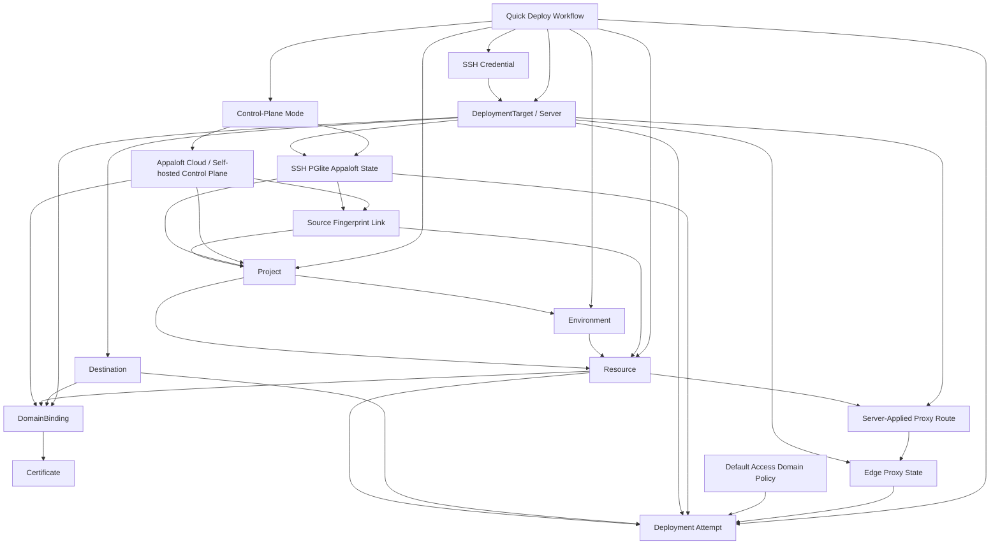

# Business Operation Map

> CORE DOCUMENT
>
> This file is the human-facing and AI-facing source of truth for how Appaloft commands, queries,
> workflows, events, read models, and implementation plans relate to each other.
>
> [DOMAIN_MODEL.md](/Users/nichenqin/projects/appaloft/docs/DOMAIN_MODEL.md) defines the domain
> boundaries and aggregate language.
>
> [CORE_OPERATIONS.md](/Users/nichenqin/projects/appaloft/docs/CORE_OPERATIONS.md) defines the public
> command/query catalog and must stay mirrored by
> [operation-catalog.ts](/Users/nichenqin/projects/appaloft/packages/application/src/operation-catalog.ts).
>
> This file defines where a behavior sits before agents write ADRs, local specs, tests, or code.

## Normative Contract

Every business behavior must be positioned in this map before it enters implementation.

If a requested behavior is already listed as an active command, query, workflow, or accepted
candidate here, agents must start from the linked ADRs and specs before changing code.

If a requested behavior is not listed here, agents must add or update this map in a Spec Round
before creating local command/event/workflow/error/testing specs or implementation code.

If a requested behavior is listed as future, deferred, removed, or rebuild-required, agents must not
implement it directly. They must first create or update the governing ADR, then add local specs,
then create an implementation plan, then enter Code Round.

Generic aggregate-root update operations are not valid business behavior positions. Per
[ADR-026: Aggregate Mutation Command Boundary](./decisions/ADR-026-aggregate-mutation-command-boundary.md),
each aggregate mutation must be positioned under an intention-revealing command or workflow such as
`rename`, `configure-*`, `set-*`, `unset-*`, `archive`, `confirm-*`, or another domain verb accepted
by its governing spec. If the only proposed name is `{aggregate}.update`, the behavior is not ready
for local specs or implementation.

## Governing Source Order

Read these files in order before changing a behavior:

1. [Decision Records](./decisions/README.md) and relevant ADRs.
2. [Business Operation Map](./BUSINESS_OPERATION_MAP.md).
3. [Core Operations](./CORE_OPERATIONS.md).
4. [Domain Model](./DOMAIN_MODEL.md).
5. Global contracts:
   - [Error Model](./errors/model.md)
   - [neverthrow Conventions](./errors/neverthrow-conventions.md)
   - [Async Lifecycle And Acceptance](./architecture/async-lifecycle-and-acceptance.md)
6. Local command, query, event, workflow, error, testing, and implementation-plan docs.

`docs/ai/**` is background analysis only and cannot override this map.

## Operation State Terms

| State | Meaning |
| --- | --- |
| Active command | Public write operation in the v1 business surface. Must appear in `CORE_OPERATIONS.md` and `operation-catalog.ts`. |
| Active query | Public read operation in the v1 business surface. Must appear in `CORE_OPERATIONS.md` and `operation-catalog.ts` when it is business-facing. |
| Workflow | Entry flow, UX flow, or process flow that sequences explicit operations. It is not itself a command unless a later ADR says so. |
| Accepted candidate | Command/query boundary is accepted by ADR or spec, but implementation may still be incomplete. Must not be exposed as active until catalog/API/CLI/Web/tests are aligned. |
| Rebuild-required | Previously implemented or expected behavior that is not part of the current public surface. It must restart at ADR/spec/plan before code. |
| Internal capability | Core/runtime/persistence mechanism that may support future behavior but is not exposed as a public business operation. |

## V1 Minimum Loop

The v1 loop is the first-class closure path. New behavior should be prioritized by whether it
improves this loop.

```text
create/select project
  -> create/select environment
  -> create/select deployment target/server
  -> create/configure credential when needed
  -> create/select resource with source/runtime/network profile
  -> deployments.create
  -> observe deployment progress, status, logs, and generated or server-applied access route when policy allows it
  -> observe current resource health and access/proxy state
  -> observe resource runtime logs when an application instance is running
  -> copy resource diagnostic summary when access, logs, or proxy state need support/debug context
  -> optionally domain-bindings.create
  -> optionally certificates.issue-or-renew
  -> observe domain readiness
```

Quick Deploy, CLI interactive deploy, and repository config driven headless deploys are workflow
entrypoints over this loop. A source-adjacent Appaloft config file is the non-interactive profile
expression of the same Quick Deploy draft normalization, not a separate deployment command or a
shortcut around the explicit operations.

For pure CLI and GitHub Actions deployments to an SSH server, Appaloft state is durable on that SSH
server by default through the `ssh-pglite` backend governed by
[ADR-024](./decisions/ADR-024-pure-cli-ssh-state-and-server-applied-domains.md). A config file may
declare provider-neutral server-applied domain intent for the target's edge proxy; this is
server-local route desired/applied state in pure CLI mode and is distinct from managed
`DomainBinding` lifecycle state. The same route intent may include canonical redirects such as
`www.example.com -> example.com`; those redirects remain edge-proxy route behavior, not deployment
input and not proof of managed domain ownership.

Control-plane mode selection is an entry-workflow concern governed by
[ADR-025](./decisions/ADR-025-control-plane-modes-and-action-execution.md). Execution owner and
state/control-plane owner are separate dimensions: GitHub Actions may remain the execution owner
when Appaloft Cloud or a self-hosted Appaloft server owns state, and pure CLI/GitHub Actions with
`controlPlane.mode = none` remains a durable product line. Repository config may select connection
policy such as `none`, `auto`, `cloud`, or `self-hosted`, but it must not select project, resource,
server, destination, credential, organization, or tenant identity.

## Relationship Diagram



## Active Command And Query Surface

### Workspace

| Behavior | Type | Operation | Owner | Main relationship | Governing docs |
| --- | --- | --- | --- | --- | --- |
| Create project | Command | `projects.create` | Project | Starts a resource collection boundary. | [Core Operations](./CORE_OPERATIONS.md) |
| List projects | Query | `projects.list` | Project read model | Lets workflows select existing project context. | [Core Operations](./CORE_OPERATIONS.md) |
| Show project | Active query | `projects.show` | Project read model | Reads one project identity and lifecycle surface before resource selection. | [projects.show](./queries/projects.show.md), [Project Lifecycle](./workflows/project-lifecycle.md), [ADR-013](./decisions/ADR-013-project-resource-navigation-and-deployment-ownership.md), [ADR-026](./decisions/ADR-026-aggregate-mutation-command-boundary.md) |
| Rename project | Active command | `projects.rename` | Project | Changes only project display name and derived slug. | [projects.rename](./commands/projects.rename.md), [Project Lifecycle](./workflows/project-lifecycle.md), [project-renamed](./events/project-renamed.md), [ADR-026](./decisions/ADR-026-aggregate-mutation-command-boundary.md) |
| Archive project | Active command | `projects.archive` | Project | Retires a project from new project-scoped mutations while retaining child history/read access. | [projects.archive](./commands/projects.archive.md), [Project Lifecycle](./workflows/project-lifecycle.md), [project-archived](./events/project-archived.md), [ADR-013](./decisions/ADR-013-project-resource-navigation-and-deployment-ownership.md), [ADR-026](./decisions/ADR-026-aggregate-mutation-command-boundary.md) |
| Create environment | Command | `environments.create` | Environment | Creates deployment/config scope inside a project. | [Core Operations](./CORE_OPERATIONS.md) |
| List environments | Query | `environments.list` | Environment read model | Lets workflows select environment context. | [Core Operations](./CORE_OPERATIONS.md) |
| Show environment | Query | `environments.show` | Environment read model | Exposes config context for one environment. | [Core Operations](./CORE_OPERATIONS.md) |
| Set environment variable | Command | `environments.set-variable` | Environment | Mutates environment config before deployment snapshot. | [Core Operations](./CORE_OPERATIONS.md) |
| Unset environment variable | Command | `environments.unset-variable` | Environment | Removes environment config before deployment snapshot. | [Core Operations](./CORE_OPERATIONS.md) |
| Read environment effective precedence | Active query | `environments.effective-precedence` | Environment configuration read model | Exposes masked environment-owned variables and the environment-level effective value for each `key + exposure` identity before resource overrides or deployment snapshots apply. | [environments.effective-precedence](./queries/environments.effective-precedence.md), [Environment Effective Precedence Test Matrix](./testing/environment-effective-precedence-test-matrix.md), [ADR-012](./decisions/ADR-012-resource-runtime-profile-and-deployment-snapshot-boundary.md) |
| Diff environments | Query | `environments.diff` | Environment read model | Compares configuration scopes. | [Core Operations](./CORE_OPERATIONS.md) |
| Promote environment | Command | `environments.promote` | Environment | Creates a promoted environment state. | [Core Operations](./CORE_OPERATIONS.md) |
| Archive environment | Active command | `environments.archive` | Environment | Retires an environment from new configuration writes, resource creation, and deployment admission while retaining environment/resource/deployment history. | [environments.archive](./commands/environments.archive.md), [Environment Lifecycle](./workflows/environment-lifecycle.md), [environment-archived](./events/environment-archived.md), [Environment Lifecycle Test Matrix](./testing/environment-lifecycle-test-matrix.md), [ADR-026](./decisions/ADR-026-aggregate-mutation-command-boundary.md) |

### Deployment Target And Credential

| Behavior | Type | Operation | Owner | Main relationship | Governing docs |
| --- | --- | --- | --- | --- | --- |
| Register deployment target | Command | `servers.register` | DeploymentTarget | Creates target/server metadata and proxy intent. | [Server Bootstrap Workflow](./workflows/server-bootstrap-and-proxy.md), [ADR-003](./decisions/ADR-003-server-connect-public-vs-internal.md), [ADR-004](./decisions/ADR-004-server-readiness-state-storage.md) |
| Configure target credential | Command | `servers.configure-credential` | DeploymentTarget | Attaches credential context to a target. | [Core Operations](./CORE_OPERATIONS.md) |
| Create reusable SSH credential | Command | `credentials.create-ssh` | Credential | Stores reusable target access material. | [Core Operations](./CORE_OPERATIONS.md) |
| List reusable SSH credentials | Query | `credentials.list-ssh` | Credential read model | Lets workflows select existing access material. | [Core Operations](./CORE_OPERATIONS.md) |
| Show reusable SSH credential usage | Active query | `credentials.show` | Credential read model / usage reader | Reads one reusable SSH credential as masked metadata plus safe deployment-target/server usage visibility before rotate or delete decisions. | [credentials.show](./queries/credentials.show.md), [SSH Credential Lifecycle](./workflows/ssh-credential-lifecycle.md), [SSH Credential Lifecycle Error Spec](./errors/credentials.lifecycle.md), [SSH Credential Lifecycle Test Matrix](./testing/ssh-credential-lifecycle-test-matrix.md), [SSH Credential Lifecycle Implementation Plan](./implementation/ssh-credential-lifecycle-plan.md) |
| Delete reusable SSH credential when unused | Active command | `credentials.delete-ssh` | Credential / usage safety reader | Permanently removes a stored reusable SSH private-key credential only after durable active/inactive visible server usage is proven empty. Usage-read failure is not zero usage. | [credentials.delete-ssh](./commands/credentials.delete-ssh.md), [credentials.show](./queries/credentials.show.md), [SSH Credential Lifecycle](./workflows/ssh-credential-lifecycle.md), [SSH Credential Lifecycle Error Spec](./errors/credentials.lifecycle.md), [SSH Credential Lifecycle Test Matrix](./testing/ssh-credential-lifecycle-test-matrix.md), [SSH Credential Lifecycle Implementation Plan](./implementation/ssh-credential-lifecycle-plan.md) |
| Rotate reusable SSH credential | Active command | `credentials.rotate-ssh` | Credential / usage safety reader | Replaces stored reusable SSH private-key material while preserving the credential id and existing server references. Nonzero active/inactive visible server usage is allowed only after explicit usage acknowledgement; rotation success does not prove connectivity. | [credentials.rotate-ssh](./commands/credentials.rotate-ssh.md), [credentials.show](./queries/credentials.show.md), [SSH Credential Lifecycle](./workflows/ssh-credential-lifecycle.md), [SSH Credential Lifecycle Error Spec](./errors/credentials.lifecycle.md), [SSH Credential Lifecycle Test Matrix](./testing/ssh-credential-lifecycle-test-matrix.md), [SSH Credential Lifecycle Implementation Plan](./implementation/ssh-credential-lifecycle-plan.md), [Reusable SSH Credential Rotation Spec](./specs/001-reusable-ssh-credential-rotation/spec.md) |
| List deployment targets | Query | `servers.list` | DeploymentTarget read model | Lets workflows select target/server context. | [Core Operations](./CORE_OPERATIONS.md) |
| Show deployment target | Active query | `servers.show` | DeploymentTarget detail read model | Reads one target/server identity, credential summary, proxy readiness, and deployment/resource/domain rollups without mutating lifecycle state. | [servers.show](./queries/servers.show.md), [Deployment Target Lifecycle](./workflows/deployment-target-lifecycle.md), [Deployment Target Lifecycle Test Matrix](./testing/deployment-target-lifecycle-test-matrix.md), [ADR-004](./decisions/ADR-004-server-readiness-state-storage.md) |
| Rename deployment target | Active command | `servers.rename` | DeploymentTarget | Changes only the operator-facing display name for an active or inactive target/server while preserving server id, host, provider, credential, proxy, lifecycle state, and historical references. | [servers.rename](./commands/servers.rename.md), [server-renamed](./events/server-renamed.md), [Deployment Target Lifecycle](./workflows/deployment-target-lifecycle.md), [Deployment Target Lifecycle Test Matrix](./testing/deployment-target-lifecycle-test-matrix.md), [ADR-004](./decisions/ADR-004-server-readiness-state-storage.md), [ADR-026](./decisions/ADR-026-aggregate-mutation-command-boundary.md) |
| Configure deployment target edge proxy | Active command | `servers.configure-edge-proxy` | DeploymentTarget | Changes only an active target/server's desired edge proxy kind for future proxy-backed route eligibility, without changing identity, host, provider, credential, lifecycle, historical deployment/domain/audit references, or provider-owned artifacts. | [servers.configure-edge-proxy](./commands/servers.configure-edge-proxy.md), [server-edge-proxy-configured](./events/server-edge-proxy-configured.md), [Deployment Target Lifecycle](./workflows/deployment-target-lifecycle.md), [Server Bootstrap And Proxy](./workflows/server-bootstrap-and-proxy.md), [Deployment Target Lifecycle Test Matrix](./testing/deployment-target-lifecycle-test-matrix.md), [ADR-004](./decisions/ADR-004-server-readiness-state-storage.md), [ADR-017](./decisions/ADR-017-default-access-domain-and-proxy-routing.md), [ADR-019](./decisions/ADR-019-edge-proxy-provider-and-observable-configuration.md), [ADR-026](./decisions/ADR-026-aggregate-mutation-command-boundary.md) |
| Deactivate deployment target | Active command | `servers.deactivate` | DeploymentTarget | Marks a target/server inactive so it remains readable but cannot be selected for new deployments, scheduling, or proxy configuration targets. | [servers.deactivate](./commands/servers.deactivate.md), [server-deactivated](./events/server-deactivated.md), [Deployment Target Lifecycle](./workflows/deployment-target-lifecycle.md), [Deployment Target Lifecycle Test Matrix](./testing/deployment-target-lifecycle-test-matrix.md), [ADR-004](./decisions/ADR-004-server-readiness-state-storage.md), [ADR-026](./decisions/ADR-026-aggregate-mutation-command-boundary.md) |
| Check deployment target delete safety | Active query | `servers.delete-check` | DeploymentTarget safety read/query service | Previews whether a deactivated target/server can be deleted and returns typed blocker reasons for retained deployments, resources, domains, certificates, credentials, routes, terminal sessions, logs, audit, or runtime tasks. | [servers.delete-check](./queries/servers.delete-check.md), [Deployment Target Lifecycle](./workflows/deployment-target-lifecycle.md), [Deployment Target Lifecycle Test Matrix](./testing/deployment-target-lifecycle-test-matrix.md), [Deployment Target Lifecycle Error Spec](./errors/servers.lifecycle.md) |
| Delete deployment target | Active command | `servers.delete` | DeploymentTarget | Soft-deletes only an inactive target/server after the shared delete-safety blocker reader proves no retained server-scoped state remains. | [servers.delete](./commands/servers.delete.md), [server-deleted](./events/server-deleted.md), [servers.delete-check](./queries/servers.delete-check.md), [Deployment Target Lifecycle](./workflows/deployment-target-lifecycle.md), [Deployment Target Lifecycle Test Matrix](./testing/deployment-target-lifecycle-test-matrix.md), [Deployment Target Lifecycle Error Spec](./errors/servers.lifecycle.md), [ADR-004](./decisions/ADR-004-server-readiness-state-storage.md), [ADR-026](./decisions/ADR-026-aggregate-mutation-command-boundary.md) |
| Test target connectivity | Command | `servers.test-connectivity` | DeploymentTarget/application service | Validates connectivity and provider-rendered proxy diagnostics for an existing target without mutating lifecycle state. | [Server Bootstrap Workflow](./workflows/server-bootstrap-and-proxy.md) |
| Test draft target connectivity | Command | `servers.test-draft-connectivity` | Application service | Validates credentials before target persistence. | [Server Bootstrap Workflow](./workflows/server-bootstrap-and-proxy.md) |
| Repair target edge proxy | Command | `servers.bootstrap-proxy` | DeploymentTarget proxy lifecycle | Starts a new provider-backed proxy bootstrap attempt for an existing connected/operable target. | [Server Bootstrap Workflow](./workflows/server-bootstrap-and-proxy.md), [server proxy repair plan](./implementation/server-proxy-bootstrap-repair-plan.md) |
| Open server terminal session | Command | `terminal-sessions.open` | TerminalSession/server operator access | Opens an ephemeral interactive shell on a selected deployment target through a terminal gateway port. | [Operator Terminal Session](./workflows/operator-terminal-session.md), [terminal-sessions.open](./commands/terminal-sessions.open.md), [ADR-022](./decisions/ADR-022-operator-terminal-session-boundary.md) |

### Resource And Workload Delivery

| Behavior | Type | Operation | Owner | Main relationship | Governing docs |
| --- | --- | --- | --- | --- | --- |
| Create resource | Command | `resources.create` | Resource | Creates deployable unit with source/runtime/network profile when supplied. | [resources.create](./commands/resources.create.md), [ADR-011](./decisions/ADR-011-resource-create-minimum-lifecycle.md), [ADR-012](./decisions/ADR-012-resource-runtime-profile-and-deployment-snapshot-boundary.md), [ADR-015](./decisions/ADR-015-resource-network-profile.md), [ADR-017](./decisions/ADR-017-default-access-domain-and-proxy-routing.md) |
| Show resource profile | Active query | `resources.show` | Resource detail query service | Reads one resource detail/profile surface without mutating deployment, runtime, route, or lifecycle state. | [resources.show](./queries/resources.show.md), [Resource Profile Lifecycle](./workflows/resource-profile-lifecycle.md), [ADR-012](./decisions/ADR-012-resource-runtime-profile-and-deployment-snapshot-boundary.md), [ADR-013](./decisions/ADR-013-project-resource-navigation-and-deployment-ownership.md), [ADR-015](./decisions/ADR-015-resource-network-profile.md) |
| Configure resource source profile | Active command | `resources.configure-source` | Resource | Changes only the durable `ResourceSourceBinding` used by future deployments and resource profile reads. | [resources.configure-source](./commands/resources.configure-source.md), [Resource Profile Lifecycle](./workflows/resource-profile-lifecycle.md), [ADR-012](./decisions/ADR-012-resource-runtime-profile-and-deployment-snapshot-boundary.md), [ADR-014](./decisions/ADR-014-deployment-admission-uses-resource-profile.md) |
| Configure resource runtime profile | Active command | `resources.configure-runtime` | Resource | Changes only durable runtime planning defaults used by future deployment admission, including reusable install/build/start defaults, strategy-specific paths, and optional runtime naming intent used to derive effective Docker container or Compose project names. Health policy remains `resources.configure-health`. | [resources.configure-runtime](./commands/resources.configure-runtime.md), [Resource Profile Lifecycle](./workflows/resource-profile-lifecycle.md), [ADR-012](./decisions/ADR-012-resource-runtime-profile-and-deployment-snapshot-boundary.md), [ADR-021](./decisions/ADR-021-docker-oci-workload-substrate.md), [ADR-023](./decisions/ADR-023-runtime-orchestration-target-boundary.md) |
| Configure resource network profile | Active command | `resources.configure-network` | Resource | Changes the durable workload endpoint profile used by future deployments and route planning. It does not bind domains or apply proxy routes. | [resources.configure-network](./commands/resources.configure-network.md), [Resource Profile Lifecycle](./workflows/resource-profile-lifecycle.md), [ADR-015](./decisions/ADR-015-resource-network-profile.md), [ADR-017](./decisions/ADR-017-default-access-domain-and-proxy-routing.md) |
| Set resource variable | Active command | `resources.set-variable` | Resource | Stores one resource-scoped runtime or build-time variable override used by future deployment snapshot materialization after environment precedence is resolved. | [resources.set-variable](./commands/resources.set-variable.md), [Resource Profile Lifecycle](./workflows/resource-profile-lifecycle.md), [ADR-012](./decisions/ADR-012-resource-runtime-profile-and-deployment-snapshot-boundary.md) |
| Unset resource variable | Active command | `resources.unset-variable` | Resource | Removes one resource-scoped variable override for future deployment snapshot materialization. | [resources.unset-variable](./commands/resources.unset-variable.md), [Resource Profile Lifecycle](./workflows/resource-profile-lifecycle.md), [ADR-012](./decisions/ADR-012-resource-runtime-profile-and-deployment-snapshot-boundary.md) |
| Archive resource | Active command | `resources.archive` | Resource | Marks a resource unavailable for new profile mutations and deployments while retaining history, diagnostics, logs, and read access. | [resources.archive](./commands/resources.archive.md), [Resource Profile Lifecycle](./workflows/resource-profile-lifecycle.md), [ADR-011](./decisions/ADR-011-resource-create-minimum-lifecycle.md), [ADR-013](./decisions/ADR-013-project-resource-navigation-and-deployment-ownership.md) |
| Delete resource | Active command | `resources.delete` | Resource | Removes only an archived resource from normal active state after slug confirmation and deletion guards prove there is no retained runtime, deployment, route, domain, certificate, source-link, dependency, terminal, log, or audit blocker. | [resources.delete](./commands/resources.delete.md), [Resource Profile Lifecycle](./workflows/resource-profile-lifecycle.md), [ADR-011](./decisions/ADR-011-resource-create-minimum-lifecycle.md), [ADR-013](./decisions/ADR-013-project-resource-navigation-and-deployment-ownership.md) |
| First-class static site deployment | Accepted candidate workflow | `resources.create -> deployments.create` | Resource / Deployment attempt | Creates or selects a `static-site` resource with source, `RuntimePlanStrategy = static`, static publish directory, and network profile, then deploys it as a Docker/OCI static-server artifact. | [resources.create](./commands/resources.create.md), [deployments.create](./commands/deployments.create.md), [Resource Create And First Deploy](./workflows/resources.create-and-first-deploy.md), [Quick Deploy](./workflows/quick-deploy.md), [ADR-012](./decisions/ADR-012-resource-runtime-profile-and-deployment-snapshot-boundary.md), [ADR-014](./decisions/ADR-014-deployment-admission-uses-resource-profile.md), [ADR-015](./decisions/ADR-015-resource-network-profile.md), [ADR-017](./decisions/ADR-017-default-access-domain-and-proxy-routing.md), [ADR-021](./decisions/ADR-021-docker-oci-workload-substrate.md), [ADR-023](./decisions/ADR-023-runtime-orchestration-target-boundary.md), [ADR-031](./decisions/ADR-031-static-server-routing-policy.md), [Static Site Deployment Plan](./implementation/static-site-deployment-plan.md) |
| Detect workload framework and resolve planner | Internal capability | no public operation | Resource profile / workload planning | Inspects normalized source evidence, selects a framework/runtime planner, and resolves base image plus install/build/start/package steps into a Docker/OCI artifact intent without adding deployment command fields. | [Workload Framework Detection And Planning](./workflows/workload-framework-detection-and-planning.md), [Workload Framework Detection And Planning Test Matrix](./testing/workload-framework-detection-and-planning-test-matrix.md), [Deployment Runtime Substrate Plan](./implementation/deployment-runtime-substrate-plan.md), [ADR-012](./decisions/ADR-012-resource-runtime-profile-and-deployment-snapshot-boundary.md), [ADR-021](./decisions/ADR-021-docker-oci-workload-substrate.md), [ADR-023](./decisions/ADR-023-runtime-orchestration-target-boundary.md) |
| Configure resource health policy | Command | `resources.configure-health` | Resource | Mutates the resource-owned reusable health policy consumed by future deployments and current `resources.health` observation. | [resources.configure-health](./commands/resources.configure-health.md), [resource-health-policy-configured](./events/resource-health-policy-configured.md), [ADR-020](./decisions/ADR-020-resource-health-observation.md), [resources.health](./queries/resources.health.md), [Resource Health Observation](./workflows/resource-health-observation.md), [Resource Health Test Matrix](./testing/resource-health-test-matrix.md) |
| List resources | Query | `resources.list` | Resource read model | Lets workflows select deployable units and lets project pages show resources. | [Project Resource Console](./workflows/project-resource-console.md), [ADR-013](./decisions/ADR-013-project-resource-navigation-and-deployment-ownership.md) |
| Read resource runtime logs | Active query | `resources.runtime-logs` | Resource runtime observation | Tails or streams application stdout/stderr for a resource-owned runtime instance through an injected runtime log reader port. | [resources.runtime-logs](./queries/resources.runtime-logs.md), [Resource Runtime Log Observation](./workflows/resource-runtime-log-observation.md), [ADR-018](./decisions/ADR-018-resource-runtime-log-observation.md) |
| Read resource effective configuration | Active query | `resources.effective-config` | Resource configuration read model | Returns resource-owned variables plus the masked effective deployment snapshot view after environment and resource precedence are resolved. | [resources.effective-config](./queries/resources.effective-config.md), [Resource Profile Lifecycle](./workflows/resource-profile-lifecycle.md), [ADR-012](./decisions/ADR-012-resource-runtime-profile-and-deployment-snapshot-boundary.md) |
| Preview resource proxy configuration | Active query | `resources.proxy-configuration.preview` | Resource access/runtime topology read model | Shows read-only provider-rendered proxy configuration for planned, latest, or deployment-snapshot resource routes. | [resources.proxy-configuration.preview](./queries/resources.proxy-configuration.preview.md), [ADR-019](./decisions/ADR-019-edge-proxy-provider-and-observable-configuration.md), [Edge Proxy Provider And Route Realization](./workflows/edge-proxy-provider-and-route-realization.md) |
| Read resource diagnostic summary | Active query | `resources.diagnostic-summary` | Resource observation/read model | Produces a copyable support/debug payload with stable ids, deployment/access/proxy/log statuses, source errors, and safe local/system context when access or logs are missing. | [resources.diagnostic-summary](./queries/resources.diagnostic-summary.md), [Resource Diagnostic Summary](./workflows/resource-diagnostic-summary.md), [Resource Diagnostic Summary Test Matrix](./testing/resource-diagnostic-summary-test-matrix.md), [Resource Diagnostic Summary Implementation Plan](./implementation/resource-diagnostic-summary-plan.md) |
| Read resource health | Active query | `resources.health` | Resource health observation | Produces the current resource health summary from latest deployment/runtime context, configured health policy, proxy route, and public access observations. | [ADR-020](./decisions/ADR-020-resource-health-observation.md), [resources.health](./queries/resources.health.md), [Resource Health Observation](./workflows/resource-health-observation.md), [Resource Health Test Matrix](./testing/resource-health-test-matrix.md), [Resource Health Implementation Plan](./implementation/resource-health-plan.md) |
| Render resource access failure diagnostic | Internal transport/read workflow | no public operation | Resource access observation / edge adapter | Classifies gateway-generated public access failures with stable Appaloft codes and renders safe HTML or problem responses without mutating resource, deployment, proxy, or health state. | [Resource Access Failure Diagnostics](./workflows/resource-access-failure-diagnostics.md), [Resource Access Failure Diagnostics Error Spec](./errors/resource-access-failure-diagnostics.md), [Resource Access Failure Diagnostics Test Matrix](./testing/resource-access-failure-diagnostics-test-matrix.md), [ADR-019](./decisions/ADR-019-edge-proxy-provider-and-observable-configuration.md) |
| Open resource terminal session | Command | `terminal-sessions.open` | TerminalSession/resource operator access | Opens an ephemeral interactive shell on the resource's selected or latest deployment target, starting in the resolved deployment workspace directory. | [Operator Terminal Session](./workflows/operator-terminal-session.md), [terminal-sessions.open](./commands/terminal-sessions.open.md), [Operator Terminal Session Test Matrix](./testing/operator-terminal-session-test-matrix.md), [ADR-022](./decisions/ADR-022-operator-terminal-session-boundary.md) |
| Relink source fingerprint | Active command | `source-links.relink` | Source link application state | Explicitly moves a normalized source fingerprint to a selected project/environment/resource/server context so future config deploys reuse the intended identity. PG/PGlite persistence makes this state durable and visible to `resources.delete` source-link blockers without adding a new operation. | [source-links.relink](./commands/source-links.relink.md), [ADR-024](./decisions/ADR-024-pure-cli-ssh-state-and-server-applied-domains.md), [ADR-028](./decisions/ADR-028-command-coordination-scope-and-mutation-admission.md), [Repository Deployment Config File Bootstrap](./workflows/deployment-config-file-bootstrap.md), [Source Link State Test Matrix](./testing/source-link-state-test-matrix.md), [Source Link Durable Persistence Plan](./implementation/source-link-durable-persistence-plan.md) |

### Deployment

| Behavior | Type | Operation | Owner | Main relationship | Governing docs |
| --- | --- | --- | --- | --- | --- |
| Create deployment | Command | `deployments.create` | Deployment attempt | Accepts an attempt for an existing project/environment/resource/server/destination context, coordinates admission at the resource-runtime scope, may supersede one previous same-resource active attempt through internal cancellation plus durable write fencing, and resolves the accepted request to an OCI-backed workload plan plus runtime orchestration target backend. | [deployments.create](./commands/deployments.create.md), [ADR-001](./decisions/ADR-001-deploy-api-required-fields.md), [ADR-014](./decisions/ADR-014-deployment-admission-uses-resource-profile.md), [ADR-015](./decisions/ADR-015-resource-network-profile.md), [ADR-016](./decisions/ADR-016-deployment-command-surface-reset.md), [ADR-017](./decisions/ADR-017-default-access-domain-and-proxy-routing.md), [ADR-021](./decisions/ADR-021-docker-oci-workload-substrate.md), [ADR-023](./decisions/ADR-023-runtime-orchestration-target-boundary.md), [ADR-027](./decisions/ADR-027-deployment-supersede-and-execution-fencing.md), [ADR-028](./decisions/ADR-028-command-coordination-scope-and-mutation-admission.md) |
| Cleanup preview deployment | Command | `deployments.cleanup-preview` | Preview deployment maintenance | Stops preview-scoped runtime state for the linked preview and any stale deployments still carrying the same preview fingerprint, coordinates cleanup at the preview-lifecycle scope, removes preview-owned inert runtime artifacts and materialized workspaces when ownership can be proven, removes preview route desired state, and unlinks preview source identity without deleting resource or deployment history. | [deployments.cleanup-preview](./commands/deployments.cleanup-preview.md), [GitHub Action PR Preview Deploy](./workflows/github-action-pr-preview-deploy.md), [deployments.cleanup-preview Test Matrix](./testing/deployments.cleanup-preview-test-matrix.md), [ADR-016](./decisions/ADR-016-deployment-command-surface-reset.md), [ADR-024](./decisions/ADR-024-pure-cli-ssh-state-and-server-applied-domains.md), [ADR-025](./decisions/ADR-025-control-plane-modes-and-action-execution.md), [ADR-028](./decisions/ADR-028-command-coordination-scope-and-mutation-admission.md) |
| Coordinate mutation admission by logical scope | Internal capability | no public operation | Shared mutation admission | Distinguishes low-level state-root coordination from operation-level coordination, resolves command policy and scope, and delegates bounded waiting, serialization, or supersede behavior to the selected backend/provider implementation. | [ADR-028](./decisions/ADR-028-command-coordination-scope-and-mutation-admission.md), [deployments.create](./commands/deployments.create.md), [deployments.cleanup-preview](./commands/deployments.cleanup-preview.md), [source-links.relink](./commands/source-links.relink.md), [Repository Deployment Config File Bootstrap](./workflows/deployment-config-file-bootstrap.md), [Mutation Coordination Implementation Plan](./implementation/mutation-coordination-plan.md) |
| Resolve and execute runtime orchestration target | Internal capability | no public operation | Release orchestration / runtime topology | Selects and invokes the runtime target backend for the accepted deployment snapshot. Active v1 backend is single-server Docker/Compose; Docker Swarm is the first required cluster backend on the path to `1.0.0`, and Kubernetes remains a later backend behind the same deployment command. | [ADR-023](./decisions/ADR-023-runtime-orchestration-target-boundary.md), [Deployment Runtime Target Abstraction](./workflows/deployment-runtime-target-abstraction.md), [Runtime Target Abstraction Implementation Plan](./implementation/runtime-target-abstraction-plan.md) |
| List deployments | Query | `deployments.list` | Deployment read model | Observes deployment attempts across project/resource filters. | [Core Operations](./CORE_OPERATIONS.md) |
| Show deployment detail | Query | `deployments.show` | Deployment detail read model | Reads one deployment attempt as immutable attempt context plus current derived observation state without reintroducing redeploy, rollback, or deployment-owned resource health. | [deployments.show](./queries/deployments.show.md), [Deployment Detail And Observation](./workflows/deployment-detail-and-observation.md), [Deployment Detail Error Spec](./errors/deployments.show.md), [Deployment Detail Test Matrix](./testing/deployments.show-test-matrix.md), [Deployment Detail Implementation Plan](./implementation/deployments.show-plan.md), [ADR-013](./decisions/ADR-013-project-resource-navigation-and-deployment-ownership.md), [ADR-016](./decisions/ADR-016-deployment-command-surface-reset.md) |
| Stream deployment events | Active query | `deployments.stream-events` | Deployment event observation read model | Replays and optionally follows one accepted deployment attempt's ordered lifecycle/progress event envelopes so observation can continue after initial command acceptance without reintroducing `deployments.reattach` as a write command. | [deployments.stream-events](./queries/deployments.stream-events.md), [Deployment Event Stream Error Spec](./errors/deployments.stream-events.md), [Deployment Event Stream Test Matrix](./testing/deployments.stream-events-test-matrix.md), [Deployment Event Stream Implementation Plan](./implementation/deployments.stream-events-plan.md), [Deployment Detail And Observation](./workflows/deployment-detail-and-observation.md), [ADR-029](./decisions/ADR-029-deployment-event-stream-and-recovery-boundary.md) |
| Read deployment logs | Query | `deployments.logs` | Deployment read model/log projection | Observes logs for one deployment attempt. | [Core Operations](./CORE_OPERATIONS.md) |
| Deployment progress stream | Transport observation | tied to `deployments.create` | Deployment progress projection | Shows progress for accepted deployment creation. Not a separate business command. | [Quick Deploy Workflow](./workflows/quick-deploy.md), [ADR-016](./decisions/ADR-016-deployment-command-surface-reset.md) |

### Routing, Domain, And TLS

| Behavior | Type | Operation | Owner | Main relationship | Governing docs |
| --- | --- | --- | --- | --- | --- |
| Create domain binding | Command | `domain-bindings.create` | DomainBinding | Creates durable domain ownership/routing lifecycle for a resource/destination/target, optionally as a canonical redirect alias to an existing served binding, and records initial DNS observation expectations. | [domain-bindings.create](./commands/domain-bindings.create.md), [Routing Domain TLS Workflow](./workflows/routing-domain-and-tls.md), [ADR-002](./decisions/ADR-002-routing-domain-tls-boundary.md), [ADR-005](./decisions/ADR-005-domain-binding-owner-scope.md), [ADR-006](./decisions/ADR-006-domain-verification-strategy.md) |
| Confirm domain binding ownership | Command | `domain-bindings.confirm-ownership` | DomainBinding verification attempt | Confirms the current verification attempt for an accepted binding. Default mode verifies public DNS evidence before publishing `domain-bound`; explicit manual mode is an operator/trusted-automation override. TLS-disabled bindings may then progress to `domain-ready` through the domain-ready process manager. | [domain-bindings.confirm-ownership](./commands/domain-bindings.confirm-ownership.md), [Routing Domain TLS Workflow](./workflows/routing-domain-and-tls.md), [ADR-006](./decisions/ADR-006-domain-verification-strategy.md) |
| List domain bindings | Query | `domain-bindings.list` | DomainBinding read model | Observes accepted domain binding records, DNS observation, verification state, and ready/not-ready lifecycle state. | [Routing Domain TLS Workflow](./workflows/routing-domain-and-tls.md) |
| Issue or renew certificate | Command | `certificates.issue-or-renew` | Certificate lifecycle | Requests provider-managed certificate issuance/renewal after domain ownership context exists. | [certificates.issue-or-renew](./commands/certificates.issue-or-renew.md), [ADR-007](./decisions/ADR-007-certificate-provider-and-challenge-default.md), [ADR-008](./decisions/ADR-008-renewal-trigger-model.md) |
| List certificates | Query | `certificates.list` | Certificate read model | Observes certificate state and latest issuance/renewal attempts for domain bindings. | [certificates.issue-or-renew](./commands/certificates.issue-or-renew.md), [Routing Domain TLS Workflow](./workflows/routing-domain-and-tls.md), [ADR-007](./decisions/ADR-007-certificate-provider-and-challenge-default.md) |
| Import certificate | Command | `certificates.import` | Certificate lifecycle | Imports operator-supplied certificate/key material for a durably owned manual-policy binding through a separate security boundary, persists secret material through the certificate secret-store boundary, publishes `certificate-imported`, and never reuses `certificate-issued`. | [ADR-009](./decisions/ADR-009-certificates-import-command.md), [certificates.import](./commands/certificates.import.md), [certificate-imported](./events/certificate-imported.md), [certificates.import test matrix](./testing/certificates.import-test-matrix.md), [Routing Domain TLS Workflow](./workflows/routing-domain-and-tls.md), [Routing Domain TLS Errors](./errors/routing-domain-tls.md), [certificates.import plan](./implementation/certificates.import-plan.md) |
| Serve HTTP challenge token | Internal capability | no public operation | Certificate provider / HTTP adapter | Serves provider-published HTTP-01 challenge token responses for certificate validation. | [ADR-007](./decisions/ADR-007-certificate-provider-and-challenge-default.md), [Routing Domain TLS Workflow](./workflows/routing-domain-and-tls.md), [Routing Domain TLS Test Matrix](./testing/routing-domain-and-tls-test-matrix.md) |
| Run certificate retry scheduler | Internal capability | no public operation | Certificate lifecycle process manager | Scans durable retry-scheduled certificate attempts and dispatches `certificates.issue-or-renew` to create new attempts when due. | [ADR-008](./decisions/ADR-008-renewal-trigger-model.md), [Routing Domain TLS Workflow](./workflows/routing-domain-and-tls.md), [Routing Domain TLS Test Matrix](./testing/routing-domain-and-tls-test-matrix.md) |
| Record domain route realization failure | Internal capability | no public operation | Domain binding route readiness process manager | Consumes route/deployment failure facts, marks affected active domain bindings `not_ready`, and publishes `domain-route-realization-failed`. | [ADR-019](./decisions/ADR-019-edge-proxy-provider-and-observable-configuration.md), [Routing Domain TLS Workflow](./workflows/routing-domain-and-tls.md), [domain-route-realization-failed](./events/domain-route-realization-failed.md) |
| Configure default access domain policy | Active command | `default-access-domain-policies.configure` | Default access policy | Configures provider-neutral generated access domain policy for system default or deployment-target override without rewriting existing deployment route snapshots. | [default-access-domain-policies.configure](./commands/default-access-domain-policies.configure.md), [ADR-017](./decisions/ADR-017-default-access-domain-and-proxy-routing.md), [Default Access Domain And Proxy Routing](./workflows/default-access-domain-and-proxy-routing.md) |
| List default access domain policies | Active query | `default-access-domain-policies.list` | Default access policy readback | Lists persisted provider-neutral default access policy records without resolving generated hostnames or static fallback config. | [default-access-domain-policies.list](./queries/default-access-domain-policies.list.md), [ADR-017](./decisions/ADR-017-default-access-domain-and-proxy-routing.md), [Default Access Domain And Proxy Routing](./workflows/default-access-domain-and-proxy-routing.md), [Default Access Policy Readback](./specs/004-default-access-policy-readback/spec.md) |
| Show default access domain policy | Active query | `default-access-domain-policies.show` | Default access policy readback | Reads one system or deployment-target policy scope, returning `policy = null` when no durable policy exists. | [default-access-domain-policies.show](./queries/default-access-domain-policies.show.md), [ADR-017](./decisions/ADR-017-default-access-domain-and-proxy-routing.md), [Default Access Domain And Proxy Routing](./workflows/default-access-domain-and-proxy-routing.md), [Default Access Policy Readback](./specs/004-default-access-policy-readback/spec.md) |
| Resolve generated access route | Internal capability | no public operation | Resource access/runtime topology | Resolves provider-neutral generated access hostnames from resource, server, proxy readiness, and policy state. | [ADR-017](./decisions/ADR-017-default-access-domain-and-proxy-routing.md), [Default Access Domain And Proxy Routing](./workflows/default-access-domain-and-proxy-routing.md) |
| Realize edge proxy route | Internal capability | no public operation | Edge proxy provider/runtime topology | Converts route snapshots, generated access routes, durable domain routes, and SSH-mode server-applied config domain routes, including canonical redirect aliases, into provider-produced proxy ensure/route/reload plans and executes them idempotently. PG/PGlite persistence for server-applied route desired/applied state is an internal persistence slice under this capability, not a new public operation. | [ADR-019](./decisions/ADR-019-edge-proxy-provider-and-observable-configuration.md), [ADR-024](./decisions/ADR-024-pure-cli-ssh-state-and-server-applied-domains.md), [Edge Proxy Provider And Route Realization](./workflows/edge-proxy-provider-and-route-realization.md), [Server-Applied Route Durable Persistence Plan](./implementation/server-applied-route-durable-persistence-plan.md) |

### System

| Behavior | Type | Operation | Owner | Main relationship | Governing docs |
| --- | --- | --- | --- | --- | --- |
| List providers | Query | `system.providers.list` | Provider registry | Exposes provider capabilities. | [Core Operations](./CORE_OPERATIONS.md) |
| List plugins | Query | `system.plugins.list` | Plugin registry | Exposes plugin capabilities. | [Core Operations](./CORE_OPERATIONS.md) |
| List GitHub repositories | Query | `system.github-repositories.list` | Integration read adapter | Lets source selection choose GitHub repositories. | [Core Operations](./CORE_OPERATIONS.md) |
| Doctor diagnostics | Query | `system.doctor` | Application/system diagnostics | Diagnoses local installation health. | [Core Operations](./CORE_OPERATIONS.md) |
| Database status | Query | `system.db-status` | Persistence/system diagnostics | Observes database migration state. | [Core Operations](./CORE_OPERATIONS.md) |
| Database migrate | Command | `system.db-migrate` | Persistence/system operation | Applies schema migration. | [Core Operations](./CORE_OPERATIONS.md) |

## Workflow Map

Workflows coordinate commands and queries. They do not own aggregate invariants.

| Workflow | Type | Operation sequence | Final business operation | Governing docs |
| --- | --- | --- | --- | --- |
| Quick Deploy | Entry workflow | Select/create project, server, credential, environment, resource, optional config/profile defaults, and optional variable, then deploy through the Docker/OCI-backed workload substrate and selected runtime target backend. Optional custom domains become server-applied proxy routes in SSH CLI mode or managed routing/domain/TLS follow-up work in control-plane mode; they are not deployment admission fields. | `deployments.create` | [Quick Deploy](./workflows/quick-deploy.md), [ADR-010](./decisions/ADR-010-quick-deploy-workflow-boundary.md), [ADR-021](./decisions/ADR-021-docker-oci-workload-substrate.md), [ADR-023](./decisions/ADR-023-runtime-orchestration-target-boundary.md), [ADR-024](./decisions/ADR-024-pure-cli-ssh-state-and-server-applied-domains.md) |
| Repository deployment config file bootstrap | Entry workflow | Non-interactive Quick Deploy profile input: discover and validate a source-adjacent Appaloft config profile, resolve project/resource/server identity outside the committed file, apply profile fields through explicit resource/environment commands when needed, resolve `access.domains[]` as server-applied proxy routes for SSH CLI mode or managed domain intent for control-plane mode, perform backend state-root preparation plus logical command coordination as required, then deploy with ids only. | `deployments.create` | [Repository Deployment Config File Bootstrap](./workflows/deployment-config-file-bootstrap.md), [Deployment Config File Test Matrix](./testing/deployment-config-file-test-matrix.md), [Deployment Config File Plan](./implementation/deployment-config-file-plan.md), [Pure CLI SSH State And Domains Roadmap](./implementation/pure-cli-ssh-state-and-domains-roadmap.md), [Quick Deploy](./workflows/quick-deploy.md), [ADR-010](./decisions/ADR-010-quick-deploy-workflow-boundary.md), [ADR-012](./decisions/ADR-012-resource-runtime-profile-and-deployment-snapshot-boundary.md), [ADR-014](./decisions/ADR-014-deployment-admission-uses-resource-profile.md), [ADR-024](./decisions/ADR-024-pure-cli-ssh-state-and-server-applied-domains.md), [ADR-028](./decisions/ADR-028-command-coordination-scope-and-mutation-admission.md) |
| Headless CI deploy from repository config | Entry workflow | Headless Quick Deploy executor: CI runner invokes the Appaloft binary directly or through the thin `appaloft/deploy-action` install wrapper, resolves control-plane mode before state/identity work, resolves the SSH target, uses SSH-server PGlite state by default unless local-only or control-plane state is explicitly selected, resolves `ci-env:` secret references from runner environment variables, applies environment variables through `environments.set-variable`, applies config domains through the target edge proxy when declared, and coordinates mutation admission by logical scope before dispatching ids-only commands. GitHub Actions may remain execution owner even when Cloud or self-hosted Appaloft owns state. | `deployments.create` | [Repository Deployment Config File Bootstrap](./workflows/deployment-config-file-bootstrap.md), [Control-Plane Mode Selection And Adoption](./workflows/control-plane-mode-selection-and-adoption.md), [Deployment Config File Test Matrix](./testing/deployment-config-file-test-matrix.md), [Control-Plane Modes Test Matrix](./testing/control-plane-modes-test-matrix.md), [Deployment Config File Plan](./implementation/deployment-config-file-plan.md), [GitHub Action Deploy Wrapper Plan](./implementation/github-action-deploy-action-plan.md), [Pure CLI SSH State And Domains Roadmap](./implementation/pure-cli-ssh-state-and-domains-roadmap.md), [Control-Plane Modes Roadmap](./implementation/control-plane-modes-roadmap.md), [Quick Deploy](./workflows/quick-deploy.md), [ADR-010](./decisions/ADR-010-quick-deploy-workflow-boundary.md), [ADR-014](./decisions/ADR-014-deployment-admission-uses-resource-profile.md), [ADR-024](./decisions/ADR-024-pure-cli-ssh-state-and-server-applied-domains.md), [ADR-025](./decisions/ADR-025-control-plane-modes-and-action-execution.md), [ADR-028](./decisions/ADR-028-command-coordination-scope-and-mutation-admission.md) |
| GitHub Action PR preview deploy | Entry workflow / accepted candidate | User-authored GitHub Actions workflow subscribes to `pull_request` opened/reopened/synchronize events, runs `appaloft/deploy-action` or the Appaloft CLI with trusted PR context, resolves a preview-scoped source fingerprint and environment/resource identity outside committed config, defaults SSH state to server PGlite, coordinates preview deployment admission by logical resource-runtime scope, derives a preview runtime-name seed in the form `preview-{pr_number}` when preview-specific profile input does not override it, deploys with ids-only `deployments.create`, and emits a generated or custom preview URL when route realization succeeds. | `deployments.create` | [GitHub Action PR Preview Deploy](./workflows/github-action-pr-preview-deploy.md), [Repository Deployment Config File Bootstrap](./workflows/deployment-config-file-bootstrap.md), [GitHub Action Deploy Wrapper Plan](./implementation/github-action-deploy-action-plan.md), [Deployment Config File Test Matrix](./testing/deployment-config-file-test-matrix.md), [ADR-017](./decisions/ADR-017-default-access-domain-and-proxy-routing.md), [ADR-024](./decisions/ADR-024-pure-cli-ssh-state-and-server-applied-domains.md), [ADR-025](./decisions/ADR-025-control-plane-modes-and-action-execution.md), [ADR-028](./decisions/ADR-028-command-coordination-scope-and-mutation-admission.md) |
| GitHub Action PR preview cleanup | Entry workflow / accepted candidate | User-authored GitHub Actions workflow subscribes to `pull_request` closed events, runs the Appaloft CLI or thin wrapper with trusted PR context, derives the preview-scoped source fingerprint, dispatches `deployments.cleanup-preview` with preview-lifecycle scoped coordination, and may also delete GitHub preview deployment/environment metadata after Appaloft cleanup reports success or already-clean. | `deployments.cleanup-preview` | [GitHub Action PR Preview Deploy](./workflows/github-action-pr-preview-deploy.md), [deployments.cleanup-preview](./commands/deployments.cleanup-preview.md), [deployments.cleanup-preview Test Matrix](./testing/deployments.cleanup-preview-test-matrix.md), [Deployment Config File Test Matrix](./testing/deployment-config-file-test-matrix.md), [ADR-024](./decisions/ADR-024-pure-cli-ssh-state-and-server-applied-domains.md), [ADR-025](./decisions/ADR-025-control-plane-modes-and-action-execution.md), [ADR-028](./decisions/ADR-028-command-coordination-scope-and-mutation-admission.md) |
| Control-plane mode selection and adoption | Entry workflow / accepted candidate | Resolve execution owner and control-plane/state owner from defaults, repository config, env, CLI/action inputs, local login, or future MCP/API input; perform compatibility handshake before mutation when Cloud/self-hosted is selected; explicitly adopt SSH-server PGlite state before changing state ownership; keep backend state-root coordination separate from command-level mutation coordination. | no public operation yet; governs entry workflows before `deployments.create` | [ADR-025](./decisions/ADR-025-control-plane-modes-and-action-execution.md), [ADR-028](./decisions/ADR-028-command-coordination-scope-and-mutation-admission.md), [Control-Plane Mode Selection And Adoption](./workflows/control-plane-mode-selection-and-adoption.md), [Control-Plane Modes Test Matrix](./testing/control-plane-modes-test-matrix.md), [Control-Plane Modes Roadmap](./implementation/control-plane-modes-roadmap.md), [Repository Deployment Config File Bootstrap](./workflows/deployment-config-file-bootstrap.md) |
| Pure CLI SSH state and server-applied domain routing | Entry/runtime workflow | Resolve SSH target and credential from trusted entrypoint inputs, ensure and state-root coordinate remote `ssh-pglite` state, migrate remote state, resolve/create project/environment/server/resource identity from source fingerprint link state or trusted state, normalize config `access.domains[]` into server-applied proxy route desired state, validate canonical redirect aliases, run explicit Quick Deploy operations with logical command coordination, realize proxy route state on the SSH target, and expose route/redirect status through resource/proxy read models. | `deployments.create` plus proxy route realization state | [ADR-024](./decisions/ADR-024-pure-cli-ssh-state-and-server-applied-domains.md), [ADR-028](./decisions/ADR-028-command-coordination-scope-and-mutation-admission.md), [Repository Deployment Config File Bootstrap](./workflows/deployment-config-file-bootstrap.md), [Quick Deploy](./workflows/quick-deploy.md), [source-links.relink](./commands/source-links.relink.md), [Source Link State Test Matrix](./testing/source-link-state-test-matrix.md), [Edge Proxy Provider And Route Realization](./workflows/edge-proxy-provider-and-route-realization.md), [Deployment Config File Test Matrix](./testing/deployment-config-file-test-matrix.md), [Quick Deploy Test Matrix](./testing/quick-deploy-test-matrix.md), [Edge Proxy Provider And Route Configuration Test Matrix](./testing/edge-proxy-provider-and-route-configuration-test-matrix.md), [Pure CLI SSH State And Domains Roadmap](./implementation/pure-cli-ssh-state-and-domains-roadmap.md), [Server-Applied Route Durable Persistence Plan](./implementation/server-applied-route-durable-persistence-plan.md) |
| Resource create and first deploy | Entry workflow | `resources.create -> deployments.create` after context selection. | `deployments.create` | [Resource Create And First Deploy](./workflows/resources.create-and-first-deploy.md) |
| Static site first deploy | Entry/runtime workflow | Create/select a `static-site` resource with source base directory, static publish directory, optional build commands, and a reverse-proxy HTTP network profile, then deploy as a static-server Docker/OCI artifact. | `deployments.create` | [Static Site Deployment Plan](./implementation/static-site-deployment-plan.md), [Resource Create And First Deploy](./workflows/resources.create-and-first-deploy.md), [Quick Deploy](./workflows/quick-deploy.md), [ADR-012](./decisions/ADR-012-resource-runtime-profile-and-deployment-snapshot-boundary.md), [ADR-015](./decisions/ADR-015-resource-network-profile.md), [ADR-021](./decisions/ADR-021-docker-oci-workload-substrate.md), [ADR-023](./decisions/ADR-023-runtime-orchestration-target-boundary.md), [ADR-031](./decisions/ADR-031-static-server-routing-policy.md) |
| Project lifecycle | UI/API/CLI workflow / active | `projects.show`, `projects.rename`, and `projects.archive` are active. Project archive blocks new project-scoped mutations without cascading child cleanup. | varies by selected operation | [Project Lifecycle](./workflows/project-lifecycle.md), [Project Lifecycle Test Matrix](./testing/project-lifecycle-test-matrix.md), [Project Lifecycle Implementation Plan](./implementation/project-lifecycle-plan.md), [ADR-013](./decisions/ADR-013-project-resource-navigation-and-deployment-ownership.md), [ADR-026](./decisions/ADR-026-aggregate-mutation-command-boundary.md) |
| Resource profile lifecycle | UI/API/CLI workflow / active | `resources.show`, `resources.configure-source`, `resources.configure-runtime`, `resources.configure-network`, `resources.configure-health`, `resources.set-variable`, `resources.unset-variable`, `resources.effective-config`, `resources.archive`, and `resources.delete` are active. Each mutation changes one explicit resource concern at a time. | varies by selected operation | [Resource Profile Lifecycle](./workflows/resource-profile-lifecycle.md), [Resource Profile Lifecycle Test Matrix](./testing/resource-profile-lifecycle-test-matrix.md), [Resource Profile Lifecycle Implementation Plan](./implementation/resource-profile-lifecycle-plan.md), [ADR-012](./decisions/ADR-012-resource-runtime-profile-and-deployment-snapshot-boundary.md), [ADR-013](./decisions/ADR-013-project-resource-navigation-and-deployment-ownership.md), [ADR-015](./decisions/ADR-015-resource-network-profile.md) |
| Deployment target lifecycle | UI/API/CLI workflow / active lifecycle slice | `servers.show`, `servers.rename`, `servers.configure-edge-proxy`, `servers.deactivate`, `servers.delete-check`, and guarded `servers.delete` are active across API/CLI; Web reads server detail and delete-check for lifecycle/delete-safety status and exposes owner-scoped rename and edge-proxy intent actions when the detail surface carries them. | varies by selected operation | [Deployment Target Lifecycle](./workflows/deployment-target-lifecycle.md), [servers.show](./queries/servers.show.md), [servers.rename](./commands/servers.rename.md), [servers.configure-edge-proxy](./commands/servers.configure-edge-proxy.md), [servers.deactivate](./commands/servers.deactivate.md), [servers.delete-check](./queries/servers.delete-check.md), [servers.delete](./commands/servers.delete.md), [server-renamed](./events/server-renamed.md), [server-edge-proxy-configured](./events/server-edge-proxy-configured.md), [server-deleted](./events/server-deleted.md), [Deployment Target Lifecycle Test Matrix](./testing/deployment-target-lifecycle-test-matrix.md), [Deployment Target Lifecycle Implementation Plan](./implementation/deployment-target-lifecycle-plan.md), [ADR-004](./decisions/ADR-004-server-readiness-state-storage.md), [ADR-017](./decisions/ADR-017-default-access-domain-and-proxy-routing.md), [ADR-019](./decisions/ADR-019-edge-proxy-provider-and-observable-configuration.md), [ADR-026](./decisions/ADR-026-aggregate-mutation-command-boundary.md) |
| SSH credential lifecycle | UI/API/CLI workflow / active lifecycle slice | `credentials.show` reads one reusable SSH credential's masked detail and safe server usage summary. `credentials.delete-ssh` deletes only unused stored SSH private-key credentials after the same active/inactive visible usage surface proves zero usage. `credentials.rotate-ssh` replaces stored reusable SSH private-key material in place after usage visibility, exact confirmation, and in-use acknowledgement when required. | varies by selected operation | [SSH Credential Lifecycle](./workflows/ssh-credential-lifecycle.md), [credentials.show](./queries/credentials.show.md), [credentials.delete-ssh](./commands/credentials.delete-ssh.md), [credentials.rotate-ssh](./commands/credentials.rotate-ssh.md), [SSH Credential Lifecycle Error Spec](./errors/credentials.lifecycle.md), [SSH Credential Lifecycle Test Matrix](./testing/ssh-credential-lifecycle-test-matrix.md), [SSH Credential Lifecycle Implementation Plan](./implementation/ssh-credential-lifecycle-plan.md), [Reusable SSH Credential Rotation Spec](./specs/001-reusable-ssh-credential-rotation/spec.md) |
| Workload framework detection and planning | Internal workflow | `ResourceSourceBinding + ResourceRuntimeProfile + ResourceNetworkProfile -> SourceInspectionSnapshot -> framework/runtime planner -> Docker/OCI artifact intent`. | no public operation | [Workload Framework Detection And Planning](./workflows/workload-framework-detection-and-planning.md), [Workload Framework Detection And Planning Test Matrix](./testing/workload-framework-detection-and-planning-test-matrix.md), [Deployment Runtime Substrate Plan](./implementation/deployment-runtime-substrate-plan.md), [ADR-012](./decisions/ADR-012-resource-runtime-profile-and-deployment-snapshot-boundary.md), [ADR-021](./decisions/ADR-021-docker-oci-workload-substrate.md), [ADR-023](./decisions/ADR-023-runtime-orchestration-target-boundary.md) |
| Deployment runtime target abstraction | Internal workflow | `RuntimePlanSnapshot + DeploymentTarget + Destination -> target backend plan/render/apply/observe/cleanup/capacity-diagnose/prune`. Capacity diagnostics, artifact retention, and safe prune behavior are runtime target backend responsibilities, not deployment admission fields. | no public operation | [Deployment Runtime Target Abstraction](./workflows/deployment-runtime-target-abstraction.md), [ADR-023](./decisions/ADR-023-runtime-orchestration-target-boundary.md), [Runtime Target Abstraction Implementation Plan](./implementation/runtime-target-abstraction-plan.md) |
| Server bootstrap and proxy | Async/process workflow | `servers.register -> server-connected -> proxy-bootstrap-requested -> proxy-installed/proxy-install-failed -> server-ready` | server readiness state | [Server Bootstrap And Proxy](./workflows/server-bootstrap-and-proxy.md), [ADR-003](./decisions/ADR-003-server-connect-public-vs-internal.md), [ADR-004](./decisions/ADR-004-server-readiness-state-storage.md) |
| Default access domain and proxy routing | Internal workflow | `resource network profile + server proxy readiness + default access provider -> generated route snapshot -> edge proxy provider route realization` | generated access route snapshot/read-model state | [Default Access Domain And Proxy Routing](./workflows/default-access-domain-and-proxy-routing.md), [ADR-017](./decisions/ADR-017-default-access-domain-and-proxy-routing.md), [ADR-019](./decisions/ADR-019-edge-proxy-provider-and-observable-configuration.md) |
| Edge proxy provider and route realization | Internal workflow | `proxy intent + route snapshot -> EdgeProxyProvider -> ensure/render/apply/config-view` | proxy route realization and observable config | [Edge Proxy Provider And Route Realization](./workflows/edge-proxy-provider-and-route-realization.md), [ADR-019](./decisions/ADR-019-edge-proxy-provider-and-observable-configuration.md) |
| Routing/domain/TLS | Async/process workflow | `domain-bindings.create -> domain-binding-requested -> domain-bindings.confirm-ownership -> domain-bound -> route readiness evaluation -> certificate-requested/certificate-issued when auto policy applies or certificates.import/certificate-imported when manual policy applies -> domain-ready` | domain readiness state and durable domain route observability | [Routing Domain And TLS](./workflows/routing-domain-and-tls.md), ADR-002 through ADR-009, [ADR-017](./decisions/ADR-017-default-access-domain-and-proxy-routing.md), [ADR-019](./decisions/ADR-019-edge-proxy-provider-and-observable-configuration.md) |
| Project/resource console | UI workflow | Project list/detail surfaces query projects/resources/deployments and route owner-scoped actions to resources. | varies by selected action | [Project Resource Console](./workflows/project-resource-console.md), [ADR-013](./decisions/ADR-013-project-resource-navigation-and-deployment-ownership.md) |
| Resource runtime log observation | UI/read workflow | Resource detail resolves a resource runtime log query and renders bounded or streaming line events. | `resources.runtime-logs` | [Resource Runtime Log Observation](./workflows/resource-runtime-log-observation.md), [ADR-018](./decisions/ADR-018-resource-runtime-log-observation.md) |
| Resource diagnostic summary | UI/read workflow | Resource detail, deployment detail, or Quick Deploy completion resolves a copyable support/debug summary for one resource and optional deployment. | `resources.diagnostic-summary` | [Resource Diagnostic Summary](./workflows/resource-diagnostic-summary.md), [Resource Diagnostic Summary Test Matrix](./testing/resource-diagnostic-summary-test-matrix.md) |
| Deployment detail and observation | UI/read workflow / active | Deployment history or a deployment deep link resolves immutable deployment detail through `deployments.show`, reads timeline/watch state through active query `deployments.stream-events`, and reads attempt logs through `deployments.logs`. Create-time transport progress remains an entrypoint affordance, not the long-term standalone observation contract. | `deployments.show`, `deployments.stream-events`, and `deployments.logs` | [Deployment Detail And Observation](./workflows/deployment-detail-and-observation.md), [deployments.show](./queries/deployments.show.md), [deployments.stream-events](./queries/deployments.stream-events.md), [Deployment Detail Test Matrix](./testing/deployments.show-test-matrix.md), [Deployment Event Stream Test Matrix](./testing/deployments.stream-events-test-matrix.md), [ADR-013](./decisions/ADR-013-project-resource-navigation-and-deployment-ownership.md), [ADR-016](./decisions/ADR-016-deployment-command-surface-reset.md), [ADR-029](./decisions/ADR-029-deployment-event-stream-and-recovery-boundary.md) |
| Resource health observation | UI/read workflow | Resource detail, project resource lists, sidebar, CLI, and API resolve current resource health from runtime, health policy, proxy, and public-access observations. | `resources.health` | [Resource Health Observation](./workflows/resource-health-observation.md), [ADR-020](./decisions/ADR-020-resource-health-observation.md), [Resource Health Test Matrix](./testing/resource-health-test-matrix.md) |
| Resource access failure diagnostics | Transport/read workflow | Edge proxy/provider failure signal -> provider-neutral diagnostic envelope -> HTML error page or problem response -> owner follows `resources.health` or `resources.diagnostic-summary` for detail. | no public operation; relates to `resources.health` and `resources.diagnostic-summary` | [Resource Access Failure Diagnostics](./workflows/resource-access-failure-diagnostics.md), [Resource Access Failure Diagnostics Test Matrix](./testing/resource-access-failure-diagnostics-test-matrix.md), [Resource Access Failure Diagnostics Plan](./implementation/resource-access-failure-diagnostics-plan.md), [ADR-019](./decisions/ADR-019-edge-proxy-provider-and-observable-configuration.md) |
| Operator terminal session | UI/interactive workflow | Selected server or resource context dispatches `terminal-sessions.open`, then attaches to a bidirectional terminal transport until close. | `terminal-sessions.open` | [Operator Terminal Session](./workflows/operator-terminal-session.md), [ADR-022](./decisions/ADR-022-operator-terminal-session-boundary.md), [Operator Terminal Session Test Matrix](./testing/operator-terminal-session-test-matrix.md) |

## Event And Async Progression Map

Events are not automatically proof that downstream work succeeded. Each event records either an
accepted request, a durable fact, or an async process outcome.

| Flow | Event | Meaning | Drives | Governing docs |
| --- | --- | --- | --- | --- |
| Project lifecycle | `project-renamed` | Project display name and derived slug changed. | Read models, navigation labels, audit. | [project-renamed](./events/project-renamed.md), [projects.rename](./commands/projects.rename.md), [Project Lifecycle](./workflows/project-lifecycle.md) |
| Project lifecycle | `project-archived` | Project was marked archived and blocked from new project-scoped mutations. | Read models, navigation state, admission guards, audit. | [project-archived](./events/project-archived.md), [projects.archive](./commands/projects.archive.md), [Project Lifecycle](./workflows/project-lifecycle.md) |
| Deployment target lifecycle | `server-renamed` | Deployment target/server display name changed without changing server identity or placement references. | Server read model, navigation labels, target selection labels, audit. | [server-renamed](./events/server-renamed.md), [servers.rename](./commands/servers.rename.md), [Deployment Target Lifecycle](./workflows/deployment-target-lifecycle.md) |
| Deployment target lifecycle | `server-edge-proxy-configured` | Deployment target/server desired edge proxy kind changed for future proxy-backed route eligibility. | Server read model, target selection/admission, generated access planning, audit. | [server-edge-proxy-configured](./events/server-edge-proxy-configured.md), [servers.configure-edge-proxy](./commands/servers.configure-edge-proxy.md), [Deployment Target Lifecycle](./workflows/deployment-target-lifecycle.md), [Server Bootstrap And Proxy](./workflows/server-bootstrap-and-proxy.md) |
| Deployment target lifecycle | `server-deactivated` | Deployment target/server was marked inactive and blocked from future target selection. | Server read model, deployment admission guards, scheduling/proxy target selection, audit. | [server-deactivated](./events/server-deactivated.md), [servers.deactivate](./commands/servers.deactivate.md), [Deployment Target Lifecycle](./workflows/deployment-target-lifecycle.md) |
| Resource lifecycle | `resource-created` | Resource aggregate was durably persisted. | Read models, audit, workflow observers. | [resource-created](./events/resource-created.md) |
| Resource profile lifecycle | `resource-source-configured` | Resource source binding was durably replaced. | Resource read model, audit, future deployment admission. | [resource-source-configured](./events/resource-source-configured.md), [resources.configure-source](./commands/resources.configure-source.md), [Resource Profile Lifecycle](./workflows/resource-profile-lifecycle.md) |
| Resource profile lifecycle | `resource-runtime-configured` | Resource runtime profile was durably replaced. | Resource read model, audit, future deployment admission. | [resource-runtime-configured](./events/resource-runtime-configured.md), [resources.configure-runtime](./commands/resources.configure-runtime.md), [Resource Profile Lifecycle](./workflows/resource-profile-lifecycle.md) |
| Resource profile lifecycle | `resource-network-configured` | Resource network profile was durably replaced. | Resource read model, audit, future deployment admission and route planning. | [resource-network-configured](./events/resource-network-configured.md), [resources.configure-network](./commands/resources.configure-network.md), [Resource Profile Lifecycle](./workflows/resource-profile-lifecycle.md) |
| Resource profile lifecycle | `resource-variable-set` | Resource-scoped variable or secret override was durably stored. | Resource config read model, audit, future deployment snapshot materialization. | [resource-variable-set](./events/resource-variable-set.md), [resources.set-variable](./commands/resources.set-variable.md), [Resource Profile Lifecycle](./workflows/resource-profile-lifecycle.md) |
| Resource profile lifecycle | `resource-variable-unset` | Resource-scoped variable override was durably removed. | Resource config read model, audit, future deployment snapshot materialization. | [resource-variable-unset](./events/resource-variable-unset.md), [resources.unset-variable](./commands/resources.unset-variable.md), [Resource Profile Lifecycle](./workflows/resource-profile-lifecycle.md) |
| Resource profile lifecycle | `resource-archived` | Resource was marked archived and blocked from new profile mutations and deployments. | Read models, audit, entrypoint guards. | [resource-archived](./events/resource-archived.md), [resources.archive](./commands/resources.archive.md), [Resource Profile Lifecycle](./workflows/resource-profile-lifecycle.md) |
| Resource profile lifecycle | `resource-deleted` | Archived unreferenced resource was removed from normal active resource state. | Read models, audit, retained-history cleanup observers when present. | [resource-deleted](./events/resource-deleted.md), [resources.delete](./commands/resources.delete.md), [Resource Profile Lifecycle](./workflows/resource-profile-lifecycle.md) |
| Deployment | `deployment-requested` | Deployment request was accepted. | Build/planning/execution orchestration. | [deployment-requested](./events/deployment-requested.md) |
| Deployment | `build-requested` | Build/package step was requested. | Build worker/process step. | [build-requested](./events/build-requested.md) |
| Deployment | `deployment-started` | Runtime execution has started. | Deployment read model/progress. | [deployment-started](./events/deployment-started.md) |
| Deployment | `deployment-succeeded` | Deployment attempt reached success terminal state. | Read models, notifications, follow-up workflows. | [deployment-succeeded](./events/deployment-succeeded.md) |
| Deployment | `deployment-failed` | Deployment attempt reached failed terminal state. | Read models, retry candidate state, notifications. | [deployment-failed](./events/deployment-failed.md) |
| Server bootstrap | `server-connected` | Connectivity has been established or marked connected. | Proxy bootstrap request. | [server-connected](./events/server-connected.md) |
| Server bootstrap | `proxy-bootstrap-requested` | Proxy installation/bootstrap was requested. | Proxy worker/process step. | [proxy-bootstrap-requested](./events/proxy-bootstrap-requested.md) |
| Server bootstrap | `proxy-installed` | Proxy installation/bootstrap succeeded. | Server readiness evaluation. | [proxy-installed](./events/proxy-installed.md) |
| Server bootstrap | `proxy-install-failed` | Proxy installation/bootstrap failed. | Server degraded/failed proxy state and retry eligibility. | [proxy-install-failed](./events/proxy-install-failed.md) |
| Server bootstrap | `server-ready` | Server readiness criteria are satisfied. | Read models and deployment target selection confidence. | [server-ready](./events/server-ready.md) |
| Routing/domain/TLS | `domain-binding-requested` | Domain binding admission accepted a verification attempt. | Domain verification process. | [domain-binding-requested](./events/domain-binding-requested.md) |
| Routing/domain/TLS | `domain-bound` | Domain ownership/routing binding is verified. | Route readiness evaluation, certificate request when required. | [domain-bound](./events/domain-bound.md) |
| Routing/domain/TLS | `certificate-requested` | Certificate issuance/renewal was requested. | Certificate provider worker. | [certificate-requested](./events/certificate-requested.md) |
| Routing/domain/TLS | `certificate-issued` | Certificate was issued and stored. | Domain readiness evaluation. | [certificate-issued](./events/certificate-issued.md) |
| Routing/domain/TLS | `certificate-imported` | Manual certificate import completed and safe imported certificate state was stored. | Domain readiness evaluation for manual certificate policy. | [certificate-imported](./events/certificate-imported.md) |
| Routing/domain/TLS | `certificate-issuance-failed` | Certificate issuance failed. | Retry/terminal certificate state. | [certificate-issuance-failed](./events/certificate-issuance-failed.md) |
| Routing/domain/TLS | `domain-ready` | Domain is ready to serve traffic. | Read models and user-facing status. | [domain-ready](./events/domain-ready.md) |

## Rebuild-Required Deployment Behaviors

ADR-016 removes these from the public v1 deployment write surface:

| Behavior | Former or expected operation | Required path before implementation |
| --- | --- | --- |
| Cancel deployment | `deployments.cancel` | Add/update ADR if lifecycle semantics change, update this map, then command/event/workflow/error/testing specs, implementation plan, and Code Round. |
| Manual deployment health check | `deployments.check-health` | Superseded as a public target by resource-owned `resources.health`; do not implement deployment-scoped health until a later ADR defines an attempt-specific use case distinct from current resource health. |
| Redeploy resource | `deployments.redeploy-resource` or future equivalent | Define resource profile snapshot reuse, active-deployment guard, retry/new-attempt semantics, and Web/API/CLI affordance. |
| Reattach deployment | `deployments.stream-events` or transport reconnect over the same query | Treat reconnect as read-only observation over the active deployment event stream boundary; do not reintroduce it as a write command. |
| Rollback deployment | `deployments.rollback` or future release rollback command | Define release/artifact retention, rollback attempt creation, state transitions, events, errors, and operator UX before implementation. |

No Web/API/CLI/MCP entrypoint may expose these behaviors until their specs are accepted and the
operation is re-added to `CORE_OPERATIONS.md` and `operation-catalog.ts`.

## Adding Or Changing A Behavior

Use this sequence for every business behavior, including future operations such as cancel, restart,
scale, rollback, source binding, health policy, storage, webhooks, or resource configuration:

1. Locate the behavior in this map.
2. If absent, add it to the correct owner group as active, accepted candidate, workflow, internal,
   or rebuild-required. Do not add a generic `{aggregate}.update` behavior; split it into
   intention-revealing commands first.
3. Check whether the behavior changes command boundary, ownership scope, lifecycle stage, readiness
   rule, retry rule, durable state shape, route/domain/TLS boundary, or async acceptance semantics.
4. If yes, create or update an ADR before local specs.
5. Update `CORE_OPERATIONS.md` only when the behavior becomes a public command/query.
6. Update `operation-catalog.ts` in the same Code Round that exposes the operation publicly.
7. Add or update local specs:
   - command or query spec;
   - event specs;
   - workflow spec;
   - error spec;
   - testing matrix;
   - implementation plan.
8. Enter Code Round only after ADR/spec/plan readiness is sufficient.
9. After Code Round, run Post-Implementation Sync and update migration gaps.

## Current Implementation Notes And Migration Gaps

`CORE_OPERATIONS.md` remains the authoritative active operation list. This map adds relationship and
gating semantics and must be kept in sync whenever a behavior changes state.

Some accepted candidate docs exist before their commands are active in the public catalog. Those
commands must not be treated as implemented until they appear in `CORE_OPERATIONS.md`,
`operation-catalog.ts`, Web/API/CLI entrypoints, and tests.

Low-level core/runtime/persistence support for rollback or historical rollback fields may remain as
internal capability, but public rollback behavior is rebuild-required under ADR-016.

`deployments.show` is now active in the public catalog, CLI, HTTP/oRPC, and Web detail path.
`deployments.logs` remains the separate bounded log surface, and future event-stream or reconnect
work must not fold unbounded transport progress back into the detail query.

First-class static site deployment is positioned as an accepted workflow over existing public
operations, not as a new command. Current code accepts `RuntimePlanStrategy = static`, persists
typed `ResourceRuntimeProfile.publishDirectory`, exposes the static resource profile through the
shared resource schema and HTTP/oRPC route, resolves ids-only `deployments.create` to a static
artifact intent, covers the shared Quick Deploy workflow rows, and generates adapter-owned static
server Dockerfiles for local/generic-SSH execution. Web QuickDeploy and CLI deploy now expose
static draft fields that map to `resources.create`, with browser-level Web entry coverage and CLI
entry helper coverage. Local Docker static smoke coverage now exercises the generated nginx image
path, and the generic-SSH Docker path has opt-in static smoke coverage gated by
`APPALOFT_E2E_SSH_QUICK_DEPLOY=true`.

Resource profile lifecycle has an active public subset: `resources.show`,
`resources.configure-source`, `resources.configure-runtime`, `resources.configure-network`,
`resources.configure-health`, `resources.archive`, and `resources.delete`. No entrypoint may expose
a generic `resources.update`; each source, runtime, network, health, archive, and delete action
must dispatch its own command or query.

Deployment target lifecycle has an active public subset: `servers.show`, `servers.rename`,
`servers.configure-edge-proxy`, `servers.deactivate`, `servers.delete-check`, and guarded
`servers.delete`. Server deletion uses soft-delete/tombstone state, explicit confirmation, and the
shared delete-safety blocker reader.

## Open Questions

- Should compact resource navigation status be served by `resources.list`, a future
  `resources.summary`, or a navigation-specific read model? Full resource detail is assigned to
  active query `resources.show`.
