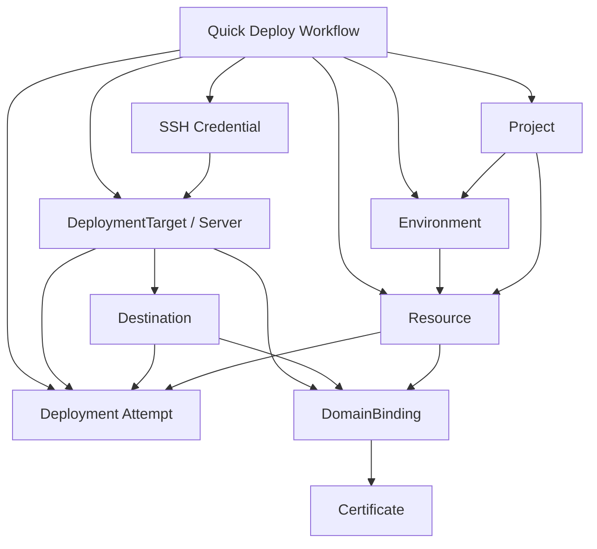

# Business Operation Map

> CORE DOCUMENT
>
> This file is the human-facing and AI-facing source of truth for how Yundu commands, queries,
> workflows, events, read models, and implementation plans relate to each other.
>
> [DOMAIN_MODEL.md](/Users/nichenqin/projects/yundu/docs/DOMAIN_MODEL.md) defines the domain
> boundaries and aggregate language.
>
> [CORE_OPERATIONS.md](/Users/nichenqin/projects/yundu/docs/CORE_OPERATIONS.md) defines the public
> command/query catalog and must stay mirrored by
> [operation-catalog.ts](/Users/nichenqin/projects/yundu/packages/application/src/operation-catalog.ts).
>
> This file defines where a behavior sits before agents write ADRs, local specs, tests, or code.

## Normative Contract

Every business behavior must be positioned in this map before it enters implementation.

If a requested behavior is already listed as an active command, query, workflow, or accepted
candidate here, agents must start from the linked ADRs and specs before changing code.

If a requested behavior is not listed here, agents must add or update this map in a Spec Round
before creating local command/event/workflow/error/testing specs or implementation code.

If a requested behavior is listed as future, deferred, removed, or rebuild-required, agents must not
implement it directly. They must first create or update the governing ADR, then add local specs,
then create an implementation plan, then enter Code Round.

## Governing Source Order

Read these files in order before changing a behavior:

1. [Decision Records](./decisions/README.md) and relevant ADRs.
2. [Business Operation Map](./BUSINESS_OPERATION_MAP.md).
3. [Core Operations](./CORE_OPERATIONS.md).
4. [Domain Model](./DOMAIN_MODEL.md).
5. Global contracts:
   - [Error Model](./errors/model.md)
   - [neverthrow Conventions](./errors/neverthrow-conventions.md)
   - [Async Lifecycle And Acceptance](./architecture/async-lifecycle-and-acceptance.md)
6. Local command, query, event, workflow, error, testing, and implementation-plan docs.

`docs/ai/**` is background analysis only and cannot override this map.

## Operation State Terms

| State | Meaning |
| --- | --- |
| Active command | Public write operation in the v1 business surface. Must appear in `CORE_OPERATIONS.md` and `operation-catalog.ts`. |
| Active query | Public read operation in the v1 business surface. Must appear in `CORE_OPERATIONS.md` and `operation-catalog.ts` when it is business-facing. |
| Workflow | Entry flow, UX flow, or process flow that sequences explicit operations. It is not itself a command unless a later ADR says so. |
| Accepted candidate | Command/query boundary is accepted by ADR or spec, but implementation may still be incomplete. Must not be exposed as active until catalog/API/CLI/Web/tests are aligned. |
| Rebuild-required | Previously implemented or expected behavior that is not part of the current public surface. It must restart at ADR/spec/plan before code. |
| Internal capability | Core/runtime/persistence mechanism that may support future behavior but is not exposed as a public business operation. |

## V1 Minimum Loop

The v1 loop is the first-class closure path. New behavior should be prioritized by whether it
improves this loop.

```text
create/select project
  -> create/select environment
  -> create/select deployment target/server
  -> create/configure credential when needed
  -> create/select resource with source/runtime/network profile
  -> deployments.create
  -> observe deployment progress, status, and logs
  -> observe resource runtime logs when an application instance is running
  -> optionally domain-bindings.create
  -> optionally certificates.issue-or-renew
  -> observe domain readiness
```

Quick Deploy and CLI interactive deploy are workflow entrypoints over this loop. They must not
become hidden aggregate commands.

## Relationship Diagram



## Active Command And Query Surface

### Workspace

| Behavior | Type | Operation | Owner | Main relationship | Governing docs |
| --- | --- | --- | --- | --- | --- |
| Create project | Command | `projects.create` | Project | Starts a resource collection boundary. | [Core Operations](./CORE_OPERATIONS.md) |
| List projects | Query | `projects.list` | Project read model | Lets workflows select existing project context. | [Core Operations](./CORE_OPERATIONS.md) |
| Create environment | Command | `environments.create` | Environment | Creates deployment/config scope inside a project. | [Core Operations](./CORE_OPERATIONS.md) |
| List environments | Query | `environments.list` | Environment read model | Lets workflows select environment context. | [Core Operations](./CORE_OPERATIONS.md) |
| Show environment | Query | `environments.show` | Environment read model | Exposes config context for one environment. | [Core Operations](./CORE_OPERATIONS.md) |
| Set environment variable | Command | `environments.set-variable` | Environment | Mutates environment config before deployment snapshot. | [Core Operations](./CORE_OPERATIONS.md) |
| Unset environment variable | Command | `environments.unset-variable` | Environment | Removes environment config before deployment snapshot. | [Core Operations](./CORE_OPERATIONS.md) |
| Diff environments | Query | `environments.diff` | Environment read model | Compares configuration scopes. | [Core Operations](./CORE_OPERATIONS.md) |
| Promote environment | Command | `environments.promote` | Environment | Creates a promoted environment state. | [Core Operations](./CORE_OPERATIONS.md) |

### Deployment Target And Credential

| Behavior | Type | Operation | Owner | Main relationship | Governing docs |
| --- | --- | --- | --- | --- | --- |
| Register deployment target | Command | `servers.register` | DeploymentTarget | Creates target/server metadata and proxy intent. | [Server Bootstrap Workflow](./workflows/server-bootstrap-and-proxy.md), [ADR-003](./decisions/ADR-003-server-connect-public-vs-internal.md), [ADR-004](./decisions/ADR-004-server-readiness-state-storage.md) |
| Configure target credential | Command | `servers.configure-credential` | DeploymentTarget | Attaches credential context to a target. | [Core Operations](./CORE_OPERATIONS.md) |
| Create reusable SSH credential | Command | `credentials.create-ssh` | Credential | Stores reusable target access material. | [Core Operations](./CORE_OPERATIONS.md) |
| List reusable SSH credentials | Query | `credentials.list-ssh` | Credential read model | Lets workflows select existing access material. | [Core Operations](./CORE_OPERATIONS.md) |
| List deployment targets | Query | `servers.list` | DeploymentTarget read model | Lets workflows select target/server context. | [Core Operations](./CORE_OPERATIONS.md) |
| Test target connectivity | Command | `servers.test-connectivity` | DeploymentTarget/application service | Validates connectivity for an existing target. | [Server Bootstrap Workflow](./workflows/server-bootstrap-and-proxy.md) |
| Test draft target connectivity | Command | `servers.test-draft-connectivity` | Application service | Validates credentials before target persistence. | [Server Bootstrap Workflow](./workflows/server-bootstrap-and-proxy.md) |

### Resource And Workload Delivery

| Behavior | Type | Operation | Owner | Main relationship | Governing docs |
| --- | --- | --- | --- | --- | --- |
| Create resource | Command | `resources.create` | Resource | Creates deployable unit with source/runtime/network profile when supplied. | [resources.create](./commands/resources.create.md), [ADR-011](./decisions/ADR-011-resource-create-minimum-lifecycle.md), [ADR-012](./decisions/ADR-012-resource-runtime-profile-and-deployment-snapshot-boundary.md), [ADR-015](./decisions/ADR-015-resource-network-profile.md) |
| List resources | Query | `resources.list` | Resource read model | Lets workflows select deployable units and lets project pages show resources. | [Project Resource Console](./workflows/project-resource-console.md), [ADR-013](./decisions/ADR-013-project-resource-navigation-and-deployment-ownership.md) |
| Read resource runtime logs | Active query | `resources.runtime-logs` | Resource runtime observation | Tails or streams application stdout/stderr for a resource-owned runtime instance through an injected runtime log reader port. | [resources.runtime-logs](./queries/resources.runtime-logs.md), [Resource Runtime Log Observation](./workflows/resource-runtime-log-observation.md), [ADR-017](./decisions/ADR-017-resource-runtime-log-observation.md) |

### Deployment

| Behavior | Type | Operation | Owner | Main relationship | Governing docs |
| --- | --- | --- | --- | --- | --- |
| Create deployment | Command | `deployments.create` | Deployment attempt | Accepts an attempt for an existing project/environment/resource/server/destination context. | [deployments.create](./commands/deployments.create.md), [ADR-001](./decisions/ADR-001-deploy-api-required-fields.md), [ADR-014](./decisions/ADR-014-deployment-admission-uses-resource-profile.md), [ADR-016](./decisions/ADR-016-deployment-command-surface-reset.md) |
| List deployments | Query | `deployments.list` | Deployment read model | Observes deployment attempts across project/resource filters. | [Core Operations](./CORE_OPERATIONS.md) |
| Read deployment logs | Query | `deployments.logs` | Deployment read model/log projection | Observes logs for one deployment attempt. | [Core Operations](./CORE_OPERATIONS.md) |
| Deployment progress stream | Transport observation | tied to `deployments.create` | Deployment progress projection | Shows progress for accepted deployment creation. Not a separate business command. | [Quick Deploy Workflow](./workflows/quick-deploy.md), [ADR-016](./decisions/ADR-016-deployment-command-surface-reset.md) |

### Routing, Domain, And TLS

| Behavior | Type | Operation | Owner | Main relationship | Governing docs |
| --- | --- | --- | --- | --- | --- |
| Create domain binding | Command | `domain-bindings.create` | DomainBinding | Creates durable domain ownership/routing lifecycle for a resource/destination/target. | [domain-bindings.create](./commands/domain-bindings.create.md), [Routing Domain TLS Workflow](./workflows/routing-domain-and-tls.md), [ADR-002](./decisions/ADR-002-routing-domain-tls-boundary.md), [ADR-005](./decisions/ADR-005-domain-binding-owner-scope.md), [ADR-006](./decisions/ADR-006-domain-verification-strategy.md) |
| List domain bindings | Query | `domain-bindings.list` | DomainBinding read model | Observes accepted domain binding records and verification state. | [Routing Domain TLS Workflow](./workflows/routing-domain-and-tls.md) |
| Issue or renew certificate | Accepted candidate command | `certificates.issue-or-renew` | Certificate lifecycle | Requests provider-managed certificate issuance/renewal after domain ownership context exists. | [certificates.issue-or-renew](./commands/certificates.issue-or-renew.md), [ADR-007](./decisions/ADR-007-certificate-provider-and-challenge-default.md), [ADR-008](./decisions/ADR-008-renewal-trigger-model.md) |
| Import certificate | Accepted candidate command | `certificates.import` | Certificate lifecycle | Imports operator-supplied certificate/key material through a separate security boundary. | [ADR-009](./decisions/ADR-009-certificates-import-command.md), [certificates.import plan](./implementation/certificates.import-plan.md) |

### System

| Behavior | Type | Operation | Owner | Main relationship | Governing docs |
| --- | --- | --- | --- | --- | --- |
| List providers | Query | `system.providers.list` | Provider registry | Exposes provider capabilities. | [Core Operations](./CORE_OPERATIONS.md) |
| List plugins | Query | `system.plugins.list` | Plugin registry | Exposes plugin capabilities. | [Core Operations](./CORE_OPERATIONS.md) |
| List GitHub repositories | Query | `system.github-repositories.list` | Integration read adapter | Lets source selection choose GitHub repositories. | [Core Operations](./CORE_OPERATIONS.md) |
| Doctor diagnostics | Query | `system.doctor` | Application/system diagnostics | Diagnoses local installation health. | [Core Operations](./CORE_OPERATIONS.md) |
| Database status | Query | `system.db-status` | Persistence/system diagnostics | Observes database migration state. | [Core Operations](./CORE_OPERATIONS.md) |
| Database migrate | Command | `system.db-migrate` | Persistence/system operation | Applies schema migration. | [Core Operations](./CORE_OPERATIONS.md) |

## Workflow Map

Workflows coordinate commands and queries. They do not own aggregate invariants.

| Workflow | Type | Operation sequence | Final business operation | Governing docs |
| --- | --- | --- | --- | --- |
| Quick Deploy | Entry workflow | Select/create project, server, credential, environment, resource, optional variable, then deploy. | `deployments.create` | [Quick Deploy](./workflows/quick-deploy.md), [ADR-010](./decisions/ADR-010-quick-deploy-workflow-boundary.md) |
| Resource create and first deploy | Entry workflow | `resources.create -> deployments.create` after context selection. | `deployments.create` | [Resource Create And First Deploy](./workflows/resources.create-and-first-deploy.md) |
| Server bootstrap and proxy | Async/process workflow | `servers.register -> server-connected -> proxy-bootstrap-requested -> proxy-installed/proxy-install-failed -> server-ready` | server readiness state | [Server Bootstrap And Proxy](./workflows/server-bootstrap-and-proxy.md), [ADR-003](./decisions/ADR-003-server-connect-public-vs-internal.md), [ADR-004](./decisions/ADR-004-server-readiness-state-storage.md) |
| Routing/domain/TLS | Async/process workflow | `domain-bindings.create -> domain-binding-requested -> domain-bound -> certificate-requested -> certificate-issued/certificate-issuance-failed -> domain-ready` | domain readiness state | [Routing Domain And TLS](./workflows/routing-domain-and-tls.md), ADR-002 through ADR-009 |
| Project/resource console | UI workflow | Project list/detail surfaces query projects/resources/deployments and route owner-scoped actions to resources. | varies by selected action | [Project Resource Console](./workflows/project-resource-console.md), [ADR-013](./decisions/ADR-013-project-resource-navigation-and-deployment-ownership.md) |
| Resource runtime log observation | UI/read workflow | Resource detail resolves a resource runtime log query and renders bounded or streaming line events. | `resources.runtime-logs` | [Resource Runtime Log Observation](./workflows/resource-runtime-log-observation.md), [ADR-017](./decisions/ADR-017-resource-runtime-log-observation.md) |

## Event And Async Progression Map

Events are not automatically proof that downstream work succeeded. Each event records either an
accepted request, a durable fact, or an async process outcome.

| Flow | Event | Meaning | Drives | Governing docs |
| --- | --- | --- | --- | --- |
| Resource lifecycle | `resource-created` | Resource aggregate was durably persisted. | Read models, audit, workflow observers. | [resource-created](./events/resource-created.md) |
| Deployment | `deployment-requested` | Deployment request was accepted. | Build/planning/execution orchestration. | [deployment-requested](./events/deployment-requested.md) |
| Deployment | `build-requested` | Build/package step was requested. | Build worker/process step. | [build-requested](./events/build-requested.md) |
| Deployment | `deployment-started` | Runtime execution has started. | Deployment read model/progress. | [deployment-started](./events/deployment-started.md) |
| Deployment | `deployment-succeeded` | Deployment attempt reached success terminal state. | Read models, notifications, follow-up workflows. | [deployment-succeeded](./events/deployment-succeeded.md) |
| Deployment | `deployment-failed` | Deployment attempt reached failed terminal state. | Read models, retry candidate state, notifications. | [deployment-failed](./events/deployment-failed.md) |
| Server bootstrap | `server-connected` | Connectivity has been established or marked connected. | Proxy bootstrap request. | [server-connected](./events/server-connected.md) |
| Server bootstrap | `proxy-bootstrap-requested` | Proxy installation/bootstrap was requested. | Proxy worker/process step. | [proxy-bootstrap-requested](./events/proxy-bootstrap-requested.md) |
| Server bootstrap | `proxy-installed` | Proxy installation/bootstrap succeeded. | Server readiness evaluation. | [proxy-installed](./events/proxy-installed.md) |
| Server bootstrap | `proxy-install-failed` | Proxy installation/bootstrap failed. | Server degraded/failed proxy state and retry eligibility. | [proxy-install-failed](./events/proxy-install-failed.md) |
| Server bootstrap | `server-ready` | Server readiness criteria are satisfied. | Read models and deployment target selection confidence. | [server-ready](./events/server-ready.md) |
| Routing/domain/TLS | `domain-binding-requested` | Domain binding admission accepted a verification attempt. | Domain verification process. | [domain-binding-requested](./events/domain-binding-requested.md) |
| Routing/domain/TLS | `domain-bound` | Domain ownership/routing binding is verified. | Certificate request. | [domain-bound](./events/domain-bound.md) |
| Routing/domain/TLS | `certificate-requested` | Certificate issuance/renewal was requested. | Certificate provider worker. | [certificate-requested](./events/certificate-requested.md) |
| Routing/domain/TLS | `certificate-issued` | Certificate was issued and stored. | Domain readiness evaluation. | [certificate-issued](./events/certificate-issued.md) |
| Routing/domain/TLS | `certificate-issuance-failed` | Certificate issuance failed. | Retry/terminal certificate state. | [certificate-issuance-failed](./events/certificate-issuance-failed.md) |
| Routing/domain/TLS | `domain-ready` | Domain is ready to serve traffic. | Read models and user-facing status. | [domain-ready](./events/domain-ready.md) |

## Rebuild-Required Deployment Behaviors

ADR-016 removes these from the public v1 deployment write surface:

| Behavior | Former or expected operation | Required path before implementation |
| --- | --- | --- |
| Cancel deployment | `deployments.cancel` | Add/update ADR if lifecycle semantics change, update this map, then command/event/workflow/error/testing specs, implementation plan, and Code Round. |
| Manual deployment health check | `deployments.check-health` or future health operation | Decide whether this belongs to deployment, resource health policy, or read-model verification before specs. |
| Redeploy resource | `deployments.redeploy-resource` or future equivalent | Define resource profile snapshot reuse, active-deployment guard, retry/new-attempt semantics, and Web/API/CLI affordance. |
| Reattach deployment | `deployments.reattach` or future reconnect/read operation | Decide whether this is a query, progress stream reconnect, or command before implementation. |
| Rollback deployment | `deployments.rollback` or future release rollback command | Define release/artifact retention, rollback attempt creation, state transitions, events, errors, and operator UX before implementation. |

No Web/API/CLI/MCP entrypoint may expose these behaviors until their specs are accepted and the
operation is re-added to `CORE_OPERATIONS.md` and `operation-catalog.ts`.

## Adding Or Changing A Behavior

Use this sequence for every business behavior, including future operations such as cancel, restart,
scale, rollback, source binding, health policy, storage, webhooks, or resource update:

1. Locate the behavior in this map.
2. If absent, add it to the correct owner group as active, accepted candidate, workflow, internal,
   or rebuild-required.
3. Check whether the behavior changes command boundary, ownership scope, lifecycle stage, readiness
   rule, retry rule, durable state shape, route/domain/TLS boundary, or async acceptance semantics.
4. If yes, create or update an ADR before local specs.
5. Update `CORE_OPERATIONS.md` only when the behavior becomes a public command/query.
6. Update `operation-catalog.ts` in the same Code Round that exposes the operation publicly.
7. Add or update local specs:
   - command or query spec;
   - event specs;
   - workflow spec;
   - error spec;
   - testing matrix;
   - implementation plan.
8. Enter Code Round only after ADR/spec/plan readiness is sufficient.
9. After Code Round, run Post-Implementation Sync and update migration gaps.

## Current Implementation Notes And Migration Gaps

`CORE_OPERATIONS.md` remains the authoritative active operation list. This map adds relationship and
gating semantics and must be kept in sync whenever a behavior changes state.

Some accepted candidate docs exist before their commands are active in the public catalog. Those
commands must not be treated as implemented until they appear in `CORE_OPERATIONS.md`,
`operation-catalog.ts`, Web/API/CLI entrypoints, and tests.

Low-level core/runtime/persistence support for rollback or historical rollback fields may remain as
internal capability, but public rollback behavior is rebuild-required under ADR-016.

## Open Questions

- Should future `deployments.show` and `deployments.stream-events` be added as deployment queries in
  the next operation-map update or deferred until the deployment detail/read-model spec round?
- Should resource detail status be served by `resources.list`, a future `resources.show`, a future
  `resources.summary`, or a navigation-specific read model?
