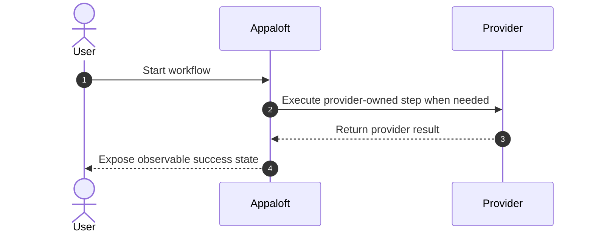
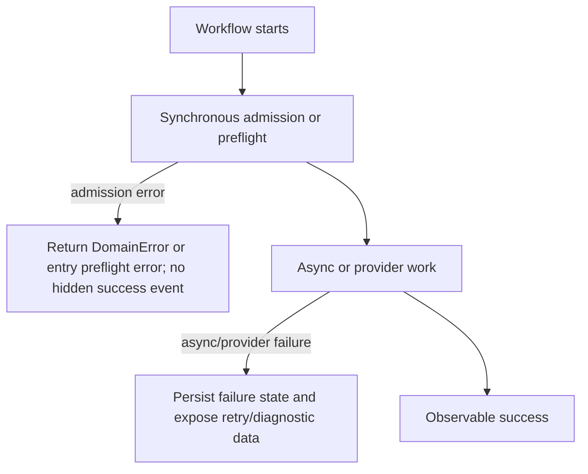

# Workflow Spec Template

> Copy this file to `docs/workflows/<workflow-name>.md`.
>
> Follow [Workflow Spec Format](./WORKFLOW_SPEC_FORMAT.md). A workflow spec describes input
> collection, multi-step UX, event/process-manager progression, or provider/runtime orchestration.
> It must end in explicit commands, events, queries, or provider boundaries rather than inventing
> parallel business semantics.

## Normative Contract

Describe what this workflow is and is not.

State whether it is:

- a first-class workflow;
- an entry workflow;
- an event/process-manager continuation;
- a compatibility path;
- proposed, partial, or implemented.

## Global References

This workflow inherits:

- [Workflow Spec Format](./WORKFLOW_SPEC_FORMAT.md)
- Relevant ADRs:
- Global contracts:
  - [Error Model](../errors/model.md)
  - [neverthrow Conventions](../errors/neverthrow-conventions.md)
  - [Async Lifecycle And Acceptance](../architecture/async-lifecycle-and-acceptance.md)
- Related command specs:
- Related event specs:
- Related query specs:
- Related workflow specs:
- Related test matrix:

## End-To-End Workflow

Explain the full route from initial user/system intent or trigger to observable completion.

### Actor Responsibilities

| Actor | Responsibilities | Success Signal | Failure Branch |
| --- | --- | --- | --- |
| User/operator or trigger source | | | |
| Appaloft | | | |
| External provider/runtime/integration | | | |

### Success Path



### Failure Branches



### Test Strategy

State how tests prove the workflow without relying on fragile UI copy, prompts, or real external
systems when fakes/adapters can cover the behavior.

Required points:

- matching `docs/testing/<workflow-name>-test-matrix.md`;
- matrix ids for success, failure, entry, async, retry, and provider branches;
- default hermetic executable tests;
- opt-in external e2e tests when Docker, SSH, public DNS, real CAs, or other mutable systems are
  required;
- explicit current implementation gaps.

## Synchronous Admission And Preflight

List validation/admission gates that can fail before durable async work begins.

| Gate | Owner | Success | Failure |
| --- | --- | --- | --- |
| | | | |

## Async Work

List worker, scheduler, process-manager, provider, runtime, or event-consumption work.

| Async step | Owner | Durable state/read model | Retry behavior |
| --- | --- | --- | --- |
| | | | |

## State Model

Separate workflow-local state from durable aggregate/read-model state.

```text
workflow_local_state
durable_state_or_read_model_state
```

## Event / State Mapping

| Command/event/query/provider callback | Meaning | State impact |
| --- | --- | --- |
| | | |

## Failure Visibility

Describe how failures are surfaced:

- synchronous admission errors;
- async failures;
- provider/runtime failures;
- retry state;
- diagnostic/read-model visibility;
- logs/traces when relevant.

## Operation Sequence

| Step | Owner | Command/query/event/provider call | Required behavior |
| --- | --- | --- | --- |
| | | | |

## Entry Differences

| Entrypoint | Contract |
| --- | --- |
| Web | |
| CLI | |
| API | |
| Automation / MCP | |

## Partial Failure Semantics

State whether the workflow is atomic. If it is not atomic, list which successful steps remain
persisted when a later step fails.

## Idempotency And Deduplication

State how repeated submissions, retries, natural matches, idempotency keys, and duplicate events are
handled.

## Current Implementation Notes And Migration Gaps

Keep temporary implementation divergence here. Do not weaken the normative sections to match
incomplete code.

## Open Questions

- 
