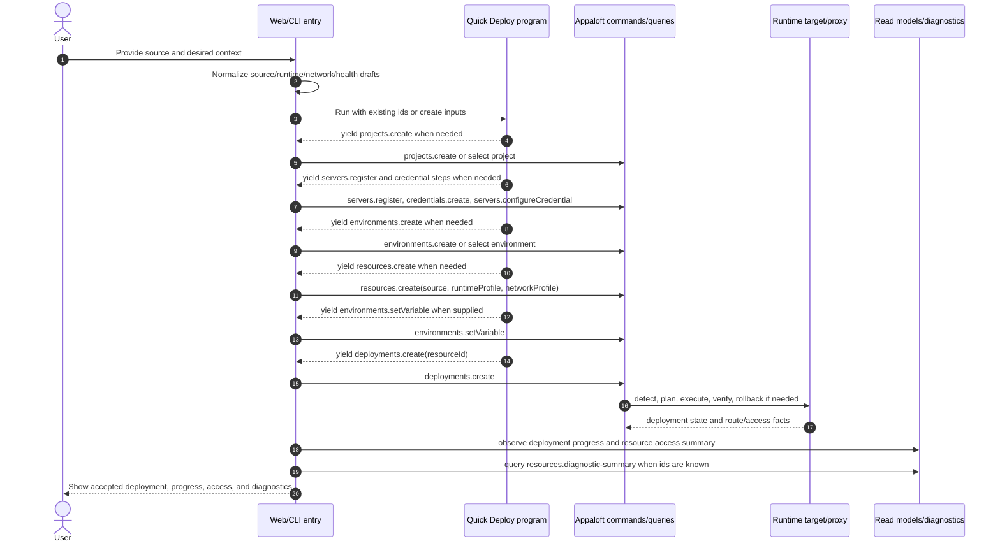
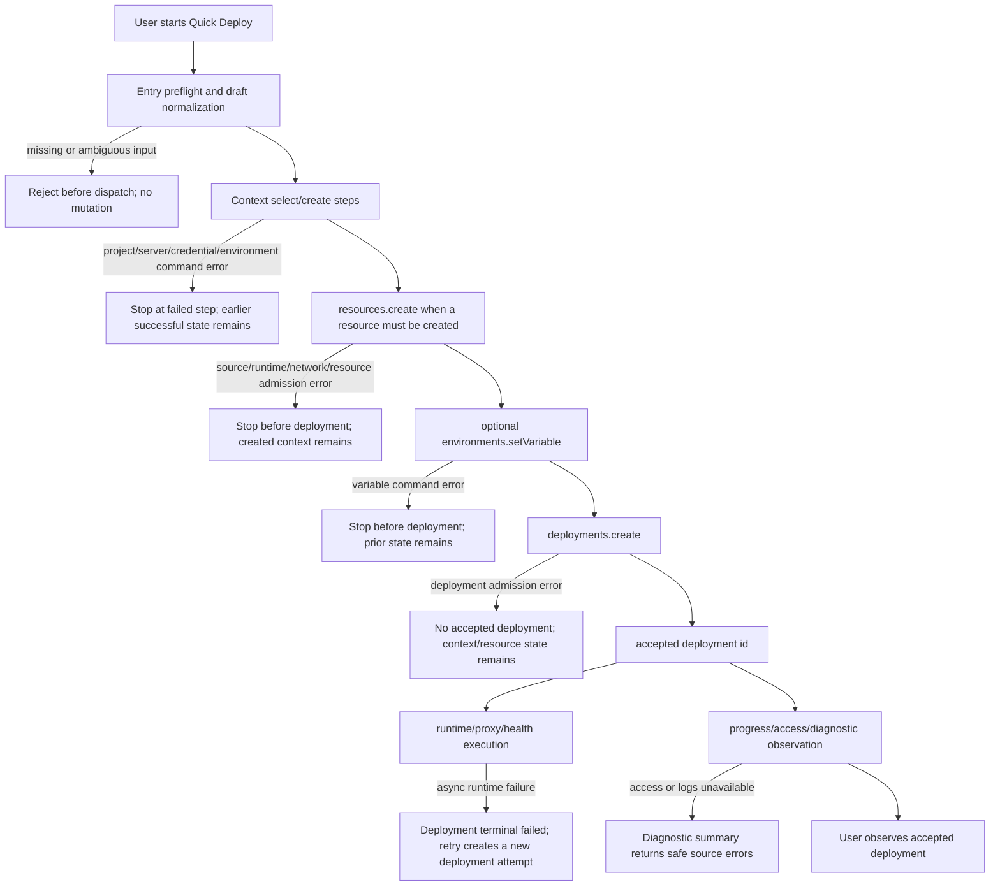

# Quick Deploy Workflow Spec

## Normative Contract

Quick Deploy is an entry workflow for guiding a user from an initial deployment intent to an accepted `deployments.create` request.

Quick Deploy is not a domain command, not an aggregate, and not a separate operation-catalog business operation. It coordinates input collection and explicit commands owned by existing operations.

## Global References

This workflow inherits:

- [ADR-001: deployments.create HTTP API Required Fields](../decisions/ADR-001-deploy-api-required-fields.md)
- [ADR-002: Routing, Domain, And TLS Boundary](../decisions/ADR-002-routing-domain-tls-boundary.md)
- [ADR-010: Quick Deploy Workflow Boundary](../decisions/ADR-010-quick-deploy-workflow-boundary.md)
- [ADR-011: Resource Create Minimum Lifecycle](../decisions/ADR-011-resource-create-minimum-lifecycle.md)
- [ADR-012: Resource Runtime Profile And Deployment Snapshot Boundary](../decisions/ADR-012-resource-runtime-profile-and-deployment-snapshot-boundary.md)
- [ADR-013: Project Resource Navigation And Deployment Ownership](../decisions/ADR-013-project-resource-navigation-and-deployment-ownership.md)
- [ADR-014: Deployment Admission Uses Resource Profile](../decisions/ADR-014-deployment-admission-uses-resource-profile.md)
- [ADR-015: Resource Network Profile](../decisions/ADR-015-resource-network-profile.md)
- [ADR-017: Default Access Domain And Proxy Routing](../decisions/ADR-017-default-access-domain-and-proxy-routing.md)
- [ADR-021: Docker/OCI Workload Substrate](../decisions/ADR-021-docker-oci-workload-substrate.md)
- [ADR-023: Runtime Orchestration Target Boundary](../decisions/ADR-023-runtime-orchestration-target-boundary.md)
- [Error Model](../errors/model.md)
- [neverthrow Conventions](../errors/neverthrow-conventions.md)
- [Async Lifecycle And Acceptance](../architecture/async-lifecycle-and-acceptance.md)
- [deployments.create Command Spec](../commands/deployments.create.md)
- [resources.create Command Spec](../commands/resources.create.md)
- [resources.diagnostic-summary Query Spec](../queries/resources.diagnostic-summary.md)
- [Resource Diagnostic Summary Workflow Spec](./resource-diagnostic-summary.md)
- [deployments.create Workflow Spec](./deployments.create.md)
- [Workflow Spec Format](./WORKFLOW_SPEC_FORMAT.md)
- [Quick Deploy Test Matrix](../testing/quick-deploy-test-matrix.md)

## Purpose

Quick Deploy exists to reduce first-deployment setup friction while preserving explicit business operation boundaries.

It may collect or create enough context for a first deployment:

- source;
- project;
- deployment target/server;
- credential;
- environment;
- resource;
- first environment variable;
- optional follow-up domain binding entrypoint;
- final deployment request.

When Quick Deploy collects source/runtime/health values, those values are entry-flow draft fields for `resources.create` or a future resource profile update command. They must not be submitted to `deployments.create`.

When Quick Deploy collects domain/TLS intent, it must sequence an explicit `domain-bindings.create` or certificate command after the required resource, server, and destination context exists. It must not submit domain/TLS intent to `deployments.create`.

When generated default access is enabled by platform policy, Quick Deploy may display the generated URL after the resource access summary projection is available. It must not collect concrete generated-domain provider fields from the user and must not send generated domain/proxy/TLS fields to `deployments.create`.

When the final workflow has a resource id and deployment id, Quick Deploy should expose a copyable
diagnostic summary through `resources.diagnostic-summary`. This is required when access, proxy
configuration, deployment logs, or runtime logs are missing/unavailable so the user can report a bug
without relying only on screenshots.

When Quick Deploy is launched from a project page, the workflow must still select or create a
resource before deployment admission. Project context may prefill `projectId`, but it must not make
the project the deployment owner.

When Quick Deploy is launched from a resource page, the workflow should prefill `resourceId`,
project, environment, and resource-owned source/runtime/network draft state where available.

Quick Deploy must use the ADR-012 domain language while collecting draft values:

- source selection produces a source locator and, when needed, a resource source binding draft;
- source selection is variant-specific: Git, local folder, Docker image, Compose, Dockerfile,
  static, zip, and inline source drafts may expose different fields, but they must normalize into
  resource source/runtime/network profile input before any write command is dispatched;
- runtime selection produces a runtime plan strategy hint, not a deployment-owned method;
- runtime selection must resolve to a Docker/OCI-backed deployment substrate for v1. Dockerfile,
  Docker Compose, prebuilt image, static, auto/buildpack-style, and workspace-command choices are
  all image or Compose artifact planning choices, not separate host-process runtime substrates;
- runtime target selection is not a Quick Deploy draft field. Quick Deploy selects or creates a
  deployment target/server and optional destination; `deployments.create` then resolves the
  registered runtime target backend. Kubernetes, Swarm, Helm, namespace, manifest, ingress-class,
  and replica settings must not be collected as deployment command fields.
- build/start/health values are runtime profile drafts;
- listener port, upstream protocol, exposure mode, and compose target service are network profile drafts;
- domain/path/TLS values belong to durable domain binding/certificate commands and must not become deployment-owned state.

For Git sources, Quick Deploy may accept repository browser URLs as user input. A URL that points to
a repository subpath, such as a GitHub `/tree/<ref>/<path>` URL, must be parsed as a convenience
source locator and normalized to:

- the repository clone locator in `source.locator`;
- `source.metadata.gitRef` for the selected branch, tag, or commit-ish when provided;
- `source.metadata.baseDirectory` for the source-tree subdirectory;
- `source.metadata.originalLocator` for traceability.

The normalized resource source for
`https://github.com/coollabsio/coolify-examples/tree/v4.x/bun` is repository
`https://github.com/coollabsio/coolify-examples`, `gitRef = "v4.x"`, and
`baseDirectory = "/bun"`.

When provider branch/tag lookup is available, Quick Deploy must resolve ambiguous slash-containing
refs by selecting the longest valid ref prefix and treating the remaining path as `baseDirectory`.
When lookup is not available, Quick Deploy must require explicit ref/path fields before dispatch or
reject the draft as ambiguous.

For Docker image sources, Quick Deploy must parse the image reference into image name plus either a
tag or digest. A digest takes precedence over a tag. Those fields belong to source identity and must
map to `ResourceSourceBinding`, while the runtime strategy maps to `prebuilt-image`.

For local folder sources, Quick Deploy may collect a source-root `baseDirectory` that is relative to
the selected folder. Dockerfile path, Docker Compose file path, publish directory, Docker build
target, and workspace command fields are runtime profile drafts because they describe how to plan
the chosen source tree.

For static site drafts, Quick Deploy must collect or infer:

- `kind = "static-site"` for newly created resources;
- `runtimeProfile.strategy = "static"`;
- `runtimeProfile.publishDirectory`, relative to the selected source base directory and resolved
  after any optional build command;
- optional install/build command fields when the static output must be generated before packaging;
- `networkProfile.internalPort = 80`, `upstreamProtocol = "http"`, and
  `exposureMode = "reverse-proxy"` by default.

Quick Deploy must not map static site deployment to `workspace-commands` merely because a build
command exists. Static build commands are preparation steps for a static Docker/OCI artifact whose
runtime serves files through an adapter-owned static server.

## Workflow Boundary

Quick Deploy owns:

- input collection;
- draft state;
- context selection UX;
- preflight validation that is useful before command dispatch;
- sequencing explicit commands and queries;
- progress observation after deployment acceptance.

Quick Deploy does not own:

- deployment admission semantics;
- resource aggregate rules;
- project/environment/server aggregate rules;
- credential storage rules;
- durable domain binding or certificate lifecycle;
- async deployment execution;
- deployment retry semantics;
- cross-command rollback.

## Reusable Workflow Program

Quick Deploy sequencing must be reusable through a side-effect-free workflow program and entry-specific executors.

The reusable program owns only the operation order and id-threading between steps:

```text
workflow input
  -> yield projects.create when project must be created
  -> yield servers.register when server must be created
  -> yield credentials.ssh.create and servers.configureCredential when credential setup is requested
  -> yield environments.create when environment must be created
  -> yield resources.create when resource must be created, including source/runtime/network profile drafts when they are part of first deploy
  -> yield environments.setVariable when first variable is supplied
  -> yield deployments.create
  -> return projectId, serverId, environmentId, resourceId, deploymentId
```

Each yielded step is an explicit operation step. The program must not call HTTP clients, CommandBus, QueryBus, repositories, prompts, or UI APIs directly.

Entry points supply executors:

- Web executors call typed oRPC/HTTP client methods and refresh Web query state.
- CLI executors dispatch command/query messages through the CLI runtime and CommandBus/QueryBus.
- A future backend convenience executor may dispatch explicit commands through the accepted backend application boundary, but it must still preserve partial failure semantics and must not become a hidden domain command.

The Web executor must use one request per yielded workflow step. It must show workflow step progress from those explicit requests: the running step is loading, succeeded steps are marked complete, and a failed step stops the workflow with the underlying command error. User-facing copy must describe the operation being performed, not the fact that the implementation uses separate requests.

The final deployment step is still the `deployments.create` command. Web may use the deployment progress stream transport for that final step so the user can see detect, plan, package, deploy, verify, rollback, Appaloft log, and application output while the command runs. `deployments.createStream` must not be used to execute project, server, environment, resource, credential, or variable workflow steps, and it must not become a hidden Quick Deploy workflow command.

The Web QuickDeploy wizard must collect project context immediately after source selection. When no project exists, the project step may stay on the new-project path and use the default first-project name if the user does not override it. When projects exist, the project step must default to selecting an existing project and still allow the user to switch to creating a new project.

The server step follows the same existing-first rule: when servers exist, default to selecting an existing server; when none exist, default to registering a new server.

Input collection remains entry-owned. The shared workflow program receives normalized references:

- existing ids for selected project/server/environment/resource; or
- create inputs for entities that the workflow should create.

The program may compose returned ids into later command inputs, such as using a created `projectId` for `environments.create`, a created `environmentId` for `resources.create`, and the returned `resourceId` for `deployments.create`.

When the workflow collects a port for an application resource, that field is resource network input. The normalized step input must be `networkProfile.internalPort`, not deployment input and not a host-published server port.

Web and CLI Quick Deploy implementations must expose this `internalPort` field when creating an inbound application resource. It is part of the core workflow contract, not an optional entrypoint enhancement.

When the workflow collects health check configuration for a newly created resource, those fields are resource runtime input. The normalized step input must be `runtimeProfile.healthCheck`, with `runtimeProfile.healthCheckPath` kept in sync as the HTTP path used by current runtime adapters. Existing resources keep their saved runtime profile; Quick Deploy must not silently overwrite health check configuration while submitting a deployment against an existing `resourceId`.

## End-To-End Workflow

Quick Deploy is a first-class entry workflow, not a single command. The user-facing route from "I
want to deploy this source" to "the deployment request is accepted and observable" crosses user
input collection, explicit Appaloft commands, optional external runtime targets, deployment progress,
read models, and diagnostics.

### Actor Responsibilities

| Actor | Responsibilities | Success Signal | Failure Branch |
| --- | --- | --- | --- |
| User/operator | Choose or provide source, project, server, environment, resource, credentials, environment variables, network/health inputs, and optional domain follow-up intent. | The workflow returns stable project/server/environment/resource/deployment ids and the user can observe deployment progress or result state. | Missing required input, ambiguous source, wrong target, invalid credential, duplicate resource name, or follow-up domain intent that belongs to the separate routing/domain/TLS workflow. |
| Web/CLI entry | Collect draft input, normalize source/runtime/network/health fields, run the shared workflow program, execute yielded operations through typed clients or command/query buses, and show per-step progress. | Each explicit step is visible as pending/succeeded/failed; the final deployment step uses `deployments.create`. | Local preflight rejects before dispatch, or an underlying command error stops the workflow at that step. |
| Shared Quick Deploy workflow program | Own side-effect-free operation order and id-threading between selected ids and create inputs. It must not call HTTP, CommandBus, QueryBus, repositories, prompts, or UI APIs directly. | Returns project, server, environment, resource, and deployment ids after the executor completes each yielded step. | Executor returns or throws a failed step; later steps are not yielded. |
| Appaloft application/API | Enforce underlying command/query specs, persist aggregate state, publish command events, expose progress/read-model state, and preserve stable error contracts. | Explicit operations succeed and `deployments.create` accepts a deployment request. | Command admission returns `err(DomainError)`; accepted deployment may later fail asynchronously. |
| Runtime target/proxy/provider | Resolve and execute Docker/OCI or Compose deployment plans, realize generated access routes when policy/provider state allows, and perform runtime health checks. | Deployment reaches succeeded state and access projections can expose generated or configured routes. | Runtime plan, image build, container start, proxy route, public route, or health verification fails. |
| Diagnostics/read-model surfaces | Expose deployment progress, resource access summary, logs when available, and `resources.diagnostic-summary` after resource/deployment ids are known. | The user has copyable stable ids and section statuses for support/debugging. | Access/proxy/log sources are missing or unavailable; diagnostic summary still reports safe source errors. |

### Success Path



### Failure Branches



### Test Strategy

Automated tests must prove the workflow by observing explicit operations and stable ids, not by
asserting UI copy or prompt text as domain behavior.

- `docs/testing/quick-deploy-test-matrix.md` owns every `QUICK-DEPLOY-WF-*` and
  `QUICK-DEPLOY-ENTRY-*` scenario.
- `packages/contracts/test/quick-deploy-workflow.test.ts` is the numbered executable baseline for
  shared workflow sequencing, id-threading, stop points, and ids-only `deployments.create`.
- Web component/browser tests should cover entry-only behavior: default selections, local preflight,
  per-step progress rendering, generated access display, and diagnostic-copy interaction.
- CLI tests should cover TTY/non-TTY input collection, explicit command dispatch, and final
  `CreateDeploymentCommandInput`.
- Docker/SSH/proxy e2e tests may be opt-in when they mutate external runtime targets, but the
  matrix row must state that the shared workflow test is the default hermetic baseline and the
  opt-in test proves real runtime reachability.
- Quick Deploy tests must not buy domains, depend on public DNS propagation, or hide domain/TLS
  behavior inside deployment tests. Durable custom domains are covered by the routing/domain/TLS
  workflow and are invoked only through explicit follow-up commands.

`deployments.create` remains the final deployment command. Command success means request accepted.

## Operation Sequence

| Step | Owner | Command/query | Required behavior |
| --- | --- | --- | --- |
| Source selection | Web/CLI workflow | Source/provider queries as needed | Produce a `ResourceSourceBinding` draft and optional provider metadata. |
| Source variant normalization | Web/CLI workflow | Local draft parser; provider branch/tag lookup when available | Convert deep Git URLs, local folder base directories, Docker image tags/digests, and build-file paths into resource source/runtime profile fields. |
| Static runtime draft | Web/CLI workflow | Local draft validation; optional source/runtime detection | For static site drafts, require `runtimeProfile.strategy = "static"` and `runtimeProfile.publishDirectory`, preserve optional install/build commands, and default the HTTP network profile to port 80. |
| Network draft | Web/CLI workflow | Local draft validation; optional source/runtime detection | Produce a `ResourceNetworkProfile` draft with `internalPort` for inbound resources. |
| Health check draft | Web/CLI workflow | Local draft validation; optional runtime defaults | Produce optional `ResourceRuntimeProfile.healthCheck` for newly created resources, including HTTP path, expected status, interval, timeout, retries, and start period. |
| Project context | Web/CLI workflow | `projects.list`; optional `projects.create` | Select or create the project before deployment admission. |
| Server context | Web/CLI workflow | `servers.list`; optional `servers.register` | Select or register the deployment target/server before deployment admission. |
| Credential context | Web/CLI workflow | `credentials.list-ssh`; optional `credentials.create-ssh`; optional `servers.configure-credential` | Store or attach credential material through credential/server commands, not inside deployment. |
| Connectivity preflight | Web/CLI workflow | `servers.test-connectivity` or `servers.test-draft-connectivity` | May test reachability before final deploy; failure is preflight feedback unless the final command requires the tested state. |
| Environment context | Web/CLI workflow | `environments.list`; optional `environments.create` | Select or create the environment before deployment admission. |
| Resource context | Web/CLI workflow | `resources.list`; `resources.create` | Prefer existing `resourceId`; use explicit `resources.create` with source/runtime/network profile when creating a new first-deploy resource. |
| First variable | Web/CLI workflow | `environments.set-variable` | Persist environment-scoped variable before deployment snapshot if the user supplies it. |
| Domain/TLS context | Web/CLI workflow | `domain-bindings.create`; certificate commands when in scope | Bind domains through explicit routing/domain/TLS commands, not through deployment admission. |
| Deployment admission | Application command | `deployments.create` | Dispatch ids-only deployment admission and accept or reject the deployment request according to the command spec. |
| Generated access observation | Web/CLI workflow | `ResourceAccessSummary` after route snapshot resolution | Display generated access URL and proxy route status when policy/provider resolved one. |
| Progress observation | Web/CLI workflow | deployment progress stream during the final deployment command; deployment read/progress queries after acceptance | Observe durable state or technical progress without treating progress events as Quick Deploy workflow steps. |
| Diagnostic summary observation | Web/CLI workflow | `resources.diagnostic-summary` after resource/deployment ids are known | Provide a copyable support/debug payload with stable ids and access/proxy/log section statuses. |

## Synchronous Admission And Preflight

Quick Deploy preflight includes:

- entry-local required-field checks before any command is dispatched;
- source URL/image/local-folder parsing and ambiguity detection;
- runtime strategy, health check, and internal listener port draft validation;
- existing-id versus create-input shape validation for project, server, environment, and resource;
- TTY versus non-TTY input collection rules for CLI;
- Web wizard step completeness checks;
- optional connectivity checks when the user explicitly requests them before final deployment.

Preflight failure must not create or mutate durable state.

Command admission remains owned by the command that is being dispatched. Quick Deploy must preserve
the returned `DomainError` fields, including `code`, `category`, `phase`, `retriable`,
`relatedEntityId`, and `correlationId`.

## Async Work

Quick Deploy does not introduce a hidden durable async workflow command.

Async work after the final step belongs to existing operations and providers:

- `deployments.create` accepts a deployment request and then drives detect, plan, execute, verify,
  and rollback behavior according to the deployment specs;
- runtime target/provider adapters may build images, start containers, render proxy configuration,
  and run health checks;
- generated default access route realization is resolved from resource/server/policy/proxy state;
- resource access summaries, deployment progress, deployment logs, runtime logs, and diagnostic
  summaries expose the observable result.

Quick Deploy may observe those async states, but it must not convert them into hidden workflow
success semantics.

## State Model

Quick Deploy-local state is entry-owned and may be transient:

```text
collecting_input
draft_invalid
ready_to_submit
executing_step
failed_step
deployment_accepted
observing_deployment
completed | deployment_failed
```

Durable state belongs to the underlying aggregates and read models:

- project, server, credential, environment, resource, and environment-variable state after their
  explicit commands succeed;
- deployment state after `deployments.create` accepts the request and runtime execution progresses;
- resource access summary state after route snapshots/read-model projections update;
- diagnostic summary state as a query result, not as a workflow aggregate.

There is no `QuickDeploy` aggregate in v1.

## Event / State Mapping

| Step or event source | Meaning | State impact |
| --- | --- | --- |
| Entry preflight | Draft is complete enough to dispatch explicit operations. | Entry-local state moves from `collecting_input` to `ready_to_submit`; no durable mutation. |
| `projects.create`, `servers.register`, `credentials.create-ssh`, `servers.configure-credential`, `environments.create` | Context prerequisite accepted. | The returned id is threaded into later steps; successful state remains if a later step fails. |
| `resources.create` | Durable resource profile accepted. | Resource owns source/runtime/network/health profile; later deployment input must use `resourceId`. |
| `environments.set-variable` | Optional first variable accepted. | Variable is available for deployment snapshot resolution. |
| `deployments.create` | Final deployment request accepted. | Deployment attempt exists and progresses according to deployment lifecycle specs. |
| Deployment progress/read-model updates | Runtime execution is observable. | Entry can show progress, terminal succeeded/failed state, and route/access projections. |
| `resources.diagnostic-summary` | Support/debug payload queried after ids are known. | Entry can expose copyable stable ids and safe section statuses. |
| Domain/TLS follow-up command | Custom domain lifecycle starts outside Quick Deploy. | State is governed by the routing/domain/TLS workflow, not by deployment admission. |

## Failure Visibility

Quick Deploy must surface the failure at the boundary where it happened:

- preflight failures are entry-local and create no durable state;
- command failures stop the workflow at the failed step and preserve the underlying `DomainError`;
- partial success is visible through already-created ids and read models;
- accepted deployment followed by async runtime failure is shown as deployment state, not as a
  failed `deployments.create` response;
- missing access, proxy, deployment log, or runtime log data should be reported through
  `resources.diagnostic-summary` source errors when resource/deployment ids are known;
- durable domain/TLS failures are shown through domain binding and certificate read models after
  the separate follow-up commands run.

## Entry Differences

| Entrypoint | Contract |
| --- | --- |
| Web QuickDeploy | May use a multi-step wizard and local draft state; all writes dispatch explicit commands or the final `deployments.create` command. |
| CLI `appaloft deploy` with source/options | May create/select a resource with source/runtime/network profile, then dispatch ids-only `deployments.create`. |
| CLI `appaloft deploy` without source in TTY | May prompt for missing source/context, call prerequisite commands, and dispatch `deployments.create`. |
| CLI `appaloft deploy` without source outside TTY | May dispatch ids-only `deployments.create` when project/server/environment/resource ids are supplied; otherwise must reject before dispatch because non-interactive input collection cannot complete. |
| HTTP API | Does not expose hidden prompts; clients call explicit operations or submit a complete `deployments.create` input. |
| Automation/MCP | Must call explicit operations in sequence or use a future durable workflow command if one is accepted by ADR. |

## Partial Failure Semantics

Quick Deploy is not an atomic cross-aggregate transaction.

If an earlier command succeeds and a later command fails, the successful earlier state remains persisted. The workflow must surface the failed step and allow the user or automation to retry from the persisted state.

Examples:

- a project created before server registration fails remains available;
- a server registered before credential configuration fails remains available;
- an environment variable set before deployment admission fails remains available;
- a deployment accepted before runtime execution fails remains available with terminal failed deployment state.

Rollback or cleanup requires explicit future operations. It must not be implied by Quick Deploy failure.

## Idempotency And Deduplication

Quick Deploy must prefer selecting existing records before creating new records when a stable identifier or natural match is available.

Repeated workflow submissions must not intentionally create duplicate project, server, environment, credential, resource, or deployment records unless the user explicitly asks for a new entity or retry attempt.

The final deployment retry rule follows [Async Lifecycle And Acceptance](../architecture/async-lifecycle-and-acceptance.md): deployment retry creates a new deployment attempt.

## Generated Names

When Quick Deploy auto-generates a new resource name from a source locator, repository, image, compose file, or local path, the generated name must use:

```text
<normalized-source-name>-<short-random-suffix>
```

The normalized source name must be slug-like and stable for display. The suffix must be generated by the entry workflow before dispatching `resources.create`.

This rule applies only to names generated by the entry workflow. If the user explicitly types a resource name, Quick Deploy must send that name unchanged and let `resources.create` enforce project/environment slug uniqueness.

The `resources.create` command must not silently add suffixes, rename resources, or retry with a different name after `resource_slug_conflict`. Naming conflict handling at the command boundary remains a structured `resource_slug_conflict` error.

## Domain Model Placement

Quick Deploy belongs to the entry workflow/application orchestration layer.

The domain model remains:

```text
Project
  -> Environment
  -> Resource
  -> Deployment

DeploymentTarget/Server
  -> Destination
  -> Deployment runtime placement
```

Quick Deploy does not introduce a `QuickDeploy` aggregate. A future durable onboarding process may introduce a workflow/process state object only after a new ADR accepts that boundary.

## Error Handling

Workflow preflight errors may be Web/CLI-local when no command has been dispatched.

Command errors from underlying operations must use the global error model and preserve stable `code`, `category`, `phase`, `retriable`, `relatedEntityId`, and `correlationId` semantics.

Quick Deploy must not convert command errors into message-only failures. UI/CLI may add user-facing copy, but tests should assert stable domain error codes when a command boundary is involved.

## Current Implementation Notes And Migration Gaps

Web QuickDeploy now uses a shared Quick Deploy workflow program for operation sequencing and id-threading. The Web component still owns draft input collection, local validation, and query refresh side effects through its executor.

Web QuickDeploy executes prerequisite workflow steps through individual typed oRPC requests and renders per-step workflow progress in the review surface. It uses deployment progress streaming only for the final `deployments.create` step so deployment phases and logs stay visible while the command runs.

Web QuickDeploy keeps the workflow result visible after deployment acceptance and uses an explicit "view deployment" action for navigation instead of auto-redirecting immediately after the create request returns.

CLI interactive deploy treats prompts as input collection and dispatches explicit commands after resolving context. It has not yet been fully migrated to the shared workflow program.

The current Web workflow creates/configures several records from the component. This can remain as a migration step, but the behavior is governed by this workflow contract and [ADR-010](../decisions/ADR-010-quick-deploy-workflow-boundary.md).

Current Web QuickDeploy and CLI interactive deploy use `resources.create` before `deployments.create(resourceId)` for new first-deploy resources.

Current Web and CLI Quick Deploy auto-generate new-resource names with a short random suffix when the user has not supplied a resource name.

Current Web QuickDeploy exposes optional HTTP health check policy input for newly created resources and sends it through `resources.create.runtimeProfile.healthCheck`. Current CLI entry flows expose the path-only subset through `--health-path`. When Quick Deploy uses an existing resource, it displays the existing-resource path as resource-owned configuration and does not modify it during deployment submission.

The shared workflow module is available for Web and future CLI/backend reuse. CLI migration remains a follow-up implementation task.

Quick Deploy domain/TLS input has been removed from the deployment flow. Resource-scoped domain binding remains available through the domain binding surfaces and should become the owner-scoped follow-up action after deployment.

Generated default access URL display is not yet aligned with ADR-017 as a provider-neutral route snapshot/read-model surface.

Quick Deploy does not yet expose `resources.diagnostic-summary` after deployment acceptance, so
users may lack a copyable support/debug payload when access or logs are unavailable.

Current Web and CLI entry fields may still use user-facing "method" wording. Entry workflows must map that wording to `ResourceRuntimeProfile.strategy` before dispatching `resources.create`; `deployments.create` must not receive `deploymentMethod`.

Current Web and CLI entry fields may still expose a generic "port" label. Entry workflows must map that value to `ResourceNetworkProfile.internalPort`; `deployments.create` must not receive `port`.

Current Web and CLI entry fields may still accept Git URLs as a single raw input, but
`resources.create` normalizes common GitHub tree URLs into repository locator, `gitRef`,
`baseDirectory`, and `originalLocator` before persistence. Docker image tag/digest identity is
typed on the source binding.

Provider-backed disambiguation for slash-containing Git refs and user-facing typed fields for
Dockerfile path, Docker Compose path, and build target remain follow-up work. Static publish
directory is accepted by the shared resource schema and static workflow tests. Web QuickDeploy and
CLI deploy expose static draft inputs that map to `resources.create`.

First-class static site deployment is partially aligned at the shared workflow and command
admission layers. Web and CLI now dispatch
`resources.create(kind = static-site, runtimeProfile.strategy = static, publishDirectory,
networkProfile.internalPort = 80)` for static drafts. The deployment runtime generates
adapter-owned static-server Dockerfiles for local/generic-SSH image builds. Local Docker static
smoke coverage verifies generated nginx packaging and runtime health, and generic-SSH Docker
static smoke coverage exists as an opt-in harness.

Until provider-backed disambiguation exists, callers should supply explicit `gitRef` and
`baseDirectory` when a GitHub tree URL uses a slash-containing branch or tag name.

## Open Questions

- Should a future non-durable backend convenience endpoint be allowed for Quick Deploy, or should automation always sequence explicit operations until a durable workflow command exists?
- Exact operation names for resource source binding, runtime profile, network profile, and access profile configuration remain open under [ADR-012](../decisions/ADR-012-resource-runtime-profile-and-deployment-snapshot-boundary.md) and [ADR-015](../decisions/ADR-015-resource-network-profile.md).
