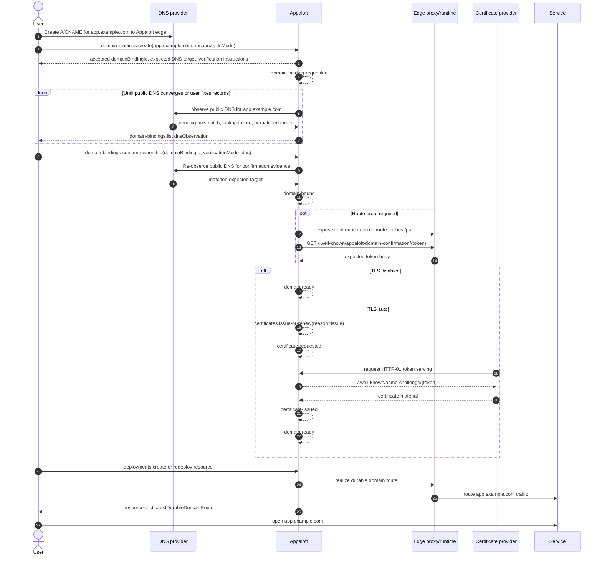
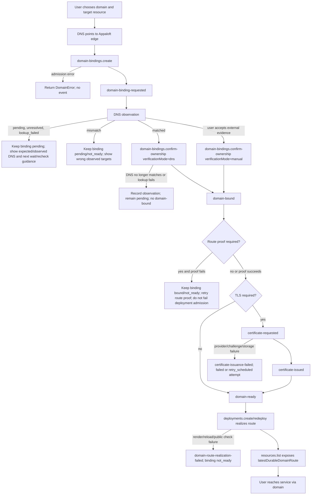

# Routing, Domain Binding, And TLS Workflow Spec

## Normative Contract

Routing/domain/TLS is a durable lifecycle workflow separate from deployment route snapshots and generated default access routes.

```text
create durable domain binding
  -> observe public DNS propagation
  -> confirm or verify domain ownership
  -> prove route reachability when required
  -> bind domain routing
  -> evaluate route readiness
  -> request certificate when required
  -> issue certificate or record failure
  -> mark domain ready when all gates pass
```

`deployments.create` must not carry domain/proxy/TLS input. It may persist resolved generated or durable route snapshots for one deployment attempt. It must not create durable domain bindings or issue certificates as hidden side effects.

Quick Deploy, repository config bootstrap, GitHub Actions binary deploys, and future automation may
hand off managed domain/TLS intent into this workflow by dispatching the same explicit domain and
certificate commands after trusted resource/server/destination context exists. They do not get a
special deployment shortcut.

Pure CLI/SSH config domains governed by
[ADR-024](../decisions/ADR-024-pure-cli-ssh-state-and-server-applied-domains.md) are a different
mode: `access.domains[]` becomes server-applied proxy route state on the selected SSH target and
does not create managed `DomainBinding` records. That server-applied state may include canonical
redirect aliases, such as `www.example.com -> example.com`, but those aliases are still target-local
route intent until a hosted or self-hosted control plane explicitly maps the same config intent into
managed domain/route lifecycle.

## Global References

This workflow inherits:

- [ADR-002: Routing, Domain, And TLS Boundary](../decisions/ADR-002-routing-domain-tls-boundary.md)
- [ADR-005: Domain Binding Owner Scope](../decisions/ADR-005-domain-binding-owner-scope.md)
- [ADR-006: Domain Verification Strategy](../decisions/ADR-006-domain-verification-strategy.md)
- [ADR-007: Certificate Provider And Challenge Default](../decisions/ADR-007-certificate-provider-and-challenge-default.md)
- [ADR-008: Renewal Trigger Model](../decisions/ADR-008-renewal-trigger-model.md)
- [ADR-009: Certificates Import Command](../decisions/ADR-009-certificates-import-command.md)
- [ADR-017: Default Access Domain And Proxy Routing](../decisions/ADR-017-default-access-domain-and-proxy-routing.md)
- [ADR-024: Pure CLI SSH State And Server-Applied Domains](../decisions/ADR-024-pure-cli-ssh-state-and-server-applied-domains.md)
- [Error Model](../errors/model.md)
- [neverthrow Conventions](../errors/neverthrow-conventions.md)
- [Async Lifecycle And Acceptance](../architecture/async-lifecycle-and-acceptance.md)
- [Workflow Spec Format](./WORKFLOW_SPEC_FORMAT.md)
- [Quick Deploy Workflow Spec](./quick-deploy.md)
- [Repository Deployment Config File Bootstrap](./deployment-config-file-bootstrap.md)
- [Routing Domain And TLS Test Matrix](../testing/routing-domain-and-tls-test-matrix.md)

## End-To-End Workflow

This is a first-class workflow, not a single command. The user-facing route from "I have a domain"
to "the service is reachable" crosses user-owned external setup, Appaloft commands, Appaloft events,
provider adapters, runtime route realization, and public read/query surfaces.

### Actor Responsibilities

| Actor | Responsibilities | Success Signal | Failure Branch |
| --- | --- | --- | --- |
| User/operator | Acquire or choose a domain, decide which resource owns it, configure DNS to point at the Appaloft edge address, wait for external DNS propagation when needed, request DNS-gated confirmation after DNS appears correct, provide explicit manual override evidence when Appaloft cannot observe DNS from its resolver context, and retry after fixing DNS/provider/proxy issues. | The requested hostname resolves to the Appaloft edge and the user can open the service URL. | DNS missing/wrong, ownership evidence absent, propagation still pending, or user selects the wrong project/resource/server/destination. |
| Appaloft | Admit commands, persist domain binding/certificate/deployment state, publish events after durable transitions, record expected DNS targets and observed DNS/readiness state, perform DNS-gated ownership confirmation through an application port, serve HTTP-01 and future confirmation-file tokens, select provider adapters through ports, realize proxy routes during deployment/redeploy, expose status through domain/certificate/resource read models, and record retryable failures without hiding them in logs only. | `domain-bindings.list`, `certificates.list`, and `resources.list` converge on `ready` state and a durable route URL tied to the latest realized deployment. DNS observation reports `matched`, ownership confirmation succeeds, and route proof/readiness gates pass when required. | Admission `err(DomainError)`, `dnsObservation.status` remains `pending`/`unresolved`/`mismatch`/`lookup_failed`, DNS-gated confirmation returns `domain_ownership_unverified` or `dns_lookup_failed`, `certificate-issuance-failed`, `domain-route-realization-failed`, or resource access summary reports no ready durable route. |
| DNS provider/registrar | Host and propagate the public DNS records selected by the user, such as `A`, `AAAA`, or `CNAME` to the Appaloft edge address. DNS propagation timing is outside Appaloft control. | DNS queries return the edge address before challenge/traffic checks. | Propagation delay, wrong record, stale record, resolver cache, split-horizon resolver mismatch, or provider outage. |
| Certificate authority/provider | Validate HTTP-01 challenge when TLS is required and issue certificate material through the provider adapter. | `certificate-issued` and an active certificate with expiry/fingerprint metadata. | Challenge validation failure, account/config error, rate limit, unavailable provider, or storage failure. |
| Edge proxy provider/runtime | Render route configuration, attach labels/config, reload or auto-activate the proxy, and route public requests to the deployed workload. | Deployment finishes with a route snapshot containing the durable domain and public route checks pass when enabled. | Route render failure, reload command failure, proxy unavailable, or public route health check failure. |

### Success Path



### Failure Branches



### Test Domain Strategy

Automated tests do not buy real domains and do not depend on public DNS propagation. They use:

- `.example`/`.test` hostnames for command and read-model e2e because the assertion is command/event/read surface convergence;
- injected fake certificate providers and fake ACME clients for CA behavior;
- local HTTP-01 token stores for challenge serving;
- an opt-in Docker proxy e2e that sends requests to `127.0.0.1` with the `Host` header set to the
  test domain, proving proxy routing without registering a public domain.

```text
domain-bindings.create
  -> domain-binding-requested
  -> domain-bindings.confirm-ownership
  -> domain-bound
  -> route readiness satisfied
  -> certificate-requested, if tlsMode is auto or certificatePolicy is auto
  -> certificate-issued
  -> domain-ready
```

For TLS disabled:

```text
domain-bindings.create
  -> domain-binding-requested
  -> domain-bindings.confirm-ownership
  -> domain-bound
  -> route readiness satisfied
  -> domain-ready
```

For certificate failure:

```text
domain-bindings.create
  -> domain-binding-requested
  -> domain-bindings.confirm-ownership
  -> domain-bound
  -> route readiness satisfied
  -> certificate-requested
  -> certificate-issuance-failed
  -> domain remains bound but not ready for TLS-required traffic
```

For route realization failure:

```text
domain-bindings.create
  -> domain-binding-requested
  -> domain-bindings.confirm-ownership
  -> domain-bound
  -> deployment route realization fails
  -> domain-route-realization-failed
  -> domain binding is not_ready until a later route realization succeeds
```

For manual certificate import:

```text
domain-bindings.create
  -> domain-binding-requested
  -> domain-bound
  -> route readiness satisfied
  -> certificates.import
  -> certificate-imported
  -> domain-ready
```

For renewal:

```text
renewal scheduler/process manager
  -> certificates.issue-or-renew(reason = renew)
  -> certificate-requested
  -> certificate-issued | certificate-issuance-failed
```

## Boundary With Server-Applied Config Domains

Server-applied config domains in pure CLI/SSH mode are not managed domain bindings.

They are represented as target-local proxy route desired/applied state in the SSH-server Appaloft
state backend. The edge proxy provider may manage TLS automation locally, but Appaloft one-shot CLI
processes do not own a background DNS observer, certificate retry scheduler, or managed domain
read-model lifecycle after the process exits.

Canonical redirect aliases in pure CLI/SSH mode are also target-local server-applied route state.
They require:

- a served target host entry in the same route set;
- DNS for both source and target hosts to point at the selected edge address;
- provider-local TLS coverage for both hosts when HTTPS redirects are expected;
- provider-rendered redirect behavior that preserves path and query and does not proxy the alias
  host to the workload.

When a hosted/self-hosted control plane adopts the same project/resource/server state, the migration
path is explicit: import or sync remote `ssh-pglite` identity and route state, then create managed
`DomainBinding` and certificate records if the operator wants cloud-managed DNS/certificate
lifecycle or managed canonical redirect policy. The presence of a server-applied route or redirect
alias must not be treated as proof that a managed `DomainBinding` already exists.

## Synchronous Admission

Synchronous admission includes:

- domain binding input validation;
- manual ownership confirmation input validation;
- normalized domain uniqueness/conflict checks;
- project/environment/resource/server/destination consistency checks;
- proxy kind and TLS mode policy checks;
- pending verification attempt and state transition checks;
- certificate request eligibility checks;
- duplicate in-flight certificate attempt checks;
- manual certificate import input validation;
- manual certificate policy eligibility checks for imported certificates;
- manual certificate import idempotency conflict checks.

Admission rejection returns `err(DomainError)` and must not publish lifecycle success events.

## Async Work

Async work includes:

- manual domain ownership verification with durable verification attempts;
- public DNS observation against configured public resolvers;
- waiting/rechecking when public DNS propagation is pending, stale, or resolver-specific;
- confirmation-file or token route proof when a workflow requires proof that the hostname reaches
  the Appaloft edge/proxy;
- route/proxy realization when the binding is made active;
- provider-owned proxy reload or dynamic route activation when route or certificate-backed proxy
  configuration changes;
- route readiness projection into resource access summaries;
- certificate challenge preparation;
- HTTP-01 challenge token publication and serving when the selected certificate provider and
  challenge type require it;
- certificate provider request;
- certificate storage;
- domain-ready evaluation after `certificate-imported` or `certificate-issued`;
- domain readiness finalization.

Async work must persist state and publish formal events after durable transitions.

DNS observation is async workflow work even when implemented as an immediate check. Appaloft owns
the observation record and retry/wait guidance; the DNS provider/registrar owns propagation and
record serving. A slow or stale public DNS answer must not make `domain-bindings.create` fail after
admission, must not make `deployments.create` delete a previously serving runtime, and must not be
reported only as a transient log line. The binding remains observable through
`domain-bindings.list`.

## State Model

Domain binding state:

```text
requested
pending_verification
bound
certificate_pending
ready
failed | not_ready
```

DNS observation state:

```text
pending
matched
mismatch
unresolved
lookup_failed
skipped
```

Certificate state:

```text
pending
issuing
active
renewing
failed
expired
disabled
```

Certificate attempt state:

```text
requested
issuing
issued
failed
retry_scheduled
```

Certificate source:

```text
managed
imported
```

## Imported Certificate Minimum State

Imported certificate state must keep the manual certificate boundary explicit. The minimal durable
shape is:

- `source = imported`;
- certificate-to-domain-binding association;
- safe metadata only:
  `subjectAlternativeNames`, `issuer`, `notBefore`, `expiresAt`, optional fingerprint, and
  algorithm;
- secret references for certificate chain, private key, and optional passphrase;
- latest import attempt id and idempotency linkage.

Raw PEM bodies, decrypted private keys, and passphrases must not appear in aggregates, events, read
models, or structured error details.

## Event / State Mapping

| Event | Meaning | State impact |
| --- | --- | --- |
| `domain-binding-requested` | Binding request accepted. | Binding moves to `requested` or `pending_verification`. |
| DNS observation | Public resolver state was observed for the requested hostname. | Binding remains visible with `dnsObservation`; DNS pending/mismatch does not publish `domain-bound`. |
| `domain-bound` | Domain binding requirements satisfied after manual confirmation or future provider verification. | Binding moves to `bound`. |
| route proof evaluation | Confirmation-file/token or Host-header proof reached the Appaloft edge/proxy. | Binding may continue toward readiness; failure remains waitable/retriable and does not erase the binding. |
| route readiness evaluation | Route/proxy gates for the binding are satisfied or failed. | Binding may remain `bound`, move to `ready`, or move to `not_ready` when a route failure is recorded. |
| `certificate-requested` | Certificate attempt accepted. | Certificate attempt moves to `requested` or `issuing`. |
| `certificate-issued` | Certificate state is active. | Certificate moves to `active`; domain may move to `ready`. |
| `certificate-imported` | Manual certificate import completed successfully. | Certificate moves to `active` with `source = imported`; domain may move to `ready` when route gates are satisfied. |
| `certificate-issuance-failed` | Certificate attempt failed. | Certificate attempt moves to `failed` or `retry_scheduled`; domain remains not ready if TLS is required. |
| `domain-route-realization-failed` | Route/proxy realization failed for an active durable domain binding. | Domain binding moves to `not_ready` with safe route failure metadata. |
| `domain-ready` | All routing and TLS gates are satisfied. | Domain binding read model reports ready. |

## Failure Visibility

Admission failures are returned to the caller as `err(DomainError)`.

Async failures are exposed through:

- domain binding read-model status;
- domain binding route failure metadata when route realization fails;
- certificate read-model status;
- attempt status when available;
- `certificate-issuance-failed` or domain verification failure state;
- logs/traces with correlation and causation ids.

## Route Readiness Baseline

Route readiness for a durable domain binding is evaluated after `domain-bound`.

The minimal v1 readiness baseline is:

- the binding is `bound`;
- the binding uses an enabled proxy kind;
- the current resource has a deployment route snapshot that can serve reverse-proxy traffic;
- the binding's TLS/certificate policy has no remaining certificate gate, or the certificate gate has later completed;
- the resource read model exposes a `latestDurableDomainRoute` for ready bindings so CLI, API, and Web can observe the same URL without inspecting persistence.

For TLS-disabled bindings, no certificate gate remains after route readiness is satisfied. The domain-ready process manager may persist the binding as `ready` and publish `domain-ready`.

For TLS auto or certificate-policy auto bindings, route readiness alone is not sufficient. The binding remains `bound` until certificate issuance completes. `certificate-requested` is consumed by the certificate worker through provider-neutral ports; `certificate-issued` records active certificate state and drives certificate-backed `domain-ready`; `certificate-issuance-failed` records failed or retry-scheduled attempt state.

The route readiness baseline does not create a separate public command. It is an event/process-manager continuation from `domain-bound` and a query/read-model projection for resources and domain bindings.

Route readiness must not depend on the local resolver used by the deployment worker when a direct
edge/proxy Host-header probe can prove the route without waiting for public DNS. Public DNS
observation remains useful for user guidance and certificate/domain readiness, but the deployment
worker should prefer edge-proxy route checks that connect to the known edge address and send the
intended `Host` header when possible. This keeps deployment replacement independent from external
DNS propagation delay.

Deployment planning must include deployable durable domain bindings for the same
project/environment/resource/server/destination in the runtime access-route snapshot. This is what
turns a confirmed binding into proxy configuration on the next deployment or redeploy. Bindings in
`requested`, `pending_verification`, or `failed` must not be used for route realization. Bindings in
`not_ready` may be included so a redeploy can act as the route retry attempt.

Redirect-only durable bindings must be realized as redirect routes alongside served bindings. The
served target must remain the primary access route; redirect aliases must not proxy the redirecting
hostname to the workload.

When a durable domain route or certificate-backed proxy configuration changes, route readiness must
use the edge proxy provider reload behavior governed by
[Edge Proxy Provider And Route Realization](./edge-proxy-provider-and-route-realization.md). A
provider may declare automatic reload/activation, or it may return explicit command steps. Domain
readiness must not be marked from certificate issuance alone when the selected provider still has a
required reload/activation failure.

Route realization failure state is a domain binding process-manager continuation:

- consume a durable failed route/deployment fact with phase `proxy-route-realization`,
  `proxy-reload`, or `public-route-verification`;
- find active durable domain bindings for the failed resource route;
- mark each affected binding `not_ready` with the failed deployment id, phase, error code,
  retriable flag, safe message, and failure timestamp;
- publish `domain-route-realization-failed` only after the binding state is persisted;
- leave `requested`, `pending_verification`, and `failed` bindings unchanged;
- do not delete or recreate the binding.

Public DNS pending or mismatch is recorded as DNS observation state, not as route realization
failure, unless a configured public-route verification step explicitly chooses public resolver based
health checks. Even then, the failure is retriable and must preserve any previous serving runtime.

## DNS Observation And Confirmation-File Route Proof

When a binding is requested, Appaloft must persist a safe DNS observation record containing the
expected public target and current status. The initial status may be `pending` before any live lookup
has run. A later observer may update it to `matched`, `mismatch`, `unresolved`, `lookup_failed`, or
`skipped`.

DNS observation records must be exposed through `domain-bindings.list` so Web, CLI, API, automation,
and future MCP tools can show the user whether Appaloft is waiting for external DNS, seeing wrong
targets, or ready for the next verification step.

Confirmation-file route proof is a good pattern to borrow from platforms that verify hostname
reachability by serving a generated token. Appaloft may use it for route proof with these rules:

- Appaloft generates and persists a non-secret token/path for one binding/proof attempt.
- The edge/proxy must serve the token only for the requested hostname and path scope.
- Appaloft or the user-visible checker requests the token through the public route or a direct
  edge-address plus `Host` header probe.
- A matching token proves the route reaches Appaloft; it does not replace DNS observation or
  registrar/provider ownership checks.
- Failure keeps the binding waiting or not ready with a retriable route-proof observation; it must
  not delete the binding or previously serving deployment runtime.

## HTTP-01 Challenge Serving

When the selected certificate provider requires an HTTP-01 style challenge, the certificate provider
adapter may publish a public token response through the application-owned challenge token store.

The HTTP adapter must serve:

```text
GET /.well-known/acme-challenge/{token}
```

from that store before static Web fallback routing. The response body is the published
key-authorization text, with `text/plain` content type and `no-store` cache control.

Missing, expired, removed, or host-mismatched challenge tokens must return `404` and must not fall
through to the Web console or API router.

Challenge token storage is a provider-facing infrastructure boundary:

- core does not model ACME accounts, orders, authorizations, or challenge tokens;
- application defines only the token serving port shape and safe error contract;
- the ACME provider adapter owns ACME account/order semantics and publishes/removes tokens through
  the port;
- shell composition wires the concrete challenge store into both the provider adapter and HTTP
  adapter.

## ACME Provider Adapter

The real ACME adapter is a provider implementation of the `CertificateProviderPort`, not a new
command. It is selected by shell composition when certificate provider configuration explicitly
enables provider key `acme`.

The adapter must:

- accept only `providerKey = acme` and `challengeType = http-01` for the first slice;
- use an injected ACME client boundary so provider package tests do not call public CAs;
- generate a per-certificate private key and CSR inside the provider boundary;
- publish the HTTP-01 key authorization through the challenge token store before asking the CA to
  validate;
- remove published challenge tokens when the CA flow succeeds, fails, or aborts;
- return certificate PEM, private key PEM, optional chain PEM, expiry, and fingerprint through the
  provider-neutral result shape;
- map ACME/network/provider errors to stable certificate failure codes without logging account keys,
  private keys, or certificate material.

The adapter may use staging or production ACME directory URLs from shell configuration. Directory
URL, account private key, account email, terms-of-service agreement, and internal challenge
verification policy are composition/provider settings, not domain model fields.

## Retry Points

Domain verification retry is a new verification attempt.

Certificate issuance retry is a new certificate attempt.

Certificate renewal retry is a new certificate attempt dispatched by the scheduler/process manager.

Route/proxy realization retry is a new route attempt or process-manager attempt.

Previous failed attempts remain historical state and must not be erased by retry.

## Certificate Retry Scheduler

The certificate retry scheduler is an internal process capability, not a public command.

It must:

- scan durable certificate state for the latest `retry_scheduled` attempt;
- skip candidates whose `retryAfter` is in the future;
- apply the configured default retry delay when a retryable failure has no explicit `retryAfter`;
- skip certificates with any newer in-flight attempt for the same reason;
- dispatch `certificates.issue-or-renew` with the failed attempt's reason, provider key, challenge
  type, certificate id, and domain binding id;
- create a new attempt id through the command/use-case path;
- use a stable idempotency key derived from the failed attempt id so repeated scheduler ticks do not
  create duplicate retries.

The scheduler must not replay `certificate-requested` or `certificate-issuance-failed` events as the
retry mechanism. It may run from a shell timer, hosted worker, cron job, or future durable scheduler
adapter, but each execution observes and mutates state only through application ports/use cases.

## Manual Certificate Import Boundary

`certificates.import` is the manual-certificate path for bindings whose certificate policy is
`manual`.

The command requires:

- a managed `DomainBinding` that is already durably owned;
- manual certificate policy eligibility;
- secret-safe certificate chain, private key, and optional passphrase input;
- validator success for domain match, key match, `notBefore`, expiry, algorithm, and chain shape.

The command must:

- store secret-bearing material through the certificate secret store;
- persist only safe metadata plus secret references;
- publish `certificate-imported` on success;
- never publish `certificate-issued` for import success;
- trigger `domain-ready` evaluation through the same readiness process path used by certificate
  state changes.

`certificates.import` is not a renewal mechanism. Renewal continues to use
`certificates.issue-or-renew` according to ADR-008, even when the current certificate source is
manual and the operator later decides to replace the imported certificate through another manual
import.

## Relationship To Generated Access And Deployment Route Snapshots

Generated default access routes are convenience routes resolved from provider-neutral platform policy. They are not durable domain bindings, and they do not prove domain ownership.

Deployment route snapshots may shape Docker labels, edge proxy requirements, public health URLs, and deployment runtime metadata for one deployment attempt. They must be derived from resource/domain/default-access state rather than submitted through `deployments.create`.

Durable domain binding and certificate lifecycle must use `domain-bindings.create`,
`certificates.issue-or-renew`, `certificates.import`, and their event flows.

A durable domain binding may be created as a managed canonical redirect alias by supplying
`redirectTo` and optional `redirectStatus` to `domain-bindings.create`. The redirect source remains
a managed domain binding for ownership, DNS observation, TLS coverage, and readiness; only the edge
proxy route behavior changes from serving traffic to redirecting to the canonical binding.

Ownership confirmation must use `domain-bindings.confirm-ownership`. DNS-gated confirmation is the
default path. Explicit manual override may be exposed for operators and trusted automation, but entry
surfaces must not infer ownership from generated sslip/default access routes or from deployment
runtime route snapshots.

## Entry Boundaries

Web must treat resource detail pages as the primary resource-scoped domain binding surface when the
binding belongs to a resource. The resource page may preload project, environment, resource,
destination, and recent placement context, then dispatch `domain-bindings.create` with the same
command contract. When canonical redirect is supported, Web must expose route behavior as a select
and must choose the redirect target from existing served bindings in the same owner/path scope.

Web may also keep a standalone domain bindings page for cross-resource listing, filtering, and creation. The standalone page must reuse the same command/query contracts and must not create a separate global binding model.

Web may guide users through DNS verification status, certificate issuance, and readiness display after the binding has been accepted.

Web must present generated default access and custom domain binding as separate concepts. A generated
sslip/default access URL is read from `ResourceAccessSummary`; it is not a row in
`domain-bindings.list` and it does not satisfy ownership confirmation for a custom domain.

CLI may expose separate commands for binding domains, confirming ownership, issuing/renewing
certificates, checking status, and retrying failed attempts. Managed canonical redirects are
supplied to `domain-binding create` through `--redirect-to` and `--redirect-status`, while
repository config expresses the pure CLI/SSH server-applied variant with
`access.domains[].redirectTo` and `access.domains[].redirectStatus`.

For manual certificate policy, Web/CLI/API may also expose `certificates.import` from a
resource-scoped binding or certificate surface. Those entrypoints must collect secret-bearing chain,
private key, and optional passphrase through secret-safe UI/transport handling, must never echo the
secret values back to the user, and must not expose the import affordance for bindings whose policy
is not `manual`.

API must expose strict command inputs and read-model status; it must not prompt.

Automation and future MCP tools must dispatch the same command semantics rather than mutating deployment runtime plans directly.

## Current Implementation Notes And Migration Gaps

Current code supports deployment runtime access routes in runtime plans and persistence snapshots.

Current adapter-facing runtime planning still contains explicit route-hint fields; target implementation must replace them with resource/domain/default-access route resolution.

Current runtime adapters generate Traefik/Caddy labels and can ensure edge proxy containers/networks for deployment runtime access routes.

Current health checks can build public URLs from access routes.

Current code now implements the `domain-bindings.create -> domain-binding-requested ->
domain-bindings.confirm-ownership -> domain-bound` segment with durable `DomainBinding` state, a
first verification attempt, PostgreSQL/PGlite persistence, oRPC/OpenAPI create/list/confirm
routes, CLI create/list/confirm commands, standalone and resource-scoped Web console create/list
entrypoints, read-model listing, and command/query-level tests.

Current code records initial DNS observation metadata during `domain-bindings.create`, including a
`pending` status and expected target derived from the selected server/edge context. The observation
is persisted with the binding and exposed through `domain-bindings.list` so the user can see that
DNS propagation is a waiting state rather than a deployment failure.

Current code implements the TLS-disabled route readiness baseline: `domain-bound` is consumed for
eligible bindings, the binding is marked `ready`, `domain-ready` is published, and ready durable
domain routes are projected into resource access summaries.

Current code implements certificate request acceptance and public observability:
`certificates.issue-or-renew` accepts issue/renew requests for eligible TLS-auto bindings, resolves
provider/challenge defaults through an injected provider selection policy, persists certificate attempt
state, publishes `certificate-requested`, and exposes the pending request through
`certificates.list`, CLI, and API.

Current code also implements the `certificate-requested` event-handler segment through injected
certificate provider and secret-store ports. It records issued state and `certificate-issued` on
provider/store success, or failed/retry-scheduled state and `certificate-issuance-failed` on
provider/store failure. The default shell provider is intentionally unavailable until a real
provider adapter is configured, so CLI/API users can observe retryable
`certificate_provider_unavailable` state.

Current code implements certificate-backed domain readiness: `certificate-issued` is consumed for a
bound TLS-auto binding, marks the binding `ready`, publishes `domain-ready`, and allows resource
access summaries to project the durable custom domain as HTTPS.

Current code implements `certificates.import`, `certificate-imported`, imported-certificate
persistence/read models, and manual certificate entrypoints across CLI, HTTP/oRPC, and the
resource-scoped Web surface. Manual certificate policy is now a business-code-supported path with
durable secret-store persistence rather than a spec-only branch.

Current code implements HTTP-01 challenge token serving through an injected challenge token store
and the HTTP adapter path `/.well-known/acme-challenge/{token}`.

Current code includes a real ACME provider adapter package that can be enabled through explicit
shell certificate-provider configuration. The default shell profile remains unavailable so tests and
local development do not contact a real CA by accident.

Outbox/inbox workflow, live DNS lookup/recheck, DNS-provider verification, confirmation-file route
proof, and renewal-window scheduling are not implemented yet.

## Open Questions

- None for the current routing/domain/TLS workflow baseline. Domain verification is governed by ADR-006, certificate provider defaults are governed by ADR-007, renewal triggering and readiness expiry are governed by ADR-008, and manual certificate import is governed by ADR-009.
